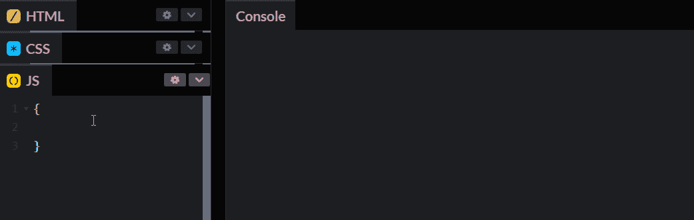

# 在 20 分钟内了解 ES6

> 原文：<https://javascript.plainenglish.io/understand-es6-in-20-minutes-8ab8f958e379?source=collection_archive---------1----------------------->

## 不要让任何人告诉你:“你不知道 ES6 怎么敢说你知道 JS！”


# 了解 ES6

根据[维基百科](https://en.wikipedia.org/wiki/ECMAScript)，

*“ECMAScript 规范是由*[*Brendan Eich*](https://en.wikipedia.org/wiki/Brendan_Eich)*of*[*Netscape*](https://en.wikipedia.org/wiki/Netscape_Communications_Corporation)*开发的一种脚本语言的标准化规范；最初命名为 Mocha，然后是 LiveScript，最后是 JavaScript。”*

ECMAScript 2015 (ES2015)是第六版，最初被称为 ECMAScript 6 (ES6)，它添加了大量新功能，这些功能后来成为 web 开发人员工具包的重要组成部分。本文旨在帮助您以轻松易懂的方式了解 ES6 的这些新特性。

# ES6 块范围的 let

首先，什么是范围？作用域指的是程序不同部分变量的可访问性。在用 let 声明变量之前，JavaScript 变量有一个全局作用域和函数作用域(用 var 声明时)。当使用 let 声明变量时，ES6 为 JavaScript 带来了块级范围。



```
{
    var a = "🍉";
    let b = "⛳";
}
console.log(a);
console.log(b);🍉
Uncaught ReferenceError: b is not defined
```

可以看到，我们使用 var 关键字定义了块中的变量“a”，可以全局访问。因此，var 声明的变量是全局的，但是我们希望变量在块中生效，并且在退出块时不可访问。然后可以使用 ES6 新的块级 scope 关键字 let 来声明变量，就像这里的变量 b 一样，它报告一个错误，说 b 没有被定义。

# ES6 销毁阵列

如下图，首先我们定义一个返回数组的函数。然后我们调用这个函数，并将结果存储在变量 temp 中。为了访问每个值，我们必须打印 temp[0]，temp[1]，temp[2]。使用析构，我们可以直接调用早餐函数，并在这里分离出变量 a、b 和 c 中的每个单独的值(第一个变量将被赋予第一个值，第二个变量被赋予第二个值，依此类推)。最后，我们打印三个变量，看到没有问题。

```
function breakfast() {
    return ['🍉', '🍔', '🍕'];
}
var temp = breakfast();
console.log(temp[0], temp[1], temp[2]);let [a, b, c] = breakfast();
console.log(a, b, c);🍉 🍔 🍕
🍉 🍔 🍕
```

# ES6 析构对象

早餐函数返回一个对象。使用析构，我们可以直接检索对象的值，存储在变量 a、b、c 中，键-值对中的键表示映射的实际对象的键名，值是自定义变量。析构完成后，赋值会自动完成，然后调用早餐函数返回对象。然后，把变量 a，b，c 打印出来，可以看到没有问题。

```
function breakfast() {
    return { a: '🍉', b: '🍕', c: '🍔' }
}
let { a: a, b: b, c: c } = breakfast();
console.log(a, b, c);🍉 🍕 🍔
```

# ES6 模板字符串

在使用模板字符串之前，我们使用+运算符连接字符串。

相反，我们现在可以使用 ES6 提供的模板字符串，首先使用``来包装字符串，当您想要使用变量时，请使用${variable}。

```
let a = '🍉',
    b = '🖼️';let c = 'eat watermelon' + a + 'watch TV' + b;
console.log(c);let d = `eat watermelon ${a} watch TV ${b}`;
console.log(d);eat watermelon🍉watch TV🖼️
eat watermelon 🍉 watch TV 🖼️
```

# ES6 检查该字符串是否包含其他字符串

使用这些函数，你可以很容易地检查字符串是否以某物开头，是否以某物结尾，是否包含任何字符串等等。

```
let str = 'hello, my name is Tom ❤️';
console.log(str.startsWith('hello'));
console.log(str.endsWith('❤️'));
console.log(str.endsWith('hello'));
console.log(str.includes(" "));true
true
false
true
```

# ES6 默认参数

在 ES6 中，您可以使用默认参数。调用函数时，如果没有给参数赋值，它将使用设置的默认参数来执行。当分配参数时，它将使用新分配的值来执行，覆盖默认值。使用以下内容:

```
function say(str) {
    console.log(str);
}
function say1(str = 'hey-hey') {
    console.log(str);
}
say();
say1();
say1('❤️');undefined
hey-hey
❤️
```

# ES6 扩展运算符

使用…展开元素以便于操作。将按如下方式使用:

```
let arr = ['❤️', '😊', '😍'];
console.log(arr);
console.log(...arr);
let brr = ['prince', ...arr];
console.log(brr);
console.log(...brr);[ '❤️', '😊', '😍' ]
❤️ 😊 😍
[ 'prince', '❤️', '😊', '😍' ]
prince ❤️ 😊 😍
```

# ES6 rest 运算符

运算符用于函数参数，通过以下方式接收参数数组:

```
function f1(a, b, ...c) {
    console.log(a, b, c);
    console.log(a, b, ...c);
}
f1('🍎','🌈','☃️','😊');🍎 🌈 [ '☃️', '😊' ]
🍎 🌈 ☃️ 😊
```

# ES6 功能名称

使用。name 获取函数的名称，如下所示:

```
function f1() { }
console.log(f1.name);
let f2 = function () { };
console.log(f2.name);
let f3 = function f4() { };
console.log(f3.name);f1
f2
f4
```

# ES6 箭头功能

使用箭头函数可以让代码更加简洁，但是也要注意箭头函数的局限性，而且箭头函数本身没有这个，这个指向父。

```
let f1 = a => a;let f2 = (a, b) => {
    return a + b;
}console.log(f1(10));
console.log(f2(10, 10));10
20
```

# ES6 对象表达式

使用 ES6 对象表达式，如果对象属性与值相同，则值可以省略，函数可以不写函数。用法如下:

```
let a = '🌈';
let b = '☃️';const obj = {
    a: a,
    b: b,
    say: function () {}
}const es6obj = {
    a,
    b,
    say() {}
}console.log(obj);
console.log(es6obj);{ a: '🌈', b: '☃️', say: [Function: say] }
{ a: '🌈', b: '☃️', say: [Function: say] }
```

# ES6 常数

使用 const 关键字定义度量。const 限制将值分配给度量的操作，而不是度量中的值。使用以下内容:

```
const app = ['☃️', '🌈'];
console.log(...app);
app.push('🤣');
console.log(...app);
app = 10;
```

可以看出，当该值被再次分配给测量值时，会报告一个错误。

```
☃️ 🌈
☃️ 🌈 🤣
app = 10;
    ^
TypeError: Assignment to constant variable.
```

# ES6 对象属性名称

使用点定义对象属性时，如果属性名包含空格字符，则是非法的，语法无法通过。使用【属性名】可以完美解决，不仅可以直接写属性名还可以用变量来指定，具体用法如下:

```
let obj = {};
let a = 'little name';
obj.name = 'prince';
// It is illegal to use dots to define properties with spaces between them
// obj.little name = 'little Prince';
obj[a] = 'little Prince';
console.log(obj);{ name: 'prince', 'little name': 'little Prince' }
```

# ES6 检查两个值是否相等

使用===或==比较某些特殊值的结果可能不符合您的需要。你可以用 Object.is(第一个值，第二个值)来判断，也许你会开心的笑了

```
console.log(NaN == NaN);
console.log(+0 == -0);
console.log(Object.is(NaN, NaN));
console.log(Object.is(+0, -0));false
true
true
false
```

# ES6 复制对象

使用 Object.assign()将一个对象复制到另一个对象，如下所示:

```
let obj = {};
Object.assign(
    // source
    obj,
    // Copy target object
    { a: '☃️' }
);
console.log(obj);{ a: '☃️' }
```

# ES6 设置对象的原型

使用 es6，您可以如下设置对象的原型:

```
let obj1 = {
    get() {
        return 1;
    }
}
let obj2 = {
    a: 10,
    get() {
        return 2;
    }
}
let test = Object.create(obj1);
console.log(test.get());
console.log(Object.getPrototypeOf(test) === obj1);
Object.setPrototypeOf(test, obj2);
console.log(test.get());
console.log(Object.getPrototypeOf(test) === obj2);1
true
2
true
```

# ES6 原型

使用方法如下。

```
let obj1 = {
    get() {
        return 1;
    }
}
let obj2 = {
    a: 10,
    get() {
        return 2;
    }
}
let test = {
    __proto__: obj1
}
console.log(test.get());
console.log(Object.getPrototypeOf(test) === obj1);
test.__proto__ = obj2;
console.log(test.get());
console.log(Object.getPrototypeOf(test) === obj2);1
true
2
true
```

# ES6 超级

```
let obj1 = {
    get() {
        return 1;
    }
}
let test = {
    __proto__: obj1,
    get() {
        return super.get() + ' ☃️';
    }
}
console.log(test.get());1 ☃️
```

# ES6 生成迭代器

在学习之前，首先，写一个迭代器

```
function die(arr) {
    let i = 0;return {
        next() {
            let done = (i >= arr.length);
            let value = !done ? arr[i++] : undefined;return {
                value: value,
                done: done
            }
        }
    }
}
let arr = ['☃️', '🤣', '🌈'];let dieArr = die(arr);
console.log(dieArr.next());
console.log(dieArr.next());
console.log(dieArr.next());
console.log(dieArr.next());{ value: '☃️', done: false }
{ value: '🤣', done: false }
{ value: '🌈', done: false }
{ value: undefined, done: true }
```

好，看看简化的生成器

```
function* die(arr) {
    for (let i = 0; i < arr.length; i++) {
        yield arr[i];
    }
}
let test = die(['🌈','☃️']);
console.log(test.next());
console.log(test.next());
console.log(test.next());{ value: '🌈', done: false }
{ value: '☃️', done: false }
{ value: undefined, done: true }
```

# ES6 类

使用 es6 可以快速轻松地构建类

```
class stu {
    constructor(name) {
        this.name = name;
    }
    say() {
        return this.name + 'say hello';
    }
}
let xiaoming = new stu("Tom");
console.log(xiaoming.say());Tom say hello
```

# ES6 获取设置

定义获取或修改类属性的获取/设置方法

```
class stu {
    constructor(name) {
        this.name = name;
    }
    get() {
        return this.name;
    }
    set(newStr) {
        this.name = newStr;
    }
}
let xiaoming = new stu("Tom");
console.log(xiaoming.get());
xiaoming.set("John")
console.log(xiaoming.get());Tom
John
```

# ES6 静态

用 static 关键字修改的方法可以直接使用，而无需实例化对象

```
class stu {
    static say(str) {
        console.log(str);
    }
}
stu.say("This is a static method");This is a static method
```

# ES6 扩展

使用继承，您可以减少代码冗余，例如:

```
class Person {
    constructor(name, bir) {
        this.name = name;
        this.bir = bir;
    }
    showInfo() {
        return 'name：' + this.name + 'Birthday：' + this.bir;
    }
}
class A extends Person {
    constructor(name, bir) {
        super(name, bir);
    }
}
let zhouql = new A("Tom", "2002-08-24");
// Tom itself does not have a showInfo method, it is inherited from Person
console.log(zhouql.showInfo());Name: Tom Birthday: 2002-08-24
```

# ES6 套件

集合不同于数组，集合中不允许有重复的元素

```
// Create Set collection
let food = new Set('🍎🥪');
// Repeatedly add, only one can enter
food.add('🍉');
food.add('🍉');console.log(food);
// current collection size
console.log(food.size);
// Check if an element exists in a collection
console.log(food.has('🍉'));
// remove an element from a collection
food.delete('🥪');
console.log(food);
// loop through the collection
food.forEach(f => {
    console.log(f);
});
// empty collection
food.clear();
console.log(food);Set(3) { '🍎', '🥪', '🍉' }
3
true
Set(2) { '🍎', '🍉' }
🍎
🍉
Set(0) {}
```

# ES6 地图

映射组合以存储键值对

```
let food = new Map();
let a = {}, b = function () { }, c = "name";food.set(a, '🍉');
food.set(b, '🥪');
food.set(b, '🥪');
food.set(c, 'rice');console.log(food);
console.log(food.size);
console.log(food.get(a));
food.delete(c);
console.log(food);
console.log(food.has(a));food.forEach((v, k) => {
    console.log(`${k} + ${v}`);
});
food.clear();
console.log(food);Map(3) { {} => '🍉', [Function: b] => '🥪', 'name' => 'rice' }
3
🍉
Map(2) { {} => '🍉', [Function: b] => '🥪' }
true
[object Object] + 🍉
function () { } + 🥪
Map(0) {}
```

# ES6 模块化

使用模块化开发，ES6 可以轻松地导入和导出一些内容，以及默认导出等细节:

```
let a = '🍉';
let f1 = function (str = 'you write parameters') {
    console.log(str);
}
export { a, f1 };import {a, f1} from './27 module test.js';
console.log(a);
f1();
f1('understood');
```

恭喜你，这篇文章你已经看完了，能力+ 100，外貌+ 10，欢迎下次再来。如果你认为这篇文章写得很好，请给我留言👋！

*更多内容请看*[***plain English . io***](https://plainenglish.io/)*。报名参加我们的* [***免费周报***](http://newsletter.plainenglish.io/) *。关注我们关于*[***Twitter***](https://twitter.com/inPlainEngHQ)[***LinkedIn***](https://www.linkedin.com/company/inplainenglish/)*[***YouTube***](https://www.youtube.com/channel/UCtipWUghju290NWcn8jhyAw)*[***不和***](https://discord.gg/GtDtUAvyhW) *。***