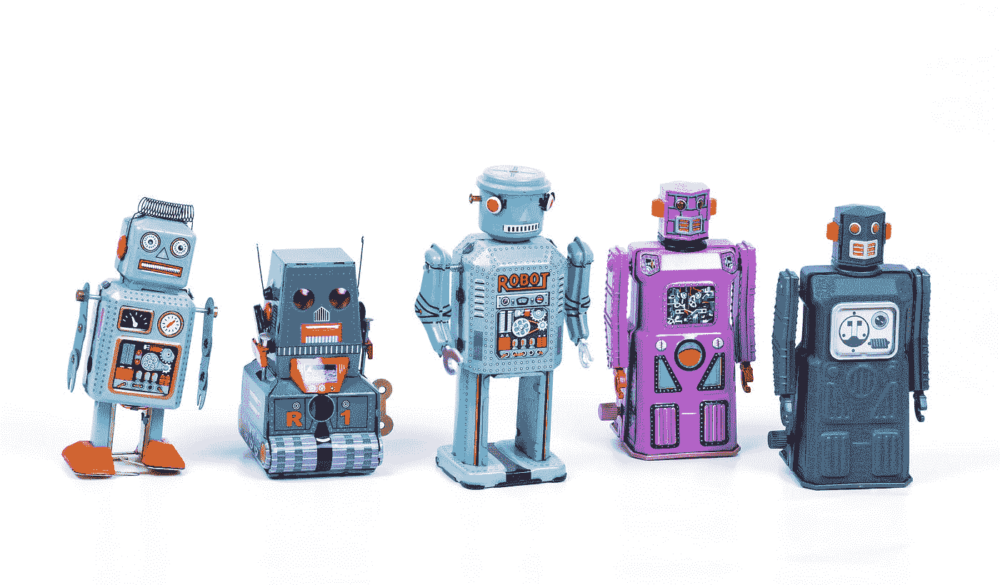
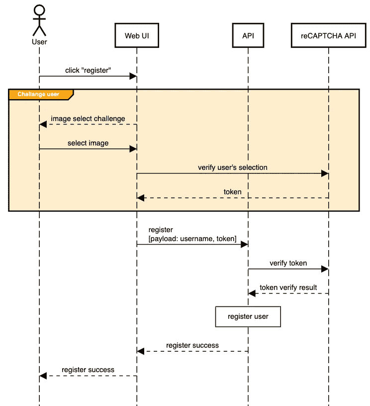

# 通过图表和代码示例理解 Google reCAPTCHA

> 原文：<https://javascript.plainenglish.io/understand-google-recaptcha-with-diagrams-and-code-examples-81fc833643a5?source=collection_archive---------4----------------------->

代码示例是用 React、TypeScript 和 Node.js 编写的



Photo by [Eric Krull](https://unsplash.com/@ekrull?utm_source=medium&utm_medium=referral) on [Unsplash](https://unsplash.com?utm_source=medium&utm_medium=referral)

即使在 2022 年，reCAPTCHA 发明以来的十多年里，我发现如果这是第一次看它，理解 Google reCAPTCHA 如何工作并与 web 应用程序集成仍然不是非常简单，这要感谢最少的官方文件。

在大量的阅读、挖掘和反复试验之后，我想我终于理解了它，但是我也相信对于新手来说应该有一种更容易的方法来掌握它，这种方法应该包含清晰的图表和简单的代码示例。

这就是我写这篇文章的原因——为那些想更容易、更快地了解 Google reCAPTCHA 的人做一个垫脚石。

# 基础

要讨论 Google reCAPTCHA，我们需要从一个更基本的概念开始——**CAPTCHA。**

**CAPTCHA** 代表***完全自动化的公共图灵测试，以区分计算机和人类*【1】，这是一种常用的方法，用来阻止机器人执行帐户注册等动作。**

**例如，你可能已经在许多网站上注册或登录时看到过类似下面的东西，它要求你输入从图像中识别的字符。**

****

**然而，强迫用户阅读和输入字符是一种摩擦和干扰，智能机器人可能能够轻松识别那些扭曲的字母，然后通过测试。**

**因此，更先进的测试方法被引入来对抗僵尸程序，而 **Google reCAPTCHA** 是最受欢迎的解决方案。**

****

**[https://trends.builtwith.com/widgets/captcha](https://trends.builtwith.com/widgets/captcha)**

# **了解不同版本的 Google reCAPTCHA**

**当步入 Google reCAPTCHA 的世界时，你将面临一个直接的挑战，那就是从树的可用选项中选择一个选项[2]:**

*   **reCAPTCHA v2(“我不是机器人”复选框)**
*   **reCAPTCHA v2(隐形 reCAPTCHA 徽章)**
*   **reCAPTCHA v3**

**可惜官方文件只有简介，把深潜的快乐留给了想了解更多的我们。**

## **reCAPTCHA v2(“我不是机器人”复选框)**

**首先，让我们假设我们有一个这样的注册屏幕:**

****

**我们希望流程是:**

****

**“图像选择挑战”是一个弹出窗口，如下所示:**

****

**理解流程“如何”和“为什么”工作的关键是幕后的一个**令牌**:**

*   **当你点击“我不是一个机器人”，reCaptcha 会检查你是否有可能是一个机器人**
*   **如果 reCAPTCHA 认为你不可能是机器人，那么它会给你一个**令牌****
*   **如果 reCAPTCHA 认为你可能是一个机器人，那么它会弹出一个图像选择测验，你只有在成功回答测验后才能获得**令牌****
*   **当 web UI 向 API 服务器发送最终的“注册”请求时，它不仅会在有效载荷中携带“用户名”，还会包含 reCAPTCHA 发出的“**令牌****
*   **当 API 服务器收到请求时，它将通过与 reCAPTCHA 服务器对话来验证**令牌**，并在**令牌**无效时阻止用户注册**

**因此，我们可以用下面的序列图来表示流程:**

**无图像挑战时([图源](https://sequencediagram.org/index.html#initialData=IYYwLg9gTgBAqgZwKZQFAAdhTASxDzAOzBgHUkAjeASQy13yJIEEAFWzbPA4YmKJAGE2AFUEAJZjDa1UiFAFoAfOSpxqALhggANngDWMAETUA5AFsYhCCWAwKNo6lU1lA4azGTp7LQHMkEkh9JEJUd1EJKRkFZRd1LWDQ1DlkKDjKGi1dA2MBPxwEMBQneOplGS18wuKoAB1CAG1MAE8dCGAAEy0AVzTCYHMkABoYJMIAXVQYpQjPKJ9NGAA3FBwAMxaxiBCwua9o9lilSu3dlbXN-iQEHp0wVAcADxgIVdhT6qKUGD6UFOmRwyaiWX1qMFuIBANwQzky6mO8igVSQBW+sEh0IQsKAA)):**

****

**当出现图像挑战([图源](https://sequencediagram.org/index.html#initialData=IYYwLg9gTgBAqgZwKZQFAAdhTASxDzAOzBgHUkAjeASQy13yJIEEAFWzbPA4YmKJAGE2AFUEAJZjDa1UiFAFoAfOSpxqALhggANngDWMAETUA5AFsYhCCWAwKNo6lQBzKBACu6GAGJovFyQYQQALYB0dAKCPZFgfAHcQnDAkZ1UaBWV5KC0cc2BAmGQdJHBtMIikQkC5WOV09S1i0pI8gtSG6mUBYVYxSWl2LQA3FBwAMwBPGBiUUwQipBLwHAhCVB7RCSkZTJVKGi1IfSrUKoATZ2z6g8btPRBDIwEXHAQUqCdO5RktF7ePgAdQgAbUwkx0EGA5y0syghGA5iQABoYMcqgBdVC7JSbPrbQaaGCjKATabo9Z4-o7dh7X5oiAnQjEsZTfhIBAeHRgVAOAAeMAgJMJfyQr3eKBmsWc2NpNzURP+EtgnJAIA5CFQ3yysVF4o+RQ8ao1qCAA))时:**

****

## **示例代码:前端**

**让我们来看看 React 组件示例的实现细节。**

**首先，该组件将呈现一个带有用户名输入、reCAPTCHA 复选框、注册按钮和错误消息的表单。**

```
<form className="Form" data-testid="FormWithCheckbox" data-registration-result={registrationResult}>
  <div>
    <label>
      <span>username: </span>
      <input type="text" name="username" value={username} onChange={handleUsernameChange} />
    </label>
  </div>

  <ReCAPTCHA sitekey={SITE_KEY} onChange={handleRecaptchaChange} />

  <button type="button" onClick={handleClickRegister}>
    register
  </button>

  {errorMessage && <div className="Error">{errorMessage}</div>}
</form>
```

**这里值得一提的是，我们使用了一个库— [react-google-recaptcha](http://npm i react-google-recaptcha) 来方便 recaptcha 的设置和渲染。**

**然后，我们存储用户名和令牌的表单状态，并用回调来更新它们(在 JSX 使用)。**

```
const [username, setUsername] = React.useState("");
const [recaptchaToken, setRecaptchaToken] = React.useState<string | null>(null);

const handleRecaptchaChange = React.useCallback((value: string | null) => {
  console.log("FormWithCheckbox::handleRecaptchaChange > value: ", value);
  setRecaptchaToken(value);
}, []);

const handleUsernameChange = React.useCallback((event: React.ChangeEvent<HTMLInputElement>) => {
  const value = trim(event.target.value);
  setUsername(value);
}, []);
```

**最后，当用户点击“注册”时，我们发送带有用户名和令牌的 API 请求。**

```
const [registrationResult, setRegistrationResult] = React.useState("");
const [errorMessage, setErrorMessage] = React.useState("");

const handleClickRegister = React.useCallback(async () => {
  setErrorMessage("");

  if (!recaptchaToken) {
    alert("Please click reCAPTCHA checkbox!");
    return;
  }

  try {
    const response = await axios.post("/api/user/registration", {
      username,
      recaptchaToken,
      recaptchaVersion: "V2_CHECKBOX",
    });
    const { result } = response.data;
    console.log("FormWithCheckbox::handleClickRegister > result: ", result);
    setRegistrationResult(trim(result));
    alert("Register success");
  } catch (e: any) {
    const response = e.response;
    const { result, error } = response.data;
    setRegistrationResult(trim(result));
    setErrorMessage(trim(error));
  }
}, [recaptchaToken, username]);
```

## **示例代码:后端**

**处理 API 请求的 node.js 代码非常简单:**

*   **验证用户输入**
*   **验证 reCAPTCHA 令牌**
*   **执行主要操作(例如，注册)**
*   **回送结果**

```
app.post("/api/user/registration", async (req, res) => {
  const recaptchaVersion = _.trim(_.get(req.body, "recaptchaVersion"));
  const username = _.trim(_.get(req.body, "username"));
  const token = _.trim(_.get(req.body, "recaptchaToken"));

  try {
    validateUsername(username);
    const secret = getSecretByRecaptchaVersion(recaptchaVersion);
    await verifyRecaptchaToken({ token, secret });
    // ... Register ...
    res.status(201).json({ result: "SUCCESS", username });
  } catch (e) {
    console.error(e);
    res.status(400).json({
      result: "FAIL",
      error: _.get(e, "message") ? _.get(e, "message") : JSON.stringify(e),
    });
  }
});
```

**…下面是验证 reCAPTCHA 令牌的代码:**

```
type VerifyRecaptchaTokenArgs = {
  secret: string;
  token: string;
};
const verifyRecaptchaToken = async (args: VerifyRecaptchaTokenArgs) => {
  const { secret, token } = args;
  if (!token || !secret) {
    throw new Error("reCAPTCHA secret or token is invalid");
  }

  const response = await axios.post(
    "https://www.google.com/recaptcha/api/siteverify",
    undefined,
    {
      params: { secret, response: token },
    }
  );

  console.log("reCAPTCHA siteverify result: ", response.data);

  if (!response.data.success) {
    throw new Error("reCAPTCHA token is invalid");
  }
};
```

**完整代码可以在 Github 上找到:**

**[](https://github.com/zzdjk6/google-recaptcha-spike) [## GitHub-zzdjk 6/Google-recaptcha-spike

### 此时您不能执行该操作。您已使用另一个标签页或窗口登录。您已在另一个选项卡中注销，或者…

github.com](https://github.com/zzdjk6/google-recaptcha-spike) 

## reCAPTCHA v2(隐形 reCAPTCHA 徽章)

使用此选项时，整个流程与复选框版本相同，只是用户不需要勾选“我不是机器人”——当用户单击主操作按钮(即“注册”按钮)时，它会被隐式勾选。

因此，当没有图像挑战时，序列图可以绘制如下([图源](https://sequencediagram.org/index.html#initialData=IYYwLg9gTgBAqgZwKZQFAAdhTASxDzAOzBgHUkAjeASQy13yJIEEAFWzbPA4YmKJAGE2AFUEAJZjDa1UqRCgC0APnJU41AFwwQAGzwBrGACIBAcxwIwKY6jU0VA4azGTp7bWaQlIBpIVQnUQkpGUUVew1tX387SgdlGW1zS2soAB1CAG1MAE9dCGAAE20AV2QoQmAAWyQAGhgYwgBdVDDlIJcQ9y0YADcUHAAzXMaIPwDO11D2cMSPMYn+wZH+JARS3TBUCggADxgIAdgktYsrFBhylDk22Yj4qLPUy42QEHWEOPVqOYUoZJIc5pGBvD4IL5AA)):


…这是有图像选择挑战的时候([diagram source](https://sequencediagram.org/index.html#initialData=IYYwLg9gTgBAqgZwKZQFAAdhTASxDzAOzBgHUkAjeASQy13yJIEEAFWzbPA4YmKJAGE2AFUEAJZjDa1UqRCgC0APnJU41AFwwQAGzwBrGACIBAcxwIwKY6jNQIAV3QwAxNF5mkMQQAtgurqe3o7IsK4A7r441qhqNIoqClDaOAC2wF4wyLpI4Dr+gUiEXvJhKvEa2jl5JOmZSHGUCcoCwqxiktLs2gBuKDgAZgCeMKEoAOQI2Ui54DgQhKhtohJSMomqzVUwkAbFqMUAJk3q1Coy2uaW1lAAOoQA2pjDuhDAR9rjUITAaUgAGl2EH2hAAuqgNq0hKsupcYP0oENRnsDisOmtuucLj1gaCEQMRvwkAhHLowKgKBAAB4wCCIrFXJAWKwoMZhOSQ9ibSpaYks27ZRwgEAkhCnBJJMJMgVs0kisWoIA)):



## 示例代码

虽然后端代码基本上与前面的 checkbox 示例相同，但前端略有不同:当用户单击“register”而不是单击 checkbox 时，我们运行 reCAPTCHA 检查。

## reCAPTCHA v3

这个选项与前两个非常不同——它不使用“图像选择”弹出窗口来测试用户是否是机器人。

或许我们甚至可以说根本没有验证码:reCAPTCHA v3 声称它有能力观察用户与网站的交互，并计算用户操作的分数，然后我们的后端可以使用自定义阈值来决定该操作是否应该被允许或阻止。

用一张图会更容易理解([来源](https://sequencediagram.org/index.html#initialData=IYYwLg9gTgBAqgZwKZQFAAdhTASxDzAOzBgHUkAjeASQy13yJIEEAFWzbPA4YmKJAGE2AFUEAJZjDa1UiFAFoAfOSpxqALhgR0SQjADulGAhxgkqChAAe2gG4oyx9QGJovAOZItOQmZzAADY4AF5I-EKiEsyosfJQyqo0WiDBIADWMABEAh44COZQWahJ6soCwqxiktLsWl4kkOl6qBVRNTIKic6aME0tpdTKMlq5+YUAOoQA2pgAnoEQwAAmWgCuyFCEwAC2SAA0fRDNhAC6qJ1KbVXRtb0OUDgAZnNHJ62RNx3sXUojb3oYA9nq8BAg1oEwJYbPZHDI3FBPN4YCAABZIDIRSrVKRZBAgaBIYpWWwQB53UZIPIFRwbFCxC4-bpqXpjGmwcEgEBIBAIEo9X7xSnUwomNZcnl8oA)):


理解这一点非常重要，当使用 reCAPTCHA v3 时，人类用户没有机会证明他/她不是机器人。当 API 收到 reCAPTCHA 令牌验证结果时，我们可以允许用户继续操作，也可以根据“分数”给用户一个出错的硬停止。

此外，值得注意的是，对于不同的用户操作，对“分数”的检查可能是不同的。例如，我们可以为“注册”和“登录”设置不同的阈值。

## 代码示例

> 注意:我们正在使用一个名为“[react-Google-recaptcha-v3](https://www.npmjs.com/package/react-google-recaptcha-v3)的库，以便更容易地将 reCAPTCHA 集成到 React 应用程序中。

首先，我们需要尽可能早地初始化 reCAPTCHA:

```
root.render(
  <React.StrictMode>
    <GoogleReCaptchaProvider reCaptchaKey={SITE_KEY}>
      <App />
    </GoogleReCaptchaProvider>
  </React.StrictMode>
);
```

然后我们需要获得**令牌**，并在用户点击“注册”时发送请求:

```
const App = () => {
  const { executeRecaptcha } = useGoogleReCaptcha();

  const handleClickRegister = React.useCallback(async () => {
    if (!executeRecaptcha) {
      console.log("Execute recaptcha not yet available");
      return;
    }

    const recaptchaToken = await executeRecaptcha("register");

    // TODO: send API request and get result
  }, [executeRecaptcha, username]);

  return (
    <div className="App">
      {/* ... */}
      <button type="button" onClick={handleClickRegister}>
        register
      </button>
      {/* ... */}
    </div>
  );
};
```

您可能已经注意到，在获得令牌时，我们还告诉 reCAPTCHA,`action`是“register”。

最后，我们需要在后端用“action”和“score”验证**令牌**:

```
const verifyRecaptchaToken = async (args: VerifyRecaptchaTokenArgs) => {
  // ... Get token verify result ...

  const score = _.toNumber(_.get(response.data, "score"));
  const action = _.toString(_.get(response.data, "action"));

  if (action === "register" && score < 0.5) {
    throw new Error("Bot detected!");
  }
};
```

如上面的代码所示，我们使用`0.5`作为“注册”动作的阈值。也就是说，如果分数等于或高于 0.5，我们允许用户注册；如果分数低于 0.5，我们抛出一个错误，并停止用户注册。

# 材料

你可以在我的 github 上的 repo 中找到所有三个选项(V2 复选框、V2 不可见和 V3)的完整且可运行的代码示例:

[](https://github.com/zzdjk6/google-recaptcha-spike) [## GitHub-zzdjk 6/Google-recaptcha-spike

### 此时您不能执行该操作。您已使用另一个标签页或窗口登录。您已在另一个选项卡中注销，或者…

github.com](https://github.com/zzdjk6/google-recaptcha-spike) 

> 注意:为了方便起见，reCAPTCHA 的键包含在 repo 中，并且是硬编码的。如果你想探索更多关于 reCAPTCHA 的知识，我建议你注册自己的账户，并获得自己的钥匙。

# 进一步讨论

虽然 reCAPTCHA 是最受欢迎的选择，但您可能会对隐私义务有一些担忧，这些担忧是完全正确的。例如，您可能想要查看这篇文章[3]以了解如何在使用 reCAPTCHA 时使您的应用程序符合 GDPR。

作为一种替代方案， [hCaptcha](https://www.hcaptcha.com/) 声称是谷歌 reCAPTCHA 的替代产品，但对各种隐私政策更加友好。因此，如果你关心隐私政策和法规，也许值得看一看。

# 参考

*   [1][https://en.wikipedia.org/wiki/CAPTCHA](https://en.wikipedia.org/wiki/CAPTCHA#Alternative_CAPTCHAs)
*   [2][https://developers.google.com/recaptcha/docs/versions](https://developers.google.com/recaptcha/docs/versions)
*   [3][https://measured collective . com/gdpr-recaptcha-how-to-stay-compliant-with-gdpr/](https://measuredcollective.com/gdpr-recaptcha-how-to-stay-compliant-with-gdpr/)

## 更多内容请访问 [PlainEnglish.io](https://plainenglish.io/) 。

报名参加我们的 [**免费周报**](http://newsletter.plainenglish.io/) 。关注我们关于 [**推特**](https://twitter.com/inPlainEngHQ)[**LinkedIn**](https://www.linkedin.com/company/inplainenglish/)**[**YouTube**](https://www.youtube.com/channel/UCtipWUghju290NWcn8jhyAw)**[**不和**](https://discord.gg/GtDtUAvyhW) **。******

## ****想用内容来扩展你的科技创业吗？检查[电路](https://circuit.ooo/?utm=publication-post-cta)。****

****我们提供免费的专家建议和定制解决方案，帮助您建立对您的技术产品或服务的认知和采用。******