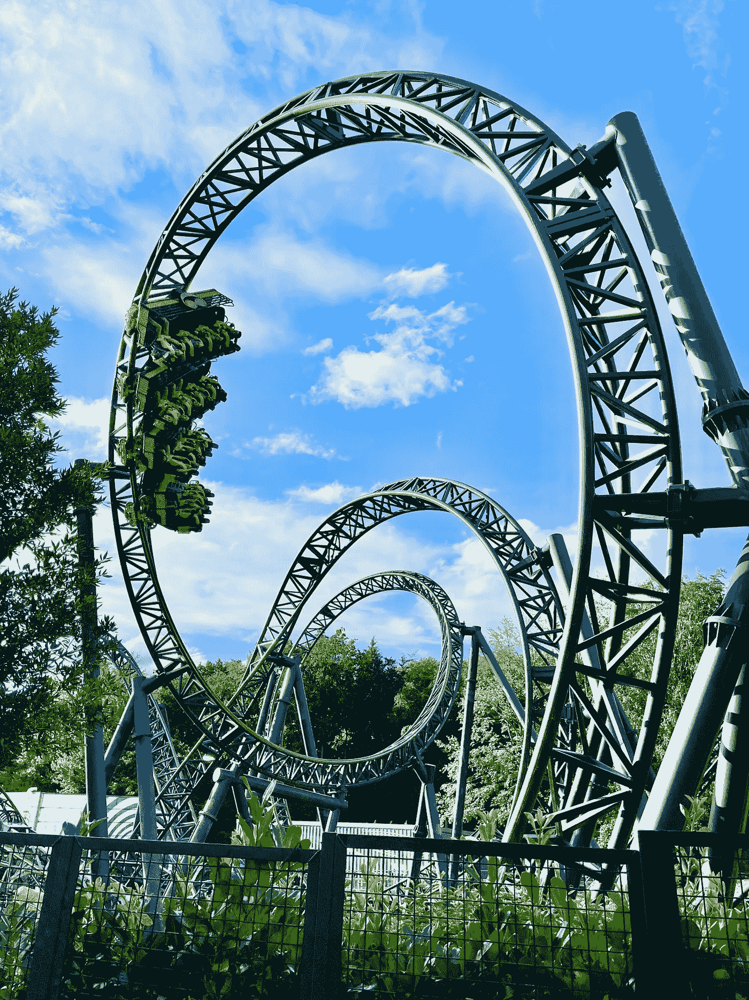

# 理解 JavaScript 的事件循环

> 原文：<https://javascript.plainenglish.io/understand-javascripts-event-loop-36c021f850f7?source=collection_archive---------9----------------------->

## 进入圈子



Photo by [Jonny Gios](https://unsplash.com/@supergios?utm_source=unsplash&utm_medium=referral&utm_content=creditCopyText) on [Unsplash](https://unsplash.com/?utm_source=unsplash&utm_medium=referral&utm_content=creditCopyText)

我最近看了[菲利普·罗伯茨](https://www.youtube.com/watch?v=8aGhZQkoFbQ)和[艾琳·齐默](https://www.youtube.com/watch?v=u1kqx6AenYw)来自 JSConf EU 的关于 JavaScript 事件循环的精彩演讲，这启发我阅读 [HTML5 规范](https://www.w3.org/TR/2016/CR-html51-20160621/webappapis.html#event-loops)本身，并确保我真正理解它。我现在认为我已经很好地理解了什么是事件循环，我想在这里总结一下。

# 调用堆栈

调用堆栈是一种数据结构，它记住了我们在代码中的位置。每当我们进入一个新的函数时，一个执行上下文被推到堆栈上，当我们从函数返回时，执行上下文被弹出，这样我们就可以在函数调用后继续运行代码。

JavaScript 是单线程的，这意味着它一次只能执行一个任务——只有一个线程，只有一个调用堆栈。如果堆栈上有“慢”代码，它会阻止其余代码的运行，还会导致 UI 看起来没有响应。正因为如此，我们希望这些“慢”代码(例如，网络调用)尽可能远离堆栈。

# 任务队列和事件循环

阻塞代码是通过使用异步回调来解决的——将函数传递给另一个函数，后者在后台执行代码，然后运行我们传递的函数。当实际运行这些回调时，我们不能将它们直接放回调用堆栈，所以我们将它们放在一个单独的数据结构中，在那里它们可以等待——任务队列**。为了执行队列中正在等待的任务，我们有了**事件循环**，这是一个无限循环，负责(除了其他事情之外)从队列中取出第一个任务并将其推送到堆栈上。一旦调用堆栈为空，事件循环就会运行。**

**展示任务队列和事件循环如何工作的一个基本例子是使用`setTimeout`。让我们看看下面的代码:**

```
console.log('Hello');
setTimeout(() => console.log('World!'), 2000);
```

**运行该代码时，将执行以下步骤:**

1.  **`console.log('Hello')`被放入调用堆栈。它被执行，并且“hello”被打印到控制台。**
2.  **`setTimeout(() => console.log('World'), 2000)`被放在调用堆栈上。方法`setTimeout`被执行，它将回调和定时器发送到由浏览器提供的 setTimeout API。**
3.  **2 秒钟后，是回调`() => console.log('World')`运行的时候了，所以 web API 把它推到任务队列中。**
4.  **调用堆栈是空的，因此事件循环可以将回调从任务队列中取出，并将其推送到调用堆栈中，在那里运行并将“World”打印到控制台。**

**一个重要的附带说明是，我们可以从这些步骤中理解到`setTimeout(cb, 0)`并不立即运行回调，而是 web API 将回调直接放到任务队列中。因为队列中的任务需要等待调用堆栈为空，所以在回调真正运行之前，可能还需要更多的时间。这使得超时实际上是在回调被执行之前经过的*最小*时间量，而不是确切的时间。**

# **翻译**

**每次任务执行后，浏览器可以决定是否运行渲染管道。大多数浏览器每秒渲染窗口约 60 次，大约每 16 毫秒一次，但浏览器可以选择延迟渲染并优先处理其他任务。需要注意的是，因为渲染管道直到任务完成后才运行，所以非常长的任务会延迟窗口的渲染。**

**到目前为止，我们已经描述了一个基本的事件循环，由一个任务队列和一个渲染管道组成。所以逻辑是这样的:**

# **多个任务队列**

**HTML5 规范规定一个事件循环可以有不止一个任务队列，只要所有的任务都来自一个特定的源(比如鼠标点击、定时器等。)去同一个队列。浏览器可以为每个队列设置不同的优先级。在每个时钟周期，事件循环选择它想要从哪个队列中取出一个任务，这个任务被放在调用堆栈中。就像单个队列一样，渲染管道只能在选择的任务完成后运行。**

**使用多个任务队列的一个缺点是，您对事件计时的控制较少，例如，如果有一个超时队列和另一个鼠标事件队列，事件循环可以决定在运行超时队列上的事件之前完全清空鼠标事件队列，从而导致超时事件的延迟比预期的长。**

**现在，我们的事件循环看起来像这样:**

# **微任务队列**

**事件循环还可以有一个微任务队列(一般来说，微任务是承诺)，它在从“常规”队列中选择的任务完成之后被处理。该队列的独特之处在于，在事件循环的每个节拍，在循环移动到渲染管道之前，它被完全清空。**

**当将微任务队列添加到事件循环中时，我们得到以下结果:**

# **动画帧回调队列**

**最后，事件循环还可以有一个动画帧回调队列，所有的`requestAnimationFrame`回调都放在那里。这些任务仅在浏览器决定运行渲染管道时运行，并在重画之前执行，以更新动画。只有重画时队列中的任务才会运行，任何进入队列的新任务都会在事件循环的下一个节拍执行。这样，如果代码正在设置动画，它会一次更新一帧动画。**

# **把所有的放在一起**

**就是这样！我们已经讨论了事件循环可以拥有的所有不同类型的队列，现在我们对事件循环是如何工作的有了一个完整的理解。当我们把所有东西放在一起时，我们得到以下逻辑:**

**我希望你和我一样对这个解释感兴趣，我很高兴听到你的任何评论或见解。下次见！**

***更多内容尽在* [***说白了. io***](https://plainenglish.io/) *。报名参加我们的* [***免费周报***](http://newsletter.plainenglish.io/) *。关注我们关于* [***推特***](https://twitter.com/inPlainEngHQ) *和*[***LinkedIn***](https://www.linkedin.com/company/inplainenglish/)*。查看我们的* [***社区不和谐***](https://discord.gg/GtDtUAvyhW) *加入我们的* [***人才集体***](https://inplainenglish.pallet.com/talent/welcome) *。***