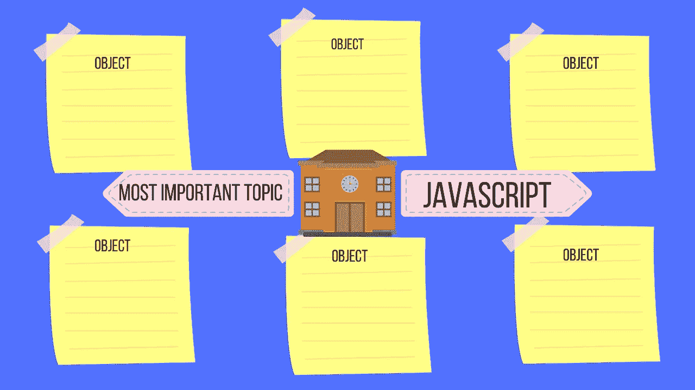
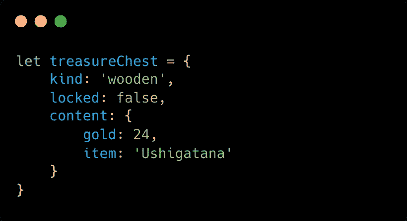
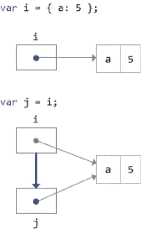
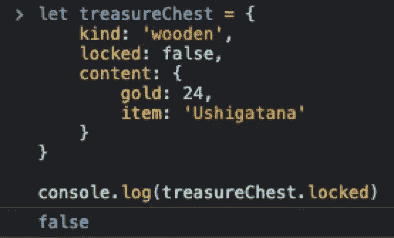
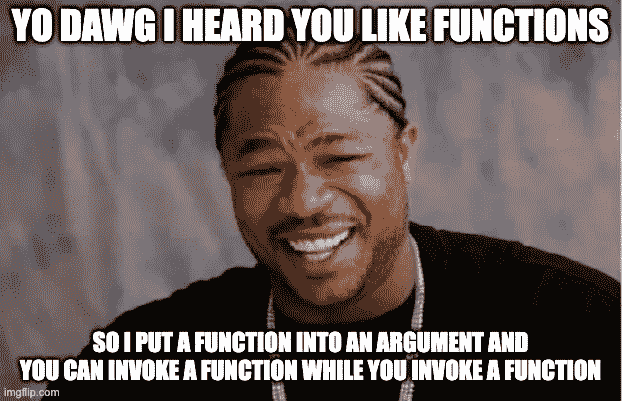
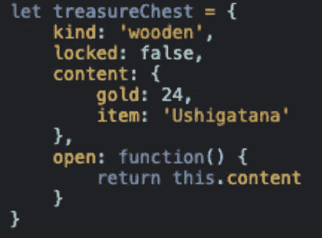
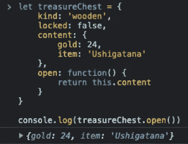

# 理解对象 JavaScript 中最重要的话题

> 原文：<https://javascript.plainenglish.io/understand-objects-the-1-most-important-topic-in-javascript-11be3e3fc7e9?source=collection_archive---------11----------------------->

## JavaScript 是一种多范例语言，但是对象是至关重要的

Image Made By The [Author](http://www.arnoldcode.com)

JavaScript 的基本数据类型是对象。对象是聚合多个值的复合值。它可以保存[原始值和其他对象](/the-1-simple-explanation-of-variables-datatypes-in-javascript-for-beginners-befc1a05dcc4)。

这些值存储在所谓的*属性*中。每个属性都是一个键和一个值，键等于属性的名称，值等于基本类型或对象。简而言之:属性= <键，值>。

对象允许您通过名称(键)来存储和检索这些值。数组是有序的集合，而对象是无序的属性集合。

**属性名是字符串——也就是说，对象将字符串映射到值。**

# 通过一个简单的例子理解物体

这是一个物体的例子。它是一个`treasureChest` ，包含两个原始类型(`kind` & `locked`)和另一个对象(`content`)。

对象`content`本身又保存了 2 个原语类型(`gold` & `item`)。

Fig. 1: Example Object of TreasureChest, Made By The [Author](http://www.arnoldcode.com)

# 用简单文字符号创建对象

如前所述，您可以用文字符号创建一个对象。下面是语法。

# 关于物体的最后一件事

**对象**作为**引用存储到变量中。**

**原语**(数字、布尔等。)存储为**值**。

当您将一个对象分配给多个变量并改变一个变量(与其他变量包含相同的对象)的属性时，所有变量都会反映一个变化。

这意味着变量存储了在哪里可以找到原始值的描述，当被赋值给变量时，原语复制它们的值。

*查看右边的例子，看看在保存到两个变量(****I&j****)的引用中改变一个值会发生什么。*

Fig. 2: Picture By [**Lee P Richardson**](https://www.codeproject.com/script/Membership/View.aspx?mid=4645031)

如果您将`j`中的`a`的属性更改为`666`，并将`i`输出到控制台，您将看到该对象保存的是`666`的确切值，而不再是`5`的值。

🔥想象你正在度假，问某人当地的教堂在哪里。那个人会给你描述在哪里可以找到教堂。不是教堂本身。如果不知何故，该镇决定搬迁教堂，所有其他参考需要知道这种情况。如果没有，他们会给你“空”的方向

# 属性是对象的特征

对象用于执行常见操作:

*   创造
*   设置
*   询问
*   删除
*   试验
*   并列举它们的属性。

每个属性都有一个**名称**和一个**值**。不允许在一个对象中有两个同名的属性。每个属性都有关联的值。

Fig. 3: Example of an Object and Property-Access, Made By The [Author](http://www.arnoldcode.com)

你可以通过写下对象的标识符来访问属性值，就像变量的标识符一样，**加上**点操作符。然后是要检索与之关联的值/对象的属性。

# 方法是对象的能力

您也可以将功能分配给属性。在这个特定的上下文中，您使用术语**方法**而不是属性。

🔥:*在 JavaScript 中，函数是一等公民。这意味着它们也是对象，可以传递给其他函数。*

Created Via [imgFlip.com](https://imgflip.com/i/6bhawy)

JavaScript 的方法是在对象上执行的动作/能力。检查下面的例子，我在其中定义了方法`open: function() { return this.content }`。

Fig. 4: Example Object of TreasureChest, Made By The [Author](http://www.arnoldcode.com)

 [## 通过 5 个简单的规则理解 JavaScript 中的“this”关键字

### 掌握“这个”关键词的 5 条规则

medium.com](https://medium.com/nerd-for-tech/i-am-sorry-but-we-javascript-developers-need-to-understand-this-first-e6b0683432b3) 

当您访问这个方法时，您执行了一个函数调用(因此，访问在结尾需要两个大括号“()”)。与图 3 中*的线`treasureChest.locked`相比。*

Fig. 5: Example Method Access of TreasureChest, Made By The [Author](http://www.arnoldcode.com)

当您只想对该对象执行某些操作时，可以定义一个方法。当你阅读你的代码时，你的代码将会做什么是很明显的。

*比较这两个例子:*

现在你可以用`treasureChest.loot()`调用方法来掠夺`treasureChest`。由一个`console.log()`包装，你得到的`treasureChest`的内容将被打印到控制台。

Fig. 6: Example Method Access of TreasureChest, Made By The [Author](http://www.arnoldcode.com)

# 原型继承非常重要

对象不仅仅是一个简单的字符串到值的映射。

除了维护自己的属性集，一个对象还继承了另一个对象的属性——称为 ***原型*** 。

对象的方法通常是继承的属性。“原型继承”是 JavaScript 的一个重要特性。

自己的属性被直接定义在一个对象上(就像我对**开放方法**所做的那样)。**相比之下，**继承属性是由对象的原型对象定义的属性。

原型中定义的继承类从 **Object.prototype** 开始。

prototype 属性的值是一个对象，它是一个存储属性和方法的桶，我们希望这些属性和方法被原型链下游的对象继承。

所以 Object.prototype.toString()，Object.prototype.valueOf()，等等。可用于从 Object.prototype 继承的任何对象类型，包括从构造函数创建的新对象实例。

这些原型方法是常用的，除了原型继承提供的一些其他优点之外，为每个对象手动定义它们是没有意义的。

[**在这里深入了解原型继承所需的一切。**](https://medium.com/geekculture/javascripts-prototype-inheritance-explained-for-dummies-32b6c4a8a2ef)

如果你还在学习，知道学什么是不可能的。想象有人有创建浓缩备忘单的经验。 [*幸好他们在这里！*](https://cntr.click/gCF1M0f)

为你自己节省大量的时间，专注于重要的主题。

*更多内容请看*[***plain English . io***](https://plainenglish.io/)*。报名参加我们的* [***免费每周简讯***](http://newsletter.plainenglish.io/) *。关注我们关于*[***Twitter***](https://twitter.com/inPlainEngHQ)*和**[***LinkedIn***](https://www.linkedin.com/company/inplainenglish/)*。加入我们的* [***社区不和谐***](https://discord.gg/GtDtUAvyhW) *。**