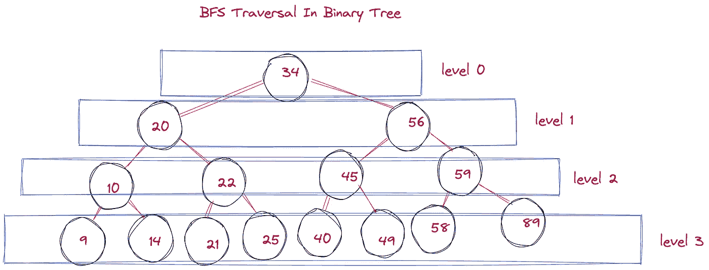
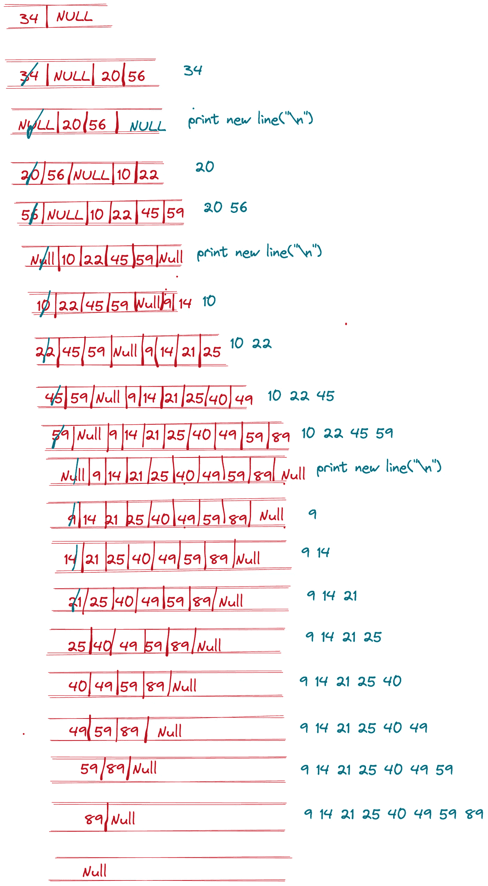

# 理解二叉树中广度优先搜索(BFS)/层次顺序遍历的模式🌳

> 原文：<https://javascript.plainenglish.io/understand-pattern-of-bfs-level-order-traversal-in-binary-tree-d675bcbe44a9?source=collection_archive---------2----------------------->



在这篇博客中，我们将讨论**模式******广度优先搜索(BFS)二叉树。****

## ****BFS 遍历也称为层次顺序遍历****

**伙计，好吧！👍**

## ****我的动力是什么？我为什么要研究这种层次顺序遍历？****

****简答:**很多高水平的面试问题和 LeetCode 中硬水平的问题，如果理解了这个模式就可以解决了。**

## **我们先来了解一下什么是广度优先搜索**

**我们通常会读到关于图的 BFS 遍历。如果我们仔细观察，**二叉树**也是一个图，其中每个节点最多有两(2)个子节点。**

**从上图可以明显看出每一级的元素。**

**为了更加清晰，我将逐层打印值。**

****0-34 级****

****一级— 20，56****

****2 级— 10、22、45、59****

**第三级——9、14、21、25、40、49、58、89 级**

****注**:如果你仔细注意，每一层的元素个数都是上一层的两倍(满二叉树规则)。**

**好了，足够的理论，让我们进入代码实现。**

**在下面的代码中，我假设已经创建了树，并且为我们提供了树的根。**

```
void levelOrderTraversalBinaryTree(TreeNode* root){

        if(!root) return; // return if there is no element in Binary   tree   

        queue<TreeNode*> q;
        q.push(root);
        q.push(NULL); // NULL acts a separator between levels

        // at last queue is left with one element which is NULL
        while(!(q.size()==1&&q.front()==NULL)){
            TreeNode* node = q.front();
            q.pop();

            if(node){
                cout<<node->val<<" ";
                if(node->left) q.push(node->left);
                if(node->right) q.push(node->right);
            }else{
                //if we encounter NULL in queue
                //it means we are going to next level, hence print new line here
                cout<<"\n";
                q.push(NULL);
            }            
        }        
    }
```

**在上面的代码中，我们使用了一个队列来存储元素。**

**最初，我将根元素放入队列，之后为 Null。Null 只是用来区分两个级别。**

**之后，我们开始循环并从队列中移除前面的元素。移除前面的元素后，我们将移除元素的子元素放入队列中。**

**最后，我们只剩下空元素并退出循环。**

**如果你想看到代码的流程，请看下图:**

****

**好吧，没关系。**

**我正在添加一个可以用上述模式解决的问题列表。**

1.  **[https://leet code . com/problems/二叉树层次顺序遍历/](https://leetcode.com/problems/binary-tree-level-order-traversal/)**

***更多内容请看*[***plain English . io***](https://plainenglish.io/)*。报名参加我们的* [***免费周报***](http://newsletter.plainenglish.io/) *。关注我们关于*[***Twitter***](https://twitter.com/inPlainEngHQ)[***LinkedIn***](https://www.linkedin.com/company/inplainenglish/)*[***YouTube***](https://www.youtube.com/channel/UCtipWUghju290NWcn8jhyAw)*[***不和***](https://discord.gg/GtDtUAvyhW) *。*****