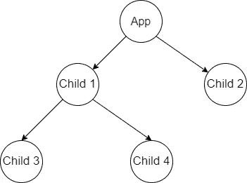

# 通过例子理解反应上下文

> 原文：<https://javascript.plainenglish.io/understand-react-context-with-examples-b66b9161d9de?source=collection_archive---------3----------------------->

## 使用 React 中的上下文创建地址管理 React 应用程序


Photo by [veeterzy](https://unsplash.com/@veeterzy?utm_source=medium&utm_medium=referral) on [Unsplash](https://unsplash.com?utm_source=medium&utm_medium=referral)

如果您刚刚开始学习 React，或者在理解 React 上下文的概念上有困难，那么这篇文章是为您准备的。当我第一次在 React 中查看上下文代码时，我也面临类似的困难。在这篇文章中，我们将分解这个主题，并试图使它简单易懂

# 什么是语境？

> “上下文提供了一种通过组件树传递数据的方式，而不必在每一级手动向下传递属性。”

我们知道，在单页面应用程序中，用户界面是以树状结构表示的，而在 React 中，用户界面被分解成不同的组件。

这些组件可以表示为一棵树，如下图所示，顶部是根组件(或父组件)，下面是子组件。这种应用程序中的数据流是通过 props 从上到下(从父到子)的。



但是这里有一个问题，当一个孩子深深地嵌套在树中并且需要来自根的数据时，那么我们必须将数据传递给它的流中的所有中间组件才能到达那里。

示例:如上图所示，如果子节点 4 需要从应用程序访问数据或状态，则需要通过子节点 1 传递，然后传递给子节点 4

这意味着不需要该特定数据的组件将被提供该数据，以便该数据可以在它们之间传递。这种将道具传递给嵌套很深的孩子的问题叫做道具钻取。

# 背景如何解决道具训练

使用上下文，我们可以避免通过许多级别传递一些道具，它被设计为共享数据，这些数据可以被认为是 React 组件树的“全局”数据

这意味着我们不再需要在组件之间传递数据，因为它对于树(或子树)是全局可用的，并且需要数据的子组件可以使用上下文 API 来访问它

# 设置上下文所涉及的步骤

第一步是使用 React 创建一个上下文。 **createContext** ()函数

```
const ThemeContext = React.createContext('light');
```

第二步是创建一个提供者，并将其包装在将要访问数据的组件/组件树周围

```
<ThemeContext.Provider value="dark">
   <App />
</ThemeContext.Provider>
```

现在，App 组件和 App 中的任何子组件都可以访问 ThemeContext 中提供的值。使用 useContext 挂钩的提供程序

```
const theme = useContext(ThemeContext);
```

现在让我们通过一个真实的例子(地址管理)来理解，并抽象出上下文 API 中的某些功能

# 地址管理示例

让我们创建一个 addressContext.js 文件，并从这个文件中导出我们的上下文和提供者

**步骤 1:** 创建上下文

```
const AddressContext = createContext();
```

**步骤 2:** 如上所述，消费者使用 React 的 useContext 钩子并传递上下文，我希望将它抽象出来，这样我们就不必每次都导入 AddressContext 并将其传递给钩子

```
const useAddress = () => {    
  const context = useContext(AddressContext)  

  if(!context){        
      throw new Error("Context error")    
   }      return context
}
```

现在在消费者上下文中，我们只需调用 useAddress 方法并获取结果

**步骤 3:** 最后一步是设置提供者，现在我希望将它抽象成一个更高阶的组件，这样我就不必导入地址上下文并编写地址上下文。提供更好的可读性

> “高阶分量是接受一个分量并返回一个新分量的函数”

我希望达到以下结果

```
<AddressProvider>
  <App />
</AddressProvider>
```

从

```
<AddressContext.Provider>
  <App />
</AddressContext.Provider>
```

因此，让我们设置这个高阶组件，在这种情况下，App 组件将作为 props.children 传递给 AddressProvider 组件，如下所示

**步骤 4:** 在设置了提供者(AddressProvider)和消费者(useAddress)之后，我们必须导出这两个函数，然后将提供者包装在需要访问数据的组件上

现在，组件树中的任何嵌套组件都能够像全局可用一样访问数据，而无需将其作为适当的使用上下文来传递。

要查看带有 API 调用的地址管理应用程序的完整实现，您可以查看我的资源库

[](https://github.com/Ash-D23/Addressmanagement) [## GitHub-Ash-D23/地址管理

### 这个项目是用 Create React App 引导的。在项目目录中，您可以运行:在…中运行应用程序

github.com](https://github.com/Ash-D23/Addressmanagement) 

***感谢你一直读到最后，希望这篇文章对你有帮助。请关注我，获取更多此类文章！***

# 参考

[](https://reactjs.org/docs/context.html) [## 上下文反应

### 上下文提供了一种通过组件树传递数据的方法，而不必每次都手动传递属性

reactjs.org](https://reactjs.org/docs/context.html) 

*更多内容看* [***说白了。报名参加我们的***](https://plainenglish.io/) **[***免费周报***](http://newsletter.plainenglish.io/) *。关注我们关于*[***Twitter***](https://twitter.com/inPlainEngHQ)*和*[***LinkedIn***](https://www.linkedin.com/company/inplainenglish/)*。加入我们的* [***社区***](https://discord.gg/GtDtUAvyhW) *。***