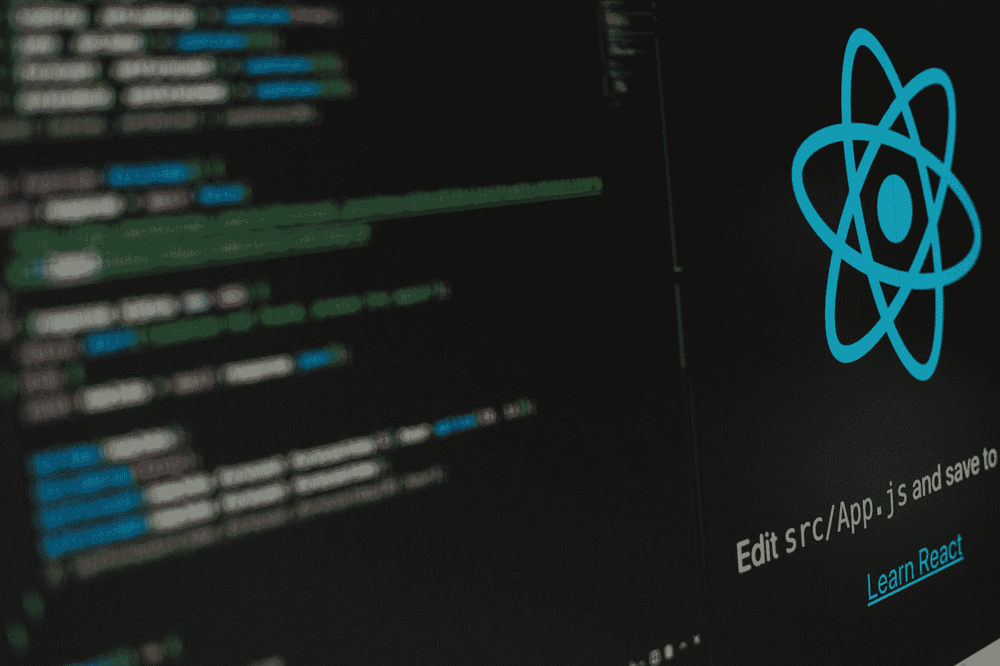

# 了解 React 设计原则

> 原文：<https://javascript.plainenglish.io/understand-react-design-principles-af0051e272c3?source=collection_archive---------8----------------------->

## React 背后的主要原理是什么？了解他们如何在引擎盖下工作



Photo by [Lautaro Andreani](https://unsplash.com/@lautaroandreani?utm_source=medium&utm_medium=referral) on [Unsplash](https://unsplash.com?utm_source=medium&utm_medium=referral)

由于前端开发人员经常使用 React 前端框架，因此更好地理解其指导原则是有意义的。由于我使用 React 已经有一段时间了，所以我将在下面简要讨论我是如何解读它的指导原则的。首先，让我们谈谈 VDOM，因为 React 和 Vue 都是基于它的前端框架。

# 虚拟 DOM(VDOM)

# 为什么 VDOM 应该是 React 和 Vue 的基础？

您无法直接操作真正的 DOM。想想接下来的情况。呈现包括使用 DOM API 添加、删除和更改真实的 DOM。我们必须遍历一个 DOM 的所有属性，如果它们已经被渲染和修改了，就要重新设置它们。这些属性包括 id、类名、onClick 和其他属性。

DOM 的属性:


许多属性在更新时必须重置，即使它们根本不被使用。

## **我们能简单地比较对我们重要的属性吗？**

将它们分离出来并表示为 JS 对象会更好。 **VDOM 正因为如此而拥有它的第一个优势。VDOM 还消除了与 DOM 的紧密联系，允许你在其他平台上渲染，如 native、Canvas 等。**

**VDOM 的第二个优势是这个**。我们知道 VDOM 是一个 JS 对象，它代表了渲染完成的 DOM。

```
{ 
  type: ‘div’, 
  props: { 
    id: ‘aaa’, 
    className: [‘bbb’, ‘ccc’], 
    onClick: function() {} 
  }, 
  children: [] 
}
```

然后用渲染器渲染。但是你希望开发者把 VDOM 写成那样吗？那不可能；这太麻烦了，而且我们熟悉 HTML 方法，所以我们需要引入一个编译工具。

# DSL(一种特定领域语言)的编译

## HTML，CSS，CSS 都是 web 域 DSL。

直接写 VDOM 太麻烦了，所以前端框架会设计一套 DSL，然后编译成渲染函数，执行后生成 VDOM。Vue 和 React 都是这样的。


## **如何设计这套 DSL？**

前端领域中描述 DOM 的常见方式是 HTML，最好的方式就是这样设计。这就是为什么 Vue 的模板和 React 的 JSX 都是这样设计的。Vue 的模板编译器是自己实现的，而 React 的 JSX 编译器是由 babel 实现的，这是两个团队合作的结果。

**渲染器如何渲染 VDOM？**

# 渲染 VDOM

渲染 VDOM 意味着通过 DOM API 添加、删除和更改 DOM。例如，对于一个 div，您必须使用 document.createElement 创建一个元素，然后使用 setAttribute、addEventListener 并设置事件侦听器。如果是文本，那么我们需要一个 document.createTextNode 来创建它。所以，根据 VDOM 的不同类型，写一个 if else，对它做不同的处理。是的，不管是 Vue 还是 React，这个 if else 在渲染器中都是不可或缺的。

```
switch (vdom.tag) { 
    case HostComponent: 
        // Create or update dom 
    case HostText:  
        // create or update dom 
    case FunctionComponent: 
        // Create or update dom 
    case ClassComponent: 
        // Create or update dom 
}
```

在 React 中，VDOM 类型是通过标签来区分的。例如，HostComponent 是元素，HostText 是文本，FunctionComponent 和 ClassComponent 分别是函数组件和类组件。**那么问题来了，如何渲染组件？**这就引出了组件的原理。

# 成分

我们的目标是通过 VDOM 描述接口，在 React 中，我们使用 JSX。这种 JSX 有时基于状态动态生成。

**我们怎么能把国家和 JSX 联系起来呢？**
将它们包装成函数、类或选项对象。然后，您可以执行它们以在渲染时获得 VDOM。这就是组件的实现方式。

```
switch (vdom.tag) {
  case FunctionComponent:
    const childVdom = vdom.type(props);
    render(childVdom);
    //…
  case ClassComponent:
    const instance = new vdom.type(props);
    const childVdom = instance.render();
    render(childVdom);
    //…
}
```

如果是函数组件，那么传入 props 执行它，得到 VDOM，然后递归渲染。如果它是一个类组件，那么创建它的实例对象，调用 render 方法获得 VDOM，并递归地渲染它。**那么，你能猜出 Vue 的 options 对象的组件描述是如何渲染的吗？**

```
{
  data: {},
  props: {}
  render(h) {
    return h(‘div’, {}, ‘’);
  }
}
```

没错，执行 render 方法就行了。

```
const childVdom = option.render();
render(childVdom);
```

您可能通常以 SFC 的形式编写单文件组件，它将有一个特殊的编译器，将模板编译成呈现函数，然后将其与 options 对象的呈现方法挂钩。


因此，该组件本质上只是生成 VDOM 的逻辑的包装，以函数、选项对象或类的形式存在。就像 Vue3 也有功能组件一样，组件的形式并不重要。基于 VDOM 的前端框架的呈现过程是相似的。Vue 和 React 在很多方面是一样的。但是管理国家的方式是不同的。

**Vue 是 responsive，React 是 setState API。**真的，Vue 和 React 最大的区别就是状态管理方式的不同，因为这种不同导致了架构演进的不同方向。

# 状态管理

**React 通过 setState API 触发状态更新，更新后重新渲染整个 VDOM。另一方面，Vue 通过代理收集状态，然后在状态被修改时触发相应组件的呈现。**有些同学可能会问，**为什么 react 不直接渲染对应的组件？**想象一下这个场景。父组件将其 setState 函数传递给子组件，子组件调用它。此时，更新是由子组件**触发的，但是这是唯一要呈现的组件吗？**

显然不是，还有它的母成分。类似地，组件更新实际上可以触发任何位置的其他组件。所以整个 VDOM 必须被重新渲染。

**那为什么 Vue 可以准确的更新更改后的组件呢？**
因为有了响应式代理，无论是子组件、父组件，还是在另一个位置的组件，只要使用了对应的状态，就会被收集为依赖项，状态变化就可以触发它们的渲染，而不管组件在哪里。这就是为什么 React 需要重新渲染整个 VDOM，而 Vue 不需要。这个问题也导致了后来两者逐渐的架构差异。

# **React 架构的发展**

在 React 15 的时候，React 和 Vue 的渲染过程仍然非常相似，都是递归地渲染 VDOM，并添加、删除和更改 DOM。但是国家管理上的差异逐渐导致了架构上的差异。React 的 setState 渲染整个 VDOM，一个应用的所有 vdom 可能都非常大，所以计算量可能非常大。浏览器中 JS 计算时间太多会阻塞渲染，占用动画的每一帧，重绘，重排时间，所以动画会滞后。

作为前端框架，动画口吃肯定不是选项。但由于 setState 方法只能渲染整个 VDOM，所以计算量大是必然的。**我们能否将计算拆分，计算每帧的一部分，以避免阻碍动画的渲染？**按照这个思路，react 被改造成了纤程架构。

## 纤维建筑

优化的目标是中断计算并将其分成多个帧，但现在递归渲染不能被中断，原因有两个。

*   **渲染中断时已经更新到 dom 的部分怎么办？**
*   现在 VDOM 是直接渲染的，只有 VDOM 的孩子的信息，如果我们中断它，**怎么才能找到它的父节点？**

第一个问题的解决方法很容易想到。渲染的时候，不要直接更新到 DOM，只需要找到改变的部分，做一个添加、删除、创建 DOM 的标记，然后全部计算完立刻更新到 DOM。

所以 React 把渲染过程分为两部分:**渲染和提交**。渲染阶段找到 VDOM 被改变的部分，创建 DOM，并用添加、删除和改变来标记它，这被称为**协调**。

协调是可中断的，并且由调度来安排。所有计算完成后，它会立即更新到 DOM，称为**提交**。通过这种方式，React 将之前非常类似于 Vue 的递归渲染转化为 render(reconcile+schedule)+commit 两阶段渲染。从那以后，React 和 Vue 的架构差异变大了。

**第二个问题是，中断后如何找到父节点和其他兄弟节点。**现有的 VDOM 不起作用；我们需要再次记录父节点和兄弟节点的信息。所以 React 创建了纤程的数据结构。


除了子节点的信息，还有 sibling 和 return，分别记录了兄弟节点和父节点的信息。这个数据结构也叫纤程(纤程既是数据结构，也是 render + commit 的渲染过程)。

React 将首先将 VDOM 转换为纤程，然后进行协调，因此它是可中断的。**为什么这是可中断的？因为它不再是递归的，所以它是一个循环:**

```
function workLoop() {
  while (wip) {
    performUnitOfWork();
  }
  if (!wip && wipRoot) {
    commitRoot();
  }
}
```

React 中有一个 workLoop 循环，每个循环对纤程进行协调，当前处理的纤程放在 workInProgress 全局变量中。当循环结束时，即 workInProgress 为空时，将执行提交阶段，并将协调后的结果更新到 Dom。根据类型的不同，对每个纤维的协调处理也不同。当前纤程节点完成后，workInProgress 被指向兄弟节点，并返回以剪切到下一个纤程节点。

```
function performUnitOfWork() {
  const { tag } = wip;

  switch (tag) {
    case HostComponent:
      updateHostComponent(wip);
      break;

    case FunctionComponent:
      updateFunctionComponent(wip);
      break;

    case ClassComponent:
      updateClassComponent(wip);
      break;
    case Fragment:
      updateFragmentComponent(wip);
      break;
    case HostText:
      updateHostTextComponent(wip);
      break;
    default:
      break;
  }

  if (wip.child) {
    wip = wip.child;
    return;
  }

  let next = wip;

  while (next) {
    if (next.sibling) {
      wip = next.sibling;
      return;
    }
    next = next.return;
  }

  wip = null;
}
```

对于函数组件和类组件的调和和之前一样，都是调用 render 获取 VDOM，然后继续处理渲染后的 VDOM:

```
function updateClassComponent(wip) {
  const { type, props } = wip;
  const instance = new type(props);
  const children = instance.render();
  reconcileChildren(wip, children);
}
function updateFunctionComponent(wip) {
  renderWithHooks(wip);
  const { type, props } = wip;
  const children = type(props);
  reconcileChildren(wip, children);
}
```

协调是在一个循环中执行的，它在每次处理之前确定是否有更高优先级的任务可以被中断。因此，我们在每次协调纤程节点之前调用 shouldYield 方法。

```
function workLoop() {
  while (wip && shouldYield()) {
    performUnitOfWork();
  }
  if (!wip && wipRoot) {
    commitRoot();
  }
}
```

shouldYield 方法用于确定队列中是否有更高优先级的任务要处理，如果是，则首先处理纤程的这一侧，然后首先暂停这一侧。这就是纤维结构的调和是如何被打断的。这是通过纤程的数据结构，加上每次判断是否中断之前的循环处理来实现的。

谈完渲染阶段(reconcile + schedule)，下一步就是进入提交阶段。如前所述，为了成为可中断的，协调阶段并不真正操作 dom，而只是创建 dom，然后创建一个 effectTag 来添加、删除和更改标签。提交阶段根据标签更新 DOM。

但是提交阶段必须再次遍历纤程以找到带有 effectTag 的节点 **并更新 DOM 吗？**那也行，但没必要。您可以在协调期间将带有 effectTag 的节点收集到一个队列中，然后在提交期间遍历该队列。这个队列被称为 effectList。

React 将在提交阶段遍历 effectList，并根据 effectTag 添加、删除和更改 DOM。在创建 DOM 之前和之后，执行 useEffect、useLayoutEffect 和一些函数组件的生命周期函数。useEffect 设计为在 DOM 操作之前异步调用，useLayoutEffect 在 DOM 操作之后同步调用。

## **为什么会这样？**

因为所有的 DOM 操作都要做，如果同步执行一个效果，计算量会非常大，会毁了纤程架构的优势。所以效果是异步的，不会阻塞渲染。而 useLayoutEffect，顾名思义，就是在这个阶段获取一些布局信息。DOM 操作完成并呈现后，您也可以自然地同步调用。

事实上，React 将提交阶段分为 3 个小阶段。**突变前，突变后，布局**。变异是迭代通过 effectList 来更新 DOM。它前面是 before variation，它异步调度 useEffect 回调函数。后面是布局阶段，因为这个阶段已经可以获取布局信息，并且会同步调用 useLayoutEffect 回调函数。这个阶段还获取新的 DOM 节点并更新 ref。至此，我们对 React 的新架构以及渲染和提交阶段的工作有了一个清晰的了解。

# 摘要

React 和 Vue 都是基于 VDOM 的前端框架。我们之所以使用 VDOM，是因为我们可以准确地比较我们关心的属性，我们也可以跨平台渲染。

但开发者不会直接编写 VDOM，而是通过 JSX，一种接近 HTML 语法的 DSL，编译生成渲染函数，执行生成 VDOM。VDOM 的渲染是通过使用不同的 DOM APIs 根据不同的类型操作 DOM 来实现的。

渲染组件时，如果是函数组件，则执行它以获得 VDOM。

该类组件创建一个实例并调用 render 方法来获取 VDOM。

Vue 的 options 对象调用 render 方法来获取 VDOM。组件本质上是 VDOM 逻辑、函数、类、选项对象或其他任何东西的包装。React 和 Vue 最大的区别是状态的管理方式。

Vue 是响应式的，React 通过 setState API 工作。我认为这是最大的不同，因为它导致了 React 架构后来的变化。React 的 setState 方法导致它不知道哪些组件发生了变化，它需要渲染整个 VDOM。但这样计算量会更大，阻碍渲染并导致动画延迟。所以 React 后来被转换成了纤程架构，目标是可中断的计算。

为了达到这个目的，我们不能边比较边更新 DOM，所以我们把渲染分为两个阶段:**渲染和提交。**render 阶段通过调度进行调和，即找到更改的部分，创建 DOM，用添加、删除、更改来标记，在所有计算完成后，commit 阶段更新 DOM。

在中断之后，我们必须找到父节点和兄弟节点，因此 VDOM 也被转换成纤程的数据结构，具有父节点和兄弟节点的信息。所以纤程指的是链表的数据结构和渲染提交的过程。

协调阶段一次处理一个纤程节点，在处理之前，它将判断 shouldYield，如果有更高优先级的任务，那么它将首先执行另一个。

提交阶段不需要再次遍历纤程树，为了优化，react 将所有带有 effectTag 的纤程放在 effectList 队列中，并遍历它以更新它。

在 DOM 操作之前，异步调用 useEffect 回调函数，异步是因为它不能阻止渲染。DOM 操作后，同步调用 useLayoutEffect 的回调函数，更新 ref。

因此，提交阶段分为变异前、变异和布局，它们对应于上面提到的三个部分。

我觉得了解 VDOM、JSX、组件本质、纤程、render(调和+调度)+ commit(变异、变异、布局前)的渲染流程，是对 React 原理的更深层次的理解。

**期待您关注和阅读更多高质量的文章。**

*更多内容请看*[***plain English . io***](https://plainenglish.io/)*。报名参加我们的* [***免费周报***](http://newsletter.plainenglish.io/) *。关注我们关于*[***Twitter***](https://twitter.com/inPlainEngHQ)**和*[***LinkedIn***](https://www.linkedin.com/company/inplainenglish/)*。查看我们的* [***社区不和谐***](https://discord.gg/GtDtUAvyhW) *加入我们的* [***人才集体***](https://inplainenglish.pallet.com/talent/welcome) *。**