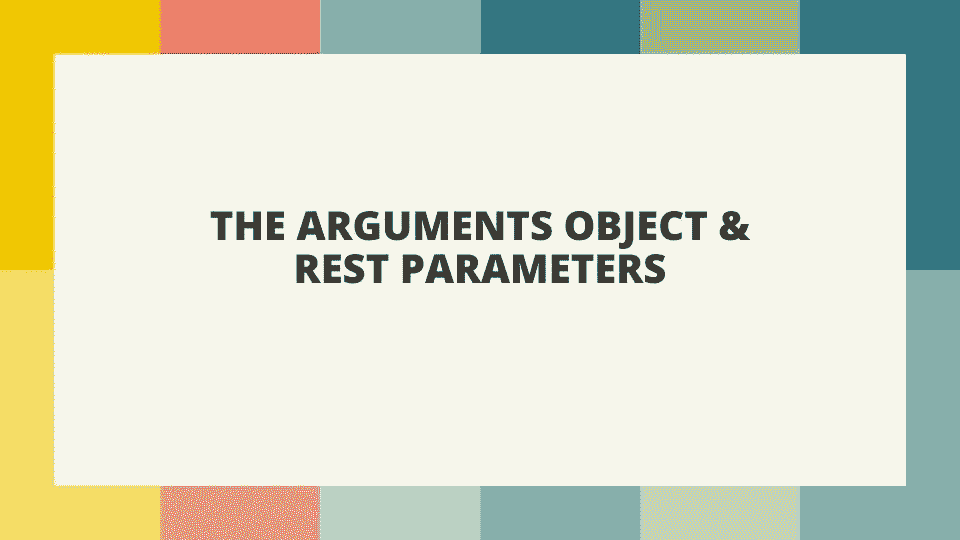

# JavaScript 中的 Rest 参数简介

> 原文：<https://javascript.plainenglish.io/understand-the-arguments-object-and-rest-parameters-921b5db60bd4?source=collection_archive---------1----------------------->

## Arguments 对象和 Rest 参数指南。



## 函数参数

当我们创建一个函数时，我们通常会在函数体内部设置参数。当我们调用或调用函数时，我们传递这些参数的值。我们称这些价值观为论点。我们来看一个基本的函数例子。

```
function add(valOne, valTwo) {
  return valOne + valTwo;
}add(1, 4);//Returns ---> 5
```

在上面的例子中，我们创建了一个名为`add`的函数。我们在函数括号内设置参数 *valOne* 和 *valTwo* 。在函数体内，我们将两个值相加。当该函数被调用时，我们传入两个参数 *1* 和 *4* ，它们成为 *valOne* 和 *valTwo* 。

## 参数对象

JavaScript 提供了一个名为 arguments 对象的对象，可以从函数内部访问它。arguments 对象看起来类似于一个数组，但它不是一个数组，所以不能使用数组方法，除非将它转换为数组。arguments 对象是一个列表，所以元素有索引，所以我们可以使用 for 循环遍历元素。让我们用前面的例子来看看。我们将对 arguments 对象进行 console.log，而不是对参数求和。

```
function add(valOne, valTwo) {
  console.log(arguments);
}add(1, 4);//Returns ---> Arguments(2) [1, 4, callee: ƒ, Symbol(Symbol.iterator): ƒ]
```

当调用 *add* 函数时，我们传入两个参数。我们可以在函数 console.log 中打印的 arguments 对象中看到这些。如果我们想访问参数，我们可以使用参数的索引，如下所示。

```
function add(valOne, valTwo) {
  console.log(arguments[0], arguments[1]);
}add(1, 4);//Returns ---> 1 4
```

我们也可以使用循环来迭代参数，就像我们使用数组一样。

```
function add(valOne, valTwo) {
  for(let i = 0; i < arguments.length; i++) {
    console.log(arguments[i]);
  }
}add(1, 4);//Returns --->
1
4
```

值得注意的是，当我们使用箭头函数时，我们不能访问 arguments 对象，如果我们试图这样做，我们将得到一个错误，如下例所示。

```
const add = (valOne, valTwo) => {
 console.log(arguments);
}add(1, 4);//Returns --->
VM320:2 Uncaught ReferenceError: arguments is not defined
    at add (<anonymous>:2:14)
    at <anonymous>:4:1
```

## 其余参数

ES6 引入了 rest 参数。这使我们能够解决与 arguments 对象相同的问题，但它要简单得多。rest 参数的语法与使用三个点(…)的 spread 运算符相同，但它的工作方式非常不同。rest 参数将所有内容收集到一个数组中。如果我们想使用一个接受任意数量参数的函数，或者如果我们有一个很长的参数列表要传递给函数(比如字母表)，这是非常有用的。

要使用 rest 参数，我们将它放在函数括号内，用三个点后跟一个名称，这样我们就可以从函数内部访问数组。让我们看一个例子。

```
function add(...values) {
  console.log(values);
}add(1, 4);//Returns ---> (2) [1, 4]
```

在上面的例子中，我们使用了前面例子中的同一个函数，但是这次我们使用了括号中的 rest 参数，并将名称设置为 values。我们在函数体中控制台注销这一点。当这个函数被调用时，我们可以看到我们得到了一个包含在屏幕上打印出来的参数的数组。

与 arguments 对象相比，rest 参数有一些不同。rest 参数将只返回尚未与前一个参数匹配的剩余参数。因此，如果我们要为 *valueOne* 设置一个参数，值数组现在将只包含一个元素，如下例所示。

```
function add(valueOne, ...values) {
  console.log(values);
}add(1, 4);//Returns ---> [4]
```

如果您希望设置参数并使用 rest 参数，考虑到 rest 参数返回剩余的值，您需要在 rest 参数之前设置参数，这一点很重要。如果您首先使用 rest 参数，然后设置 *valueOne* 参数，您将得到如下所示的语法错误。

```
function add(...values, valueOne) {
  console.log(valueOne);
}add(1, 4);//Returns ---> Uncaught SyntaxError: Rest parameter must be last formal parameter
```

最后，与 arguments 对象不同，我们还可以在 arrow 函数中使用 rest 参数！

```
const add = (...values) => {
 console.log(values);
}add(1, 4);//Returns ---> (2) [1, 4]
```

我希望你喜欢这篇文章，请随时发表任何意见，问题或反馈，并关注我的更多内容！

*更多内容看* [***说白了就是***](https://plainenglish.io/) *。报名参加我们的* [***免费周报***](http://newsletter.plainenglish.io/) *。关注我们关于* [***推特***](https://twitter.com/inPlainEngHQ) *和**[***LinkedIn***](https://www.linkedin.com/company/inplainenglish/)*。加入我们的* [***社区***](https://discord.gg/GtDtUAvyhW) *。**