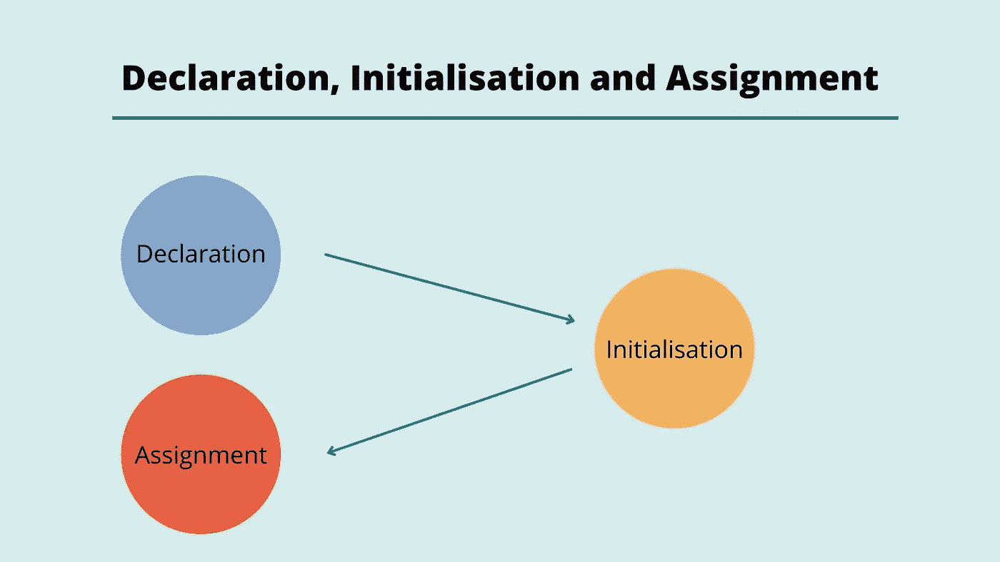
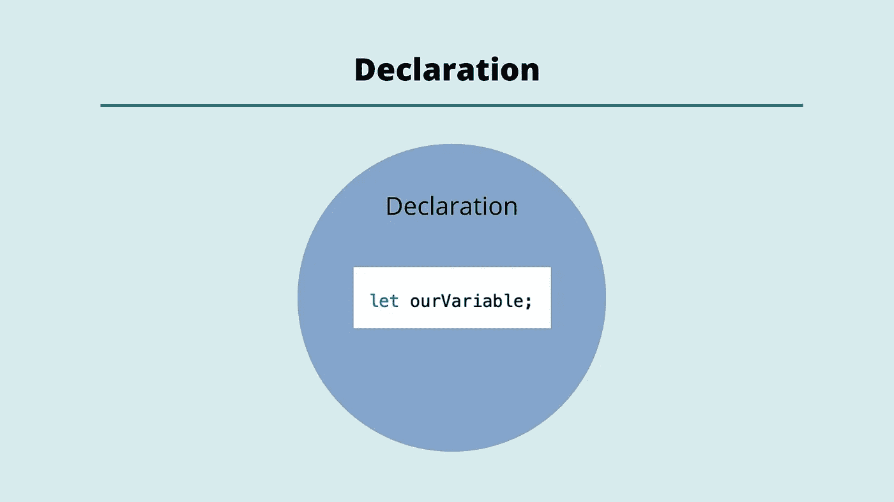
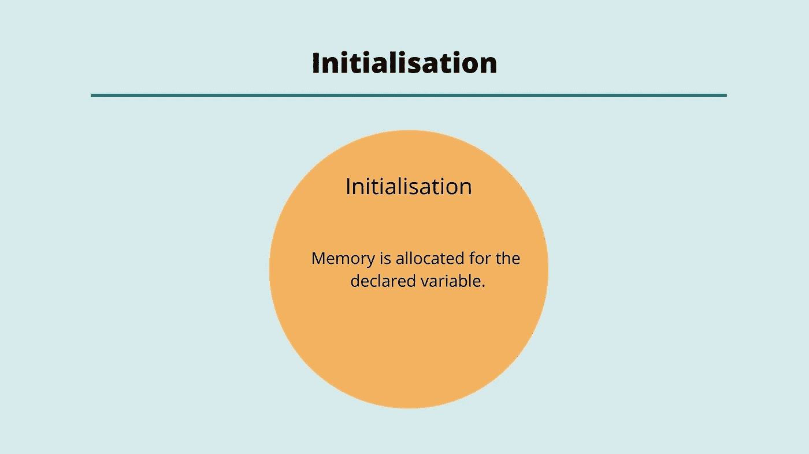
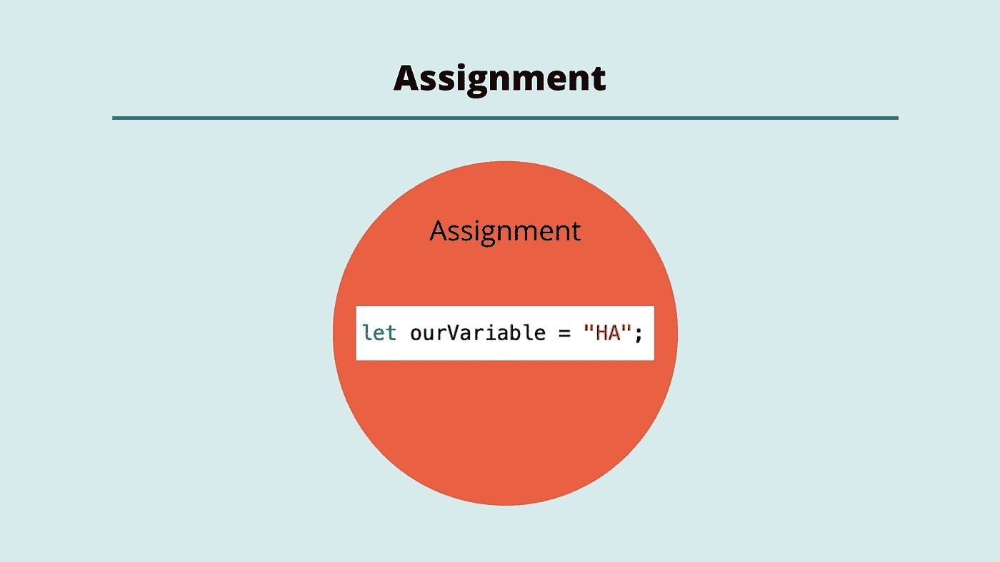

# 理解 JavaScript 中的变量声明、初始化和赋值

> 原文：<https://javascript.plainenglish.io/understand-variable-declaration-initialisation-and-assignment-in-javascript-4f98e54ecda5?source=collection_archive---------21----------------------->



## 申报



当我们声明一个变量时，我们命名它，然后在我们期望的范围内注册它。

```
var x;
let y;console.log(x);
//Returns ---> undefinedconsole.log(y);
//Returns ---> undefined
```

上面提供了一个使用 *var* 和 *let* 在全局范围内声明变量的例子。我们可以再次这样做，但这次是在本地范围内，如下例所示:

```
function dummyFunction() {
  var x;
  let y;

  console.log(x);
  console.log(y);
}dummyFunction()
//Returns ---> 
//undefined
//undefined
```

当您声明一个变量时，您并没有定义该变量包含的值。这就是为什么我们在控制台注销变量时会返回*未定义的*。相反，我们是在为一个以后要用的值分配内存。

## 初始化



初始化阶段意味着 JavaScript 引擎在其内存中为变量分配空间。当你在 JavaScript 中声明一个变量时，这个变量会被自动初始化。

## 分配



赋值阶段为我们在声明变量时创建的标签赋值。我们使用赋值操作符来完成这项工作(等号)。

```
let season; //Declaration
console.log(season);
//Returns ---> undefined season = "Summer"; //Assignment
console.log(season);
//Returns ---> 'Summer;
```

让我们回到第一个例子，给变量 *x* 和 *y* 赋值。

```
var x = 1;
let y = 2;console.log(x);
//Returns ---> 1console.log(y);
//Returns ---> 2
```

在最后一个例子中，我们同时在同一行上声明和定义了变量 *x* 和 *y* 。然而，现在我们理解了当我们创建这些变量时所发生的不同阶段。

## const 呢？

ES6 为我们提供了另一种方法来创建一个与使用常量*的 *let* 并排的变量。如果你试图用 const 声明一个变量，而没有给这个变量赋值，你会得到一个错误。*

```
const a;
//Returns ---> Uncaught SyntaxError: Missing initializer in const declaration
```

当你使用 *const* 声明一个变量时，你**必须同时**给这个变量赋值。还要记住，你不能在以后重新分配用 *const* 创建的变量。

```
const a = "Hello";
```

我希望你喜欢这篇文章，请随时发表任何意见，问题或反馈，并关注我的更多内容！

*更多内容请看*[***plain English . io***](http://plainenglish.io/)*。报名参加我们的* [***免费每周简讯***](http://newsletter.plainenglish.io/) *。在我们的* [***社区***](https://discord.gg/GtDtUAvyhW) *获取独家写作机会和建议。*