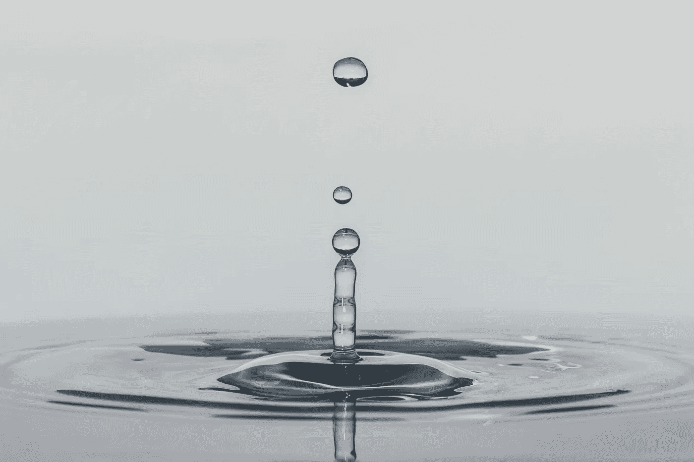
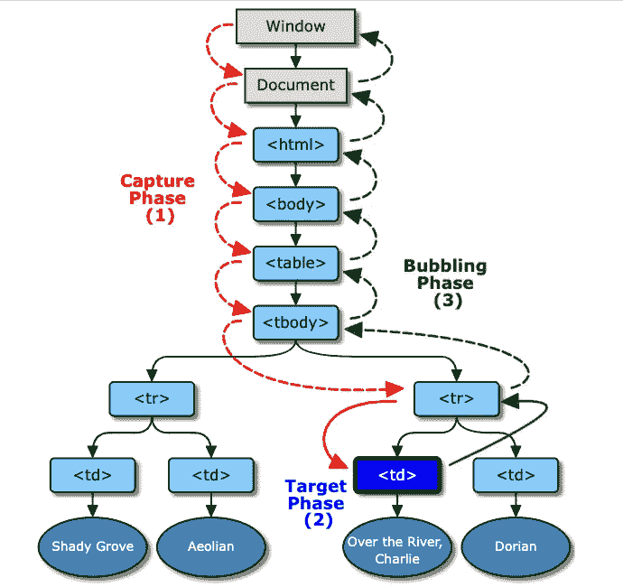
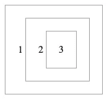
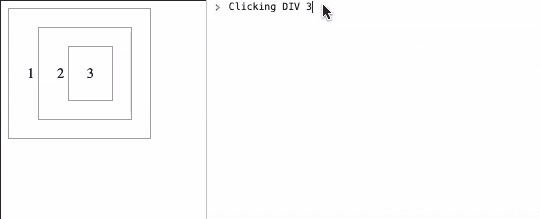
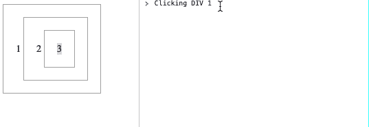
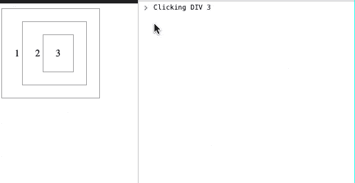

# 理解 JavaScript 中的事件冒泡和事件捕获

> 原文：<https://javascript.plainenglish.io/understanding-event-bubbling-and-event-capturing-in-javascript-1fb04d2754d2?source=collection_archive---------12----------------------->

## 详细介绍 JavaScript 中的事件冒泡和事件捕获。



Photo by [César Couto](https://unsplash.com/@xcrap?utm_source=unsplash&utm_medium=referral&utm_content=creditCopyText) on [Unsplash](https://unsplash.com/s/photos/ripple?utm_source=unsplash&utm_medium=referral&utm_content=creditCopyText)

在进入今天的两个主要话题 JavaScript 中的事件冒泡和事件捕获之前。首先，我们必须了解这些主题的根源，即 JavaScript 中的事件。

# JavaScript 中的事件是什么？

对象状态的任何变化都称为事件。HTML 中有各种事件，这些事件代表浏览器或用户执行的一些活动。

当我们在 HTML 页面中包含 JavaScript 时，JavaScript 对这些事件做出反应并执行。因此，对事件做出反应的整个过程称为**事件处理。**

各种 HTML 事件的示例:

*   输入字段已更改
*   点击了一个按钮
*   HTML 页面已完成加载
*   表单提交已点击
*   调整浏览器窗口的大小

# 了解事件传播

当有许多嵌套元素时，每个元素都有其处理程序，事件处理会变得非常复杂——特别是当父元素接收到与其子元素完全相同的事件时，因为它们在“空间”上重叠，所以事件在两者中都发生，并且这些事件的处理顺序取决于被触发的每个处理程序的[事件冒泡和捕获](https://developer.mozilla.org/en-US/docs/Learn/JavaScript/Building_blocks/Events#event_bubbling_and_capture)设置。( [MDN 网络文档](https://developer.mozilla.org/en-US/docs/Web/API/Event)，2022)

因此，理解事件如何在 DOM 中传播是至关重要的。

## 什么是事件传播？

通过文档对象模型(DOM)树从其父元素传播到目标元素，然后传播回其父元素的事件流被称为**事件传播**。

这导致了 JavaScript 事件的三个阶段:

1.  **事件捕获阶段**:事件从**窗口**对象向目标元素传播。
2.  **事件目标阶段**:事件到达启动事件的目标元素。
3.  **事件冒泡阶段**:事件传播直到到达**窗口**对象。这与事件捕获阶段相反，即事件从目标元素流向窗口对象。

上述事件流阶段如下图所示:



[Copyright © 2016 World Wide Web Consortium, (MIT, ERCIM, Keio, Beihang)](https://www.w3.org/Consortium/Legal/2015/doc-license)

# 事件传播属性

各种属性可用于检索与事件相关的信息。为了便于理解，我们将重点关注以下三个属性:

1.  e.target :事件被传输到的元素的引用。它是一个只读属性。
2.  **e.currentTarget** :对事件处理程序所附加的元素的引用。这是一个**只读**属性。
3.  **e.eventPhase** :当前事件阶段的引用。可用事件阶段的类型:

*   事件。无(0)
*   事件。捕捉 _ 阶段(1)
*   事件。AT_TARGET (2)
*   事件。冒泡 _ 阶段(3)

如果您有兴趣了解更多关于其他酒店的信息，请参考[事件(MDN Web Docs，2022)](https://developer.mozilla.org/en-US/docs/Web/API/Event) 。

# 让我们举一个例子

我们将创建三个嵌套形式的 div，如下图所示。



Nested Div Elements

*HTML 部分*:

```
<div id="div1">1
    <div id="div2">2
        <div id="div3">3</div>
    </div>
</div>
```

*CSS 部分*:

```
div {
 display: inline-block;
 padding: 20px;
 border: 1px solid #aaa;
 cursor: pointer;
}// Apply different colours for different divs#div1:hover {
 border: 1px solid #faa;
 background: blue;
}#div2:hover {
 border: 1px solid #faa;
 background: green;
}div:hover {
 border: 1px solid #faa;
 background: #fdd;
}
```

**现在，让我们向所有的窗口、文档和 div 元素添加事件监听器。**

*addEventListener 方法*:

```
target.addEventListener(type, listener, useCapture)
```

使用上述方法将事件附加到窗口、文档和所有 div 元素:

```
window.addEventListener("click", () => {    
  console.log('Window');
},true);document.addEventListener("click", () => {  
  console.log('Document');
},true);document.querySelector("#div3").addEventListener("click", () => {     
  console.log('DIV 3');  
},true);document.querySelector("#div2").addEventListener("click", () => {    
  console.log('DIV 2');
},true);document.querySelector("#div1").addEventListener("click", () => {    
  console.log('DIV 1');
},true);
```

## 事件捕获阶段

事件从根元素传播到目标元素被称为捕获。

让我们借助上面的可视化表示示例来理解捕获阶段:



Event Capturing flow

*场景*:

1.  当点击“Div 3”元素时，捕获事件从根元素(即窗口)流向目标元素

```
Window(Root) > HTML Document > DIV 1 > DIV 2 > DIV 3(Target)
```

2.类似地，当我们单击“Div 2”元素时，流程如下:

```
Window(Root) > HTML Document > DIV 1 > DIV 2(Target)
```

2.最后，当我们单击“Div 1”元素时，流程如下:

```
Window(Root) > HTML Document > DIV 1(Target)
```

# 事件冒泡阶段

与捕获事件流相反。事件将从目标元素传播到根元素。

基于该示例，我们有以下冒泡事件流的可视化表示:



Event Bubbling flow

*场景*:

1.  当点击“Div 3”元素时，冒泡事件从目标元素(即“Div 3 ”)开始流动，直到根元素

```
DIV 3(Target) > DIV 2 > DIV 1 > HTML Document > Window(Root)
```

2.类似地，当我们单击“Div 2”元素时，流程如下:

```
DIV 2(Target) > DIV 1 > HTML Document > Window(Root)
```

2.最后，当我们单击“Div 1”元素时，流程如下:

```
DIV 1(Target) > HTML Document > Window(Root)
```

# 事件冒泡和一起捕获

让我们一起看看冒泡和捕获事件的组合的直观表示:



Event bubbling and capture

代码请参考[https://jsfiddle.net/nwali/eanz9o52/](https://jsfiddle.net/nwali/eanz9o52/)

# 停止传播

有时，我们希望停止单个元素上的事件触发器，并防止更多的事件被触发。

为了达到阻止事件传播的目的，我们有以下两种方法:

*   **停止繁殖()**

此方法将阻止任何父处理程序被执行，而

*   **stop immediate propagation()**

此方法将阻止包括父处理程序在内的任何处理程序被执行

# 参考

*   [https://www.quirksmode.org/js/events_order.html](https://www.quirksmode.org/js/events_order.html)
*   [https://developer.mozilla.org/en-US/docs/Web/API/Event](https://developer.mozilla.org/en-US/docs/Web/API/Event)
*   https://en.wikipedia.org/wiki/Event_bubbling

# 直到下一次

希望这篇文章对你有用，感谢你阅读它。如果您有任何反馈，也请分享。

我在@buymeacoffee 上。如果你喜欢我的作品，你可以给我买一幅☕，分享你的想法🎉【https://www.buymeacoffee.com/nikhilwali2 

*更多内容看* [***说白了就是 io***](http://plainenglish.io/) *。报名参加我们的**[***免费周报***](http://newsletter.plainenglish.io/) *。在我们的* [***社区不和谐***](https://discord.gg/GtDtUAvyhW) *获得独家获取写作机会和建议。**