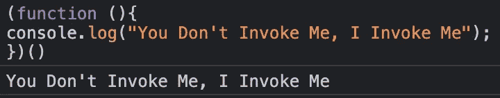
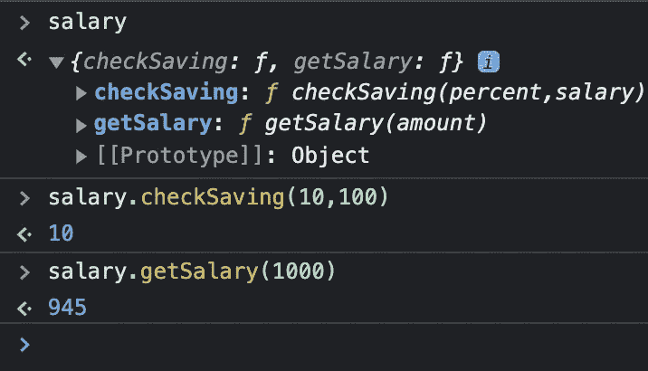

# 初学者生活入门

> 原文：<https://javascript.plainenglish.io/understanding-iifes-64d1b8f234ce?source=collection_archive---------14----------------------->

## 什么是生活？IIFEs 或立即调用的函数表达式是在定义时就被调用的函数。


Immediately Invoked Function Expression

立即调用函数表达式，你在不知情的情况下使用它们

生活就是你所说的立即被调用的函数表达式，是一个在定义的时候就被调用的函数。这也是一种被称为[自执行匿名函数](https://developer.mozilla.org/en-US/docs/Glossary/Self-Executing_Anonymous_Function)的模式。基本的生活看起来像

```
(function (){
 console.log("You Don't Invoke Me, I Invoke Me");
})()
```

当函数被读取时，它被调用:



乍一看，它看起来很简单，而且确实如此。事情变得有点复杂的地方是决定在哪里使用它们。所以让我们看一些例子和用例来理解它们是如何工作的，最终的结果可能会比你想象的更令人惊讶。

## 让我们保持全局名称空间的整洁

对于现代的 JavaScript 应用程序，我们注入了大量的依赖关系，其中一些是在全局/窗口对象中定义的依赖关系。但是如果我们定义了一个全局变量，它覆盖了另一个依赖项使用的变量，事情会变糟。总是建议将全局变量的数量保持在最小是有原因的(也有助于内存)。
在我们看这个例子之前，让我提醒你，在 JS 中，一个函数中的所有变量/函数都被认为是局部的。

```
// global scope
var sum = 100;var getSum = num => (function(num){
    // local scope
    var sum = 10;
    return sum + num;
})(num)console.log(getSum(40)); // => 50
console.log(sum) // => 100
```

变量 *sum* 的局部范围不影响全局定义的 *sum* 。这是一个基本的例子，但是当处理多个文件和暴露的全局范围时，很有可能会有同名的变量。为了防止它们互相覆盖，IIFE 可能是定义局部作用域的一种方法。

## ***封装***

封装是 OOPs(面向对象编程)的核心概念之一。它指的是将数据以及对数据进行操作的方法捆绑到一个单元中，您也可以将它视为一个类。这让我们只公开实现功能所需的内容，这可以通过公共方法和变量的形式来完成。

让我们使用 IIFE 来创建 salary util，它公开了供用户交互的方法:

```
var salary = (function (){
   // deduct 10% of basic salary
   var tax = 10;
   // add 5 % to basic salary
   var houseAlowance = 5;// user can check savings;
   function checkSaving(percent,salary){
       var savings = (percent/100) * salary;
       return savings
   }// returns salary after adding houseAlowance and tax deductions
   function getSalary(amount){
      var withHouseAlowance =  ((houseAlowance/100) * amount) +amount;
      var taxCut =  (tax/100) * withHouseAlowance;
      var salary = withHouseAlowance - taxCut
      return salary;
   } // exposed interface for the dev/user to work with
    return {
       checkSaving,getSalary
   }
})()
```

正如您在下面所看到的，只有 IIFE 返回的方法才暴露给用户进行交互。所以我们只暴露需要的东西，防止私有变量泄露，帮助我们实现封装。



Encapsulation exposes only what we want to be public

## 模块模式

因为这是一个很大的话题，所以我不会深入讨论这个模式的细节，但是这就是我所说的“如果你在不知情的情况下使用了它们”的意思如果您曾经将外部依赖项导入到您的项目中，则很有可能使用了以下语法:

```
import {} from 'module'
Or
const abc = require('module')
```

在这种模式中，立即调用的函数表达式(IIFE)用于创建私有范围，只导出应该是公共的部分(封装)。因为函数中定义的任何东西都是局部函数的一部分，所以不能被破坏。这有助于我们导入两个不同的模块，公开同名的方法。如果您想了解关于模块模式的更多信息，您可以查看:

*   https://github.com/umdjs/umd
*   AMD:[https://en . Wikipedia . org/wiki/Asynchronous _ module _ definition](https://en.wikipedia.org/wiki/Asynchronous_module_definition)
*   https://requirejs.org/docs/commonjs.html

希望这能帮助你理解生命，以及它是如何成为 JS 开发的核心部分的。如果你有任何疑问，请让我知道。

感谢您的阅读。

*更多内容看* [***说白了就是 io***](http://plainenglish.io/) *。报名参加我们的* [***免费周报***](http://newsletter.plainenglish.io/) *。在我们的* [***社区获得独家访问写作机会和建议***](https://discord.gg/GtDtUAvyhW) *。*