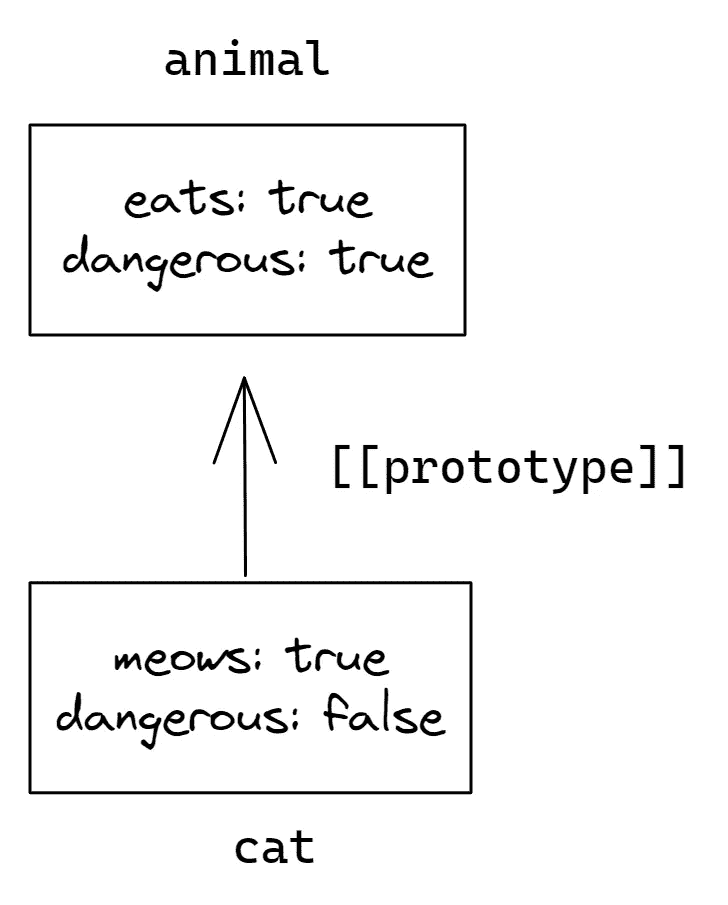

# 理解 JavaScript 中的原型

> 原文：<https://javascript.plainenglish.io/understanding-prototypes-in-javascript-3629ee0439a2?source=collection_archive---------12----------------------->


在编程中，我们经常想要获取一些东西并对其进行扩展。

例如，我们有一个带有属性和方法的`animal`对象。我们想在`animal`之上制作具有特定属性和方法的`cat`和`dog`对象。我们想重用我们在`animal`中的东西，而不是复制/重新实现它的方法，只是在它的基础上建立一个新的对象。

原型是 JavaScript 中的底层特性，它使得对象之间可以继承和共享属性。

为了正确使用原型，我们需要理解它们到底是什么，以及它们如何帮助继承。

# 什么是原型

在 JavaScript 中，每个对象都有一个名为`[[prototype]]`的隐藏内部属性，要么引用另一个对象，要么为空。


JavaScript 使用原型继承。也就是说，每当你试图访问一个对象的属性时。

1.  它首先检查对象本身的属性。
2.  如果在那里找不到，就在对象的原型中搜索属性。
3.  如果它也不能到达那里，则搜索原型的原型，依此类推，直到找到属性，或者到达链的末端，在这种情况下返回`undefined`。

`[[prototype]]` field 是一个隐藏字段，但是我们可以用几种方法来设置它。

1.  `obj.__proto__`:属性`__proto__`已被弃用，不应再使用。
2.  `Object.setPrototypeOf(obj, proto)`:将`obj`的`[[Prototype]]`设置为`proto`。
3.  `Object.create(proto, [descriptors])`:用给定的`proto`作为`[[Prototype]]`和可选的属性描述符创建一个空对象。

`Object.create`方法更加强大，因为它有一个可选的第二个参数:属性描述符。此外，用`Object.setPrototypeOf`或`obj.__proto__`动态改变原型是一个非常慢的操作，因为它破坏了对象属性访问操作的内部优化。

由于这些原因，我们将在本文的其余部分使用`Object.create`方法。

```
let animal = {
  eats: true
};

let cat = Object.create(animal, {
  meows: {
    value: true
  }
});

// we can find both properties in cat now:
console.log(cat.eats); // true 
console.log(cat.meows); // true
```


我们可以看到，当我们试图读取不在`cat`中的`cat.eats`时，JavaScript 会跟随`[[Prototype]]`引用并在`animal`中找到它。

我们可以说`animal`是`cat`的原型，或者说`cat`原型继承了`animal`。

这就是原型的强大之处。如果`animal`有很多有用的属性和方法，那么它们在`cat`中会自动可用。

请记住，对象只能有一个`[[Prototype]]`。他们只能继承一个。

# 原型不用于写作

原型仅用于读取属性。写/删除操作直接处理对象。

在下面的例子中，我们将自己的`dangerous`属性分配给`cat`。

```
let animal = {
  eats: true,
  dangerous: true
};

let cat = Object.create(animal, {
  meows: {
    value: true
  }
});

console.log(animal.dangerous); // true

// Updating cat object
cat.dangerous = false; 

console.log(animal.dangerous); // true
console.log(cat.dangerous); // false
```



从现在开始，`cat.dangerous` call 直接在对象中查找属性并执行，不使用原型。

# “这个”有什么价值？

考虑下面的例子。

```
let animal = {
  eats: true,
  doesItEat: function() {
    return this.eats;
  }

};

let cat = Object.create(animal, {
  meows: {
    value: true
  }
});

cat.eats = false;

console.log(animal.doesItEat()); // true
console.log(cat.doesItEat()); // false
```

可能会出现一个有趣的问题，那就是行`return this.eats`中`this`的值是什么。是`animal`还是`cat`？

答案很简单:`this`永远是点之前的对象。完全不受原型的影响。

所以线`cat.eats = false`使用`cat`作为`this`而不是`animal`。

总而言之，当继承对象运行继承的方法时，它们将只修改自己的状态，而不是父对象的状态。

# 原型在 for…in 循环中的作用

`for..in`循环也遍历继承的属性。

```
let animal = {
  eats: true
};

let cat = Object.create(animal, {
  meows: {
    value: true,
    enumerable: true
  }
});

// for..in loops over both own and inherited keys
for(let prop in cat) console.log(prop); // meows, eats
```

如果我们想排除继承的属性，我们可以使用一个内置方法`obj.hasOwnProperty(key)`，如果`key`是它自己的属性(不是继承的),它将返回`true`。

```
let animal = {
  eats: true
};

let cat = Object.create(animal, {
  meows: {
    value: true,
    enumerable: true
  }
});

for(let prop in cat) {
  let isOwn = cat.hasOwnProperty(prop);

  if (isOwn) {
    console.log(`Our: ${prop}`); // Our: meows
  } else {
    console.log(`Inherited: ${prop}`); // Inherited: eats
  }
}
```

# [总结](https://javascript.info/prototype-inheritance#summary)

*   所有对象都有一个隐藏的`[[Prototype]]`属性，要么引用另一个对象，要么是`null`。
*   如果我们想读取一个属性或者调用一个对象的方法，如果它不存在，那么 JavaScript 试图在它的原型链中找到它。
*   写/删除操作不涉及原型，它直接作用于对象。
*   `this`的值总是调用函数的对象。
*   `for..in`循环遍历它自己的和它继承的属性。

耶，你已经走到尽头了。希望你今天的概念有点清楚了。敬请关注更多此类帖子。

***如果你喜欢这个，请看看我的其他作品***[](https://tahajiru.start.page/)****。****

**更多内容请看* [***说白了就是***](https://plainenglish.io/) *。报名参加我们的* [***免费每周简讯***](http://newsletter.plainenglish.io/) *。关注我们* [***推特***](https://twitter.com/inPlainEngHQ) ， [***领英***](https://www.linkedin.com/company/inplainenglish/) ***，***[***YouTube***](https://www.youtube.com/channel/UCtipWUghju290NWcn8jhyAw)***，****[*****不和*** *对成长黑客感兴趣？检查出***](https://discord.gg/GtDtUAvyhW) **[***电路***](https://circuit.ooo/) ***。*******