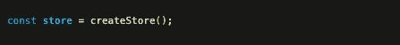
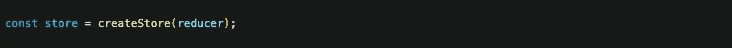
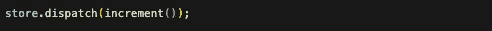
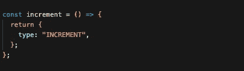
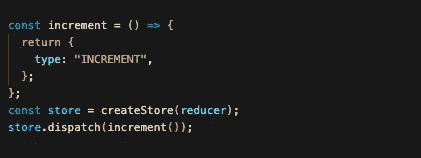
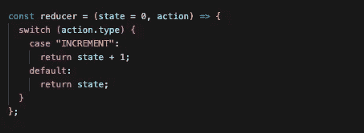
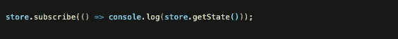
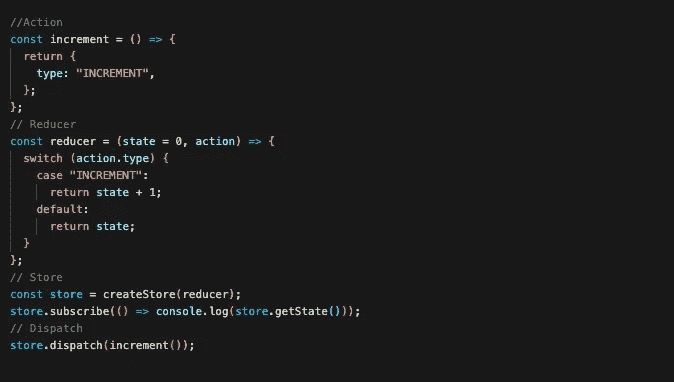
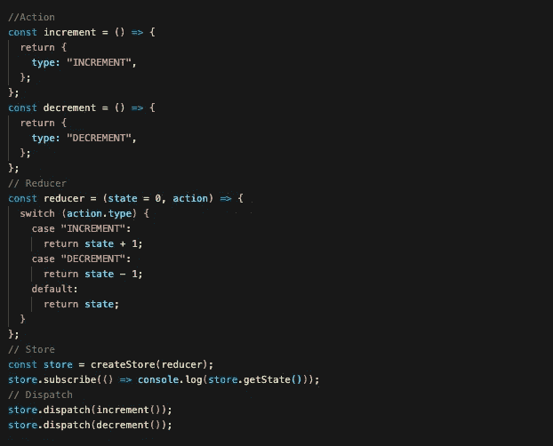

# 面向初学者的 Redux 介绍

> 原文：<https://javascript.plainenglish.io/understanding-redux-beginner-guide-320a19363773?source=collection_archive---------6----------------------->

## 了解 Redux 是什么，它是如何工作的。

# 什么是 Redux

Redux 是一个用于管理和集中应用程序状态的 JavaScript 库。它将所有的应用程序状态存储在一个地方，为了改变一个状态，发出一个调度调用。然后一个动作返回一个 type & payload，它将使用一个 reducer 来改变状态。

Redux 是最常用的 React & Angular。在本指南中，我们将重点介绍 React 以及如何正确使用它。有关 Redux 的更多信息，可以访问他们的文档。他们的链接将在本指南的底部。

# 何时使用 redux

在应用程序中使用 Redux 有很多原因。以下是您可能决定使用 Redux 的几个主要原因:

1.  当您必须在整个应用程序中大量更新状态时
2.  如果您正在创建一个使用许多状态的应用程序。
3.  当更新状态背后的逻辑很复杂时。
4.  如果多个开发人员在同一个项目中工作。

# 基本理解

在我们开始解释 Redux 如何在 React 中工作之前，有一些在使用 Redux 时使用的关键术语。理解其中的每一个将使理解 Redux 变得容易得多。

**状态** —状态是一个 javascript 对象，用于存储关于组件当前情况的信息。

**商店** —商店是一个全球化的状态，它保存了应用程序所有组件的所有状态。

**动作** —动作是一个函数，它返回一个由类型和有效载荷组成的对象。

**Dispatch** — Dispatch 是一个命令，它将返回对象从动作中取出，并将其发送给一个 reducer。

**还原器** —还原器接受一个状态和一个动作(从调度功能发送的信息)，并根据给定的类型返回一个新的状态。

# Redux 如何工作

为了解释 Redux 如何工作，我们将创建一个示例。我们将解释加 1 和减 1 的过程。这可以通过使用动作和一个 Redux 来完成。我们将一步一步地检查，以确保您不会错过任何内容！

# 第一步

为了存储应用程序中的所有状态，我们需要创建一个存储。这将保存我们在应用程序中的所有状态。对于这个例子，它将只保持一个状态。要创建商店，我们使用以下内容:

# 第二步

为了改变状态，我们需要使用减速器。为了允许这个 reducer 在我们的应用程序中改变状态，我们需要像这样将我们的 reducer 传递到存储中:

# 第三步

正如我们前面提到的，改变状态的唯一方法是分派一个动作。有一个叫做 *dispatch()* 的方法，它允许我们调用这些动作。我们将从创建增量动作开始。我们可以使用以下命令分派到一个操作:

# 第四步

为了分派到增量动作，我们需要创建增量动作本身。我们将这样做

如上所述，一个动作返回两件事，1)一个类型 2)一个有效载荷。如果你不需要一个有效载荷，那很好，你不需要把它放进去，但是，每个动作都应该返回一个类型。这用于说明应该对状态进行哪种更改。这在以后会更有意义！

在我们继续下一步之前，您的代码应该是这样的:

# 第五步

为了实现这一点，我们需要在我们的商场内创建一个减速器。当改变我们的状态时，这个减速器将容纳我们所有的选择。在我们目前的情况下，它是“增量”。随着应用程序变得越来越大，这种情况会越来越多，但是不要担心，有很多方法可以解决这个问题。我们不会在本指南中涉及这一点。

在 reducer 中，我们传递两条信息，原始状态和动作。动作来自调度，状态在 reducer 中定义。对于这个例子，当我们递增和递减时，我们的状态可以定义为 0。由此，我们可以根据动作中给出的类型来改变我们的状态。我们使用一个开关来实现。这看起来像下面这样:

为了解释上面的代码，我们已经传入了等于 0 的状态和{type: "INCREMENT}的动作。然后通过开关将 action.type 与类型匹配。在我们的例子中，action.type = "INCREMENT ",第一个例子是" INCREMENT"。这将执行第一种情况下的代码，即*返回状态+ 1。*当我们的状态被设置为 0 时，这个返回将把 0 的状态改变为 1。

最后，为了再次检查它是否正常工作，让我们 *console.log()* 我们的状态来确保它返回 1。您可以通过以下方式实现这一点:

所以为了确保代码中包含所有内容。它应该是这样的:

恭喜你，你已经成功实现了 Redux 的基本格式。如果您想进一步了解这个示例，您可以添加减量，如下所示:

这些只是 Redux 的第一步，随着你的应用变得越来越大，你想用它做更多的事情，它会变得更加复杂。然而，这些原则都是一样的，完全掌握它们并不需要太多。

如果你想了解更多关于 redux 的内容，你可以查看他们的文档:

【https://redux.js.org】T4/

希望这对您有所帮助！

*更多内容请看*[***plain English . io***](http://plainenglish.io/)*。报名参加我们的* [***免费周报***](http://newsletter.plainenglish.io/) *。在我们的* [***社区***](https://discord.gg/GtDtUAvyhW) *获得独家获得写作机会和建议。*