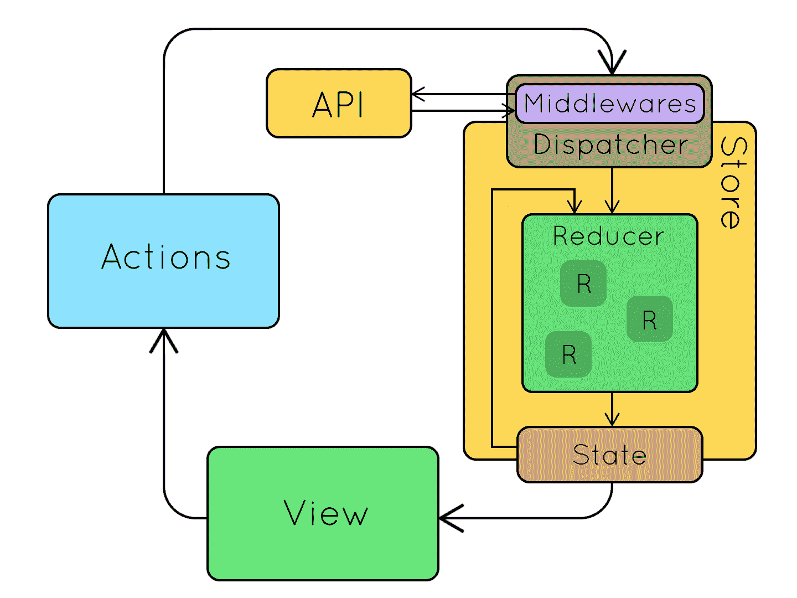
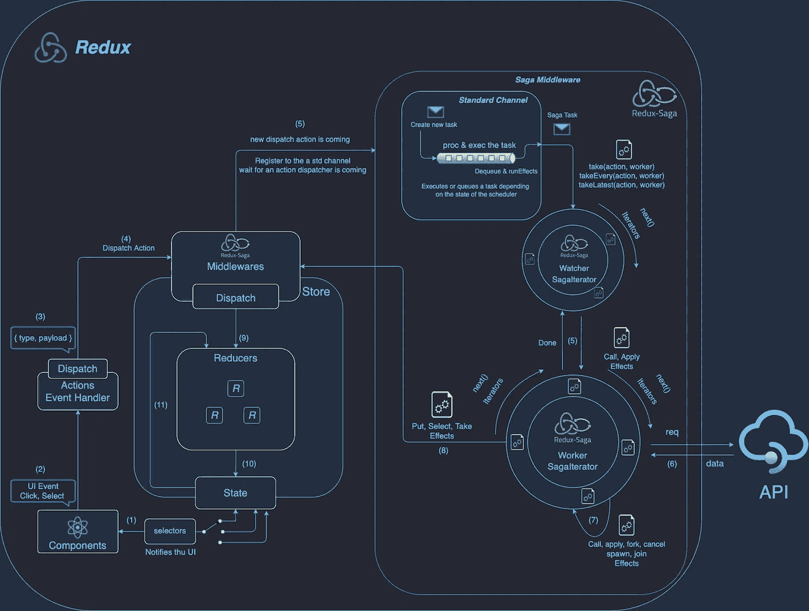

# 了解 Redux-Saga 及其工作原理

> 原文：<https://javascript.plainenglish.io/understanding-redux-saga-how-it-works-6bd566c3aa21?source=collection_archive---------7----------------------->


Photo by [Christopher Gower](https://unsplash.com/@cgower?utm_source=medium&utm_medium=referral) on [Unsplash](https://unsplash.com?utm_source=medium&utm_medium=referral)

Redux Saga 是**一个中间件库，用于从 Redux 中捕获动作，与外部的外部服务(API)异步交互，并与 Redux store** 通信。这包括向外部服务发出 HTTP 请求、访问浏览器存储和执行 I/O 操作。Redux-Saga 有助于以一种更容易管理的方式组织这些副作用。

# 什么时候该用 Redux？

**Redux 在以下情况下最有用:**:

*   您有大量的应用程序状态，应用程序中的许多地方都需要这些状态。
*   app 状态更新频繁。
*   更新状态逻辑可能很复杂。
*   该应用程序有一个中型或大型代码库，可能会有很多人在工作。
*   您需要了解该状态是如何随着时间的推移而更新的。

在本文中，我将指导您如何在项目中实现它。我们将讨论什么是 redux-saga 以及如何将其与 redux 集成？



Redux Workflow

# 向您的应用程序添加必要的包

```
npm install @reduxjs/toolkit react-redux redux-saga redux-injectors redux-logger npm install @types/react-redux --dev
```

已经包含了我们正在使用的几个包，比如 redux、reselect 和 immer，并且重新导出了这些 API。多个包中只要有一个需要设置 redux 项目。

`react-redux`:一个包，它让 React 组件通过读取状态片段和调度动作来更新存储，从而与 Redux 存储进行交互

`redux-injectors`:根据需要动态加载 redux redux reducer 和 redux-saga sagas，而不是预先全部加载。这有一些很好的好处，比如避免了必须管理一个大的全球减少者和传奇列表。它还允许更有效地使用代码分割



Redux & Redux-Saga Middleware

> Redux-Saga 是一个库，旨在使应用程序副作用(即，异步的事情，如数据获取和不纯的事情，如访问浏览器缓存)更容易管理，更有效地执行，易于测试，并更好地处理故障。
> 
> 传奇是“它们就像后台运行的守护任务，选择自己的发展逻辑”——亚辛·埃卢阿菲，redux-saga 的创造者。

请查看我的存储库，在 repo 中，我将一步一步地指导你如何创建一个传奇，并告诉你它如何操作和与 Redux 商店通信。(☞ﾟ∀ﾟ)☞更多信息参考我的 github:[https://github . com/kobee-tech-stack/react-typescript-template/tree/redux-saga](https://github.com/kobee-tech-stack/react-typescript-template/tree/redux-saga)

*更多内容请看*[***plain English . io***](http://plainenglish.io/)*。报名参加我们的* [***免费周报***](http://newsletter.plainenglish.io/) *。在我们的* [***社区***](https://discord.gg/GtDtUAvyhW) *获得独家获得写作机会和建议。*