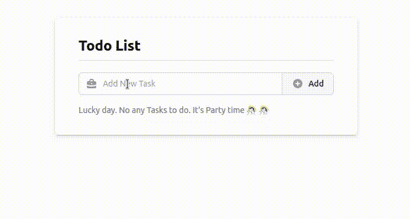
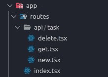

# 通过构建应用程序理解混音

> 原文：<https://javascript.plainenglish.io/understanding-remix-by-building-an-application-cf8a38c49631?source=collection_archive---------6----------------------->

## Prisma，Tailwind，多份表格，验证。


Photo by [Arnold Francisca](https://unsplash.com/@clark_fransa?utm_source=medium&utm_medium=referral) on [Unsplash](https://unsplash.com?utm_source=medium&utm_medium=referral)

你好，开发人员👋👋。我们有一个新产品 [Doneo](https://doneo.io/) 要开发，我们的团队决定使用 Remix。我开始使用 Remix 已经有一个月了。我想分享我的知识，希望它能让我更容易开始使用混音。

在本文中，我将构建一个简单的 Remix 应用程序，如下图所示。在这一篇之后会有更多的文章报道更多的其他领域。



# 我们开始吧

让我们从创建一个全新的混音应用程序开始。运行:

```
npx create-remix@latest
```

我选择 **Remix 应用服务器**作为部署目标，选择**类型脚本。**您可以根据自己的要求和喜好进行选择。

运行命令`yarn dev`启动您的服务器。

## 顺风和后 CSS 设置

顺风设置请遵照条。我在本文发表之前就已经写好了，所以一次只关注一件事是很好的。

## 核标准情报中心

我在本文中使用了 **heroicons** 图标。您可以使用您偏好的其他图标。

```
yarn add [@heroicons/react](http://twitter.com/heroicons/react)
```

## 数据库ˌ资料库

我将使用 [SQLite](https://sqlite.org/index.html) 数据库，这样每个人都可以很容易地了解。我也将使用 [Prisma](https://www.prisma.io/) ORM。

安装所需的软件包:

```
yarn add -D prisma
yarn add [@prisma/client](http://twitter.com/prisma/client)
```

我们现在可以用 SQLite 初始化 Prisma:

```
npx prisma init --datasource-provider sqlite
```

这将生成:

*   `schema.prisma`文件根目录下的`prisma`文件夹包含 SQLite 配置。
*   `.env`文件用`DATABASE_URL`指向我们的文件数据库。

## 添加模型

> 地点:prisma/schema.prisma

我们将只需要这个演示的一个模型，即任务模型。

## 准备 Prisma 客户

在这里，我们要确保我们不会在每次实时重新加载(任何代码更改)时创建到数据库的新连接，并且最终在开发环境中用完连接。所以下面的代码是为了在每次重新加载时重用相同的连接。

> 位置:app/utils/db.server.ts

## 我们演示应用程序的背景

我们的演示应用程序允许我们向任务列表中添加新任务并将其删除(或标记为完成)。

为此，我们需要:

*   一个加载器给我们任务列表( **GET** )
*   两个动作，其中一个动作用于创建新任务( **POST** )，另一个动作用于删除任务( **DELETE** )。在这里，我们可以创建一个动作，检查它是 Post 请求还是 Delete 请求，并相应地执行。但是我喜欢将不同关注点的代码分开，这使得代码易于管理。

## 文件夹结构



*   在`routes/api/task`下，我们有 3 个文件(1 个加载器和 2 个动作)
*   在`routes/index.tsx`下，我们有 1 个 UI 文件

## 装货设备

> 位置:路线/API/任务/获取

这很简单。我们从 utils 文件夹中获取之前设置的 Prisma 客户端，并使用它来获取所有可用的任务。

## 行动

> 位置:路线/API/任务/新

让我用下面几行简单解释一下:

*   [Line 4–14]:这是从该动作返回的数据的**类型**。`formError`在行动中掌握任何一般的错误。`fieldErrors`保存任何字段中的任何验证错误。`fields`保存提交的值，`ok`表示操作成功。
*   [Line 22–31]:这里我们从请求中接收数据，并将接收到的值设置为`fields`变量。
*   [第 33–39 行]:这里我们做简单的验证。
*   [Line 41–55]:这里我们将任务添加到数据库中。

> 位置:路线/API/任务/删除

这有一个类似的代码风格。这里我们从数据库中删除一个任务。另一个要知道的区别是我们在这里返回 ***重定向到首页*** 。原因是这不是我们在页面上的默认加载器。(上面创建的***add task-Loader***将是我们的默认加载器)。因此，我们需要手动重定向到此加载程序来执行删除操作，此操作应该会将我们重定向回主页(任务列表)。

## 主文件

这主要包含设计代码。我简单解释一下部分。

这里有两种形式。一个用于添加新任务，另一个用于删除任务。

*   [第 8–9 行]:这里我们定义了这个页面的默认加载器和动作。
*   [第 12 行]:我们从之前创建的加载器中获取任务列表。
*   [第 13 行]:这里，我们在提交表单以添加新任务后，从操作中获得响应。
*   [第 14–21 行]:这是一个提交后重置输入字段的逻辑。否则，如果旧的提交值保留在输入字段中，就会很烦人。
*   [Line 33]:这是我们用来添加新任务的第一个**表单****。因为我们没有提供任何 action 参数，所以它使用我们的默认加载器。**
*   **[第 75 行]:这是我们用来删除任务的第二个**表单**，这里我们提供动作参数来表示删除加载器存在的位置。**

# **结论**

**如果你在任何地方迷路了，你可以检查我的 Github 项目。**

**[](https://github.com/dipeshhkc/learning-remix-crud) [## GitHub-dipeshkc/Learning-remix-crud:通过构建 CRUD 应用程序学习 Remix

### 此时您不能执行该操作。您已使用另一个标签页或窗口登录。您已在另一个选项卡中注销，或者…

github.com](https://github.com/dipeshhkc/learning-remix-crud) 

这是我们创建一个简单的应用程序来开始使用 Remix 的短暂旅程的结束。希望这对你的项目有所帮助。我将在未来几天创造更多的混音文章。敬请关注。任何建议都是非常值得的。快乐编码☺.

*更多内容看* [***说白了。报名参加我们的***](http://plainenglish.io/) **[***免费周报***](http://newsletter.plainenglish.io/) *。在我们的* [***社区获得独家访问写作机会和建议***](https://discord.gg/GtDtUAvyhW) *。*****