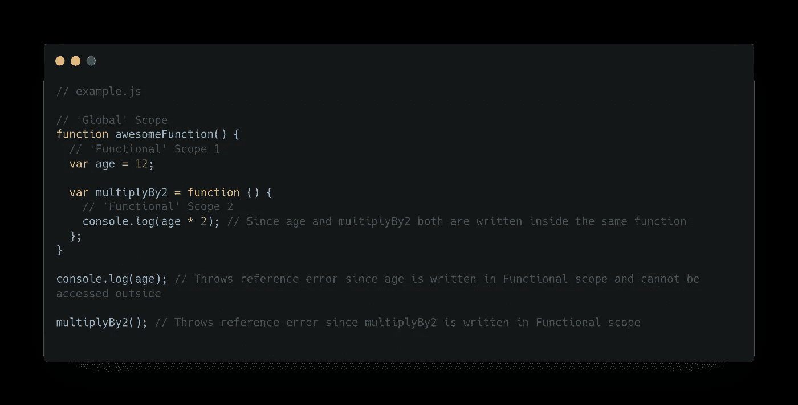
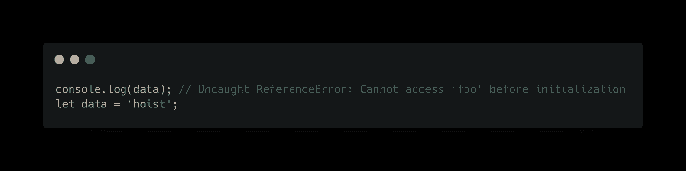

# 通过示例理解 JavaScript 中的作用域和提升

> 原文：<https://javascript.plainenglish.io/understanding-scoping-and-hoisting-in-javascript-with-examples-c51e5612d52e?source=collection_archive---------13----------------------->


Photo by [Pankaj Patel](https://unsplash.com/@pankajpatel?utm_source=medium&utm_medium=referral) on [Unsplash](https://unsplash.com?utm_source=medium&utm_medium=referral)

JavaScript 很奇怪吧？很多时候，开发人员在他们的代码中看到一个意想不到的行为，他们就想大发雷霆。在这篇文章中，我将介绍两个概念，这两个概念将帮助您理解那些奇怪的行为。

# **什么是范围？**

JavaScript 中的作用域指的是运行时变量、函数和对象的可访问性。

在 JavaScript 中，有三种类型的范围:

*   全球范围
*   功能范围
*   块范围

## **全局范围:**

全局作用域是最外层的作用域，如果变量是在块外声明的，那么它就是全局作用域。

`window`和`document`是浏览器提供的全局变量。


Variable in Global Scope

全局范围内的变量可以在任何其他范围内被访问和修改。

## **功能范围:**

在函数内部声明的任何变量或函数都有局部/函数范围，这意味着它们只能在函数内部访问，而不能在函数外部访问。



Variable/Functions in a local scope

## **封锁范围:**

块作用域告诉我们，在块 **{}** 内声明的任何变量，只能在块内访问，不能在块外访问。
块范围只与使用`let`和`const`声明的变量有关，`var`没有块范围。


Variables in Block scope

像`if`和`switch`条件或者`for`和`while`循环这样的块语句创建了一个块级作用域。

# 吊装:

当执行 JavaScript 代码时，JavaScript 引擎经历两个阶段:

*   **解析** :-如果变量是全局的，JS 引擎将所有变量声明移动到页面顶部，否则如果在函数中声明，则移动到函数顶部。
*   **执行** :- JS 引擎给变量赋值并执行。

因此，提升是一种机制，JavaScript 引擎在执行代码之前，将所有变量、函数`declaration`移动到它们作用域的顶部。它允许在声明函数和变量之前在代码中使用它们。

看看下面的代码，猜猜当我们执行他的代码时会发生什么

```
console.log(data);
var data = 'hoist';
```

来自任何编程语言的每个开发人员都会期望输出是:`ReferenceError: data is not defined,`，但实际上，它会打印出`undefined.`

为什么会发生这种情况？

再看一遍关于**提升**的定义，JavaScript 将变量声明提升到了作用域的顶部，这就是代码在解释器看来的样子。

```
var data;console.log(data); // logs undefined
data = 'hoist';
```

因为提升，我们可以在声明变量或函数之前使用它们。只要记住被提升的变量是用值`undefined`初始化的。

让我们更深入地了解一下`variable`和`functional`的吊装，以理解这是如何以及意味着什么。

# 可变提升

在 JavaScript 中，有三种不同的方法来声明变量— `var`、`let`和`const`。有两个步骤:变量**声明**和**初始化。**
JavaScript 解释器只把声明移到代码的顶端而不初始化。

变量提升根据变量的声明方式而有所不同。我们先来了解一下`var`吊装。

## V ar 吊装

当 JS 解释器提升一个用`var`声明的变量时，它将其值初始化为`undefined`。


Example from [MDN](https://developer.mozilla.org/en-US/docs/Glossary/Hoisting#var_hoisting)

如果我们忘记了声明，只初始化了值，变量就不会被提升。试图在变量被初始化和未被提升之前读取它将抛出一个`ReferenceError`异常。


Example from [MDN](https://developer.mozilla.org/en-US/docs/Glossary/Hoisting#var_hoisting)

但是，初始化也会导致声明(如果尚未声明)。下面的代码将会工作，因为即使它没有被提升，一个变量在被使用之前会被初始化和有效地声明。


现在，你们可能都在想，JavaScript 允许我们在声明变量之前访问它们，这有点奇怪。这在 JS 中是不常见的，会让我们更加困惑，导致错误。
这也是 ECMAScript 2015 中引入`let`和`const` 的原因。

## 出租和固定起重

与`var`不同，用`let`和`const`声明的变量被提升，但没有用默认值初始化。试图在声明变量之前读取它会抛出一个异常`ReferenceError`。



Same behavior for a variable declared with const

请注意，解释器仍然会提升变量' data ':错误消息表明该变量在某处被初始化。

正如我们在上面看到的，变量被提升到了它们作用域的顶部。接下来，让我们看看函数作用域的变量是如何提升的。

## 功能提升

函数提升允许我们在定义函数之前调用它。让我们举个例子，试着猜测输出


Functional hoisting

以下代码成功运行并输出:“我的猫的名字是老虎”。为什么？
因为函数声明被吊起来了。

```
Note: Only function declarations are hoisted, not function expression
```

这是有意义的，因为变量赋值没有被提升。如果我们试图调用函数表达式被赋给的变量，我们将得到一个`TypeError`或`ReferenceError`，这取决于变量的范围。


Function expressions aren’t hoisted

# 结论:

让我们总结一下这篇文章

*   let 和 const 是**块**范围，而 var 是**全局**范围
*   var、let 和 const 都被提升，但与 var 不同，其他两个没有用默认值初始化(**未定义**)。
*   函数声明被提升，但函数表达式不被提升

我们应该养成使用`let`和`const`而不是`var`的习惯，以避免不必要的错误。

> 感谢您的阅读，我希望您了解 JavaScript 中的作用域和提升。请在评论区分享你的观点，欢迎反馈。
> 查看我的其他关于 [**如何高效加载脚本的文章**](https://medium.com/@aayushtibra1997?p=f05dfe46dfc5) **。** **[**地图与 forEach**](https://medium.com/@aayushtibra1997/difference-between-map-and-foreach-bcaf8cdd5404) **的区别。****

***更多内容请看*[***plain English . io***](http://plainenglish.io/)*。报名参加我们的* [***免费每周简讯***](http://newsletter.plainenglish.io/) *。在我们的* [***社区***](https://discord.gg/GtDtUAvyhW) *获得独家获得写作机会和建议。***