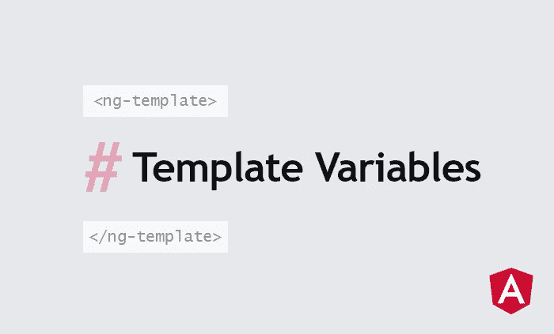

# 了解角度模板变量

> 原文：<https://javascript.plainenglish.io/understanding-template-variables-in-angular-506ae98d29?source=collection_archive---------4----------------------->



模板变量是标记组件模板各部分的一种方式，以便它可以在模板的其他部分被引用。它们的工作方式类似于 JavaScript 中变量的工作方式，只存在于它们定义的范围内，并且能够引用几种类型的模板对象。

## 定义模板变量

要定义模板变量，只需使用散列符号:

```
<input #firstName type="text" placeholder="First Name">
```

在这个例子中，我们给了元素`<input>`一个名字`firstName`,我们可以用它在模板的其他部分引用它:

```
<div>Your name is: {{firstName.value}}</div>
```

这将呈现输入元素的当前值，而不需要获取输入的值，或者将它存储在组件变量中。

然而，模板变量不仅仅可以用于 HTML 元素。如果在组件上分配了一个变量，则可以使用该变量来引用组件实例。例如，将一个模板变量赋给一个`ContactCard`组件将让我们在模板的其他部分引用它的可公开访问的属性:

```
<contact-card #myCard></contact-card>
<div>My name is: {{myCard.firstName}}</div>
```

您也可以将一个分配给一个`<ng-template>`，以便引用一个`TemplateRef`。

## 指定名称的变量

在变量的右边指定一个名字允许我们引用带有那个`exportAs`名字的指令。请考虑以下情况:

```
<form id="myForm" #contactForm="ngForm">
  ...
</form>
<div class="error-message">
  The form is {{!contactForm.form.valid ? "not" : ""}} valid
</div>
```

如果没有在模板变量中指定“ngForm”，那么`contactForm`将引用一个`HTMLElement`。但是在这个例子中，它引用导出的`ngForm`，允许我们调用`contactForm.form.valid`来检查表单是否处于有效状态。

## 模板变量范围

与 JavaScript 变量一样，模板变量也受到其定义范围的限制。范围存在于声明它们的模板中。然而，结构指令也创建了一个新的嵌套作用域。为了理解为什么，让我们看看 Angular 是如何解析指令的。考虑一个简单明了的`ngFor`:

```
<nav>
  <ul>
    <li *ngFor="let item of navItems">{{item.name}}</li>
  </ul>
</nav>
```

这实际上是`ngFor`指令的简写版本。查看长格式版本，我们可以看到这个指令是如何被分解成嵌套的`ng-template`:

```
<nav>
  <ul>
    <ng-template ngFor let-item [ngForOf]="navItems">
      <li>{{item.name}}</li>
    </ng-template>
  </ul>
</nav
```

因此，该指令中的模板变量将**而不是**在它之外是可访问的，如下例所示:

```
<input #navRef *ngIf="navItems.length > 0" type="text">
<span>{{navRef.value}}</span>
```

这个**没有**起作用，因为`navRef`是在输入上的`ngIf`创建的模板中声明的，因此在该指令之外是不可访问的。

我希望这篇文章能为您提供开始有效使用模板变量所需的内容。欲了解更多信息:

 [## 有角的

### Angular 是一个构建移动和桌面 web 应用程序的平台。加入数百万开发者的社区…

angular.io](https://angular.io/guide/template-reference-variables) 

*更多内容请看*[***plain English . io***](https://plainenglish.io/)*。报名参加我们的* [***免费周报***](http://newsletter.plainenglish.io/) *。关注我们关于*[***Twitter***](https://twitter.com/inPlainEngHQ)*和*[***LinkedIn***](https://www.linkedin.com/company/inplainenglish/)*。查看我们的* [***社区不和谐***](https://discord.gg/GtDtUAvyhW) *加入我们的* [***人才集体***](https://inplainenglish.pallet.com/talent/welcome) *。*