# JavaScript 中迭代数组的不同方式

> 原文：<https://javascript.plainenglish.io/understanding-the-different-ways-of-iterating-over-an-array-in-javascript-26851399c531?source=collection_archive---------10----------------------->

## JavaScript 中迭代数组的多种方式:for 循环、while 循环、for-of 循环、map()、forEach()、filter()和 reduce()。

在这篇文章中，我们将看到不同的方法来迭代一个数组，也将涵盖它如何不同于其他。希望你们对数组有清晰的理解。但是在进入主要部分之前，让我回忆一下数组的基础知识。

## 什么是数组？

数组是一种复杂的数据结构，用于以顺序方式存储相同数据类型的元素。数组是静态的，在代码中初始化数组时应该提到数组的大小。但是 JavaScript array 不同于传统的数组，传统数组是动态的——这意味着在初始化时不需要提及数组的大小，并且可以将任意数量的元素推入数组。JavaScript 数组可以存储任何数据类型的值——这意味着数组中的元素可以是任何大小，也就是说，没有限制元素应该是同一类型。

## 为什么我们要迭代一个数组？

由于数组以顺序的方式存储元素，我们需要遍历或迭代数组来从中找到所需的元素。通常，遍历的时间复杂度为 O(n)。我们还将遍历数组来改变数组的元素或者访问数组中的每一个元素。

## 不同的数组遍历技术

有几种技术可以遍历数组。它们是:

1.  for 循环
2.  while 循环
3.  for-of 循环
4.  地图()
5.  forEach()
6.  过滤器()
7.  减少()

## 1.for 循环

这是迭代数组的基本技术之一。通过使用数组的长度，for 循环可用于遍历数组。在 for 循环中，应该提到三个条件。

1.  起始基础条件
2.  结束条件
3.  迭代条件(通常是递增或递减)

示例:

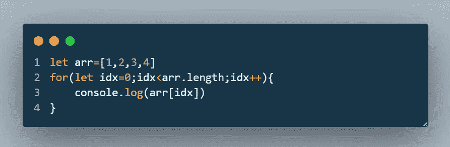

## 2.while 循环

while 循环的工作方式类似于 for 循环，但它需要一个条件，并且将一直运行到给定的条件为真。如果条件为假，则 while 循环中断，控制移至循环外的下一条语句。continue 和 break 语句可以在 while 循环中使用。

示例:

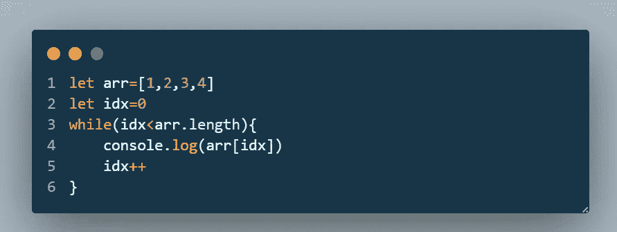

## 3.for-of 循环

for-of 循环类似于 Python 中的 for-in 循环，其中我们使用“in”作为关键字，而在 JS 中“in”已经被“of”代替。它用于迭代数组，并且可以直接访问元素而无需索引，因为它给出了元素，而不像实际的“for 循环”那样索引。

示例:

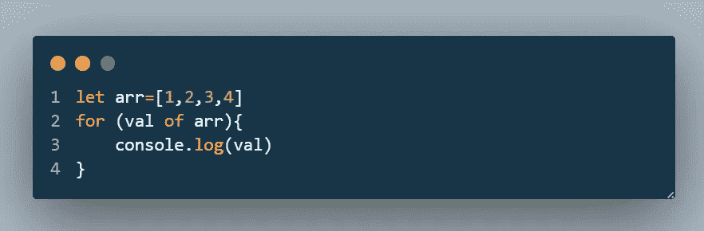

这可以在我们只需要访问元素而不需要操作它们的时候使用，因为我们不能访问元素的索引。

## 4.地图()

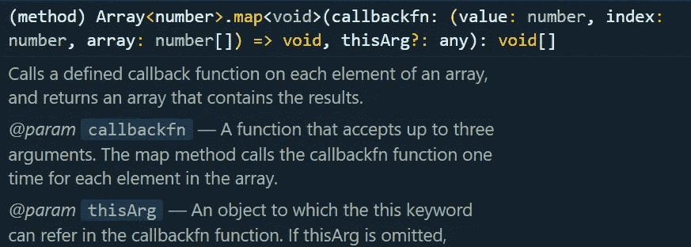

map()是一个数组方法，用于对数组中的每个元素顺序应用函数或所需的操作，结果数组将作为结果返回。它调用一个回调函数，回调函数有三个参数值、索引和数组。回调函数返回的元素将以相同的索引存储在数组中。这看起来像是从一个数组中取出元素，对它们进行操作，然后将它们存储在一个新的数组中。

示例:用于操作数组

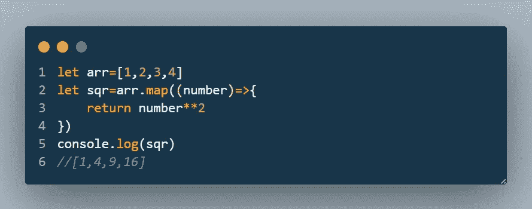

## 5.forEach()

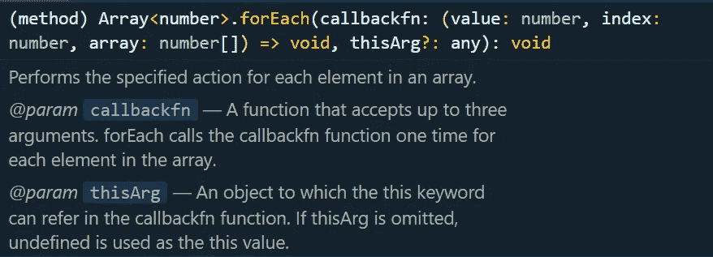

forEach()也是一个数组方法，与 map()函数非常相似，唯一的区别是 forEach()方法不返回任何内容。这将返回 undefined。使用 map()方法可以实现的功能也可以使用 forEach()来实现，但是手动更改新数组中的元素需要额外的工作。

示例:

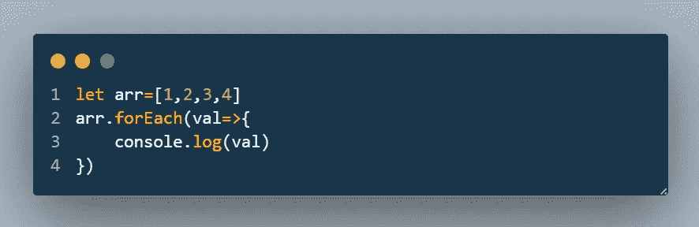

## 6.过滤器()

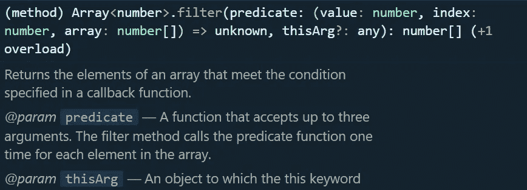

filter()方法类似于 map()方法，但是回调的返回类型是布尔值。filter()方法返回一个数组。它用于过滤数组，仅包含满足给定回调条件的元素。不满足给定条件的元素不会添加到将返回的数组中。如果没有一个元素满足回调中定义的条件，那么返回值将是一个空数组，而不是 null。

示例:过滤数组中的奇数

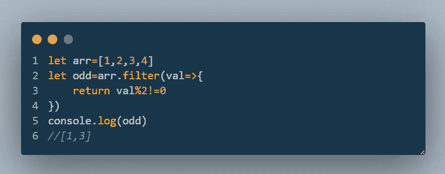

## 7.减少()

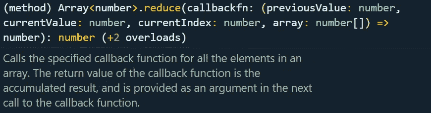

解释 reduce()函数的一个简单方法是用一个简单的例子来解释它。考虑一个向数组添加元素的算法。通常，我们将定义一个名为 sum 0 的变量，并将所有元素添加到 sum 变量中，然后返回该变量。

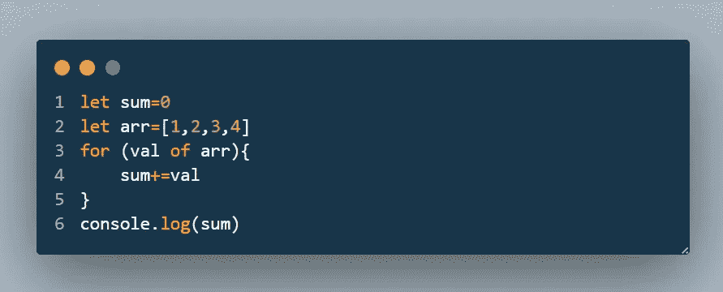

我们可以通过使用如下所示的 reduce()函数来实现上述目的:

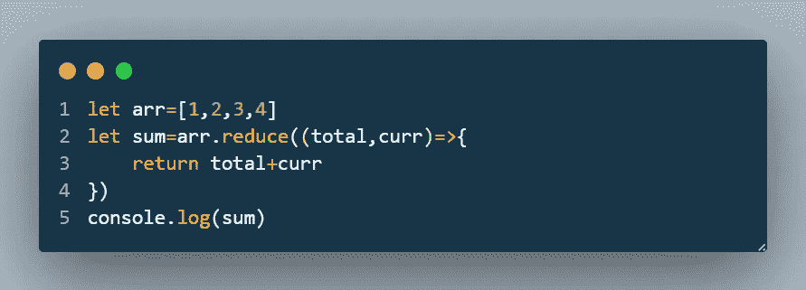

reduce()函数可以以多种方式实现不同的功能，我无法在一篇文章中解释所有的内容。

查看我的新作品集:

 [## 纳文库马尔 M

### 使用 create-react-app 创建的网站

mdnaveenkumar2002.web.app](https://mdnaveenkumar2002.web.app) 

*更多内容请看*[***plain English . io***](https://plainenglish.io/)*。报名参加我们的* [***免费周报***](http://newsletter.plainenglish.io/) *。关注我们关于*[***Twitter***](https://twitter.com/inPlainEngHQ)[***LinkedIn***](https://www.linkedin.com/company/inplainenglish/)*[***YouTube***](https://www.youtube.com/channel/UCtipWUghju290NWcn8jhyAw)*[***不和***](https://discord.gg/GtDtUAvyhW) *。***