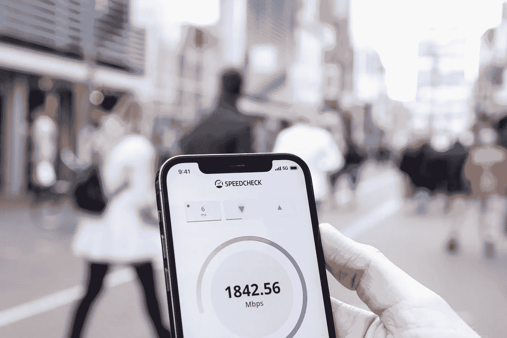

# 了解网络信息 API

> 原文：<https://javascript.plainenglish.io/understanding-the-network-information-api-c362a9feab98?source=collection_archive---------3----------------------->

## 下面是浏览器网络信息 API 的简短描述和一些例子。真正的规格可以在这里找到。

我以前写过其他浏览器 API，特别是[变异观察器 API](https://betterprogramming.pub/understanding-the-mutationobserver-api-f9ac9f93d1a2?source=your_stories_page-------------------------------------) 和[交叉观察器 API](https://betterprogramming.pub/the-intersectionobserver-b19fca5a194e?source=your_stories_page-------------------------------------) 。

并非所有的新浏览器都支持网络信息 API，但是我们仍然可以在支持它的浏览器上使用它。



Device connection speed and type

## 总之

API 为您提供了关于客户端当前连接的信息。像这样简单的调用:`navigator.connection`将为您提供如下结果:

```
{
   downlink: 10,
   effectiveType: "4g",
   onchange: null,
   rtt: 50,
   saveData: false
}
```

这个对象在上面被简化了，但是你明白了。
您将收到有关用户连接的信息。是一个非常简单的 API，只有一种方法可以使用。

您可以做的是附加一个事件侦听器，每当连接发生变化时，它就会“回叫您”。
看起来是这样的:

[](https://stackblitz.com/edit/vue-ags4fb?embed=1&file=src/components/HelloWorld.vue) [## 网络信息 Api - StackBlitz

### Vue.js 的启动项目

stackblitz.com](https://stackblitz.com/edit/vue-ags4fb?embed=1&file=src/components/HelloWorld.vue) 

# 用例

我能想到一些这个 API 有用的用例。其中之一就是我如何发现 API 的。

## 提供不同的内容

一些网站会从向连接不良的用户显示较小版本的应用程序中受益。这非常符合现代 PWA 网站的理念，你可以根据可用的速度，使用有关连接的信息做出许多不同的选择。

## 衡量绩效

最近，我不得不衡量许多网站的表现。我在代码中定义了许多测量点，并将它们报告给中央系统进行分析。有了最初的数据，我意识到，有了连接速度可以帮助我过滤掉连接不好的设备。对于调试非常有帮助，它也让我决定如何处理慢速连接的用户。

# 考虑

由于该 API 通常无法在所有浏览器上使用，因此仍应谨慎使用。然而，我确实认为在工具箱中有一个很好的小 API，用于您想要区分或使用连接信息来改变您的逻辑的情况。

*更多内容请看*[***plain English . io***](https://plainenglish.io/)*。报名参加我们的* [***免费周报***](http://newsletter.plainenglish.io/) *。关注我们关于*[***Twitter***](https://twitter.com/inPlainEngHQ)[***LinkedIn***](https://www.linkedin.com/company/inplainenglish/)*[***YouTube***](https://www.youtube.com/channel/UCtipWUghju290NWcn8jhyAw)***，以及****[***不和***](https://discord.gg/GtDtUAvyhW) *对成长黑客感兴趣？检查* [***电路***](https://circuit.ooo/) ***。*****