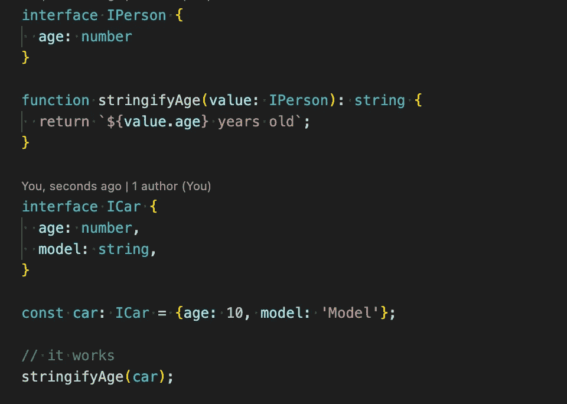
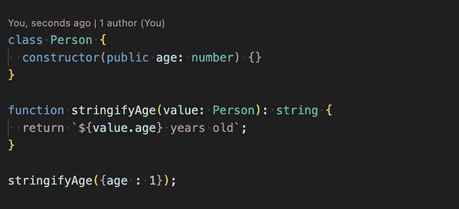
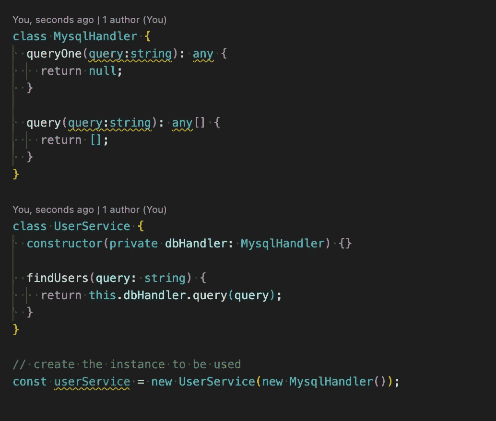
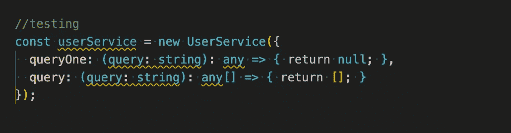
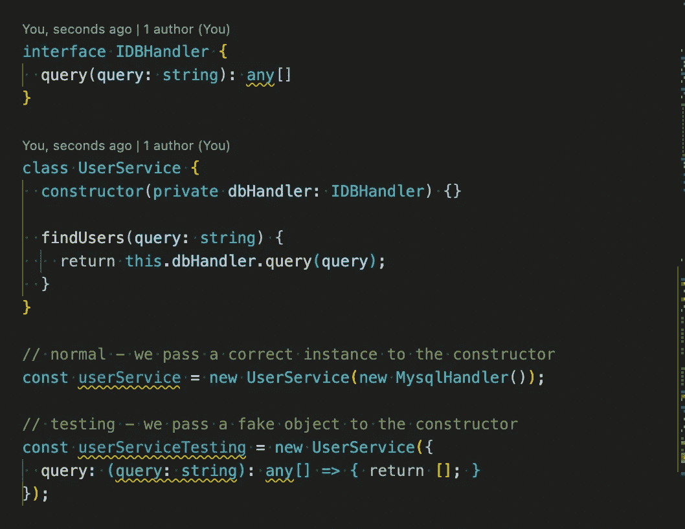

# TypeScript 结构类型深入

> 原文：<https://javascript.plainenglish.io/understanding-the-typescript-structural-typing-8fc6a001c260?source=collection_archive---------8----------------------->

## 通过示例理解 TypeScript 中的结构类型。

众所周知，JavaScript 有一个“ [duck typing](https://en.wikipedia.org/wiki/Duck_typing) ”系统，而 TypeScript 遵循了一种被称为“[结构类型](https://www.typescriptlang.org/docs/handbook/type-compatibility.html)的东西。函数所期望的任何对象都将被它所拥有的属性所接受，而不是被它的实际值所接受。让我们通过例子来理解这一点。

这个例子展示了我们如何拥有两个不同的接口，它们之间没有声明的关系，以及一个接收其中一个接口的方法。正如我们所看到的，如果我们调用方法“stringifyAge”传递一个用另一种类型声明的变量(在本例中是“ICar”接口)，就没有问题。

唯一重要的是接收到的参数具有所需的属性(“age:number”)。在我们的例子中，它可能会导致我们失败，也许一个模型的“年龄”是以年为单位，而另一个是以月或模型的年龄为单位。

好的，但是，这是一个接口，对于一个类也是一样的吗？让我们看看。

同样，它工作得很好，我们不需要创建 Person 的实例。传递一个属性相同的对象就够了。不需要传递规则“value instanceof Person”。

现在让我们来看看当我们在发展的时候它是如何对我们有益的。结构类型将帮助我们在测试代码中模拟依赖关系。让我们看一个例子。

有类似于:

我们可以创建一个使用“模拟”实例的测试(对于更专业的模拟，我们应该选择 [Jest](https://jestjs.io/es-ES/docs/mock-functions) ， [Sinon](https://sinonjs.org/releases/latest/mocks/) 等)。).

更好的选择是使用一些可靠的原则( [Liskov 替换](https://en.wikipedia.org/wiki/Liskov_substitution_principle)或[依赖注入](https://en.wikipedia.org/wiki/Dependency_injection))。

我们看到由于结构类型化，在 Typescript 中模仿对象是多么容易。

从这里我们可以得出三个主要观点:

*   可赋给接口的值可能具有类型声明中明确列出的属性之外的属性。类型不是“密封的”请注意，类也遵循结构化类型规则。
*   运行时，您拥有的实例可能不是您期望的类。
*   便于单元测试的结构类型。

我希望这有助于更好地理解 JavaScript 和 TypeScript 中的打字工作方式。

*更多内容请看*[***plain English . io***](https://plainenglish.io/)*。报名参加我们的* [***免费周报***](http://newsletter.plainenglish.io/) *。关注我们关于*[***Twitter***](https://twitter.com/inPlainEngHQ)*和*[***LinkedIn***](https://www.linkedin.com/company/inplainenglish/)*。加入我们的* [***社区不和谐***](https://discord.gg/GtDtUAvyhW) *。*