# 理解 TypeScript 中的类型声明和类型断言

> 原文：<https://javascript.plainenglish.io/understanding-type-declarations-and-type-assertions-in-typescript-39bee93c889c?source=collection_archive---------4----------------------->

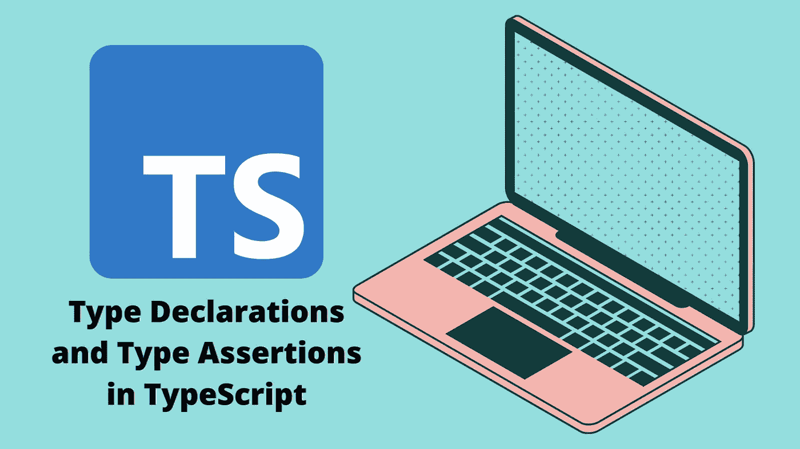

首先，让我们定义类型声明和类型断言。

**类型声明**:类型声明验证(并确保)值符合所选接口/类型。

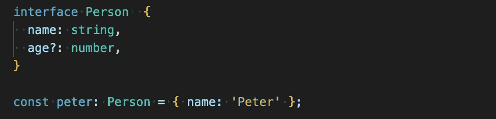

**Type Assertion** :告诉 TypeScript，不管它推断的是什么类型，您都更了解，并且希望该类型是所选的接口/类型。

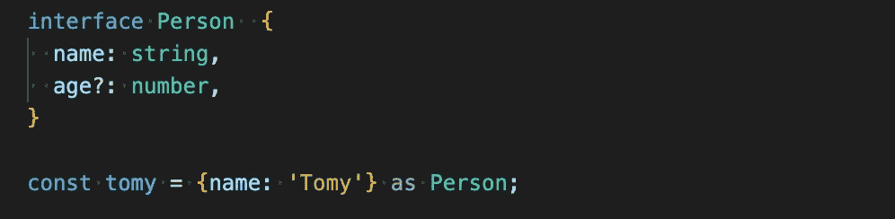

默认情况下，我们可以用两种方式键入变量

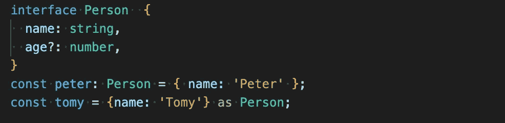

在最后一个示例中，我们正在创建一个满足接口的对象。在中，我们尝试创建另一个，但缺少必需的属性，对于类型声明，我们将看到一个众所周知的错误

*“Property”name 在类型“{ 0 }”中缺失，但在类型“Person”中是必需的。ts”*

但有了类型断言，就没有问题了。

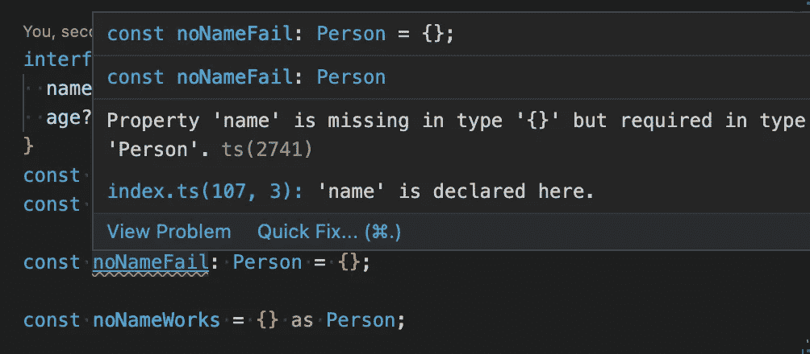

如果我们试图定义一个具有比已定义更多属性的变量，也会发生同样的情况。通过类型声明，我们将得到:

”*类型“{名称:字符串；年龄:数字；其他:字符串；“}”不能分配给类型“Person”。对象文字只能指定已知属性，而“Person”类型中不存在“other”。ts*

但对于类型断言，没有错误。

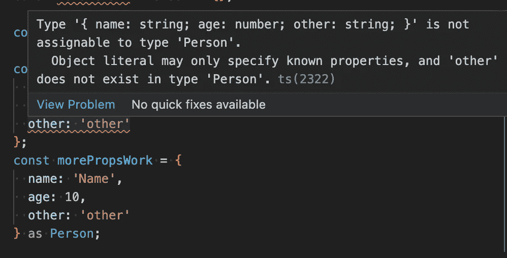

现在，让我们看看从字符串(名称)数组创建 Person 列表的不同方法。

我们可能认为这种做法会奏效

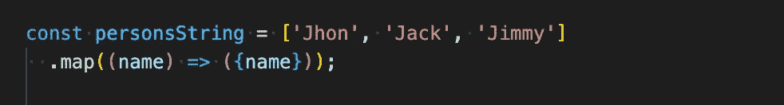

但相反，我们将得到一种类型的“*string[*”。

我们可以使用类型断言来“强制”类型化(不管它是否满足)

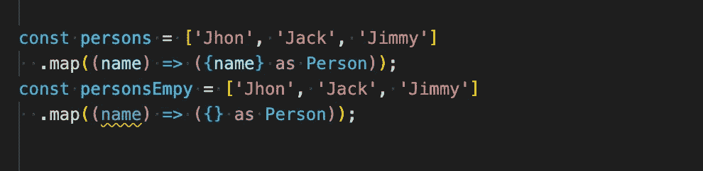

两者都生成类型“ *Person[]* ”。

要生成正确的人员列表，更好的选择是。

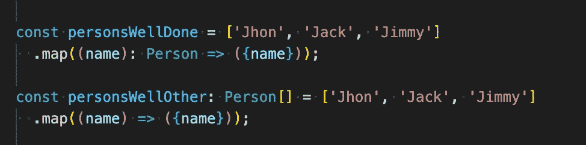

通过查看前面的这些示例，我们可以一致认为，在大多数情况下最好使用类型声明，并让 Typescript 在它比我们更了解时帮助我们。

现在让我们看看什么时候使用类型断言可能是更好的选择。选择类型断言的一个很好的例子可能是来自 API 的响应，其中 Typescript 不知道响应类型

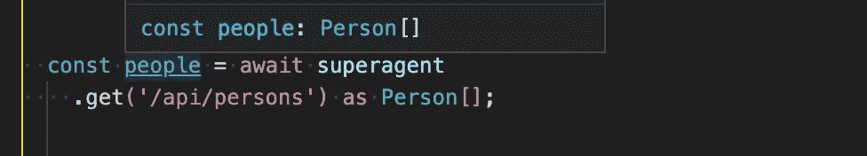

而且，什么时候类型断言不起作用呢？当我们试图分配一个类型的变量并试图断言另一个类型时，我们将得到错误

”*转换类型“{大小:数字；地址:字符串；“}”来键入“Person”可能是个错误，因为两个类型都没有与另一个类型充分重叠。如果这是有意的，请先将表达式转换为“unknown”。类型“{ size:number }”中缺少属性“name”；地址:字符串；“}”但在“Person”类型中是必需的。*”

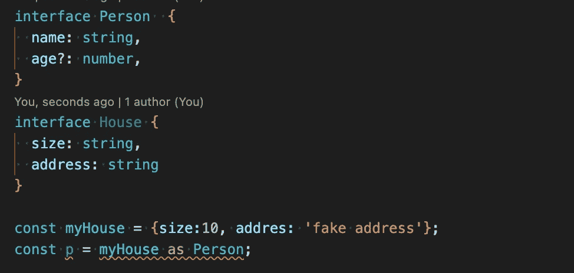

我希望这些示例能帮助您理解类型声明和类型断言之间的区别，以及何时使用它们。

感谢阅读。

*更多内容请看*[***plain English . io***](https://plainenglish.io/)*。报名参加我们的* [***免费周报***](http://newsletter.plainenglish.io/) *。关注我们关于*[***Twitter***](https://twitter.com/inPlainEngHQ)*和*[***LinkedIn***](https://www.linkedin.com/company/inplainenglish/)*。加入我们的* [***社区不和谐***](https://discord.gg/GtDtUAvyhW) *。*