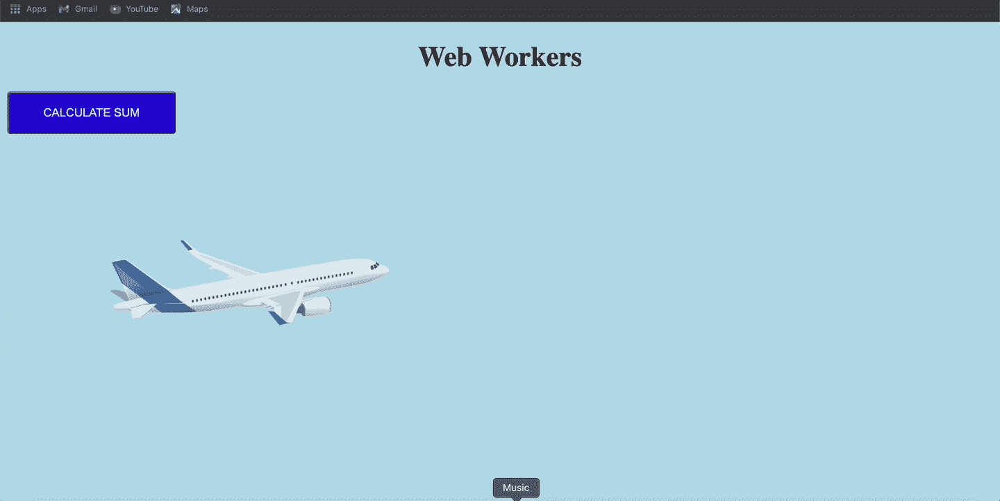
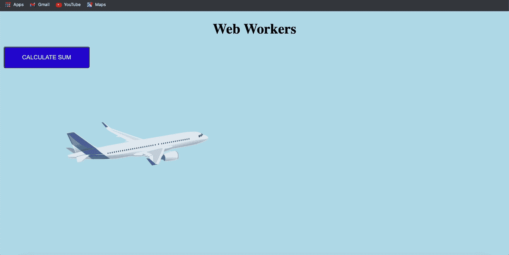

# 通过真实的例子理解 JavaScript 中的 Web Workers

> 原文：<https://javascript.plainenglish.io/understanding-web-workers-in-js-with-real-world-example-1629a283aeec?source=collection_archive---------0----------------------->

## JavaScript 中的 web workers 是什么？用一个真实的例子来解释。


Photo by [Christopher Gower](https://unsplash.com/@cgower?utm_source=medium&utm_medium=referral) on [Unsplash](https://unsplash.com?utm_source=medium&utm_medium=referral)

JavaScript 是一种单线程编程语言。这意味着所有事情都发生在那个主线程上。它不能同时做多件事。Web workers 被引入来解决这个问题。Web 工作者给了我们编写多线程 JavaScript 的可能性，它不会阻塞 DOM。即使是异步操作也会在某种程度上阻塞 DOM。

[Web workers](https://developer.mozilla.org/en-US/docs/Web/API/Web_Workers_API/Using_web_workers) 不能执行任何类型的 DOM 操作，因为它不能访问窗口对象、文档对象或 DOM。但是，它可以访问 location 对象、navigator 对象、fetch、应用程序缓存以及使用 importScripts()导入外部脚本。

## 语法:

下面是创建新的 worker 实例的语法。worker 构造函数获取一个 worker 脚本的路径(即 worker.js)。

```
var myWorker = new Worker('worker.js');
```

## 向网络工作者发送消息

我们可以使用 [postMessage()](https://developer.mozilla.org/en-US/docs/Web/API/Worker/postMessage) 方法和 [onmessage](https://developer.mozilla.org/en-US/docs/Web/API/Worker/message_event) 事件处理程序将数据从主线程发送到工作文件，反之亦然。数据是复制的而不是共享的，也就是说，你可以传递对象，这些对象会被复制。

**从主线程向工作线程发送数据:**

```
worker.postMessage('Hello');
```

正在为我们的工作线程添加 onmessage 事件侦听器。

```
worker.onmessage = function(e) {
   let data = ev.data;
   console.log(data);
}
```

**从网络工作者发送数据:**

在我们的 worker.js 文件中，我们可以使用 **self.onmessage** 和 **self.postMessage** 来接收和发送数据到父线程。

```
self.onmessage = (e) => {
 if(e.data !== undefined) {
        var msg = e.data + ' World';
        // Posting back to the page
        self.postMessage(msg)
    }
});
```

## 现实世界的例子:



这里我们有一个简单的 HTML 页面，上面有一些动画和一个按钮(计算总和)来执行繁重的操作。单击此按钮，我们将执行从 0 到 1000000000 的求和计算。

```
let sum = 0;
for (let i = 0; i < 1000000000; i++) {
    sum += i;
}
alert(sum);
```

当我们点击这个按钮时，动画将会冻结，因为我们的主线程正忙于执行那个复杂的计算。并且只有当计算完成时，动画才会继续。所以网络工作者来拯救我们了。我们可以将这个复杂的计算任务提供给网络工作者，如下所示:

**在 app.js 中**

```
document.getElementById('sumBtn').addEventListener('click', ()=> {
      worker.postMessage({'do':'Sum'})
});
```

**在 worker.js 中**

结果显示在下面的 gif 中。现在，动画不会因为单击按钮而停止，因为复杂的计算任务现在由 web worker 在后台处理。



# 共享员工:

专用工作器只能访问并连接到一个脚本，不能向其他脚本或工作器发送消息。另一方面，一个[共享工作器](https://developer.mozilla.org/en-US/docs/Web/API/Web_Workers_API/Using_web_workers#shared_workers)可以被多个脚本访问——即使它们被不同的窗口、iframes 甚至工作器访问。

## 语法:

```
var myWorker = new SharedWorker('worker.js');
```

## 向共享工作人员发送数据

对于一个共享的工作者，我们必须通过一个端口对象进行通信——一个显式的端口被打开，脚本可以使用它与工作者进行通信。这个端口连接将通过使用 **onmessage** 事件处理程序隐式启动。
因此，我们必须使用**my worker . port . postmessage()**，而不是使用 **myWorker.postMessage()** 。

```
document.getElementById('sumBtn').addEventListener('click', ()=> {
      myWorker.port.postMessage({'do':'Sum'})
});
```

**注意:**如果对 onmessage 事件使用 addEventListener()方法，需要使用 start()方法。

## 从共享工作者发送数据

与网络工作者相比，这里的方法有点不同。首先，我们使用一个 **onconnect** 处理程序在连接到端口时触发代码(例如，当父线程中的 **onmessage** 事件处理程序被设置时，或者当父线程中的 start()方法被显式调用时)。接下来，我们在端口上添加一个 onmessage 处理程序来进行计算，并将结果返回给主线程。

**注意:**如果可以从几个浏览上下文访问 SharedWorker，那么所有这些浏览上下文必须共享完全相同的源(相同的协议、主机和端口)。

## 完整源代码:

**Web Workers 示例:** [Github 回购链接](https://github.com/ankitsaxena21/Web-Workers-Demo) **共享 Workers 示例:** [Github 回购链接](https://github.com/ankitsaxena21/Shared-Worker)

## 视频解释:

*更多内容请看*[***plain English . io***](https://plainenglish.io/)*。报名参加我们的* [***免费周报***](http://newsletter.plainenglish.io/) *。关注我们关于*[***Twitter***](https://twitter.com/inPlainEngHQ)*和*[***LinkedIn***](https://www.linkedin.com/company/inplainenglish/)*。查看我们的* [***社区不和谐***](https://discord.gg/GtDtUAvyhW) *加入我们的* [***人才集体***](https://inplainenglish.pallet.com/talent/welcome) *。*