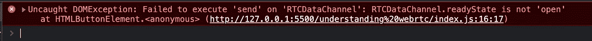

# 了解 WebRTC —第 1 部分

> 原文：<https://javascript.plainenglish.io/understanding-webrtc-api-46948337dc7?source=collection_archive---------11----------------------->

## 燃烧网络的尖端技术之一

在过去的十年中，WebRTC 在 web 开发社区中获得了很大的人气。感谢疫情(虽然是积极的方式),因为许多公司开始采用在家永久工作👨‍💻，像 Atlassian，Shopify，Spotify，Twitter……(OMG 名单还在继续)。这种远程工作的采用导致大多数公司购买实时通信工具，如 MS Teams 和 Gmeet，它们将 WebRTC 作为主要组件。

根据 PayScale 的数据，2022 年美国 WebRTC 开发人员的平均工资约为 74136 美元/年。相当不错的报酬，好吧，让我们直接进入主题。


Photo by [Brian_Cragun](https://pixabay.com/users/brian_cragun-19680916/) on [Pixabay](https://pixabay.com/)

# 什么是 WebRTC？

> WebRTC 是一个开源框架，允许使用可靠的协议和加密技术进行实时数据传输。

这些实时数据可以是音频、视频，或者可能是一个简单的字符串消息，只需几行代码就可以以一种非常快速、更加安全的方式进行交换！💆

# 如何开始🤔

作为开发人员，当我们遇到一项新技术时，我们经常会陷入如何开始的困境。最好的方法是直接进入实用的方法。

让我们从跟随亲吻写一个简单的要点开始😘原则。打开代码编辑器，复制粘贴下面的代码。

普通的 javascript 很无聊，让我们给它添加一些 html 和 css 的点缀吧，🥳

厉害！🤩我们做到了！😎我们已经创建了一个 WebRTC 支持的聊天应用程序，现在让我们更好地理解代码。

HTML 和 CSS 部分是不言自明的，所以我们可以只关注 javascript。在这个例子中，我们创建了一个简单的聊天应用程序，它使用 WebRTC 的集成 [dataChannelAPI](https://developer.mozilla.org/en-US/docs/Web/API/WebRTC_API/Using_data_channels) 来发送和接收聊天消息。

# 那么什么是数据通道呢？

> WebRTC 数据通道是一种媒介，通过它，对等方可以通过对等连接发送和接收消息。

所以数据通道就像一座桥🌉用于发送和接收消息。

# 那么什么是对等连接呢？

> WebRTC 对等连接连接不同会话中的对等方，以便它们可以使用对等协议进行通信。

简单地说，对等连接处理一组协议，通过这些协议，不同计算机之间可以进行数据传输。它处理诸如将消息发送到哪里以及哪条消息应该发送到哪台计算机之类的细节。一旦我们完成了对等连接，我们需要理解对等连接的主要组件。

*   RTCIceCandidate
*   会话描述协议(sdp)

## 冰什么？

> 交互式连接建立(ICE)是一个框架，充当对等体使用 RTCPeerConnection 进行通信的协议和路由机制。

使用 ICE 协议，将生成候选人。iceCandidate 是包含网络路由信息的字符串，数据包使用该信息在对等连接中流动。

## 好吧，那 SDP 呢？

> SDP 是另一种保存特定于会话的信息的协议，例如支持的音频或视频编解码器、加密算法以及其他与设备相关的详细信息。

SDP 是 WebRTC 的主要组件之一。此外，在两个对等体之间创建 WebRTC 连接的第一步是创建和交换 sdp(提供和应答)。

为了创建一个 WebRTC 连接，我们要经过一个**信令阶段**🚥。让我们通过听一个💞故事。

# 一个罗密欧🤵—朱丽叶👩‍💼故事


Photo by [Oscar Mucyo](https://unsplash.com/@oscarmucyo?utm_source=unsplash&utm_medium=referral&utm_content=creditCopyText) on [Unsplash](https://unsplash.com/s/photos/mobile-chat?utm_source=unsplash&utm_medium=referral&utm_content=creditCopyText)

罗密欧想要给朱丽叶发送一个消息，所以他决定使用 WebRTC。Romeo 从他的本地 RTCPeerConnection 创建一个 offer sdp，并将其设置为本地描述。现在罗密欧向朱丽叶发出了邀请💌通过某种通信协议(可能是套接字连接)。

```
localConnection = new RTCPeerConnection();
localConnection.createOffer().then((offer) => {
    localConnection.setLocalDescription(offer);
    // send offer to Juliet👩‍💼
}
```

Juliet 收到该提议，将其设置为远程描述，并创建一个应答 sdp 来本地设置它，将其发送回 Romeo💌。

```
remoteConnection = new RTCPeerConnection();
remoteConnection.setRemoteDescription(offer).then(() => {
    remoteConnection.createAnswer().then((answer) => {
        remoteConnection.setLocalDescription(answer)
        // send answer to Romeo🤵
    })
})
```

收到答案-sdp 罗密欧很高兴，并将其设置为他的远程描述。结果，ice 候选者开始在两端生成，然后交换💌实时地。

```
localConnection.setRemoteDescription(answer)localConnection.onicecandidate = (event) => {
    remoteConnection.addIceCandidate(event.candidate);
    // send candidate to Juliet👩‍💼
}remoteConnection.onicecandidate = (event) => {
    localConnection.addIceCandidate(event.candidate);
    // send candidate to Romeo🤵
}
```

现在连接已经准备好发送和接收数据，但是 Romeo 需要一个秘密的数据通道来发送和接收消息，所以他创建了一个通道并发送了他的第一条消息。

```
sendChannel = localConnection.createDataChannel("romeo-juliet");
sendChannel.send("Hey my love ❤️");
```

另一方面，Juliet 正在侦听新创建的数据通道并接收消息。

```
receiveChannel.onmessage = (event) => {
    message = event.data; //Hey my love ❤️
}
```

这样一个幸福的结局不是吗😊，这怎么可能？

嘣！！！无法发送消息。



Unable to send message 🙁

这个错误的原因可能是什么？罗密欧应该如何解决这个问题？在评论区等你的回答。

# 结论

我知道这将是势不可挡的，因为我们已经在这个快速博客中讨论了许多概念。学习新技术的最好方法是培养好奇心，尝试新事物。最重要的是，一个专业的建议是阅读 [**文档**](https://developer.mozilla.org/en-US/docs/Web/API/RTCPeerConnection/connectionState#failed) **。是的，阅读文档是更好地理解事物的最好方法之一。你可能也会找到上述问题的答案💡😉一定要去看看。**

*更多内容请看*[***plain English . io***](https://plainenglish.io/)*。报名参加我们的* [***免费周报***](http://newsletter.plainenglish.io/) *。关注我们上*[***Twitter***](https://twitter.com/inPlainEngHQ)[***LinkedIn***](https://www.linkedin.com/company/inplainenglish/)*[***YouTube***](https://www.youtube.com/channel/UCtipWUghju290NWcn8jhyAw)**和* [***不和***](https://discord.gg/GtDtUAvyhW) *对成长黑客感兴趣？检查* [***电路***](https://circuit.ooo/) ***。*****