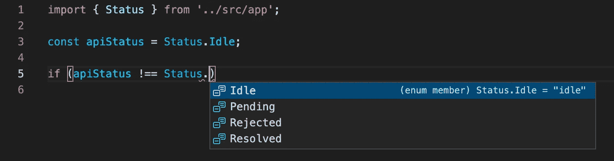
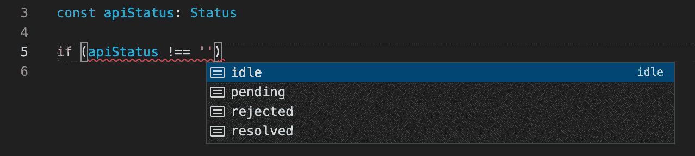
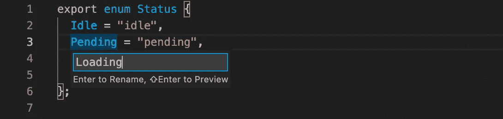

# TypeScript 中的联合类型与枚举

> 原文：<https://javascript.plainenglish.io/union-types-vs-enums-in-typescript-a43c2c01c5fa?source=collection_archive---------4----------------------->

## 哪个更好？


Photo by [Headway](https://unsplash.com/@headwayio?utm_source=unsplash&utm_medium=referral&utm_content=creditCopyText) on [Unsplash](https://unsplash.com/s/photos/discussion?utm_source=unsplash&utm_medium=referral&utm_content=creditCopyText)

当我在处理一个 TypeScript 项目时，我需要定义一个请求的状态。所以我可以通过`enums`或`union types`来实现它。但是它们之间有什么区别呢？哪个更好？

如果你很困惑或者不确定区别在哪里，那就一起来深入探讨一下吧。

# 申报

首先，让我们比较枚举和联合类型声明。下面是枚举的典型用法:

```
enum Status {
  Idle = "idle",
  Pending = "pending",
  Resolved = "resolved",
  Rejected = "rejected"
};
```

如果我们使用联合类型，它将看起来像这样:

```
type Status = "idle" | "pending" | "resolved" | "rejected";
```

酷！简单很多！

# 使用

如果您想使用枚举，您需要导入它:



Using Enum

然而，对于联合类型，这不是必需的，因为 ide 足够强大，可以在使用字符串联合时建议值。



Using Union Types

# 重新命名

在某些时候，我们可能会改变主意，或者我们可能不喜欢这个名字或价值，我们可能会说你希望你的`Pending`身份被称为`Loading`。

如果我们使用一个枚举，我们可以只**右键单击- >重命名**或者只改变值。到处都会变。是的，很简单。



Renaming Enum Field

如果我们使用联合类型，这需要几个步骤。因为我们需要找到项目中的所有实例并替换它们。这对工会类型来说是一个很大的不利因素。

# 循环

枚举是一个对象，所以我们可以使用`Object`方法或者使用`in`操作符和 for 循环来迭代它:

```
enum Status {
  Idle = "idle",
  Pending = "pending",
  Resolved = "resolved",
  Rejected = "rejected"
};
for (const status in Status) {
  console.log(status);
}
// console - Idle
// console - Pending
// console - Resolved
// console - Rejected
```

不幸的是，您不能迭代联合类型。如果尝试迭代联合类型，将会引发错误:

```
type Status = "idle" | "pending" | "resolved" | "rejected";// Error - ‘Status’ only refers to a type, but is being used as a value here
for (const status in Status) { 
  console.log(status);
}
```

# 延伸

在 typescript 中，联合类型不仅允许我们使用字符串，还允许我们联合其他类型的值:

```
type Status = "idle" | "pending" | "resolved" | "rejected";
type UserStatus = Status | "existed";
```

然而，这给了你太多额外的灵活性:

```
type Status = "idle" | "pending" | "resolved" | "rejected";
type UserStatus = Status | "existed" | null | [];
```

但是您可能会感到困惑，这会导致代码中出现问题。

至于枚举，扩展是不可能的。

# 类型安全

从概念上讲，枚举可以是具有数值或字符串值的联合类型的子集。数字枚举不太安全。如果你调用`updateStatus(20)`它工作得很好。

```
enum Status {
  Idle = 0,
  Pending = 1,
  Resolved = 2,
  Rejected = 3
};const updateStatus = (newStatus: Status) => {
  console.log(newStatus); // console -> 20
};updateStatus(20); // it works
```

但是字符串枚举总是安全的。让我们更新前面的例子:

```
enum Status {
  Idle = "idle",
  Pending = "pending",
  Resolved = "resolved",
  Rejected = "rejected"
};const updateStatus = (newStatus: Status) => {
  console.log(newStatus);
};updateStatus("idle"); // Error - Argument of type '"idle"' is not assignable to parameter of type 'Status'.
```

使用联合类型通常是一种安全、简单且有效的方式。

```
type Status = "idle" | "pending" | "resolved" | "rejected";const updateStatus = (newStatus: Status) => { 
  console.log(newStatus);
};updateStatus("idle"); // it is ok and safe
```

# 代码大小

如果使用联合类型，这不会改变代码的大小。

很棒很简单！

但是如果用枚举替换联合类型，并再次将代码编译成 JavaScript，就会增加代码的大小。让我们编译前面例子中的代码:

```
enum Status {
  Idle = "idle",
  Pending = "pending",
  Resolved = "resolved",
  Rejected = "rejected"
};
```

我们编译的代码将如下所示:

```
var Status;
(function (Status) {
    Status["Idle"] = "idle";
    Status["Pending"] = "pending";
    Status["Resolved"] = "resolved";
    Status["Rejected"] = "rejected";
})(Status || (Status = {}));
```

# 结论

在本文中，我们讨论了联合类型和枚举之间的主要区别。如果我在很多地方使用枚举，我更喜欢使用枚举。在一个简单的例子中，我将使用联合类型。

感谢阅读，希望这篇文章对你有用。编码快乐！

# 资源

[](https://stackoverflow.com/questions/40275832/typescript-has-unions-so-are-enums-redundant) [## Typescript 有联合，那么枚举是多余的吗？

### 使用最新版本的 TypeScript，可以很容易地声明可迭代的联合类型。

stackoverflow.com](https://stackoverflow.com/questions/40275832/typescript-has-unions-so-are-enums-redundant) [](https://www.becomebetterprogrammer.com/typescript-union-types-vs-enums/) [## TypeScript |联合类型与枚举

### 当我开始我的编程之旅时，我使用 C#，这是实现枚举的常用方法。因此，当我开始使用…

www.becomebetterprogrammer.com](https://www.becomebetterprogrammer.com/typescript-union-types-vs-enums/)  [## 在 Typescript 中应该使用枚举类型还是联合类型？

### 在使用 TypeScript 时，我们需要经常做一些事情:将变量的类型定义为…

博客. bam.tech](https://blog.bam.tech/developer-news/should-you-use-enums-or-union-types-in-typescript) 

*更多内容请看*[***plain English . io***](https://plainenglish.io/)*。报名参加我们的* [***免费周报***](http://newsletter.plainenglish.io/) *。关注我们关于*[***Twitter***](https://twitter.com/inPlainEngHQ)*和*[***LinkedIn***](https://www.linkedin.com/company/inplainenglish/)*。加入我们的* [***社区不和谐***](https://discord.gg/GtDtUAvyhW) *。*