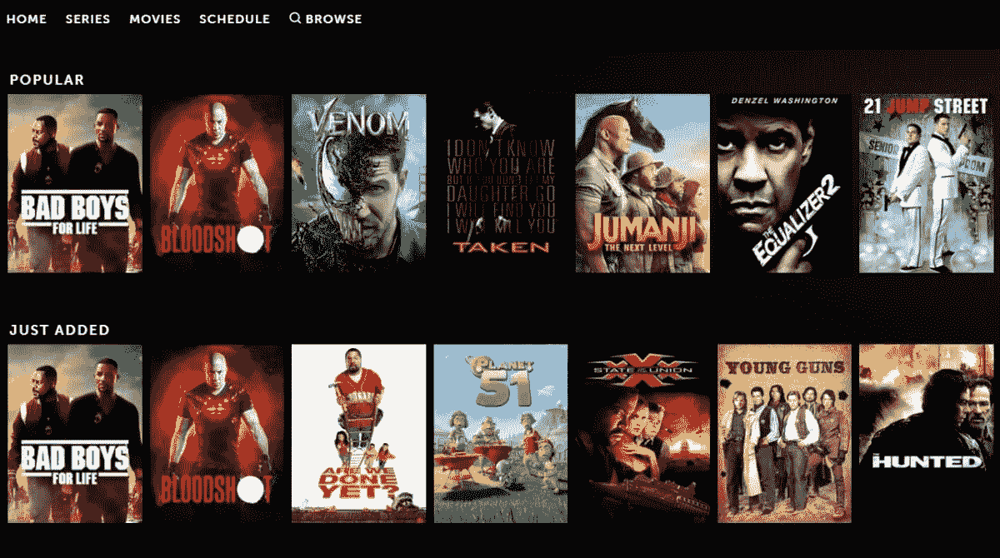
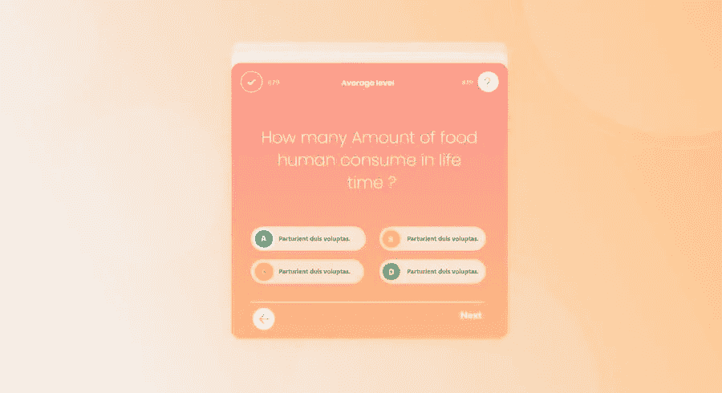
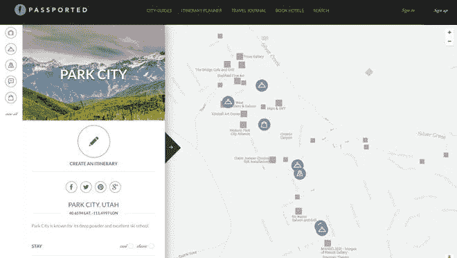
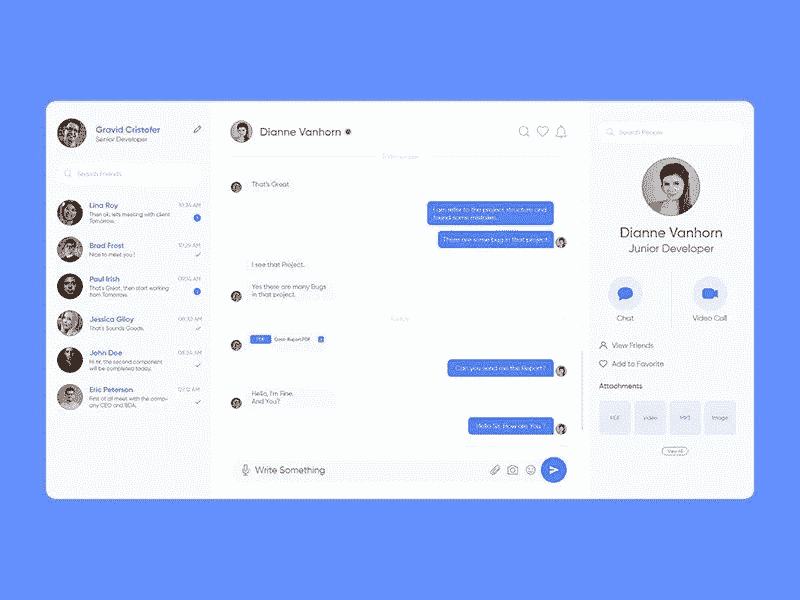

# 提高反应技能的独特项目创意

> 原文：<https://javascript.plainenglish.io/unique-project-ideas-to-practice-react-86a76645a389?source=collection_archive---------5----------------------->

一个程序员在学习了一门新的语言/框架之后想要什么？实践和项目，对吗？所以，我要告诉你一些独特的项目，你可以做来练习和提高你的反应技能。

在每个项目的结尾，我都增加了一个部分，告诉你如何在那个项目中挑战自己，如何改进那个项目，等等。我向你保证，在每个项目完成后，你会学到新的东西，变得更好。我会尽最大努力在这个列表中只保留最好的和独特的项目想法。现在，让我们开始吧！

# 1.电影推荐 App

Inspiration of the Quiz App

你可能也会面临这个问题:接下来我该看什么？如果是的，你并不孤单，许多人想知道接下来该看什么。这个项目可以帮助他们，也可以帮助你，提高你的技能。现在，出现在你面前的第一个问题是用什么来制作这个项目。答案很简单！如果你是中级，就用机器学习。对于初学者来说，API 可以完成这项工作。这个项目中有几个 API 可以使用，包括最著名的电影数据库 API， [IMDb](https://developer.imdb.com/) 。但是如果你问我，我会建议 [TMDb](https://developers.themoviedb.org/3) 。这是一种选择，事实上，是 IMDb 的合适选择。最棒的是，它是免费的！

## 似乎很容易？

*   尝试添加登录和注册功能。
*   询问用户他/她喜欢的流派，并尝试根据它来显示推荐。
*   添加“搜索电影”选项。
*   添加“给出评级”选项。

# 2.测验应用程序

Inspiration of the quiz app

你可能不会称之为一个独特的项目，但它*是*！如果你是初学者，我会建议你只做一个基本的测验应用程序，但对于中级开发人员，我会建议将这个测验应用程序扩展到更大的规模。现在，让我解释一下我所说的“更大规模”是什么意思。您可以添加令人惊叹的功能，如分类测验、积分系统、注册和登录、在线排行榜等。对于添加问题，您有两种方法:第一种是制作自己的问题 API(如果您熟悉后端开发)，第二种也是最受欢迎的方法是使用 API。我不认为我需要列出 API。你可以很容易地在网上找到一些。如果你仍然觉得这个想法很无聊，还有一个想法你可以试试。创建一个平台，人们可以创建和参加在线调查。创建者也应该能够看到与他们的调查相关的统计数据，如有多少人参加了调查，其中有多少是男性，有多少是青少年等。

## 似乎很容易？

*   添加购买提示选项。
*   在测验应用程序中，添加一个选项，人们也可以创建和共享他们的项目。
*   也关注 UI，而不仅仅是逻辑。

# 3.旅游顾问

Travel Guide Inspiration

你喜欢旅行吗？嗯，我们很多人都这样。这就是这个项目对你和这个应用程序的访问者都有帮助的原因。在最开始的水平，你可以做一个基本的地图，当用户点击一个位置时，它以卡片的形式显示信息。因为。对于中间用户，我会推荐一个大规模的应用程序，有很好的用户界面和 UX，当然，你可以从大牌那里获得灵感。你可以为全世界或你自己的国家制作这个应用程序。美食指南，酒店指南，餐厅指南是你可以添加的一些功能。你可以使用[谷歌地图](https://console.cloud.google.com/google/maps-apis/overview)，当然，你可以根据你要在应用中使用的特性来发现 API。现在，我再次建议你，只是因为你做这个项目是为了练习反应，不要跳过设计部分！尽量表现得专业一点。

## 似乎很容易？

*   添加搜索栏
*   添加列表，如收藏夹、添加到愿望列表、已访问列表等。
*   添加分级系统。

# 4.体育网站

Sports Website Inspiration

我只向那些对运动感兴趣的人推荐这个。你也可以做一个仅限于一项运动的网站。现在在这个网站上放什么呢？看，有很多选择！你可以做一个体育新闻网站，比分更新网站，或者如果你太喜欢体育，你甚至可以开一个博客。我不认为我需要列出运动 API，有几十个。对于不知道去哪里找的新手，可以去 [Rapid API](https://rapidapi.com/) 。这个平台上有 30，000 多个可用的 API！如果你想把这个项目做的更大，可以试着把思路混起来。你可以做一个网站，展示最新的比分、新闻和博客，就像 [ESPN](https://www.espn.in/) 一样。

## 似乎很容易？

*   添加评论功能。
*   在用户界面和 UX 上多下功夫。

# 6.群聊应用

在解释这个项目的任何其他内容之前，让我首先告诉你，这不是那个无聊和基本的聊天应用程序的想法。事实上，我增强了视野。我的想法是创建一个应用程序，人们可以在其中组成群组并在群组中聊天，但是等等，还有更多！人们可以在这些群组中做更多的事情，包括语音通话、视频通话、群组通话、安排或加入活动等等。现在，你可以注意到，这个项目规模更大，所以，我不建议初学者做这个项目。当然，你可以根据自己的兴趣和创造力添加更多的功能。你可以从一些大牌那里获得想法和灵感。我最喜欢的是[懈怠](https://slack.com/intl/en-in/)和[不和谐](https://discord.com/)。事实上，[的不和谐](https://discord.com/)激发了整个项目。

## 似乎很容易？

*   允许您的用户将其他人添加为好友，并与他们聊天。

# 结束了

本文到此为止。希望这篇文章对你有帮助。如果有，请留下评论。如果你做了这些项目中的任何一个，请在评论中分享你的网站/GitHub 资源库链接，这样可以给其他开发者信心。

像这样的文章，请关注我并评论这篇文章来启发我。

如果你想支持我，使用我的会员链接网上购物。你只需要使用我的链接从亚马逊购买你想要的任何东西。你不用额外付钱，我会得到一些佣金！希望你明白了。如果是，记得无论何时你想在网上买东西都要用我的链接。下面是我的[链接](https://www.amazon.in/b?_encoding=UTF8&tag=codinghashi0e-21&linkCode=ur2&linkId=acd955dd19d2293e62d98134b2eaec16&camp=3638&creative=24630&node=1375424031)。

如果你在这篇文章中遇到任何问题，请在下面评论来解决。

> 感谢阅读！编码快乐！

*更多内容看* [***说白了。报名参加我们的***](http://plainenglish.io/) **[***免费周报***](http://newsletter.plainenglish.io/) *。在我们的* [***社区不和谐***](https://discord.gg/GtDtUAvyhW) *获得独家获取写作机会和建议。***