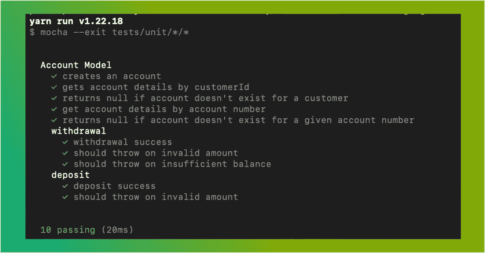
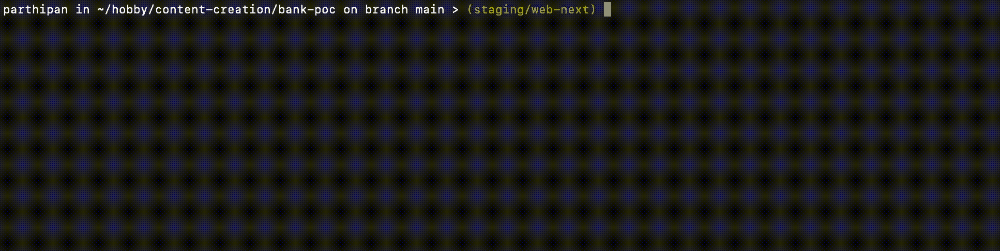
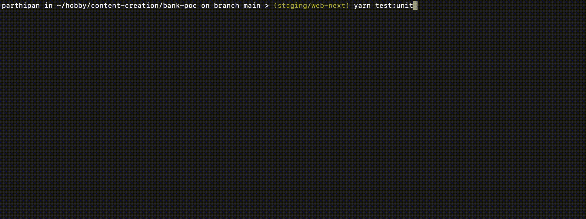

# 用 Mocha 和 Chai 单元测试 Node.js 后端模型

> 原文：<https://javascript.plainenglish.io/unit-testing-node-js-backend-models-with-mocha-and-chai-1185c8ad9ff6?source=collection_archive---------6----------------------->



Unit Tests with Mocha & Chai

大家好！

在这篇高度实用和动手操作的文章中，让我们看看如何为我们用 Node.js 编写的后端模型编写单元测试。在这篇文章中，我们将使用 [Mocha](https://mochajs.org/) 测试框架和 [Chai](https://www.chaijs.com/) 断言库。

> **免责声明:**这是一篇代码密集的文章，建议至少对 JavaScript 有中等程度的熟悉，以充分利用将进一步讨论的概念。还有，请做好大量阅读 JS 代码的准备。
> 
> **注:**单元测试一般是指孤立地测试逻辑的最小单元(比如一个函数)，但在这里，我们将后端的单个实体(比如账户模型)作为一个单元来考虑。

所以事不宜迟，让我们开始吧:

# 摩卡是什么？

摩卡是一个类似于 [Jest](https://jestjs.io/) 的测试跑者。Mocha 和 Jest 的主要区别在于 Jest 是一个包含电池的测试框架。这意味着它开箱即用，提供断言、嘲讽等帮助。但是摩卡缺少它们。你必须使用一个外部库来实现这些功能。

# 为什么是摩卡？

所以，你可能会想，为什么不用 jest 呢？你会是对的。但是，如果您必须在几年前构建的系统上工作，并且您刚刚加入团队。您的任务是实现您的第一个功能。那么对如何用 Mocha 编写测试有一个大致的了解将是在这样的场景中有用的知识。

此外，知道使用多种工具不会影响你的机会。事实上，这只会让他们进步很多。

# Chai.js 是什么？

正如我们前面讨论的，我们必须在 Mocha 中使用外部断言库。内置的 Node.js 断言对于简单的情况也能很好地工作。但是如果我们想写习惯性的和描述性的测试，我们需要一个第三方的断言库。这就是 Chai.js 出现的原因。它只是一个断言库，通过它公开了一些有用的方法。

# 设置依赖关系:

为了使用这些工具，我们必须将它们作为依赖项添加到我们的项目中。由于它们只是用于测试的依赖项，我们不妨将它们作为`devDependencies`添加到 package.json 文件中。

所以我们的`package.json`文件看起来会像下面这样:

```
{
  "name": "mochachaidemo",
  "version": "1.0.0",
  "type": "module",
  "description": "A POC app to demostrate unit testing with mocha and chai",
  "main": "src/index.js",
  "author": "Parthipan Natkunam",
  "license": "MIT",
  "scripts": {
    "test:unit": "mocha --exit tests/unit/*/*",
  },
  "dependencies": {
    "joi": "^17.4.0",
  },
  "devDependencies": {
    "chai": "^4.3.4",
    "mocha": "^8.4.0",
  }
}
```

还要注意，为了简单、简明和紧扣主题，我们将只为它建立一个模型和一个测试。在本文中，我们不会实现 API 路由。

此外，在本文中，我们不会看到任何数据库集成。

# 型号:

让我们建立一个模型来模拟一个银行账户。在项目的根目录下，让我们创建一个名为`models`的目录，并将所有与模型相关的模块放在那里。

## 基本模型类:

当使用 Node.js 在后端工作时，我经常发现采用面向对象的方法来处理后端实体很方便。当然，这只是我个人的看法和喜好。您可以根据您的项目需求和偏好做出决定。

说到这里，让我们实现一些基类，从这些基类我们可以扩展子模型:

```
// models/Base.jsexport class DataObject {
  toString() {
    return JSON.stringify(this);
  }
}

export class Model {
  constructor(name) {
    this.modelName = name;
  }
}
```

因此，从 DataObject 扩展的类将对数据建模，并充当对象关系映射(ORM)。而那些从 Model 类扩展而来的类将更像其他编程语言(如 Java)中的存储库类。

## 验证者:

从技术上来说，这些不是模型的一部分，而是我们的模型将利用的函数和对象。为了方便起见，我将把它放在我们的`models`目录中:

```
// models/validators.jsimport joi from "joi";export const isValidAmount = (amount) => {
  return !!amount && !Number.isNaN(+amount) && amount > 0;
};export const account = {
  validateAccountObject: (accountObject) => {
    const schema = joi.object({
      id: accountNumberValidationRule,
      holderId: joi.number().required(),
      currency: currencyShortCodeValidationRule,
      balance: joi.number().positive().precision(2).required(),
    });
    return schema.validate(accountObject);
  },
  validateWithdrwal: (balance, amount) => {
    if (isValidAmount(amount)) {
      if (balance < amount) {
        throw new Error("Insufficient balance in your account");
      }
      return;
    }
    throw new Error("Invalid amount");
  },
  validateDeposit: (amount) => {
    if (!isValidAmount(amount)) {
      throw new Error("Invalid amount");
    }
  },
};
```

## 客户模型:

现在，让我们创建帐户数据对象和帐户存储库。同样，为了简单起见，我将两个类放在一个文件中。如果您正在进行一个生产项目，我建议您将它们作为单独的文件。

Account DAO and Repository as a unified Model

正如您所看到的，模型和存储库只是模拟了一个银行账户。

有一件事我们还没有讨论过，但是在上面的代码中出现了，那就是`inMemoryStore`。如前所述，为了进行概念验证，我们没有将模型连接到实际的数据库，而是在内存中有一个对象来存储数据。

# 内存中的数据存储:

让我们快速在内存中创建一个对象来保存我们的数据，如下所示:

```
// store/db.jsexport const store = {
  customers: [],
  accounts: [],
};
```

现在，让我们为内存中的数据对象创建一些助手方法:

Custom In-memory store

# 单元测试:

让我们在项目的根目录下创建一个目录，并将其命名为`tests`。这将为我们的应用程序代码和测试提供清晰的分离。同样值得注意的是，我们将把 Account DAO 和 Account repository 看作一个单独的实体。

好的单元测试的主要组成部分之一是模拟数据。让我们首先为我们的测试创建一些模拟:

```
// tests/mocks.jsexport const account = {
  validAccount: {
    id: "1627898927",
    holderId: 1,
    currency: "INR",
    balance: 23000,
  },
};
```

现在，让我们测试开立新账户的方法:

```
// tests/unit/models/Account.test.jsimport chai from "chai";
import { Account } from "../../../models/Account.js";
import { account as accountMock } from "../../mocks.js";

const account = new Account();describe("Account Model", () => {
  it("creates an account", () => {
    account.openAccount(accountMock.validAccount);
    const openedAccount = account.getByAccountNumber(
      accountMock.validAccount.id
    );
    chai
      .expect(openedAccount.accountNumber)
      .to.equal(accountMock.validAccount.id);
    chai
      .expect(openedAccount.currencyShortCode)
      .to.equal(accountMock.validAccount.currency);
    chai
      .expect(openedAccount.balance)
      .to.equal(accountMock.validAccount.balance);
    chai
      .expect(openedAccount.customerId)
      .to.equal(accountMock.validAccount.holderId);
  });
});
```

现在让我们运行我们在 package.json 中定义的脚本来运行单元测试:

`yarn test:unit`



run the unit test case

# 添加剩余的案例:

现在我们有了一个可测试的单个案例，让我们添加其他功能的测试，比如检索账户细节、存款和取款。让我们也给这些功能添加一些负面案例，使测试完整可靠。

所以`Account.test.js`文件会变成如下:

Complete test suite for Account model

现在，让我们一起运行它:



All cases for the Account Model

# 结论:

因此，我们使用 Mocha 和 Chai 为 Node.js 代码编写了一个完整的单元测试套件。

如果将来需求发生变化，拥有这些测试将使我们更有信心进行重构。

我希望这些内容对你有用。如果我对这篇文章有足够的兴趣，我会写另一篇关于用相同的 Mocha 和 Chai 设置执行集成测试的文章。

如果你想看更多关于编程和 web 开发的实用技术内容，可以考虑在这里关注我。

在我的下一篇文章中，我将很快与您交流。

干杯！:)

*更多内容请看*[***plain English . io***](https://plainenglish.io/)*。报名参加我们的* [***免费周报***](http://newsletter.plainenglish.io/) *。关注我们关于*[***Twitter***](https://twitter.com/inPlainEngHQ)[***LinkedIn***](https://www.linkedin.com/company/inplainenglish/)*[***YouTube***](https://www.youtube.com/channel/UCtipWUghju290NWcn8jhyAw)*[***不和***](https://discord.gg/GtDtUAvyhW) *。***