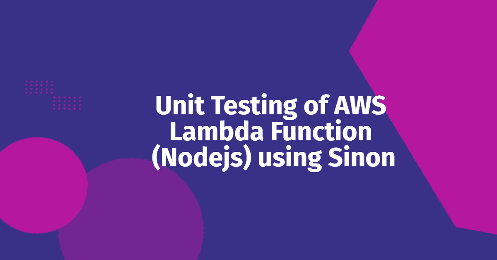
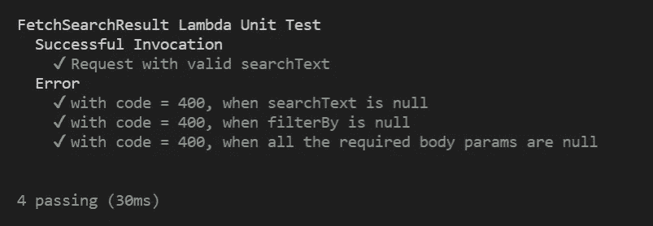

# AWS Lambda 函数(Node.js) —使用 Sinon、Mocha 和 Chai 的单元测试

> 原文：<https://javascript.plainenglish.io/unit-testing-of-aws-lambda-functions-node-js-using-sinon-b6b3f25cc31d?source=collection_archive---------0----------------------->

## 让我们学习如何使用 Sinon、Mocha 和 Chai 对 AWS lambda 函数进行单元测试。

在我之前的[文章](/unit-testing-of-aws-lambda-functions-node-js-using-mocha-and-chai-317353f8d60)中，我已经介绍了使用 *mocha* 、 *chai、*和 *proxyquire* 为 AWS lambda 函数编写单元测试用例。

在本文中，我将介绍使用 **Sinon** 为 AWS lambda 函数编写单元测试用例的逐步过程。

让我们学习如何使用 Sinon 为 AWS Lambda 函数编写单元测试用例。

## λ代码

让我们首先来看一个样例 Lambda 函数，它根据搜索输入和过滤器从数据库中获取搜索结果。该函数有两个输入— `searchText`和`filterBy`。

*   `searchText` —将有我们要在数据库中搜索的文本。
*   `filterBy` —将具有我们希望对搜索结果进行排序所基于的字段名称。

Lambda function

## lambda 函数的单元测试

现在让我们通过编写测试用例来测试上面的 lambda 代码。对于单元测试，我们将使用下面的包。

*   [Mocha](https://mochajs.org/) —用于创建测试套件和运行测试用例。
*   [Chai](https://www.chaijs.com/) —验证给定代码是否正确运行的断言库。
*   [Sinon](https://sinonjs.org/) —一个可以模仿/存根依赖关系的包。

现在让我们深入研究一下。

## 覆盖和模仿依赖关系

让我们学习如何模仿 lambda 函数内部的依赖关系。这些依赖项可以是任何第三方库或 DB 调用，甚至是 API 调用。为了覆盖和模仿这些依赖性，我们可以使用 **sinon** 包。

在运行每个测试用例之前，我们将创建一个 *sinon 沙箱*并初始化其中所有的存根函数。稍后一旦每个测试用例被执行，我们将恢复存根函数并删除 *sinon 沙箱*。

在下面的例子中，我们有一个依赖项— *数据服务*(数据库函数)。我们将覆盖一个名为 ***query*** 的数据库函数，并添加我们自己的逻辑来返回模拟结果。

Mocking the dependencies using Sinon

## lambda 函数的测试用例

你可以在[这个](https://github.com/SyedAfrozPasha/node-lambda-unit-test-sinon) repo 中找到单元测试用例的完整代码。

 [## GitHub-SyedAfrozPasha/node-lambda-Unit-test-sinon:AWS lambda 函数的单元测试(Node.js)…

### 用 Mocha，Chai 和 Sinon - GitHub 对 AWS lambda 函数(Node.js)进行单元测试…

github.com](https://github.com/SyedAfrozPasha/node-lambda-unit-test-sinon) 

要运行单元测试用例，执行项目根文件夹中的命令`mocha`或`npm run test`。

Unit test results

这就是我今天的全部内容。希望你喜欢。😉

谢谢你的来访。如果你喜欢的内容，请支持我，并关注我更多这样的内容。

在 [LinkedIn](https://www.linkedin.com/in/syedafrozpasha/) 、 [Twitter](https://twitter.com/SyedAfroz_Pasha) 和 [GitHub](https://github.com/SyedAfrozPasha) 上与我联系。

*更多内容看* [***说白了。报名参加我们的***](https://plainenglish.io/) **[***免费周报***](http://newsletter.plainenglish.io/) *。关注我们关于*[***Twitter***](https://twitter.com/inPlainEngHQ)[***LinkedIn***](https://www.linkedin.com/company/inplainenglish/)*，以及* [***不和***](https://discord.gg/GtDtUAvyhW) *。***