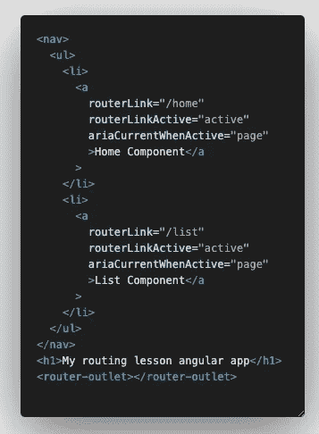
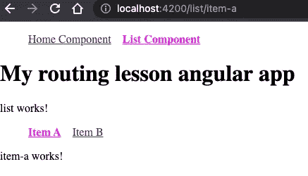
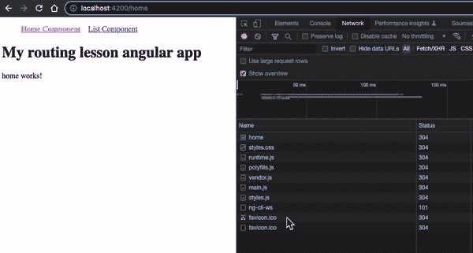

# 揭开角路由器的威力

> 原文：<https://javascript.plainenglish.io/unveil-the-power-of-angular-router-2f34b25ed649?source=collection_archive---------2----------------------->

## 正确设置您的路线并节省时间，在 Angular 应用程序中为您的用户提供最佳导航体验！


您是否正确使用了角路由器？今天，我们将向您展示 Angular Router 的一些基础知识，以及如何在 Angular 应用中有效地使用它们。

# 标准路由实践

一旦创建了 Angular 应用程序，您将从生成更多的页面/组件开始。我将运行下面的两个命令来生成两个新组件。

```
ng g c home // home component
ng g c list // list component
```

生成这两个新组件后，您可以将它们添加到**approving module**文件中，并在 routes 参数中定义这两个组件。


app-routing.module.ts

确保您的**批准模块**文件被导入到您的`app.module.ts`文件中。


app.module.ts

现在，最后一步是将`router-outlet`添加到您的应用程序组件页面，并添加一个带有`routerLink`的简单导航栏，以及您在**approving module**文件中定义的路由，以便路由器工作。此外，当组件在当前路线上时，您可以添加`routerLinkActive`来为您的组件添加一个类`active`。



app.component.html


home route


list route

我添加了一些 css 样式(不是最漂亮的😝)添加到活动类中，这样可以清楚地看到当前路线中显示的是哪个组件。恭喜你，你刚刚完成了基本角度路由 101，你可能已经从 [www.angular.io](http://www.angular.io) 中知道了😂

# 通配符和重定向路由

只是为了确保我们所有人在进入下一部分之前都在同一页上。在设置任何复杂的路线之前，你必须确保你的应用程序处理所有可能由于人为错误而出错的基本路线，比如不正确的路线名称等等。因此，设置`wildcard route`非常重要，它确保任何与您定义的路线不匹配的路线都将被捕获并定向到`wildcard route`组件。


Updated AppRoutingModule file

一旦你设置好了，现在你可以通过在你的域后添加任何不相关的路由名称来尝试中断你的路由，它将总是被定向到你在`wildcard route`中定义的 **PageNotFound** 组件。

除此之外，您的应用程序需要的下一个最重要的途径是`redirectTo route`。如果你现在尝试在没有定义任何路由的情况下转到`localhost:4200`，你可以看到它将你导向`wildcard route`，这不是你希望你的用户看到的，因为在你的根路由上，它应该显示你的`home`页面。因此，您可以添加一个`redirectTo route`来将任何根路由流量重定向到您的`home`页面。


Updated AppRoutingModule file

现在，当您访问`localhost:4200`时，您将看到您的`home`页面，只有当您键入错误的路线时，您才会被重定向到 **PageNotFound** 组件。

# 嵌套和子路由

如果您有一个列表组件页面，它希望在一个列表中显示许多不同的项目，那么您可以选择使用嵌套的路由模式在列表组件页面下显示您的项目。

首先，让我们再创建 2 个组件，看看这个嵌套路由是如何工作的。将这两个组件添加到**批准模块**文件中。

```
ng g c item-a
ng g c item-b
```


Updated AppRoutingModule file

注意，这一次，我没有将它作为另一个对象添加到 routes 中，而是将组件作为子组件添加到 list 组件对象中。这是您可以设置**嵌套路由**的格式。完成后，最后一步是为用户设置导航，以便从您的列表组件页面访问**项目-a** 和**项目-b** 组件。


list.component.html



Accessing child item-a component


Accessing child item-b component

请注意，url 路由现在是`/list/item-a`和`/list/item-b`，因为您已经将此路由作为子对象放置在列表组件 route 对象中，所以路由路径将是**嵌套** / **堆叠**。

# 动态路由和访问路由参数

您可能会问，如果您有 100 个条目，这是否意味着您必须创建 100 个子组件并将其放在列表组件下？😨你完全可以这么做，但那会是一片混乱。此外，如果您的子组件模板和 css 相同，您可以重用相同的组件，并将此子路由改为动态路由。因此，对于 100 件商品，您可以只使用一个子组件在不同的路线上显示它。

对于这个例子，我将创建另一个组件来展示一个通用组件如何实现尽可能多的子路由。

```
ng g c list-item
```


Updated AppRoutingModule file


Updated list.component.html


Dynamic Route URL

你可以从上面的 url 中看到，它随着在`routerLink param`中定义的选定子节点而变化。接下来的问题是列表项组件如何知道在所选的路线上显示什么内容？只需使用 Angular 提供的`ActivatedRoute`，就能访问 route param，知道正在访问哪条路由，要显示什么内容。


list-item.component.ts


list-item.component.html


Get route param and show exclusive content for each unique route

现在，您可以获得路由参数，并显示所选动态路由名称特有的内容。您可以删除 100 个子组件，并用 1 个动态组件替换它。🎉

# 惰性加载模块

你可能已经看到了一个巨大而复杂的项目，其中 Angular 应用程序有超过 40–50 个组件。我对此并不感到惊讶。任何大型企业项目都可以轻松达到这个数字或更多。您可能想知道在第一次页面加载时加载 40–50 个组件是否会有问题。我可以有把握地告诉你，这将是一个问题，而且肯定会是一个问题！🤓想象一下，加载一个由 50 个组件组成的包，这些组件在应用程序的第一页中没有使用。😱你甚至无法想象装货时间。

因此，为了防止大型企业应用程序如此疯狂的加载时间，Angular 有一个特性叫做`lazy loading module`。它允许您将不同的页面或功能分组到一个角度模块中，并且它将仅在用户访问该模块时加载该模块，因此它会将未使用的模块加载从第一次页面加载中移除。

让我们尝试改变列表组件，使其成为一个惰性加载模块。💪🏽首先，添加一个`list.module.ts`和`list-routing.module.ts`文件到你的列表组件文件夹中。您可以使用下面的命令来生成模块文件。

```
ng g c module list
```


list.module.ts


list-routing.module.ts

将从`app-routing.module.ts`定义的路径转移到新的路径文件中，清理并在`app-routing.module.ts`文件中添加延迟加载功能。


Updated app-routing.module.ts file



list module only loaded when being accessed

您可以看到，只有当用户单击导航中的列表组件时，才会加载列表模块包。如果你有很多组件是在第一页加载时加载的，那么这无疑会改变你的应用程序速度。

# 每条路线的页面标题

大多数 Angular 开发者不关心的开发部分——应用程序的页面标题。


`index.html`中的这部分代码你看着眼熟吗？不，不是这样的，我也为此感到内疚。很多时候，尤其是当你在开发 PWAs 的时候，你的用户在手机上看到浏览器的页面标题时，并没有意识到他们在哪个页面上，因为所有的页面都显示默认的标题。否则，您将不得不在每个页面中实现额外的逻辑来显示页面的标题，这可能会很长。然而，现在在 Angular 14 中，他们让我们变得很容易，你可以轻松地定义你的浏览器的页面标题，只需在你的`Routes`中添加标题字段，就大功告成了！


现在你的应用程序会在浏览器标题中准确显示你在哪个页面，而不是在`index.html`文件中默认的无聊标题标签。


Home page of the application


Form page of the application

# 摘要

希望这篇文章为您提供了关于 Angular 路由器的基础和高级知识。使用突出显示的几页，并对您的角度应用程序进行适当的更改。我相信你的角度申请[灯塔](https://chrome.google.com/webstore/detail/lighthouse/blipmdconlkpinefehnmjammfjpmpbjk?hl=en)分数一定会提高的。💯

如果你有 Angular application 应该有的其他有趣的路由技术，请在下面的评论中告诉我，我很乐意向你学习。干杯！🚀

[](https://medium.com/@devjo/membership) [## 用我的推荐链接- DevJo 加入媒体

### 阅读 DevJo 的每一个故事(以及 Medium 上成千上万的其他作者)。你的会员费直接支持 DevJo 和…

medium.com](https://medium.com/@devjo/membership) 

*更多内容请看*[***plain English . io***](https://plainenglish.io/)*。报名参加我们的* [***免费周报***](http://newsletter.plainenglish.io/) *。关注我们关于*[***Twitter***](https://twitter.com/inPlainEngHQ)[***LinkedIn***](https://www.linkedin.com/company/inplainenglish/)*[***YouTube***](https://www.youtube.com/channel/UCtipWUghju290NWcn8jhyAw)*[***不和***](https://discord.gg/GtDtUAvyhW) *。对增长黑客感兴趣？检查* [***电路***](https://circuit.ooo/) *。***