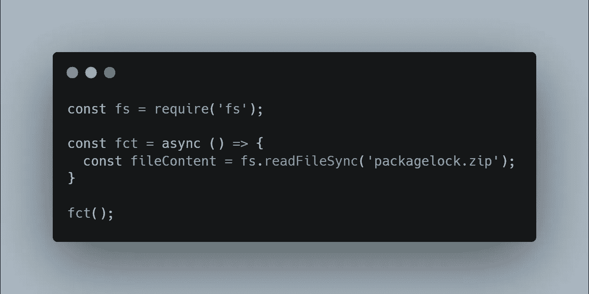
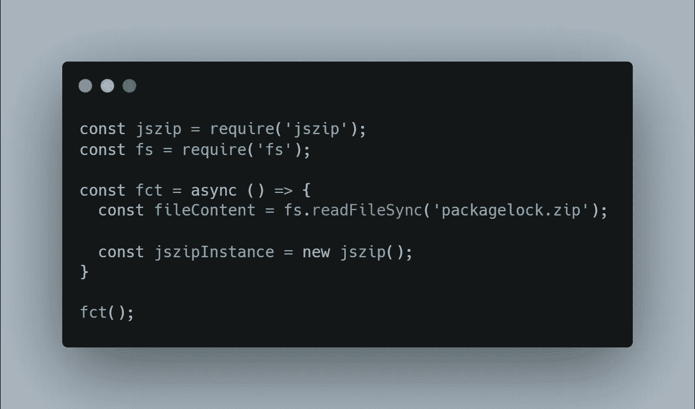
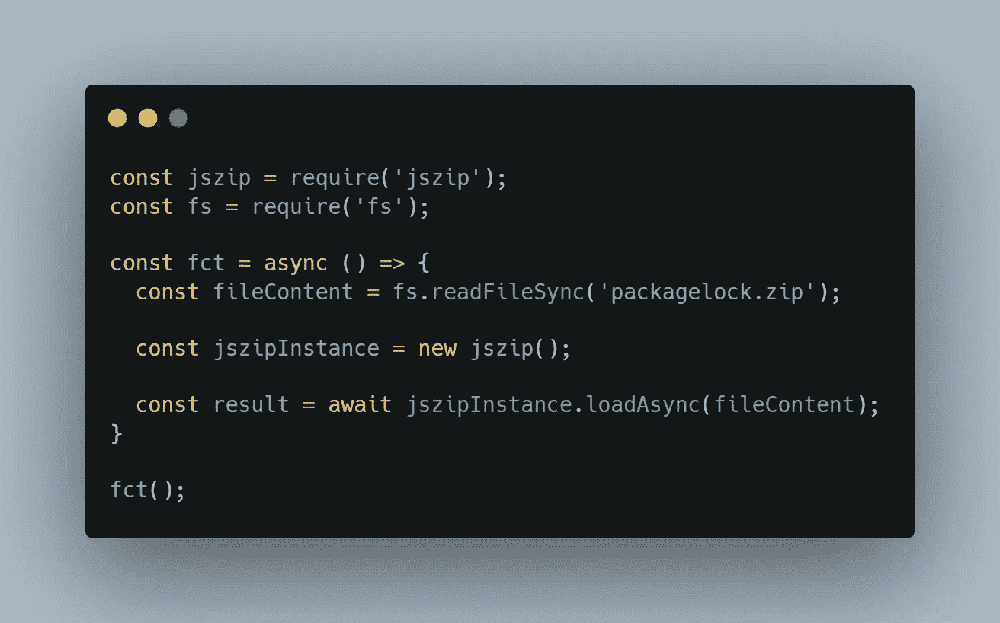
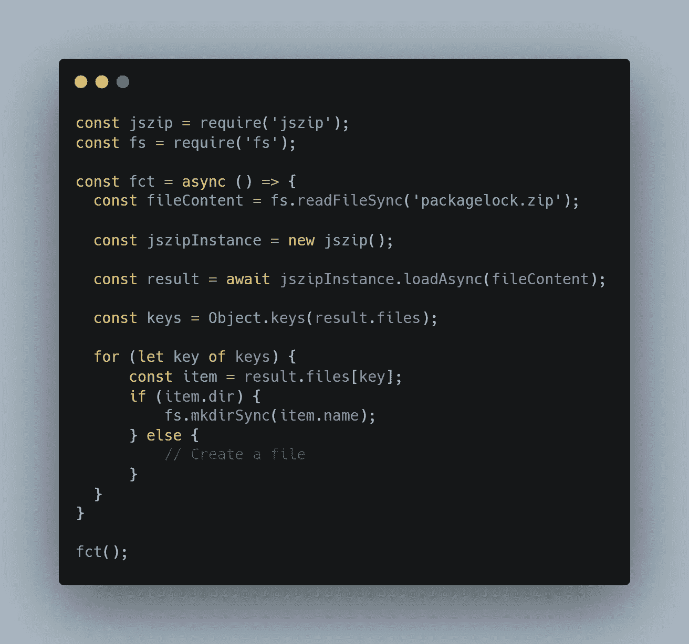
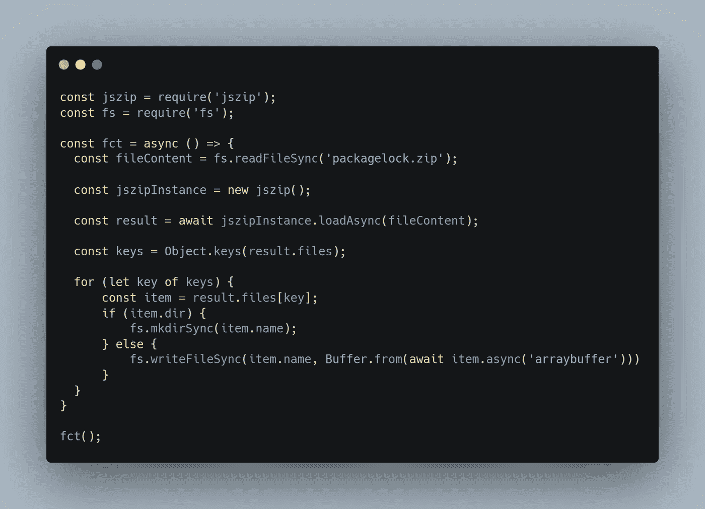

# 如何用 Node.js 解压文件

> 原文：<https://javascript.plainenglish.io/unzip-a-file-with-nodejs-5f94b360f7df?source=collection_archive---------0----------------------->

## 在 FS 能够实现的所有特性中，解压缩不是其中之一。让我们看看如何使用 Node.js 来实现这一点


Photo by Daniel Battersby: [https://www.pexels.com/photo/close-up-view-of-man-zipping-jacket-9965135/](https://www.pexels.com/photo/close-up-view-of-man-zipping-jacket-9965135/)

Node.js 不支持 Zip。通过查看，我们可以找到一些库，但是没有一个库提供如何做的清晰文档。

我们今天会努力解决这个问题！

对于本文，我选择了库 **jszip** ，因为它是**最轻的**和**最容易使用的**！

[](https://www.npmjs.com/package/jszip) [## jszip

### 一个用于创建、阅读和编辑的库。用 JavaScript 压缩文件，有一个可爱简单的 API。看…

www.npmjs.com](https://www.npmjs.com/package/jszip) 

# 设置我们的环境

在开始编写任何代码之前，让我们设置一下我们的环境。

> 您将需要一个 Node.js 环境，因为它不能与任何基于 web 的环境一起工作。虽然 Jszip 是 web 兼容的，但是我们将使用 fs 来读取我们的文件

让我们用命令`npm install -S jszip`安装 jszip

为此，我们还需要一个 zip 文件。但是我认为，如果你看到了这篇文章，那是因为你已经有了一篇文章，而你不知道如何提取它！对于我的文章，我将我的`package-lock.json`压缩成一个 zip 文件。下面是它的结构:

```
- package-lock
  | package-lock.json
```

# 打开我们的 zip 文件

在能够提取 zip 文件的内容之前，我们需要访问它。为此，我们将使用内置的文件系统模块`fs`:



Read the zip file

> 因为我的项目非常小。我必须创建一个函数并执行它来使用 async/await 特性。

**读取文件时不需要精确的编码**，我们需要的只是文件的原始内容。

# 加载我们的 zip 文件

现在读完这个文件后，我们想用 Jszip 加载它。首先，我们必须创建它的一个实例:



Creating an instance of jszip

创建实例后，我们可以通过添加以下代码来加载我们的文件:



Load the zip file

现在我们已经加载了我们的文件，让我们停下来看一下它的内容。在上面运行 console.log，下面是打印的内容:

```
{                                    
  files: [Object: null prototype] {  
    'package-lock/': {               
      name: 'package-lock/',         
      dir: true,                     
      date: 2022-05-29T18:12:24.000Z,
      comment: null,                 
      unixPermissions: null,         
      dosPermissions: 16,            
      _data: [Promise],              
      _dataBinary: true,             
      options: [Object]
    },
    'package-lock/package-lock.json': {
      name: 'package-lock/package-lock.json',
      dir: false,
      date: 2022-05-01T22:40:52.000Z,
      comment: null,
      unixPermissions: null,
      dosPermissions: 32,
      _data: [Object],
      _dataBinary: true,
      options: [Object],
      unsafeOriginalName: 'package-lock/package-lock.json'
    }
  },
  comment: null,
  root: '',
  clone:
```

我们可以看到像`comment` 或`root`这样的几个项目，但我们不会对它们给予太多关注。

然而，有趣的是`files`对象。我们有两件东西:

*   包装锁/
*   包锁/包锁. json

第一个是包含我们的文件的文件夹。我们可以确认它是一个文件夹，因为项目`dir`是真实的。

第二项包含在我们的文件夹中，它是我们的 package-lock.json。

# 在当前目录中解压我们的 zip 文件

现在，让我们把它们都提取出来。提取所有项目的最简单的方法是通过循环使用`files`对象中的键，然后创建一个新目录(如果它是一个目录)或创建文件。

> Jszip 做得很好，将始终遵循逻辑顺序，这意味着**目录将始终在文件**之前，您不会因为目录不存在而无法创建文件



Looping through the files

> 在这种情况下，我决定使用 for 循环，因为我们稍后需要做一些异步操作。

在这段代码中，我们遍历所有的键，获取相应的文件并检查它是否是一个目录。如果是一个目录，我们简单地用`fs.mkdirSync`创建一个目录。

> 如果您愿意，也可以使用`fs.mkdir`。

现在我们必须写我们的文件。为此，我们将使用每个文件项可用的`fs.writeFileSync`和`async()`函数。这个函数允许我们将文件转换成 fs 可以理解和写入的可读格式。在我们的情况下，这将是一个`arraybuffer`



Our final code

我们到了。如果您运行这段代码，您将能够提取并复制根目录中 zip 文件的内容！

这就是用 Node.js 和 Jszip 解压文件的全部内容。如果你想在评论里放一篇文章，请告诉我！

如果你喜欢这篇文章，不要犹豫留下掌声或关注！

*更多内容看* [***说白了。报名参加我们的***](https://plainenglish.io/) **[***免费周报***](http://newsletter.plainenglish.io/) *。关注我们关于*[***Twitter***](https://twitter.com/inPlainEngHQ)*和*[***LinkedIn***](https://www.linkedin.com/company/inplainenglish/)*。查看我们的* [***社区不和谐***](https://discord.gg/GtDtUAvyhW) *加入我们的* [***人才集体***](https://inplainenglish.pallet.com/talent/welcome) *。***