# 即将推出的 JavaScript 日期标准库—时态

> 原文：<https://javascript.plainenglish.io/upcoming-javascript-date-standard-library-temporal-9d93d7dad39e?source=collection_archive---------1----------------------->

## 目前处于第三阶段(候选)。它将取代原来的`Date()`


Photo by [Ocean Ng](https://unsplash.com/@oceanng?utm_source=medium&utm_medium=referral) on [Unsplash](https://unsplash.com?utm_source=medium&utm_medium=referral)

JavaScript 中的原生日期处理存在许多问题，而`Date`对象自从 1995 年受 Java (java.util.Date)启发的实现以来就没有改变过。Java 早就弃用它了，只留下 JavaScript 用于向后兼容浏览器。

`Date()` API 的问题包括:

1.  除了用户的本地时间和 UTC，不支持其他时区
2.  解析器行为不可靠，无法使用
3.  日期对象是可变的
4.  DST 行为不可预测
5.  计算 API 是笨拙的
6.  不支持非公历日历

所以为了解决这个痛点，时态 API 在几年前就已经提出来了，现在终于到了阶段 3(候选)，下一个阶段就是阶段 4(完成)。这也意味着它不会有大的变化。本文将简单介绍一下。

# 概观

Temporal 将是顶级名称空间中的全局对象(如 Math)。它专注于处理日期和时间，不仅完全覆盖了原来的`Date()`特性，还添加了许多额外的强大特性。以前，你可能不得不求助于像 [moment.js](https://momentjs.com/) 这样的日期库来解决这个问题，但这是一个额外的负载(通常为 20-100 kb，取决于你是否包括时区和其他东西)，而 Temporal 将内置于浏览器中，因此不需要下载。

下面简单介绍一下它的主要 API。在其官方资源库中也有推荐的 [polyfills](https://github.com/tc39/proposal-temporal#polyfills) ，有兴趣可以本地加载测试。

我下面的例子截图全部使用`[@js-temporal/polyfill](https://github.com/js-temporal/temporal-polyfill)`。

# 当前日期和时间

`Temporal.Now`返回代表当前日期和时间的对象。它有以下方法:

*   `Temporal.Now.instant()` -获取自 [Unix 纪元](https://en.wikipedia.org/wiki/Unix_time)以来的准确时间
*   `Temporal.Now.timeZone()` -获取当前系统时区
*   `Temporal.Now.plainDate(calendar)` -获取系统时区和指定日历中的当前日期
*   `Temporal.Now.plainDateISO()` -获取系统时区和 ISO-8601 日历中的当前日期
*   …

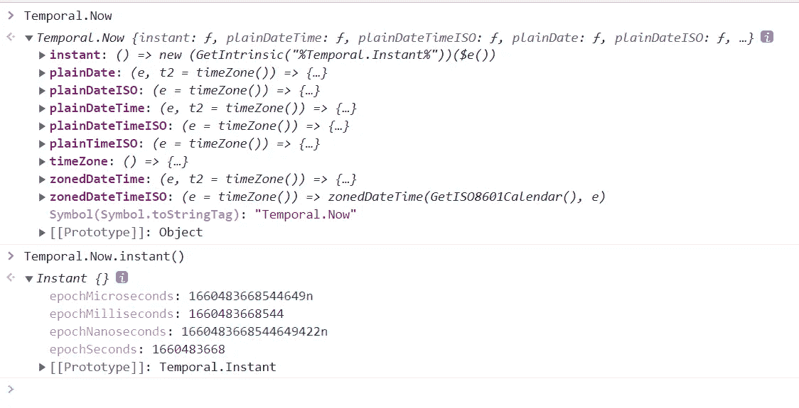

这里只截取了一部分。更多详情可以查看[时态。现在文档](https://tc39.es/proposal-temporal/docs/now.html)。

# 即时日期和时间

一个`Temporal.Instant`代表一个固定的时间点(称为“精确时间”)，独立于日历或位置。具体来说，它从 ISO 8601 格式的字符串中返回一个表示日期和时间的对象，精确到纳秒。

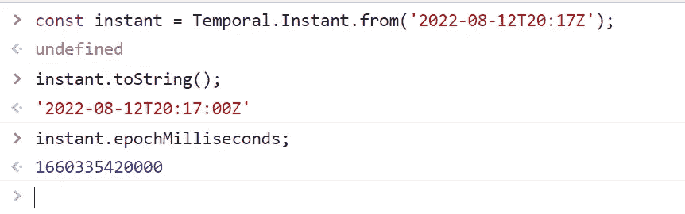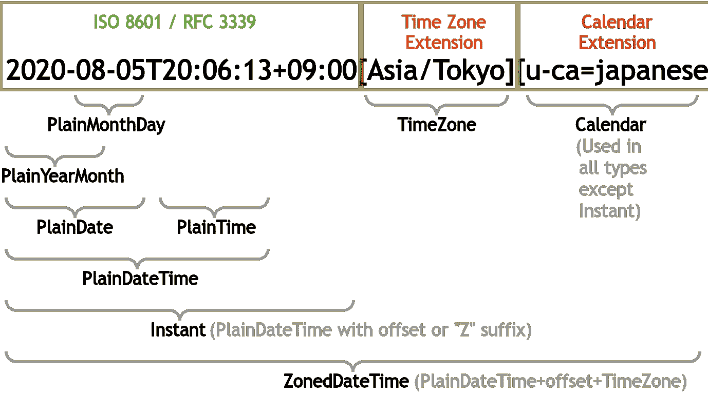

Image from [TC39](https://tc39.es/proposal-temporal/docs/)

见[太阳穴。即时文档](https://tc39.es/proposal-temporal/docs/instant.html)获取详细文档。

# 暂时的。ZonedDateTime

`Temporal.ZonedDateTime`返回一个对象，该对象表示事件在特定全球位置发生(或将发生)时的时区和日历感知日期/时间，例如

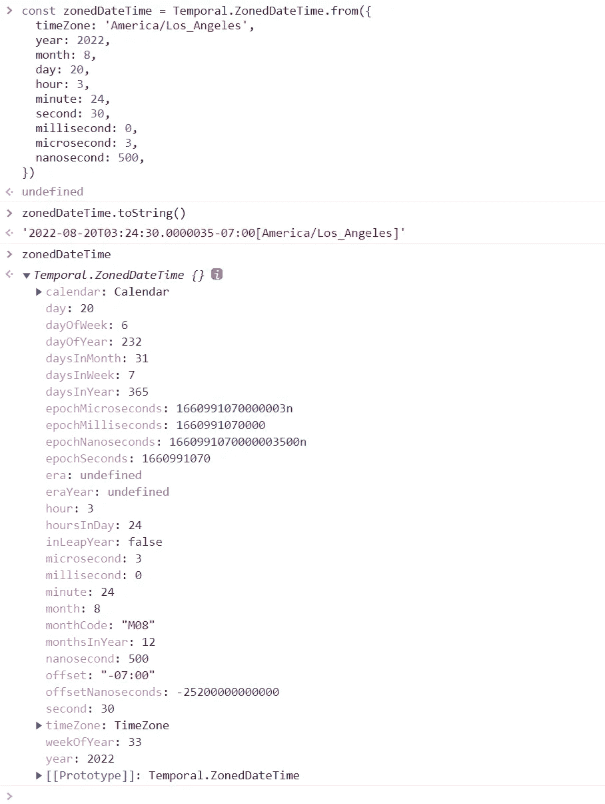

见[太阳穴。ZonedDateTime 文档](https://tc39.es/proposal-temporal/docs/zoneddatetime.html)获取详细文档。

# 简单的日期和时间

*普通*日期和时间表示与特定日期或时区无关的日历事件。选项包括:

## 暂时的。普通约会

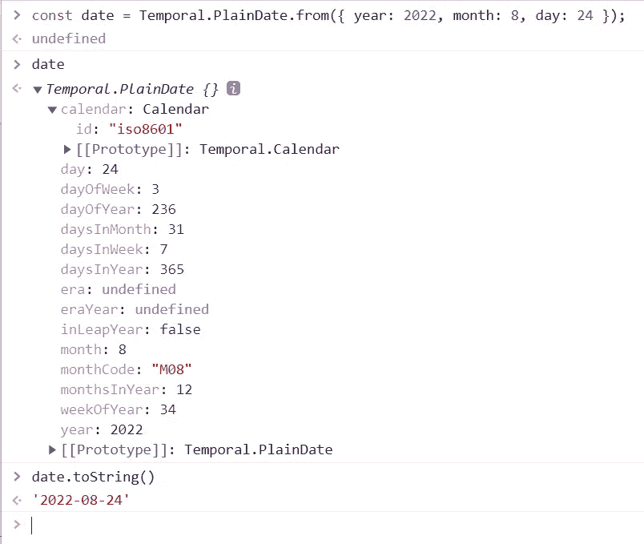

参见[太阳穴。详细文件的普通文件](https://tc39.es/proposal-temporal/docs/plaindate.html)。

## 暂时的。哀怨

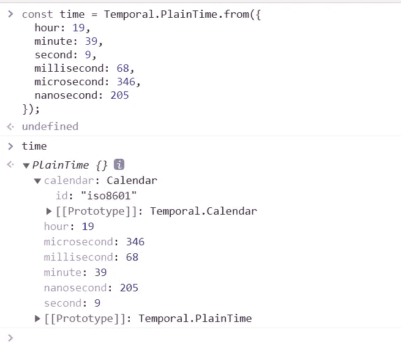

参见[太阳穴。详细文件的原告文件](https://tc39.es/proposal-temporal/docs/plaintime.html)。

## 暂时的。普通日期时间

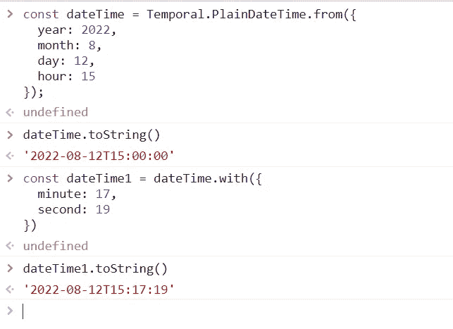

见[太阳穴。PlainDateTime 文档](https://tc39.es/proposal-temporal/docs/plaindatetime.html)获取详细文档。

## 暂时的。平年月份

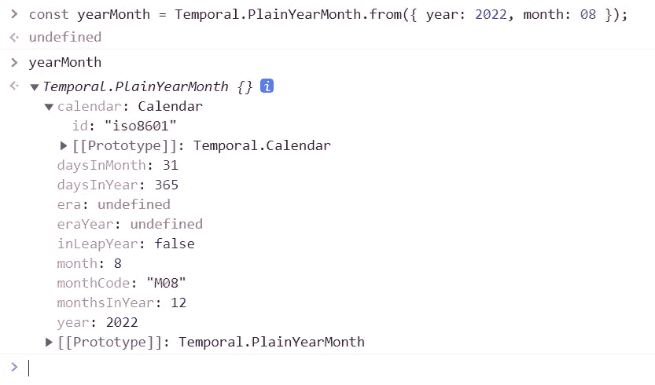

见[太阳穴。平年月文档](https://tc39.es/proposal-temporal/docs/plainyearmonth.html)获取详细文档。

## 暂时的。平原月日

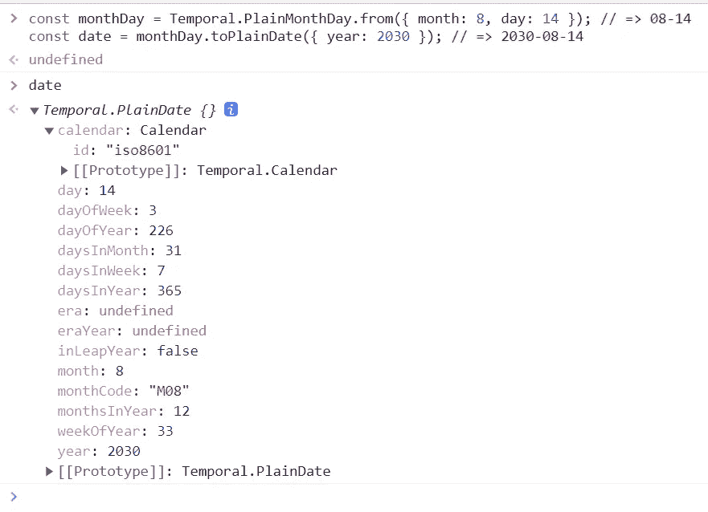

[见太阳穴。平原月文档](https://tc39.es/proposal-temporal/docs/plainmonthday.html)了解详细文档。

# 暂时的。持续时间

`Temporal.Duration`代表时间的长短。这用于日期/时间运算和测量`Temporal`对象之间的差异。

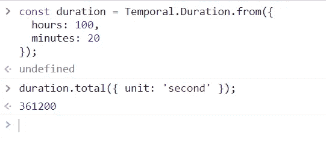

见[太阳穴。详细文件的持续时间文件](https://tc39.es/proposal-temporal/docs/duration.html)。

# 暂时的。时区

`Temporal.TimeZone`代表 IANA 时区、特定的 UTC 时差或 UTC 本身。您也可以实现自己的时区。

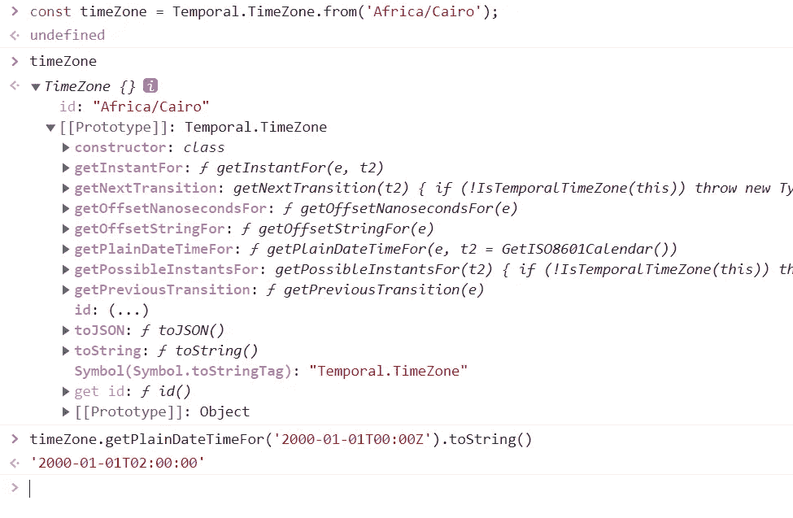

见[太阳穴。时区文档](https://tc39.es/proposal-temporal/docs/timezone.html)获取详细文档。

# 暂时的。日历

一个`Temporal.Calendar`代表一个日历系统。大多数代码将使用 ISO 8601 日历，但也可以使用其他日历系统。

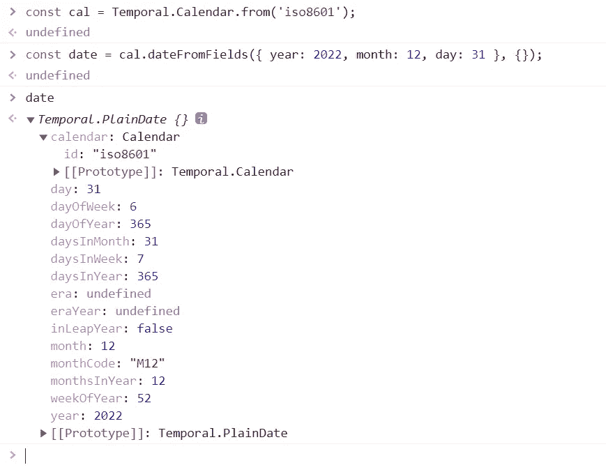

见[太阳穴。日历文档](https://tc39.es/proposal-temporal/docs/calendar.html)了解详细文档。

# 对象关系

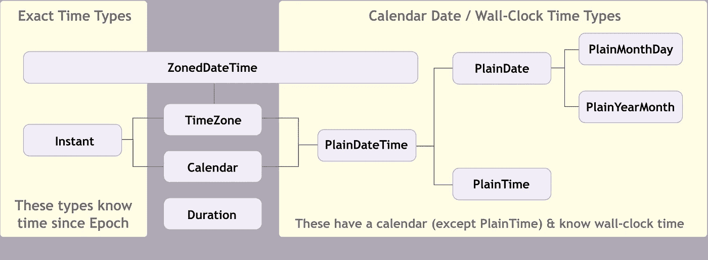

Image from [TC39](https://tc39.es/proposal-temporal/docs/)

# 日期和时间计算

所有时态对象都提供了非常丰富的数学方法来执行计算。可以说`moment.js`中几乎所有有用的方法都实现了。例如 [compare()](https://tc39.es/proposal-temporal/docs/duration.html#compare) 、 [add()](https://tc39.es/proposal-temporal/docs/duration.html#add) 、 [subtract()](https://tc39.es/proposal-temporal/docs/duration%20.html#subtract) 或 [round()](https://tc39.es/proposal-temporal/docs/duration.html#round) 等。

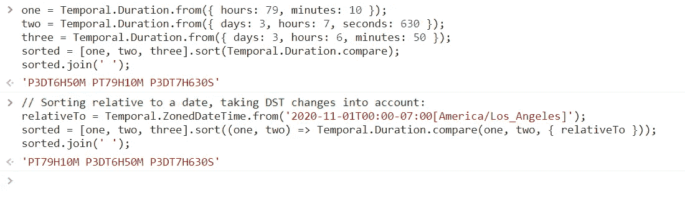

```
const t1 = Temporal.ZonedDateTime.from({
  timeZone: 'America/Los_Angeles',
  year: 2022,
  month: 8,
  day: 20,
  hour: 3,
  minute: 24,
  second: 30,
  millisecond: 0,
  microsecond: 3,
  nanosecond: 500,
});// add 1 hours 30 minutes
t1.add({ hours: 1, minutes: 30 }); // or
t1.add(Temporal.Duration.from({ hours: 1, minutes: 30 }));// subtract 2 weeks
t1.subtract({ weeks: 2 }); // or
t1.add({ weeks: 2, sign: -1 });
```

# 结论

时态 API 的特性很多而且很强大，本文只是一个简单的介绍。

有关更多信息，请参考:

`[Temporal](https://tc39.es/proposal-temporal/)`[提案](https://tc39.es/proposal-temporal/)

[2]`[Temporal](https://tc39.es/proposal-temporal/docs/)`[文献资料](https://tc39.es/proposal-temporal/docs/)

`[Temporal](https://tc39.es/proposal-temporal/docs/cookbook.html)`[食谱举例](https://tc39.es/proposal-temporal/docs/cookbook.html)

*感谢阅读。如果你喜欢这样的故事，想支持我，请考虑成为* [*中等会员*](https://medium.com/@islizeqiang/membership) *。每月 5 美元，你可以无限制地访问媒体内容。如果你通过* [*我的链接*](https://medium.com/@islizeqiang/membership) *报名，我会得到一点佣金。*

你的支持对我来说非常重要——谢谢。

*更多内容请看* [***说白了就是***](https://plainenglish.io/) *。报名参加我们的* [***免费每周简讯***](http://newsletter.plainenglish.io/) *。关注我们关于* [***推特***](https://twitter.com/inPlainEngHQ) ， [***领英***](https://www.linkedin.com/company/inplainenglish/) ***，*** *和* [***不和***](https://discord.gg/GtDtUAvyhW) ***。***