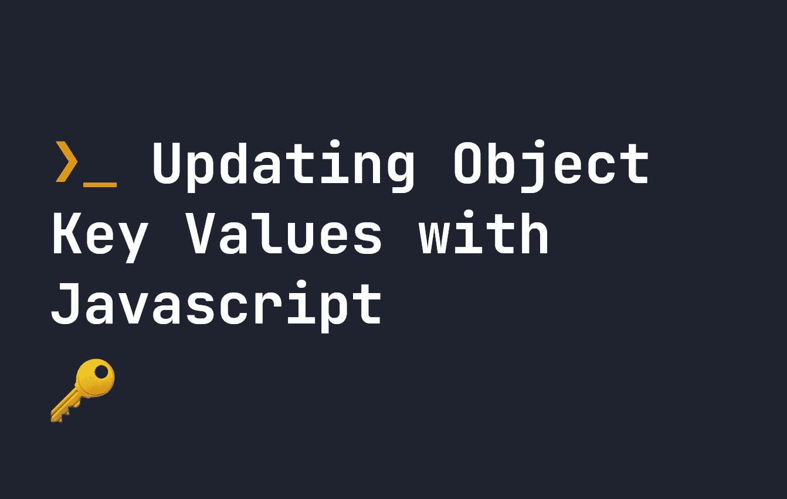

# 用 JavaScript 更新对象键值

> 原文：<https://javascript.plainenglish.io/updating-object-key-values-with-javascript-354906059a43?source=collection_archive---------6----------------------->

## 在 JavaScript 对象中更新键值的最好方法是什么？



[Javascript 对象](https://fjolt.com/article/javascript-objects-introduction)由键值对组成，是 Javascript 中最常见的数据结构之一。

要更新对象中的所有值，最简单的方法是:

1.  使用`Object.keys`获取对象的所有关键点。
2.  应用任何逻辑来决定哪些值应该更新。
3.  使用像`forEach`或`for`这样的循环更新每个的值。

例如:

```
let myObject = {
    name: "John", 
    skillItem1: 4,
    skillItem2: 7,
    skillItem3: 2,
    skillItem4: 1
}// Updates any numerical values that are more than or equal to 4, and changes them to 10:
Object.keys(myObject).forEach((item) => {
    if(typeof myObject[item] == "number" && myObject[item] >= 4) {
        myObject[item] = 10
    }
})console.log(myObject)
// Returns:
// let myObject = {
//     name: "John", 
//     skillItem1: 10,
//     skillItem2: 10,
//     skillItem3: 2,
//     skillItem4: 1
```

你不必运用逻辑——但它通常是有用的。你也可以用一个`for`循环来实现这一点——这比使用`forEach`要稍微快一些:

```
let myObject = {
    name: "John", 
    skillItem1: 4,
    skillItem2: 7,
    skillItem3: 2,
    skillItem4: 1
}// Updates any numerical values that are more than or equal to 4, and changes them to 10:
for(let item of Object.keys(myObject)) {
    if(typeof myObject[item] == "number" && myObject[item] >= 4) {
        myObject[item] = 10
    }
}console.log(myObject)
// Returns:
// let myObject = {
//     name: "John", 
//     skillItem1: 10,
//     skillItem2: 10,
//     skillItem3: 2,
//     skillItem4: 1
```

要仅更新对象中的一个值，使用方括号符号`[]`选择要更新的键。例如:

```
let myObject = {
    name: "John", 
    skillItem1: 4,
    skillItem2: 7,
    skillItem3: 2,
    skillItem4: 1
}// Updates `skillItem2` to 15
myObject['skillItem2'] = 15;
```

[JavaScript 对象是通过引用](https://fjolt.com/article/javascript-by-reference-by-value)创建的，这是一种奇特的说法，当我们进行上述更改时，我们正在改变原始对象。这也意味着`Object.values()`不允许我们更新对象的值，这就是为什么我们必须使用`Object.keys()`。

[🙇‍♂️:如果你喜欢这个，请考虑支持我](https://www.patreon.com/smpnjn?fan_landing=true)

*更多内容请看*[***plain English . io***](https://plainenglish.io/)*。报名参加我们的* [***免费周报***](http://newsletter.plainenglish.io/) *。关注我们关于*[***Twitter***](https://twitter.com/inPlainEngHQ)[***LinkedIn***](https://www.linkedin.com/company/inplainenglish/)*[***YouTube***](https://www.youtube.com/channel/UCtipWUghju290NWcn8jhyAw)*[***不和***](https://discord.gg/GtDtUAvyhW) *。对增长黑客感兴趣？检查* [***电路***](https://circuit.ooo/) *。***