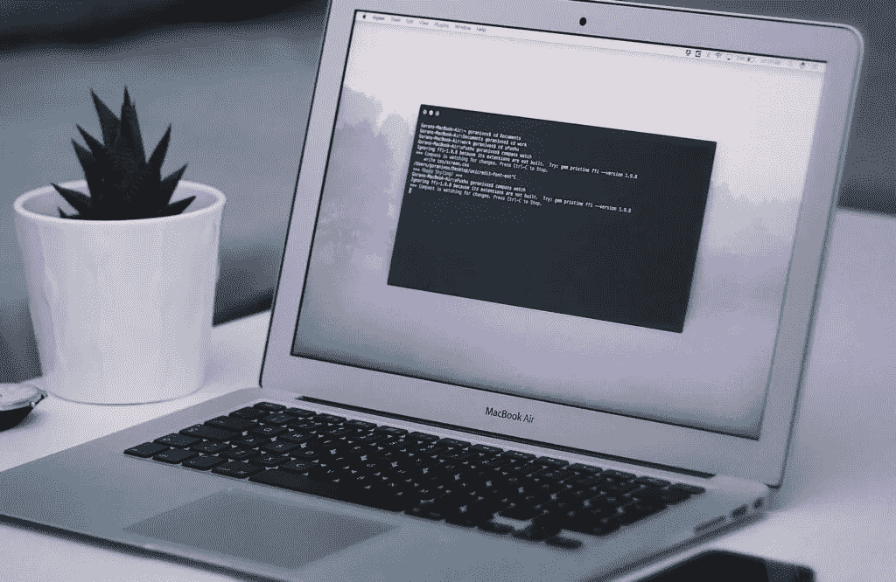
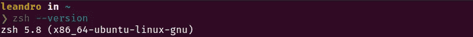

# 如何升级您的终端与哦我的 Zsh 和更多

> 原文：<https://javascript.plainenglish.io/upgrading-your-terminal-with-oh-my-zsh-and-more-fa58d61d21d3?source=collection_archive---------10----------------------->

你知道，在编程中，生产率对任何项目的成功都起着很大的作用。在任何开发者的生态系统中都是终端，任何程序员都希望拥有一个既美观又高效的终端。在这篇文章中，我将帮助你两者兼得，记住这篇教程是基于 Unix 系统(Mac 或 Linux)的。



## 安装 Zsh

Zsh 是一个用于 shell 脚本的命令解释器，其目的是改进和促进工具之间的使用。在它的特性中，突出可以应用到它的界面的定制。访问下面的页面，看看哪种方式适合您的操作系统。

[https://github.com/ohmyzsh/ohmyzsh/wiki/Installing-ZSH](https://github.com/ohmyzsh/ohmyzsh/wiki/Installing-ZSH)

安装 Zsh 后，运行命令 Zsh-version，输出应该如下所示:



## 安装我的天啊

**Oh My Zsh** 有一个用户友好的、开源的、社区驱动的框架来管理 Zsh 配置。要安装 Oh My Zsh，您需要运行以下命令:

```
sh -c "$(curl -fsSL https://raw.githubusercontent.com/robbyrussell/oh-my-zsh/master/tools/install.sh)"
```

现在**你需要做的所有设置**都会在~/里。zshrc 文件，而不再位于~/bash_profile 中。

重新启动您的终端，看到它现在不同于正常。

## 安装德古拉

Dracula 是一个默认的颜色主题，可用于许多开发应用程序，如 VS 代码和各种终端。

要继续安装，请选择适合您的操作系统的版本。

对于使用 Gnome 发行版的 Linux:[https://github.com/dracula/gnome-terminal](https://github.com/dracula/gnome-terminal)

对于带标准终端的 Mac:[https://draculatheme.com/terminal/](https://draculatheme.com/terminal/)

## 安装宇宙飞船

飞船将修改显示在终端上的信息，通过它我们可以看到当前版本的节点、摘要等。

要安装 Spaceship，我们需要克隆 Oh My Zsh themes 文件夹中的存储库。

```
git clone <https://github.com/denysdovhan/spaceship-prompt.git> "$ZSH_CUSTOM/themes/spaceship-prompt"
```

现在我们需要在 Oh My Zsh spa 文件夹中创建一个到飞船主题文件的链接。

```
ln -s "$ZSH_CUSTOM/themes/spaceship-prompt/spaceship.zsh-theme" "$ZSH_CUSTOM/themes/spaceship.zsh-theme"
```

在~/里面。zshrc 文件我们将像这样改变 ZSH 主题变量:

```
ZSH_THEME="spaceship"
```

重启终端，你会得到一个新的更干净的界面。

## 安装宇宙飞船

从现在开始，这只是我使用的偏好，随意修改。

在~/里面。zshrc 文件添加以下设置:

```
SPACESHIP_PROMPT_ORDER=(
  user          # Username section
  dir           # Current directory section
  host          # Hostname section
  git           # Git section (git_branch + git_status)
  hg            # Mercurial section (hg_branch  + hg_status)
  exec_time     # Execution time
  line_sep      # Line break
  vi_mode       # Vi-mode indicator
  jobs          # Background jobs indicator
  exit_code     # Exit code section
  char          # Prompt character
)
SPACESHIP_USER_SHOW=always
SPACESHIP_PROMPT_ADD_NEWLINE=false
SPACESHIP_CHAR_SYMBOL="❯"
SPACESHIP_CHAR_SUFFIX=" "
```

## ZSH 插件

让我们安装 ZInit，这样可以更容易地安装和删除新插件。

```
sh -c "$(curl -fsSL <https://raw.githubusercontent.com/zdharma/zinit/master/doc/install.sh>)"
```

让我们添加以下插件:

*   zsh-users/zsh-completions:为最多样和最常用的工具添加了补充。
*   zdharma/fast-syntax-highlighting:在命令编写中增加语法高亮。
*   zsh-users/zsh-autosuggestions:非常有用，因为它根据您的历史添加了建议的命令。

添加这些插件或者其他你想要的插件。在 ZInit 安装程序块的第###行末尾添加所需的插件，在上面提到的例子下面。

```
zinit light zdharma/fast-syntax-highlighting
zinit light zsh-users/zsh-autosuggestions
zinit light zsh-users/zsh-completions
```

## 结论

现在你有了一个漂亮且非常高效的终端，我希望你喜欢这个内容，并且不要忘记访问[博客](https://www.thexcodes.com)中的其他帖子。

*更多内容看* [***说白了。报名参加我们的***](http://plainenglish.io/) **[***免费周报***](http://newsletter.plainenglish.io/) *。在我们的* [***社区获得独家访问写作机会和建议***](https://discord.gg/GtDtUAvyhW) *。***