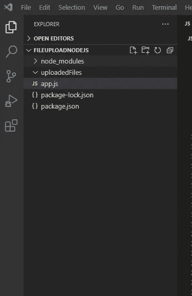
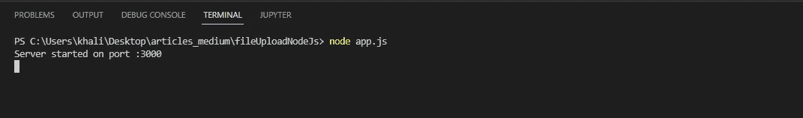
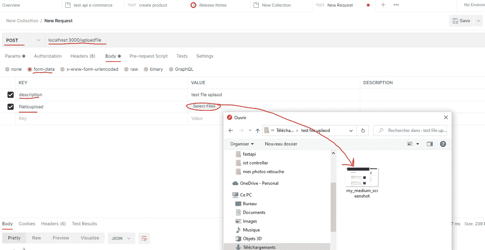
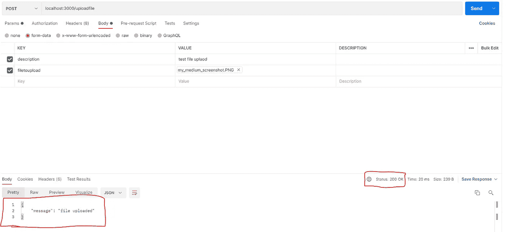
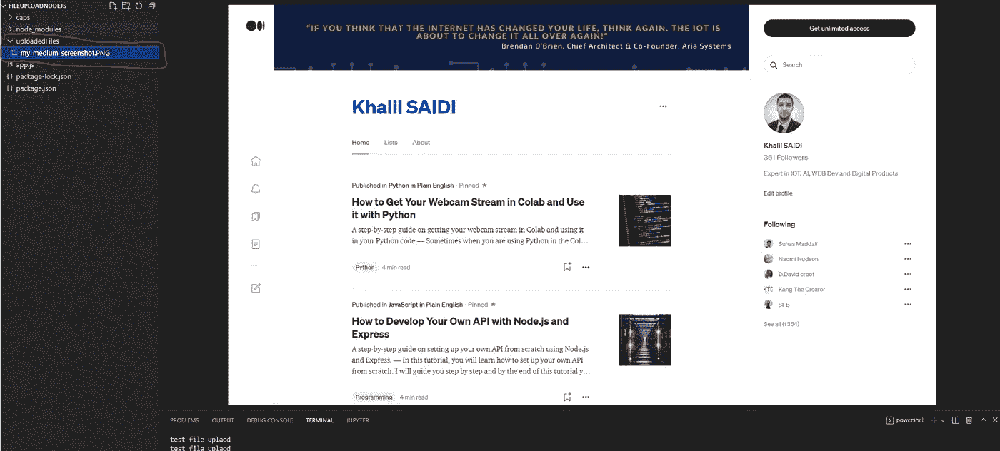

# 使用 Multer 通过 Express API 将文件上传到 Node.js 后端

> 原文：<https://javascript.plainenglish.io/upload-files-to-node-js-back-end-through-an-express-api-using-multer-3d3fc95be9b1?source=collection_archive---------3----------------------->

## 一步一步的建立你自己的 Node.js API 的指南，它允许使用 Express 和 Multer 上传文件到你的后端。

本教程结束时，您将能够在基于 Express 和 Multer 的 Node.js 后端中从头开始设置自己的 API。这个 API 将捕获通过 POST 请求发送的文件，并将它存储在后端服务器上的一个文件夹中。


Photo by [Arnold Francisca](https://unsplash.com/@clark_fransa?utm_source=medium&utm_medium=referral) on [Unsplash](https://unsplash.com?utm_source=medium&utm_medium=referral)

请注意，在本教程中，我们不解释“快速部分”(用于设置 API 及其工作原理)。如果您需要了解更多信息，请访问这个快速简单的教程:

[](/how-to-develop-your-own-api-with-node-js-and-express-25d4000564af) [## 如何用 Node.js 和 Express 开发自己的 API

### 使用 Node.js 和 Express 从头开始设置自己的 API 的分步指南。

javascript.plainenglish.io](/how-to-develop-your-own-api-with-node-js-and-express-25d4000564af) 

# 什么是 API？

API 代表应用程序编程接口。它是 web 应用程序的后端，通常运行在服务器上。API 总是用来为你的前端服务，也可以作为第三方集成的接口。API 由一组服务组成，用于获取数据或将数据推送到后端服务器。

# 你需要什么？

我假设你已经安装了 Node.js(如果没有，请查看上面提到的教程)。

现在，您必须通过以下方式启动节点项目:

```
npm init
```

您需要安装:

*   快速:创建 API
*   Multer:处理文件上传

您可以使用以下命令安装它们:

```
npm install --save express multer
```

但是什么是快递呢？

****Express . js****，或者简称为****Express****，是一个* [*后端*](https://en.wikipedia.org/wiki/Front_end_and_back_end)*[*web 应用框架*](https://en.wikipedia.org/wiki/Web_application_framework) *为*[*node . js*](https://en.wikipedia.org/wiki/Node.js)*，发布为*它是为构建 [*web 应用*](https://en.wikipedia.org/wiki/Web_application) *和*[*API*](https://en.wikipedia.org/wiki/API)*而设计的。*[](https://en.wikipedia.org/wiki/Express.js#cite_note-ExpressJS-3)**它被称为* [*事实上的标准*](https://en.wikipedia.org/wiki/De_facto_standard) *服务器框架为*[*node . js*](https://en.wikipedia.org/wiki/Node.js)*——维基百科****

**穆特呢。**

***“Multer 是处理* `*multipart/form-data*` *的 Node.js 中间件，主要用于上传文件。它写在* [*之上，以获得最大效率。”*](https://github.com/mscdex/busboy)[*https://github.com/expressjs/multer*](https://github.com/expressjs/multer)**

# **编码时间！**

**在下面的示例中，我们将设置一个 API 来捕获 HTTP POST，以便将文件上传到我们在 Node.js 上运行的服务器:**

**服务器将监听端口 3000，当它捕获到“/uploadfile”的 POST 请求时，它将处理它。**

***请注意，您必须创建一个文件夹来存储上传的文件。在本例中，文件夹名为“uploadedFiles”。***

**这是它在您的项目中的外观:**

****

**Project organisation**

*   **note_modules:是包含了这个项目使用和安装的所有节点模块的文件夹。**
*   **uploadedFiles:我们创建的文件夹，我们将在其中存储所有上传到服务器的文件。**
*   **app.js:要在 Node.js 服务器上运行的服务器代码。**
*   **package.json:项目配置和依赖性。**

**现在，如果我们看一下我们的 JavaScript 代码，其中我们用 Express 和 Multer 创建 API 来处理文件上传:**

## **让我们浏览一下代码！**

**在这里，我们导入 Express 和 Multer 模块:**

```
**const express = require('express');const multer = require('multer');**
```

**现在我们将设置 Multer 来使用它。首先，我们需要创建和设置文件存储引擎，我们必须在其中配置文件的存储位置，我们还可以设置上传文件时 Multer 将如何处理 filename:**

*   **在“destination”选项中，我们指定了存储文件夹“uploadedFiles/”。**
*   **在 name 选项中，我们已经指定将使用上传时的原始文件名。**

**请注意，在这两个选项中有一个 cb:它是确定第一个选项的目标路径的回调，是确定第二个选项的上传文件的名称的回调。**

```
**// set up multervar storage = multer.diskStorage({destination: function (req, file, cb) {cb(null, 'uploadedFiles/')},filename: function (req, file, cb) {cb(null, file.originalname)}})**
```

**现在我们可以用上面定义的存储配置实例化 Multer。**

```
**var upload = multer({ storage: storage })**
```

**现在，让我们创建一个快速应用程序来处理 API，然后开始监听:**

```
**// create appport = 3000;const app = express();app.listen(port,()=>{console.log("Server started on port :"+port)});**
```

**最后一步是编写捕捉 POST 请求的应用程序部分，并使用 Multer 处理上传的文件:**

```
**app.post('/uploadfile', upload.single('filetoupload'), 
function (req, res, next) {console.log(req.body.description);res.status(200).send({'message' : "file uploaded"});})**
```

*   **app.post:用于处理 post 请求，并将调用“函数”。**
*   **“/uploadfile”:设置用什么 URL 路径触发请求处理程序。**
*   **upload.single('filetoupload '):这里我们对请求处理程序说，我们将使用 Multer 处理上传的文件。在前端构建和发送请求时，必须使用字段“filetoupload”上传文件。**
*   **console . log(req . body . description):渴望与上传文件一起在 JSON 中发送的描述消息(可选，但可以有所帮助)。**
*   **研究现状(200)。send({ ' message ':" file uploaded " }):我们发送一个状态 200 来表示一切正常，并以 JSON 的形式向前端返回一条消息。**

## **现在我们来测试一下！**

**通过运行`node`命令启动您的应用程序:**

```
**node app.js**
```

**如果应用程序启动，您将看到:**

****

**app started and API running**

**为了测试 API，我们将使用 Postman 工具(开发 API 时真正强大的工具)。**

**查看此处:**

**[](https://www.postman.com/) [## 邮差 API 平台|免费注册

### 超过 2000 万开发者使用 Postman。通过注册或下载桌面应用程序开始。什么是邮递员…

www.postman.com](https://www.postman.com/) 

让我们开始我们的 API 测试:



Test Express API to upload file

结果呢？



API test result

我们得到一个 200 状态码，这意味着一切正常，我们正在接收来自服务器的消息:“文件上传”。

太棒了，不是吗？！

但是等等，文件真的存在服务器里吗？！



uploaded file stored in the server

您可以看到文件已成功存储在服务器上。

# 结论

本教程结束时，您已经学会了如何:

*   安装 Express 和 Multer 模块。
*   配置 Multer 存储引擎和 Multer 实例来处理上传的文件。
*   用 Express 开发一个 POST API 处理程序。
*   在 API 处理程序中集成 Multer 中间件，以处理上传的文件，并将其正确存储在后端服务器上创建的存储文件夹中。

希望对你有帮助！查看我的教程[这里](https://medium.com/@khalilsaidi19)。

**请不要忘记点击** [**按钮跟随**](https://medium.com/@khalilsaidi19) **。**

您可以通过加入 Medium 社区来支持我和其他作者，请点击以下链接:

[](https://medium.com/@khalilsaidi19/membership) [## 通过我的推荐链接加入 Medium-Khalil SAIDI

### 阅读哈利勒·赛迪(以及媒体上成千上万的其他作家)的每一个故事。您的会员费直接支持…

medium.com](https://medium.com/@khalilsaidi19/membership) 

*更多内容看* [***说白了。报名参加我们的***](https://plainenglish.io/) **[***免费周报***](http://newsletter.plainenglish.io/) *。关注我们* [***推特***](https://twitter.com/inPlainEngHQ)**和*[***LinkedIn***](https://www.linkedin.com/company/inplainenglish/)*。查看我们的* [***社区不和谐***](https://discord.gg/GtDtUAvyhW) *加入我们的* [***人才集体***](https://inplainenglish.pallet.com/talent/welcome) *。******