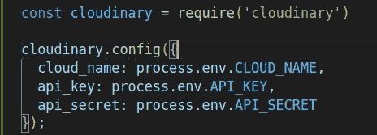

# 如何简单地在 Node.js 中上传图片

> 原文：<https://javascript.plainenglish.io/upload-images-in-nodejs-and-mongodb-2e435ffd960a?source=collection_archive---------0----------------------->

## 为了获得更好的用户体验，学习如何使用 Node.js 和 MongoDB 将图像上传到云中。

# 概述

⭐为图片上传设置了一个 Multer。

⭐上传图片到云端。

⭐把图像和 MongoDB 数据库连接起来。

最近，为了改进我的水果店网站的功能，我决定构建自己的 REST API。

经过很多努力，我能够为网站构建自己的 REST API。在本地，一切都很完美，包括图形和产品数据。然而，当我把我的 API 放到 Heroku 上时，事情开始变糟了。

我的意思是，让我解释一下👇

*   正如您在上面的图片中看到的，当我从服务器获取数据时，它返回了所有产品及其图片链接。
*   然而，当我点击图片链接时，我得到的不是图片，而是一个错误。

正如您在错误消息中看到的，它表示该路线当前不可用。显然，这不是我想要的，所以我试图自己解决它。

最后，经过大量的研究，我想出了一个解决方案，我相信对你也会有用。

这就是你将在本文中学到的关于上传图片到*云*并使用 **Node.js** 和 **MongoDB** 将它们链接到*数据库*的内容。

## 让我们开始吧

作为了解实际工作的一种方式，您的任务是创建一个包含用户姓名、电子邮件和照片的用户配置文件。

## 先决条件

*   用于 API 测试的迅雷客户端或 Postman。
*   代码编辑器。
*   如果您能够理解 starter 文件中的代码，就可以开始了。

## 让我们看看怎么做

*   获取启动文件。

 [## GitHub-fk 00750/上传-图片-云

### 此时您不能执行该操作。您已使用另一个标签页或窗口登录。您已在另一个选项卡中注销，或者…

github.com](https://github.com/fk00750/upload-image-cloud) 

*   打开您的终端并安装所有需要的软件包。

✍️ **注** **—** 该项目遵循 REST API 架构。

*   为了开始，你只需要创建一个环境文件并添加两个变量，MONGO_URI 和端口。
*   将您的 MongoDB 连接字符串粘贴到 MONGO_URI。
*   让我们运行服务器。

理想情况下，您应该会得到类似于上图的结果。

*   现在让我们检查一下 route 文件夹中的一些路线，并对它们进行测试。

*   好了，现在让我们创建用户配置文件。
*   第一步是将 *multer* 导入到多部分数据的主文件中。
*   首先为用户配置文件图像创建存储。

## 密码

## 代码解释

*   首先分配存储用户图像的文件夹。
*   通过将当前日期与一个随机生成的高达十亿的数字和原始文件扩展名连接起来，您可以轻松地创建一个唯一的文件名，如下所示:

"文件名":" 1663478472266–946908179 . jpg "

## 创建多部分数据的处理程序

1.  创建一个函数 **handleMultipartData**
2.  对它使用 multer 方法。
3.  Multer 接受几个选项，但是在您的情况下，您需要传递您之前创建的存储配置和文件限制。
4.  并提供单个(“图像”)

*   在 main.js 路由文件中使用 handleMultipartData

## 完全码

是时候测试你的设置了。

在迅雷客户端中，打开创建用户路径，输入用户名和电子邮件以及配置文件。

*   此外，您将在上传文件夹中找不到任何文件。
*   让我们发送请求，并希望一切顺利。

*   服务器用**用户**和**文件**数据响应。
*   您还可以注意到 uploads 文件夹不再是空的。

*   一切正常。
*   现在你可以上传**用户**的图片到服务器。

## 将图像上传到云

*   让我们进入第二步，将您的映像上传到云中。
*   对于这样的项目，我推荐使用 Cloudinary，这是一个免费的基于云的服务，效果相当好。

 [## 图像和视频上传、存储、优化和 CDN

### 转换图像和视频以加快加载速度而不降低视觉效果，自动生成图像和视频变体…

cloudinary.com](https://cloudinary.com/) 

## 以下是您需要遵循的步骤

*   创建一个云账户。
*   创建帐户后，现在是配置 web 应用程序的时候了。

*   点击配置您的 SDK。
*   选择 Node.js 选项。

*   复制钥匙。
*   转到 **main.js** 文件中的创建用户路径。
*   我强烈建议您将这些键值存储在您的环境文件中。

好吧，让我们写一些代码，然后我们将启动。

## 密码

**代码解释**

1.  如果文件路径未定义，代码将直接返回。
2.  将 filePath 提供给 cloudinary.v2.uploader.upload 方法。

让我们看看您的文件是否已成功上传到云中。

*   太好了，我们有结果了。

*   在上图中，你可以看到你上传的文件链接和用户数据。
*   现在点击图片链接打开图片。

*   太好了，图像已经成功上传到云中。

## 完全码

## 将图像与数据库链接

*   打开 models 文件夹中的 **user.js** 并检查用户模式。

*   如您所见，已经创建了用户模式。欢迎大家根据自己的要求定制。

## 创建用户文档

*   去创建一个新的数据库。
*   在 main.js 文件中导入 user.js 文件。

## 代码解释

1.  第 57 行—解构了 req 中的姓名和电子邮件。身体。
2.  第 61 行—等待并使用 User.create()方法创建用户。
3.  第 62 & 63 行—将名称和电子邮件对象传递给 create 方法。
4.  第 64 行—为 image 选项分配云映像的安全 URL。

⌛把用户数据上传到数据库的时候到了。

*   上面，你可以看到你的云镜像和数据库已经成功链接。
*   你可以通过点击图片链接来验证，它已经可以访问了。
*   你也可以检查你的数据库。

# 结论

有了这个新特性，您可以毫不费力地将图像从您的计算机上传到云中，从而使您的 Node.js 应用程序比以前运行得更快、更高效。

如有任何疑问和建议，请随时通过我的 [**Twitter**](https://twitter.com/Fk00750) ✌联系我🏻

*更多内容看* [***说白了就是***](https://plainenglish.io/) *。报名参加我们的* [***免费周报***](http://newsletter.plainenglish.io/) *。关注我们关于* [***推特***](https://twitter.com/inPlainEngHQ) ， [***领英***](https://www.linkedin.com/company/inplainenglish/) *，*[***YouTube***](https://www.youtube.com/channel/UCtipWUghju290NWcn8jhyAw)*，以及* [***不和***](https://discord.gg/GtDtUAvyhW) *。对增长黑客感兴趣？检查* [***电路***](https://circuit.ooo/) *。*