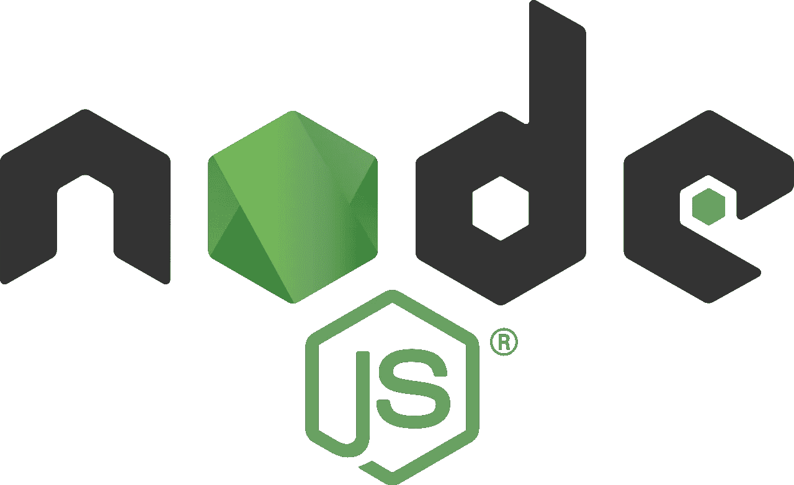
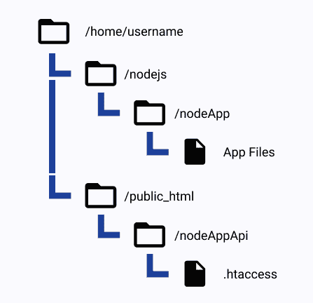
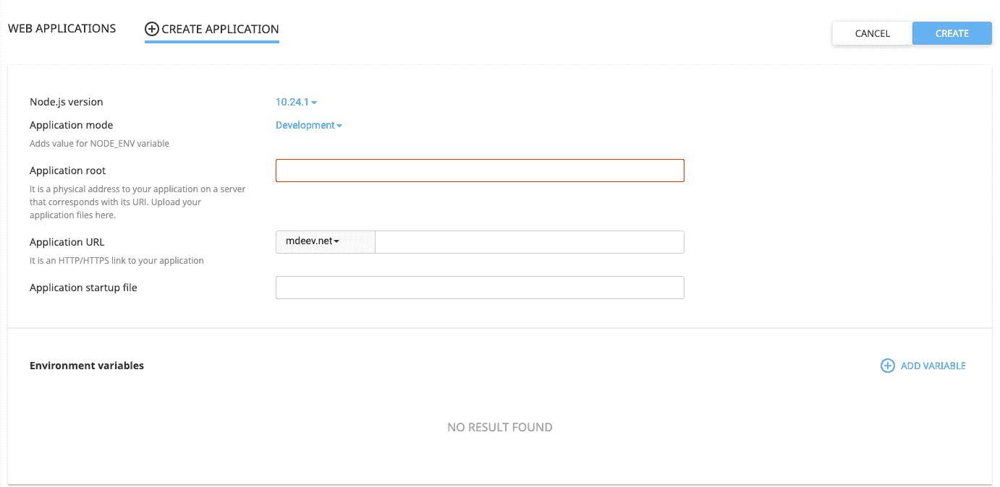
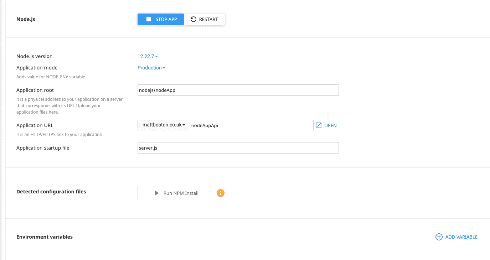

# 如何使用 Namecheap 在 Cpanel 上上传 Node.js App

> 原文：<https://javascript.plainenglish.io/uploading-a-node-js-app-on-cpanel-using-namecheap-4f7347da7e67?source=collection_archive---------4----------------------->



在本文中，我将解释如何使用 Namecheap 将 Node.js 应用程序部署到 Cpanel。本文将介绍如何组织您的应用程序，如何在 Cpanel 中创建 Node.js 应用程序，以及您需要对代码进行的潜在更改。

# 文件结构

为了创建 Node.js 应用程序，您需要将所有代码放到 Cpanel 的文件系统中。创建一个好的文件结构是组织所有应用程序的好方法。

就我个人而言，我创建了一个名为“nodejs”的文件夹，并将我所有的 Node.js 应用程序存储在该文件夹的子文件夹中。对于这个例子，我们将把我们的项目命名为“nodeApp”，在那个文件夹里面将放入所有的源代码(不是 **node_modules** 文件夹，我们将在后面这样做)。下面是这应该是什么样子！



File Structure for node.js apps

正如你在上面看到的，我们在 public_html 目录中还有另一个文件夹。对于本例，我们使用主域文件夹。但是，如果您使用不同的域或子域，请将“nodeAppApi”文件夹放在该域目录中。这将使用该域！我们创建了一个“nodeAppApi”文件夹来存储我们的 htaccess 文件。我们这样做是为了将节点 Api 从 React 应用程序代码中分离出来。

在里面。htaccess 编写以下代码:

```
RewriteEngine off
```

这将阻止 Apache 服务器重写或重定向任何发送到节点应用程序的请求。

太好了！我们已经为节点应用程序设置了文件结构。接下来，我们将通过 Cpanel 创建节点应用程序。

# 在 Cpanel 中创建 Node.js 应用程序

导航到 Cpanel 的“Node.js”部分。您可以通过“主仪表板”>“Setup Node.js App”按钮来完成。按下那个按钮，它会直接把你送到那里。接下来按“创建应用程序”！

下一页看起来会像这样



如您所见，为了创建应用程序，我们需要填写或更改一些内容。下面解释了每个部分的功能！

**Node.js 版本** —设置您的应用程序所需的 Node.js 版本。

**应用模式—** 选择“开发”或“生产”(建议选择“生产”)

**应用程序根** —这是你的应用程序在文件系统中的位置。在本例中是它的“nodejs/nodeApp”

**应用程序 URL** —这是应用程序将使用的域。对于本例，它是“example.com/nodeAppApi ”,这将使用。我们设置的 htaccess。

**应用程序启动文件** —这是您的应用程序的文件名(例如 server.js | app.js | index.js)

填写完所有信息后，请点击“创建”。一旦你这样做了，你会看到类似这样的东西



在底部，你可以看到一个按钮，上面写着“运行 NPM 安装”。按下这个按钮，它将为我们创建 node_modules 文件夹。(要做到这一点，应用程序根目录中需要有一个 package.json。)

在我们完成之前的最后一件事是改变我们的港口。我花了一段时间才弄明白，因为我一直收到 EACCESS 错误，说我没有权限使用这些端口。因此，为了解决这个问题，我们不设置端口，而是使用这个…

process.env.PORT

我们为什么要这样做？这是因为端口处理是由 Apache 服务器在上游处理的。这意味着我们不需要定义端口，它会自动为我们解决这个问题。

# 测试您的应用

恭喜您，您已成功将您的应用上传到实时服务器。然而，为了确保我们的应用程序正常工作，你可以使用 postman 来测试并确保它正在工作。一旦你确定一切正常，你就大功告成了！

希望这对你有帮助！

*更多内容请看*[***plain English . io***](https://plainenglish.io/)*。*

*报名参加我们的* [***免费每周简讯***](http://newsletter.plainenglish.io/) *。关注我们关于* [***推特***](https://twitter.com/inPlainEngHQ)[***LinkedIn***](https://www.linkedin.com/company/inplainenglish/)*[***YouTube***](https://www.youtube.com/channel/UCtipWUghju290NWcn8jhyAw)*[***不和***](https://discord.gg/GtDtUAvyhW) ***。*****

*****对缩放您的软件启动感兴趣*** *？检查* [***电路***](https://circuit.ooo?utm=publication-post-cta) *。***