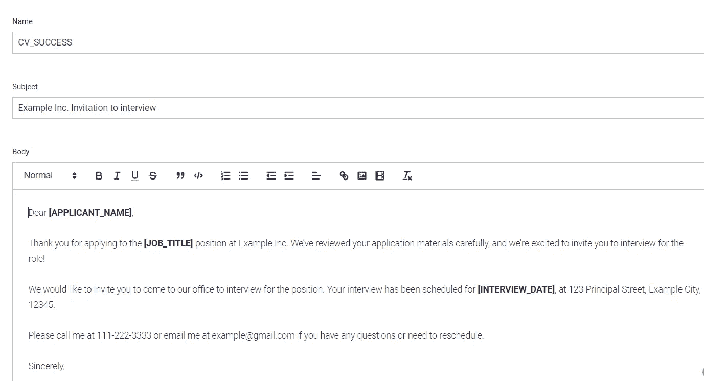

# 使用 AdminJS 快速构建管理 Web 应用程序

> 原文：<https://javascript.plainenglish.io/use-adminjs-to-quickly-build-an-administration-web-app-1a6421fe7864?source=collection_archive---------1----------------------->

## 图书馆能为我们节省时间


Photo by [Arnold Francisca](https://unsplash.com/@clark_fransa?utm_source=medium&utm_medium=referral) on [Unsplash](https://unsplash.com?utm_source=medium&utm_medium=referral)

## 介绍

在 web 项目中，除了前台——用户界面，我们还有后台——管理员界面。这是我们执行 CRUD 操作的地方。这个页面主要由数据表和编辑表单组成，通常由“有经验的用户”使用。此外，项目中分配给它的时间也少于前台页面。因此，一个明显的需要是一个工具，**减少时间和精力**来建立管理页面。

在本文中，我将使用 [AdminJS](https://adminjs.co/) 构建一个管理 web 应用程序。我就拿招聘管理应用来介绍一下图书馆的一些概念。该应用程序具有以下特性:

*   管理未结职位
*   管理电子邮件模板并向候选人发送电子邮件
*   管理候选人和面试

我们将实施一个简单的招聘流程，包括 3 个步骤:检查简历，面试，并提供。它是一个 CRUD+应用程序，90%的特性都是 CRUD。“plus”部分是执行招聘流程逻辑，并向候选人发送电子邮件。到本文结束时，您将理解一些关键概念，并能够使用 AdminJS 来加速您的项目。除了 AdminJS，这个应用程序还使用了 web 开发中的一些流行技术: **Node.js、Express、React、MongoDB。**这里是应用程序的一些页面。我们会在最后得到它们。


List of candidates screen.


Edit candidate screen.


Prepare for interview schedule and email.

你准备好了吗？我们走吧！

## 入门—设置项目

除了上面列出的一些库，我们还有 AdminJS 团队推荐的用于解析传入请求的`express-formidable`。我们还使用`dotenv`来管理环境变量，`nodemailer`来发送电子邮件，`nodemon`来根据变化自动重新加载应用程序。

```
mkdir hiring-adminjscd hiring-adminjsnpm init -ynpm i --save express mongoose adminjs @adminjs/express @adminjs/mongoose express-formidable dotenv nodemailer nodemon
```

说到文件夹架构，[我们就按组件来组织](https://github.com/goldbergyoni/nodebestpractices/blob/master/sections/projectstructre/breakintcomponents.md)。在顶层，我们用 **app.js** 来运行服务器，用 **config.js** 来管理应用程序的配置。

```
hiring-adminjs
-app.js
-config.js
-.env
```

在 **config.js** 文件中，我们读取环境变量和导出，因此项目中的每个文件都可以使用它们。

在 **app.js** 文件中，除了经典的 Express 样板代码之外，我们还需要 AdminJS 相关的库(第 4–7 行)，然后初始化 AdminJS 实例(第 13 行)并将 AdminJS 路由挂载到 Express 应用程序(第 21 行)。

通过键入`nodemon app.js`运行应用程序，然后转到`localhost:8080/admin`，您将看到 AdminJS 的默认屏幕。

**恭喜恭喜**！您只需设置应用程序的主干并运行它。让我们转到下一部分，在那里我们将添加功能。

## 功能 1 —管理未结头寸—管理基础知识

对于实体`Position`，我们需要基本的 CRUD 操作。AdminJS 帮助我们在不到 5 分钟的时间内完成这项工作。

```
mkdir position
touch position/position.model.js
touch position/position.options.js
```

在文件 **position.model.js** 中，我们将实体`Position`的模式定义为普通应用。PositionSchema 只包含`name`字段。例如，我们可以有初级 Web 开发人员、项目经理等…

在文件 **position.options.js** 中，我们为实体`Position`定义了选项，AdminJS 将使用该文件中的选项来渲染界面。在最简单的形式中，选项只有一个字段`resource`,指向我们上面定义的模型。所以我们在界面中看到和操作的数据会来自并保存到相应的集合中。AdminJS 允许我们定制资源，我们会在需要的时候做。目前，下面的代码已经足够了。

在主文件 **app.js** 中，我们需要 **position.options.js** 文件，然后将`PositionResourceOptions`添加到 AdminJS 的资源选项中。

```
....
const { PositionResourceOptions } = require("./position/position.options");
....
const adminJS = new AdminJS({
  databases: [],
  rootPath: '/admin',
  resources: [PositionResourceOptions]
});
...
```

重新加载应用程序并刷新页面，您将在左侧菜单中看到条目`Position`。点击你看到的那一行`Position`列表。目前，它是空的。您可以开始添加新条目，然后查看单个条目，编辑并删除它。


The listing screen has been done by AdminJS.

我们刚刚用几个代码完成了“管理未结头寸”功能！CRUD API 和接口都是 AdminJS 做的。

## 功能 2 —管理并向候选人发送电子邮件—向 AdminJS 添加自定义代码

此功能帮助我们定义一些电子邮件模板，并在以下情况下向候选人发送电子邮件:

*   候选人的简历很好，我们邀请候选人面试。
*   候选人的简历不合适。我们通知候选人。
*   面试进行得很顺利。我们联系候选人进行进一步的交流。
*   面试不好。我们通知候选人。

**管理电子邮件模板**

我们为特征创建文件夹和必要的文件。每个文件的作用都在注释中

```
mkdir email
touch email/email.model.js # The schema of email entity
touch email/email.options.js # Used by AdminJS to render the GUI
touch email/email.sender.js # Reponsible for sending email
touch email/email.route.js # Expose the API to be called by the frontend
```

电子邮件模式将包含模板名称、主题和电子邮件正文。

```
const mongoose = require('mongoose');
const EmailSchema = new mongoose.Schema({
  name: { type: String },
  subject: { type: String },
  body: { type: String },
});
const Email = mongoose.model('Email', EmailSchema);module.exports = {
  EmailSchema,
  Email
}
```

我们对 **email.options.js** 使用了前面特性中的相同代码。唯一的区别是对邮件正文使用类型`richtext`。AdminJS 将对这种类型的字段使用 WYSIWYG 编辑器。

```
const { Email } = require("./email.model");
const EmailResourceOptions = {
  resource: Email,
  options: {
    properties: {
      body: {
       type: "richtext",
      }
    }
  },
}module.exports = {
  EmailResourceOptions
}
```

和上面一样，我们需要将`EmailResourceOptions`添加到 **app.js** 中 AdminJS 的`resources`属性中。重新加载应用程序，您现在可以通过单击左侧菜单中的新条目来查看电子邮件模板列表。在这个屏幕上，您可以创建和编辑我们上面提到的 4 个模板。这是编辑邀请候选人面试的电子邮件模板的屏幕。



Edit email template screen.

**实现 API 发送邮件**

创建完所有模板后，现在我们需要准备发送电子邮件的 API。API 接受 3 个参数:`receivers`、`subject`和`body`，分别用于发送邮件的地址、主题和邮件内容。下面是文件 **email.route.js** 中的代码。

```
const express = require("express");
const router = express.Router();
const sender = require("./email.sender");router.post("/sendEmail", function (req, res, next) { try {
    const sendEmailRequest = {
      receivers: req.body.receivers,
      subject: req.body.subject,
      body: req.body.body,
  } sender.sendEmail(sendEmailRequest);
  res.json({ success: true }); } catch (error) { next(error);
  }
});module.exports = router;
```

在 **email.sender.js** 文件中，我们使用库`nodemailer`。我们需要为传输实例配置主机、端口、地址和用于发送电子邮件的帐户密码。比如 Gmail 账号会使用`smtp.gmail.com`作为主机，端口为`587`。

```
const nodemailer = require("nodemailer");
const config = require("../config");
const transporter = nodemailer.createTransport({
  host: config.SENDER_HOST,
  port: config.SENDER_PORT,
  secure: false, // true for 465, false for other ports
  auth: {
    user: config.SENDER_ADDRESS,
    pass: config.SENDER_PASSWORD
  }
});module.exports = { sendEmail: function (params) {
     let { receivers, subject, body } = params;
     const mailOptions = {
       from:{
        name: config.SENDER_NAME,
        address: config.SENDER_ADDRESS,
       },
       to: receivers,
       subject: subject,
       html: body
     }; transporter.sendMail(mailOptions)
       .then(() => {
          console.log("Email sent");
       })
       .catch(error => {
          console.log(`Error when send email : ${error.message}`);
          throw error;
       });
   },
};
```

最后，在 **app.js** 文件中，我们需要路径并挂载到应用程序。AdminJS 路由和我们的自定义路由在 Express 服务器中共存。如果您熟悉 Express 内置解析器，您可以在 AdminJS 路由之后使用它们，如下所示。如果没有，您可以使用`req.fields`而不是`req.body`来访问数据，如[express-harvardable NPM 页面](https://www.npmjs.com/package/express-formidable)中所述。

```
...
app.use(adminJS.options.rootPath, adminJSRouter);// custom route
const emailRoute = require("./email/email.route");
app.use(express.json()); // after mounting adminJS route to avoid conflictapp.use("/emails", emailRoute);// error handler
app.use(function (err, req, res, next) { console.error(err.stack);
   res.status(500).json({ success: false, message: "INTERNAL_ERROR" });});
app.listen(8080, () => console.log('AdminJS is under localhost:8080/admin'));
```

您现在可以重新加载应用程序，并通过 Postman 测试 API。确保所有的邮件都正常。它们将在下一个功能中使用。

## 功能 3 —管理候选人和面试—在 AdminJS 中自定义资源和操作

**CRUD 操作—定制资源**

至此，我们已经定义了职位和电子邮件实体。它们是主要候选实体的卫星。为了简洁起见，我不会张贴重复的代码，因为您已经熟悉它了。

在候选图式中，我们有`name`、`email`、`phoneNumber`、`position,`、`note`。`position`字段指向位置集合。

关于选项，我们可以自定义资源，以拥有友好的界面。

*   将`isVisible`字段设置为 false，隐藏所有屏幕中的字段。比如我不想看到 field _id，因为它没有意义，占用空间很大。

```
options: {
  properties: {
   _id: {
      isVisible: false
   },
   ....
}
```

*   对于候选人，电子邮件是必需的，并且必须是有效的。为此，我们可以使用 props，就像我们将属性传递给 HTML 输入字段一样。

```
options: {
  properties: {
   ...
   email: {
      props: {required: true, type : "email"}
   },
   ....
}
```

*   字段`currentStage`定义了候选人在招聘流程中的位置。如上所述，我们的流程有 3 个阶段:检查简历、面试和录用。该字段有预定义值，可使用`availableValues`列出。

```
options: {
  properties: {
   ...
   currentStage: {
       availableValues: [
       { value: "CHECK_CV", label: "Application" },
       { value: "CV_REJECTED", label: "CV Rejected" },
       { value: "INTERVIEW", label: "Interview" },
       { value: "INTERVIEW_REJECTED", label: "Interview Rejected" },
       { value: "OFFER", label: "Offer" },
       { value: "HIRED", label: "Hired" },
   ]
},
   ....
}
```

正如您所猜测的，AdminJS 将使用一个选择输入来呈现这个字段。这比默认输入文本更方便。显示`label`,同时将`value`保存到数据库中。

*   对于引用字段，我们需要告诉 AdminJS 它指向哪个集合。

```
options: {
  properties: {
   ...
   position: {
      reference: "Position"
   },
   ....
}
```

AdminJS 将使用选择输入来呈现该字段。我们定义的所有位置都会列出来。这有助于我们避免人为错误。

您可以在[文档页面](https://docs.adminjs.co/tutorial-customizing-resources.html)上看到更多选项，并根据您的需求进一步定制资源。

**管理面试**

在实施招聘流程之前，我们需要创建实体面试。如果候选人有适合这个职位的简历，我们会安排一次面试。

在面试模式中，我们有两个字段:`candidateId`指向候选人集合，还有`date`。因为`candidateId`是一个参考字段，不要忘记在选项文件中定制这个字段。

向文件 **app.js** 中的 AdminJS 选项添加 2 个新资源。我们在界面上有了新的屏幕。

深呼吸，我们继续这个功能的第二部分——实施招聘流程。

**实施招聘流程—定制行动**

AdminJS 有 7 个预定义的动作:列表、搜索、新建、显示、编辑、删除和批量删除。对于候选人，我们将添加 4 个操作:拒绝简历、通过面试、面试后拒绝和面试后接受。以下是“通过面试”操作的说明。

**动作**:通过面试

**当**时:如果`currentStage`是 CV_CHECKING

**行为**:

*   将显示一个新屏幕，允许用户选择面试日期。
*   确认后，`currentStage`变为面试。相应的电子邮件会在选定的日期发送到候选人的地址。

为了定义资源的一个动作，我们添加动作名作为`actions`属性的一个键。该操作具有一些属性:

*   **动作类型**:可以是`resource`、`record`或`bulk`类型。这是行动的目标。根据该值，操作将分别触及整个集合、单个记录或一些记录。
*   **isVisible** :可以是布尔值，也可以是返回布尔值的函数。我们可以用它来指定动作可能发生的条件。
*   **处理器**:为 React 组件准备数据的函数。从这个函数返回的数据可以从组件的 props 中访问。
*   **组件**:指向 React 文件渲染界面。

对于“通过面试”活动，根据上述说明，我们有:

```
const isCheckingCV = ({ record }) => {
  return record.params.currentStage === "CHECK_CV";
}const cvResponseHandler = (request, response, context) => {
   const candidate = context.record;
   return {
     record: candidate.toJSON(),
   }
};.....options: {
  properties: {
   ....
  },
  actions: {
    PassToInterview: {
      actionType: 'record',
      isVisible: isCheckingCV,
      handler: cvResponseHandler,
      component: AdminJS.bundle('../public/pages/cv-response'),
    },
}
```

因为“通过面试”和“拒绝简历”的动作非常接近。我们对他们使用相同的文件。在该文件中，我们将获得当前动作并相应地显示元素。我们需要创建一个文件夹来存储 React 文件。

```
mkdir -p public/pages
touch public/pages/cv-response.jsx
```

在 **cv-response.jsx** 文件中，我们必须:

*   从 props 获取候选人数据
*   加载正确的电子邮件内容，并根据操作显示元素。如果简历通过，我们需要一个字段来选择面试日期。

下面是 **cv-response.jsx** 文件的概要:

```
import ...const CVResponse = (props) => {
  const isCVAccepted = props.action.name === "PassToInterview"; const candidate = props.record.params;

  const [subject, setSubject] = useState("");
  const [body, setBody] = useState("");
  const [date, setDate] = useState(new Date()); // based on isCVAccepted value, get the right email content
  function getEmailContent() {}// utility functions
  async function sendRequestCreateInterview() {}
  async function sendRequestUpdateCandidate({ stage }) {}
  async function sendRequestSendEmail() {}
  function displayMessage() {} useEffect(() => getEmailContent(), []); async function createInterview() {
     try {
        sendRequestCreateInterview();
        await sendRequestUpdateCandidate({ stage: "INTERVIEW" });
        await sendRequestSendEmail();
        displayMessage("success");
     } catch (error) {
        displayMessage("error");
     }
  } async function rejectCandidate() {
     try {
        await sendRequestUpdateCandidate({ stage: "CV_REJECTED" });
        await sendRequestSendEmail();
        displayMessage("success");
     } catch (error) {
        displayMessage("error");
     }
  }return (
      <div>
          {/* Display candidate info */}
          {/* If isCVAccepted, display the datepicker to select     interview date */}
          {/* Display email content, placeholders are filled by candidate information */}
          {/* The button to confirm action  */}
          {/* Other elements: message to display when action has  been done successfully or there is an error */}
      </div>
  );
}
export default CVResponse;
```

重新加载应用程序，并选择一个`currentStage`为 CHECKING_CV 的候选人，您将在右上角看到新的操作显示。点击按钮，显示页面`cv-response.jsx`。

其他两个动作:拒绝和面试后接受遵循相同的逻辑。您需要更改到`isVisible`条件，并为它们创建一个新的 React 文件。

至此，您已经完成了招聘流程！虽然有很多我们可以改进的地方，但我的教程在技术上已经完成了。您可以使用上面的概念进一步定制和开发应用程序。完整代码可以参考我的 Github 页面[这里](https://github.com/ddkhoa/hiring-adminjs)。

## 我对管理的思考

*   这个库确实**在构建后台页面方面节省了很多时间&精力**。一些必须做的工作已经为我们做了:基本的 CRUD APIs，数据表，过滤器，编辑表单…
*   如果我们将其与[市场](https://themeforest.net/category/site-templates/admin-templates)中的一些管理模板进行比较，我们会发现:
    +它是免费的！
    +它不仅提供了 UI 系统，还提供了后端部分。构建定制页面时，UI 系统帮了我很大的忙。它很容易学习和使用。
    ——尽管如此，AdminJS UI 系统并不像模板那样丰富。例如，我必须定制消息组件，而不是使用我在使用模板时熟悉的 Toastr。这是可以理解的，因为这个库不仅仅关注 UI 端。但我觉得如果团队能增加更多 UI 组件就更好了。
*   整合很顺利。AdminJS 代码可以与我们的代码共存。这使得无限的定制能力成为可能。
*   第一次处理资源选项，对我来说还是挺迷茫的。它们用于定义页面的外观，但位于“后端”部分。感觉后端和前端混在一起了。如果我想改变 UI 中的图标，我需要重启服务器。每次重启服务器时，应用程序都需要重新绑定代码。这需要一些时间。

## 包裹

在本文中，我通过一个简单而现实的应用程序介绍了 AdminJS 库的一些基本概念。我还提到了一些优点和 AdminJS 可以改进的地方。我希望你能有一个额外的选择来加快你未来的项目。作为一名对管理仪表板感兴趣的开发人员，我要感谢 AdminJS 团队提供了一个很棒的库。我希望他们将来会增加更多很酷的功能。

感谢您阅读我的文章。我写关于软件工程的文章，包括附带项目、专业经验等等…目标是通过分享我所学到的东西来帮助其他开发人员。在这个列表中，你可以阅读我的其他故事:

[https://medium . com/@ DDK Hoa . blogging/list/growth-as-a-a-developer-68 c8 ff 278615](https://medium.com/@ddkhoa.blogging/list/growth-as-a-developer-68c8ff278615)

*更多内容请看*[***plain English . io***](http://plainenglish.io/)*。报名参加我们的* [***免费周报***](http://newsletter.plainenglish.io/) *。在我们的* [***社区***](https://discord.gg/GtDtUAvyhW) *获得独家获得写作机会和建议。*