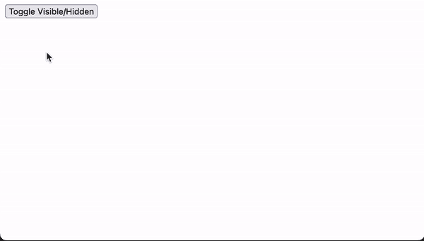

# 使用有角度的动画来创造令人惊叹的东西

> 原文：<https://javascript.plainenglish.io/use-angular-animations-to-create-awesome-stuff-12c11c8eb75?source=collection_archive---------5----------------------->

角度动画的简单指南


Photo by [Hans-Jurgen Mager](https://unsplash.com/@hansjurgen007?utm_source=medium&utm_medium=referral) on [Unsplash](https://unsplash.com?utm_source=medium&utm_medium=referral)

在在线应用领域，动画给消费者带来了运动的感觉。在幕后，动画只不过是 HTML 组件从初始状态过渡到最终状态时所经历的风格调整。

自从互联网出现以来，动画已经成为 web 应用程序中的一个常见功能。然而，在当今创建 web 应用程序时，动画是一个至关重要的组成部分，web 应用程序是人们日常生活中的主要信息来源和工具。

虽然正确定位和定时的动画可以改善我们的在线应用程序的外观并使其现代化，但它们的存在并不纯粹是美观的。人们可以意识到运动。用户可以被动画吸引，这有助于我们将他们的注意力吸引到我们希望通过我们的应用传达给他们的关键点上。当用户体验动画时，他们会更加投入到我们的软件中，因为它给了他们一种愉快、流畅的感觉，并对他们的活动提供了反馈。旋转加载器是一个简单的例子，而访问者滚动页面时的淡入效果是一个更复杂的例子。总之，动画可以改善我们程序的整体用户体验。

另一方面，使用过多的动画可能会导致消费者停止使用你的应用程序。动画不应该时间不正确或者非常复杂。更重要的是，它们不应该让你的用户感到厌烦或者关掉它们。因此，在必要的时候为你的应用进行用户界面/UX 研究是一个很好的主意。

## 角度动画

Angular 框架有一个基于 CSS 功能的模块，叫做 Angular Animations ( `@angular/animations`)。这意味着 CSS 动画中可用的所有功能(如变换、缩放和颜色)在此模块中同样可用。

不过，在角度动画的帮助下，用户可以更好地管理或安排动画。这个模块允许我们将元素的动画序列定义为一系列随时间发生的变化。顺序和并行动画都是可能的。就速度而言，角度动画的表现类似于 CSS 动画。此外，我们可以轻松地生成带有角度动画的动画，而无需安装外部或第三方依赖项。

这些只是众多解释中的一部分，解释了为什么我们认为 Angular Animations 是一个优秀的模块，可以开始在您的在线应用程序中包含动画。

## 设置

我们需要做一些动作来设置角度动画，然后才能使用它们。

首先，我们必须确认`@angular/animations`包已经安装并列在`package.json`文件的`dependencies`部分。尽管在使用 CLI 构建项目时应该默认设置这个包。

其次，我们必须通过从`@angular/platform-browser/animations`导入来将`BrowserAnimationsModule`包含在根模块文件的导入数组中。看看下面的例子。

```
import { NgModule } from '@angular/core';
import { BrowserModule } from '@angular/platform-browser';
import { BrowserAnimationsModule } from '@angular/platform-browser/animations';

import { AppRoutingModule } from './app-routing.module';
import { AppComponent } from './app.component';

@NgModule({
    declarations: [AppComponent],
    imports: [BrowserModule, AppRoutingModule, BrowserAnimationsModule],
    providers: [],
    bootstrap: [AppComponent],
})

export class AppModule {}
```

第三，如果我们想要给一个特定的组件动画，我们必须把想要的动画函数导入到组件的文件中。这些方法来自`@angular/animations`模块。看看下面的例子。

```
import { Component } from '@angular/core';
import { 
    trigger,
    transition,
    animate,
    style,
    state,
    //...
} from '@angular/animations';
```

最后，我们必须将元数据属性`animations: []`包含在同一个组件文件的`@Component()`装饰器中。动画触发器由该属性中数组的每个元素表示。看看下面的例子。

```
@Component({
    selector: 'app-root',
    templateUrl: './app.component.html',
    styleUrls: ['./app.component.scss'],
    animations: [
        // write animation trigger here
    ],
})
```

我们现在准备开始制作动画！

现在让我们创建一个简单的动画。

## 状态和风格

使用角度动画的`state()`功能提供一个动画状态。这个函数有两个参数。州名是第一个。Angular 有三种选择可供我们使用:

*   状态:当元素还不是 DOM 的一部分或者正被从 DOM 中删除时，它就处于这种状态。
*   `wildcard (*)`状态:该元素默认处于此状态。该状态还包括定义转换时的任何状态。
*   自定义状态:我们在代码中定义的任何自定义名称都可以是这个状态。

第二种是`style()`方法。为了选择一组 CSS 样式来搭配州名，我们使用了`style()`函数。

在本教程中，我们将创建一个`snackbar`组件来展示如何使用角度动画来创建一个基本动画。点击按钮时，此`snackbar`会出现淡入和展开动画。再次单击该按钮时，它会消失，并显示淡出和缩小的动画。

我们将制作上述动画所需的状态称为`visible`和`hidden`。我们还将要求第三个，`void`州。这是因为当页面完成加载时，`snackbar`组件会遇到这样的情况:它已经形成但还不是 DOM 的一部分，或者当它从 DOM 中退出时。

为了使`snackbar`在`visible`状态不透明，我们将使用 CSS 函数`scale(1)`和`translate(-50%, 0%)`。而`translate`的作用是让`snackbar`出现在屏幕的底部中间，不会影响动画，`scale(1)`在`snackbar`打开时会产生一个扩大的效果。请参见下面的示例代码。

```
state(
   'visible',
  style({
    transform: 'translate(-50%, 0%) scale(1)'
    opacity: 1
  })
)
```

由于`hidden`和`void`状态的样式是相同的，所以单个`state()`函数可以处理这两种状态。在这些条件下，我们希望`snackbar`有`0`的不透明度，并用`scale(0.8)`和`translate(-50%, 0%)`进行变换。`scale(0.8)`用于在`snackbar`关闭时产生收缩效果，而`translate`功能与`visible`状态的原因相同。请参见下面的代码片段。

```
state(
   'void hidden',
  style({
    transform: 'translate(-50%, 0%) scale(0.8)'
    opacity: 0
  })
)
```

## 过渡和动画

现在我们有了我们的状态，我们需要指定它们是如何随时间变化的，以便“动画”可以发生。我们为此使用了带两个参数的`transition()`函数。

第一个是表示两个状态如何连接的表达式。这个表达式的语法可能是这样的:`someState => anotherState`。根据该图，当绑定元素的状态从`someState`切换到`anotherState`时，过渡动画将开始。请记住，连接状态需要`=>`操作符。

函数`animate()`是第二个参数，它是将在过渡期间使用的动画函数。此功能接受`timings`和`styles`输入。有几种方法可以定义`timings`参数，但是在本演示中，我们将使用字符串格式的`ms`单元。如果我们希望在转换过程中改变样式，我们可以用 CSS 填充`styles`参数。

在这个演示中，我们将创建两个转换函数。从任何状态到`visible`状态的转换是第一种。为了使这个演示的动画更加明显，我们希望过渡发生在`500ms`中。请参见下面的示例代码。

```
transition('* => visible', animate('500ms'))
```

第二个转变是在任何状态和`hidden`状态之间，以及在任何状态和`void`状态之间。我们可以将这两个条件合并成一个单一的`transition()`函数，因为我们希望为这两个场景创建相同的转换。这种转变应该发生在`250ms`中。请参见下面的示例代码。

```
transition('* => void, * => hidden', animate('250ms'))
```

## 触发动画

我们动画开始的触发器是我们有了状态和转换后需要的下一个项目。为此，我们采用双参数`trigger()`方法。触发器的名称是第一个参数，我们将使用它将触发器与 HTML 模板文件中的触发元素关联起来。而第二个参数将上述状态和转换编译成一个数组。

在这个演示中，我们将触发器称为`visibleHidden`。完整的代码如下所示。

```
@Component({
  selector: 'app-snackbar',
  animations: [
    trigger('visibleHidden', [
      state(
        ‘visible’,
        style({
          transform: 'translate(-50%, 0%) scale(1)',
          Opacity: 1,
        })
      ),
      state(
        'void, hidden’,
        style({
          transform: 'translate(-50%, 0%) scale(0.8)',
          opacity: 0,
        })
      )
      transition('* => visible', animate('500ms')),
      transition('* => void, * => hidden', animate('250ms')),
    ]),
  ],
  templateUrl: 'snackbar.component.html',
  styleUrls: ['snackbar.component.scss']
})
export class SnackbarComponent {
  isVisible = false;

  toggle() {
    this.isVisible = !this.isVisible;
  }
}
```

我们之前定义的触发器现在必须连接到一个在`visible`和`hidden`状态之间交替的变量。然后，我们必须通过将`@`符号放在 div 前面的方括号中，将触发器绑定到`snackbar`元素的`div`。查看下面的模板文档。

```
<nav>
  <button type="button" (click)="toggle()">Toggle Visible/Hidden</button>
</nav>

<div *ngIf="isVisible" [@visibleHidden]="isVisible ? 'visible’ : 'hidden'" class="app-snackbar">
  {{'This is an animation demo'}}
</div>
```

我们动画的设置和制作终于完成了！我们准备在演示区进行测试。

## 最终输出



Output

正如在上面的视频中看到的，当我们第一次点击切换按钮时，snackbar 出现在屏幕的底部中间，有淡入和扩大的效果。从`*`状态到`visible`状态的变化在此是明显的。我们在`visible`状态下指定的样式在这个过渡过程中被应用，导致 snackbar 的不透明度逐渐上升到 1，并放大到其大小的 100%。

当我们再次单击该按钮时，snackbar 会淡出并缩小。从`*`状态到`void, hidden`状态的变化产生了这种情况。我们为`void, hidden`状态指定的样式，逐渐将不透明度减少到 0，并将元素缩小到原始大小的 80%，在整个转换过程中生效。

这些动画序列是我们放在每个转换函数的`animate`函数上的值的结果，分别出现在`500ms`和`250ms`中的`visible`和`hidden`状态。此外，在演示条件之外，这些`animate`设置应该减少，以便消费者可以体验更加平滑和流畅的运动。

## 结论

添加动画是提高 web 应用程序美感的极好方法，尽管它通常被认为是 web 应用程序开发的高级主题。此外，动画可以从整体上增强应用程序的用户体验，这是当今人们使用在线应用程序进行日常任务和活动的一个重要因素。

向 web 应用程序添加动画时，一个很好的起点是角度动画(`@angular/animations`)。如果您使用 CLI 生成此模块，它已经是您的 Angular 项目的一部分。虽然这个模块制作的动画是基于 CSS 的，但是它给了我们一个更好的管理和组织它们的方法。

在本教程中，我们使用角度动画在`snackbar`组件上有效地创建了一个简单的淡入和淡出动画。然而，这里给出的例子仅仅触及了角度动画的皮毛。它当然能够制作出比这里展示的更复杂、更流畅、更美丽的动画；还有许多方法和功能尚未涉及。

```
Want to Connect?

Connect with me on [LinkedIn](https://www.linkedin.com/in/gouravkajal/).
```

感谢阅读！

## 你是否希望为你的软件创业增加知名度？检查[电路](https://circuit.ooo/?utm=publication-post-cta)。

我们提供免费的专家建议和定制解决方案，帮助您建立对您的技术产品或服务的认知和采用。

## 更多内容请访问 [PlainEnglish.io](https://plainenglish.io/) 。

报名参加我们的 [**免费周报**](http://newsletter.plainenglish.io/) 。关注我们 [**推特**](https://twitter.com/inPlainEngHQ) ，[**LinkedIn**](https://www.linkedin.com/company/inplainenglish/)**，**[**YouTube**](https://www.youtube.com/channel/UCtipWUghju290NWcn8jhyAw)**，以及** [**不和**](https://discord.gg/GtDtUAvyhW) **。**