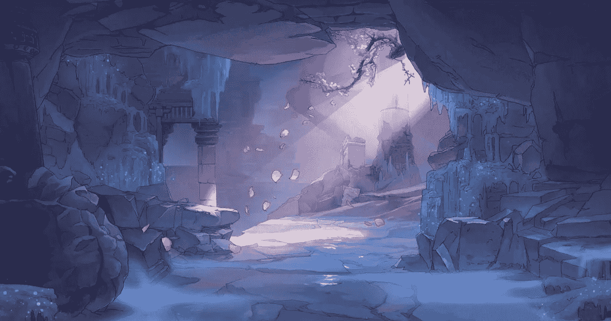
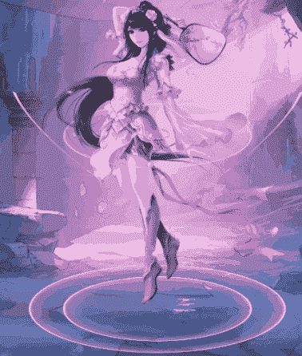
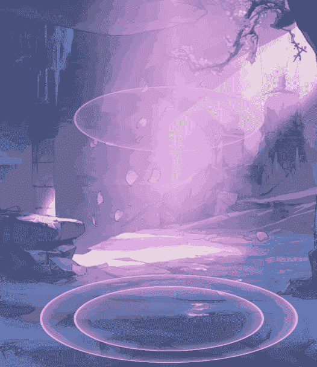
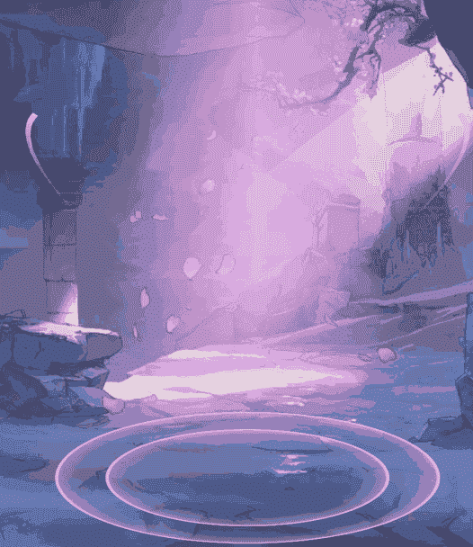

# 用 CSS 实现一个漂亮的 Lol 回忆特效

> 原文：<https://javascript.plainenglish.io/use-css-to-achieve-a-beautiful-lol-back-to-the-city-special-effect-2c90518ecb53?source=collection_archive---------6----------------------->



作为一个老 LOL 游戏玩家，一直想实现一个回忆的特效，但是水平有限，就简单实现了一下，哈哈哈。



# 密码

这里我们指的是游戏默认的回忆效果，两个嵌套的圆环，外加一点内影。

```
// html
<div id="bottom-wrap">
  <div class="bottom-item">
  </div>
</div>

// css
#bottom-wrap {
  position: absolute;
  width: 600px;
  height: 600px;
  left: 50%;
  margin-left: -300px;
  bottom: -300px;
  border-radius: 50%;
  transform-style: preserve-3d;
  box-sizing: border-box;
  transform: rotateX(90deg);
  border: 5px solid #ffb9ff;
  box-shadow: 0 0 50px 2px rgb(255 155 238 / 80%) inset;
}
.bottom-item {
  border: 5px solid #ffb9ff;
  box-shadow: 0 0 50px 2px rgb(255 155 238 / 80%) inset;
  width: 75%;
  height: 75%;
  box-sizing: border-box;
  border-radius: 50%;
  left: 50%;
  top: 50%;
  position: absolute;
  transform: translate(-50%, -50%);
}
```

接下来我们再加一个回城的光束，这样就不会让画面看起来那么单调了。我们直接把这个加到底盘上，用定位把它立起来，加个渐变，透明之类的。

```
<div id="bottom-wrap">
  <div class="bottom-item">
      <div class="bottom-content">
      </div>
  </div>
</div>

.bottom-content {
  position: absolute;
  width: 100%;
  height: 4500px;
  opacity: .7;
  background-image: linear-gradient(to right, transparent, rgb(255 151 247 / 60%) ,rgb(253 192 255), rgb(255 151 247 / 60%) 80%, transparent);
  mask-image: linear-gradient(to bottom, transparent -10%,#fff 20%, #fff 80%, transparent);
  -webkit-mask-image: linear-gradient(to bottom, transparent -10%,#fff 20%, #fff 80%, transparent);
  bottom: 50%;
}
```

那么我们再多加一点动态效果，给一个向上运动的圆环，我们可以直接复制内圈，然后给一个连续向上运动的动画

```
// html
<div id="bottom-wrap">
  <div class="bottom-item">
    <div class="bottom-content">
    </div>
  </div>
  <div class="bottom-item copy"></div>
</div>

// css
.bottom-item.copy {
  animation: moveTop .5s linear infinite;
}

@keyframes moveTop {
  from{
    opacity: 1;
    transform: translate(-50%, -50%) translateZ(0);
  } to{
    opacity: 0;
    transform: translate(-50%, -50%) translateZ(1200px);
  }
}
```



我们继续使用旋转光束效应。

```
// html
<div class="light-wrap one">
  <div class="light-item one"></div>
</div>
<div class="light-wrap two">
  <div class="light-item two"></div>
</div>
// css
.light-wrap {
  position: absolute;
  width: 800px;
  height: 800px;
  left: 50%;
  bottom: -400px;
  margin-left: -400px;
  transform-style: preserve-3d;
  transform: rotateX(0deg) rotateZ(30deg);
  margin-bottom: 375px;
}
.light-wrap.one {
  transform: rotateX(0deg) rotateZ(150deg);
}
.light-item {
  width: 800px;
  height: 800px;
  border-radius: 50%;
  box-sizing: border-box;
  border: 10px solid #ffb9ff;
  /* box-shadow: 0 0 3px 1px rgb(255 246 82) inset; */
  mask-image: linear-gradient(to top, transparent 25%, #000 75%);
  -webkit-mask-image: linear-gradient(to top, transparent 25%, #000 75%);
  clip-path:polygon(0% 25%, 50% 50%, 0% 75%);
  -webkit-clip-path:polygon(0% 25%, 50% 50%, 0% 75%);
}
.light-item.one {
  animation: rotate-light 3s linear infinite;
}
.light-item.two {
  /* margin-bottom: 450px; */
  animation: rotate-light 3s linear infinite;
}
@keyframes rotate-light {
  from{
    transform: rotateY(360deg) rotateX(90deg);
  } to{
    transform: rotateY(0deg) rotateX(90deg);
  }
}
```



我们给它加一点花瓣效果吧。

因为这里我们需要让花瓣斜向下飘，来营造一种风的感觉，所以一定不能是直上直下的，所以给它一点倾斜的角度`transform: rotateZ(30deg)`，当它飘起来的时候，一定不仅在水平方向它会倾斜，而且它自己也会旋转。这里我们给它一个旋转动画。注意我们需要添加`transform-style: preserve-3d;`来管理 3D 透视图，效果如下。


你有那种感觉吗？当然，我不会画立体的花瓣，所以看起来像是最后一张纸，但如果你不注意，你就能看到。之后，我们将使用 js 生成花瓣。关于我在下面的 js 代码中写了所有生成 petals 的细节，并做了详细的注释。

```
.flower-item {
  position: absolute;
  width: 15px;
  height: 20px;
  background-image: radial-gradient(#fdedff 40%, #ffb9ff);
  box-shadow: 0 5px 10px 2px rgba(255, 255, 255, .8);
  border-radius: 80% 80% 100% 100%;
  transform-style: preserve-3d;
  transform: rotateZ(30deg);
  animation: rotate-flower 5s linear infinite;
}
@keyframes rotate-flower {
  from{
    transform: rotateZ(30deg) rotateY(0deg);
  } to{
    transform: rotateZ(30deg) rotateY(360deg);
  }
}
```

```
let lastflowerTime = 0, 
flowerFrequency = 2,
screenWidth = document.documentElement.clientWidth,
screenHeight = document.documentElement.clientHeight,
flowerAngle = 60,
flowerSpeed = 3,
createflowerInterval = null
function flowerStart () {
  console.log(444);
  let now = new Date().getTime()
  if (now - lastflowerTime > (1000 / flowerFrequency)) {
    let flowerItem = document.createElement('div')
    flowerItem.className = 'flower-item'
    flowerItem.style.top = -flowerItem.offsetWidth + 'px'
    let _left = (screenWidth + Math.tan(flowerAngle * Math.PI / 180) * screenHeight) * Math.random()
    flowerItem.style.left = _left + 'px'
    // flowerItem.style.opacity = Math.random()
    document.body.appendChild(flowerItem)
    flowerItem.flowerScale = Math.random() * 0.5 + 0.5
    flowerItem.style.width = flowerItem.offsetWidth * flowerItem.flowerScale + 'px'
    flowerItem.style.height = flowerItem.offsetHeight * flowerItem.flowerScale + 'px'
    let flowerMove = () => {
      let moveY = flowerSpeed * flowerItem.flowerScale
      flowerItem.style.top = flowerItem.offsetTop + moveY + 'px'

      let moveX = Math.tan(flowerAngle * Math.PI / 180) * moveY
      flowerItem.style.left = flowerItem.offsetLeft - moveX + 'px'

      if (flowerAngle > 0) {
        if (flowerItem.offsetLeft < (-flowerItem.offsetWidth)) {
          document.body.removeChild(flowerItem)
          return
        }
      }
      if (flowerItem.offsetTop > screenHeight) {
        document.body.removeChild(flowerItem)
      } else {
        requestAnimationFrame(flowerMove)
      }
    }
    flowerMove()
    lastflowerTime = now
  }
  createflowerInterval = requestAnimationFrame(flowerStart)
}
flowerStart()
```

# 最后

**感谢阅读**。期待您的关注，阅读更多高质量的文章。


[omgzui](https://medium.com/@omgzui?source=post_page-----2c90518ecb53--------------------------------)

## 更好的编程

[View list](https://medium.com/@omgzui/list/better-programing-9b4c9bb174aa?source=post_page-----2c90518ecb53--------------------------------)109 stories

[omgzui](https://medium.com/@omgzui?source=post_page-----2c90518ecb53--------------------------------)

## Java Script 语言

[View list](https://medium.com/@omgzui/list/javascript-48bfc7b5f93c?source=post_page-----2c90518ecb53--------------------------------)57 stories

[omgzui](https://medium.com/@omgzui?source=post_page-----2c90518ecb53--------------------------------)

## 新闻

[View list](https://medium.com/@omgzui/list/news-67ec0a972660?source=post_page-----2c90518ecb53--------------------------------)23 stories

*更多内容请看*[***plain English . io***](https://plainenglish.io/)*。报名参加我们的* [***免费周报***](http://newsletter.plainenglish.io/) *。关注我们关于*[***Twitter***](https://twitter.com/inPlainEngHQ)[***LinkedIn***](https://www.linkedin.com/company/inplainenglish/)*[***YouTube***](https://www.youtube.com/channel/UCtipWUghju290NWcn8jhyAw)*[***不和***](https://discord.gg/GtDtUAvyhW) *。对增长黑客感兴趣？检查* [***电路***](https://circuit.ooo/) *。***