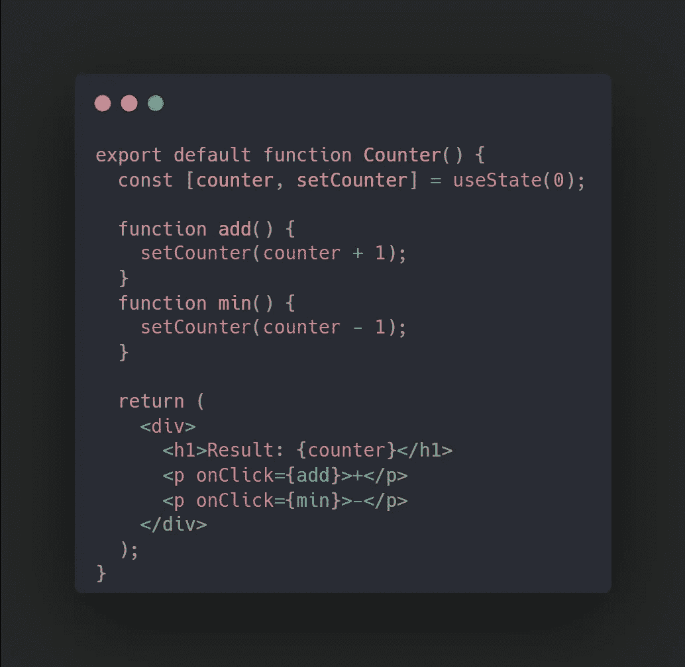
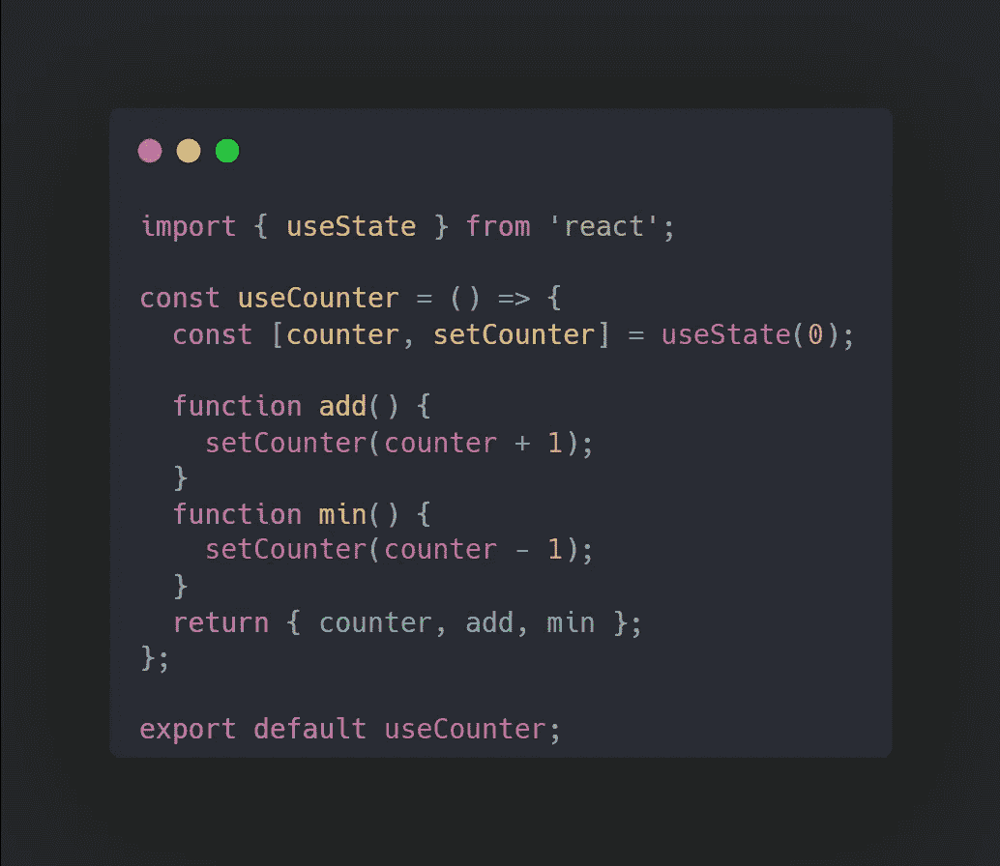
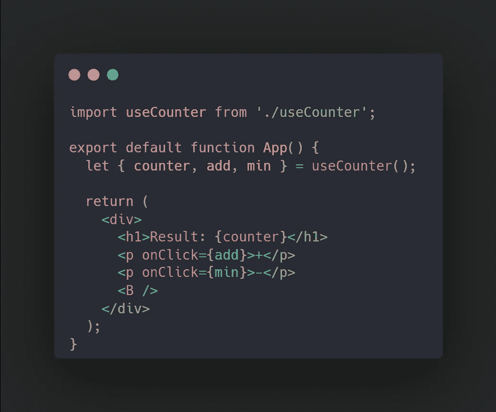

# 如何使用自定义钩子在 React 中分离逻辑和用户界面

> 原文：<https://javascript.plainenglish.io/use-custom-hook-to-separate-logic-ui-in-react-efbe3b4b423a?source=collection_archive---------4----------------------->

## 构建 React app 时如何分离逻辑和 UI 的关注点？

Photo by [Sean Oulashin](https://unsplash.com/@oulashin?utm_source=medium&utm_medium=referral) on [Unsplash](https://unsplash.com?utm_source=medium&utm_medium=referral)

在本文中，我将向您展示在构建 React 应用程序时如何分离逻辑和 UI 之间的关注点。让我们开始吧。

看看下面的代码示例:

这是一个简单的反应计数器应用程序，工作得非常好。在这个阶段，你的组件有两个方法在里面不会有任何问题。但是想象一下，随着组件的增长，组件中的方法会增加，组件会更难调试，一个文件中会有这么多行。这就是一个定制钩子来分离你的逻辑和你的实际 UI 的方便之处。

现在，让我们创建另一个名为 useCounter 的文件，因为我们的主要组件被称为 Counter，或者您喜欢的任何名称，但是强烈建议函数的名称前面有*使用* word，如 React [文档](https://reactjs.org/docs/hooks-custom.html#using-a-custom-hook)中所述。

在这个文件中，我们将主组件中的所有方法和状态都移到这里。它将类似于下面的代码:

我们将所有的方法都移到了这里，注意到最后，我们返回了主组件需要的所有值和方法。现在回到我们的主组件，从我们的定制钩子中导入这些组件，如下所示:

现在我们的代码看起来更干净，可读性更好，因为它只关心 UI，并且只从自定义钩子中导入所有的方法和值。

感谢您的阅读。再见！🍻

*更多内容看*[***o***](https://plainenglish.io/)**。报名参加我们的* [***免费周报***](http://newsletter.plainenglish.io/) *。关注我们关于*[***Twitter***](https://twitter.com/inPlainEngHQ)*和*[***LinkedIn***](https://www.linkedin.com/company/inplainenglish/)*。查看我们的* [***社区不和谐***](https://discord.gg/GtDtUAvyhW) *加入我们的* [***人才集体***](https://inplainenglish.pallet.com/talent/welcome) *。**