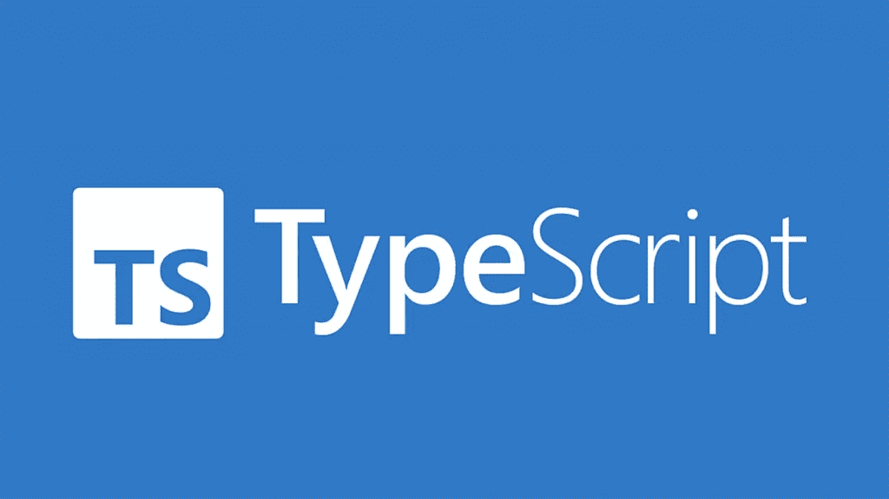

# 为什么你应该使用枚举为更好的角度应用

> 原文：<https://javascript.plainenglish.io/use-enums-for-better-angular-apps-ee2d3992f21?source=collection_archive---------3----------------------->

## 为什么以及如何在你的 Angular 应用中使用枚举，而不是使用旧的容易出错的数据操作方法。



枚举是定义变量的一种方式，变量的值可以是几个常量中的一个。它们非常适合于状态驱动设计、强类型函数参数以及在代码中显示意图。他们绝对应该在你的 Angular app 里有一席之地。

## 组件中的枚举

设想一个用来显示用户状态的 UserComponent。用户可以是我们虚拟订阅服务的标准会员、黄金会员或白金会员。当然，您可以像这样简单地设置您的组件:

在这个例子中，`memberStatus`是一个字符串变量，我们(希望)将它设置为“标准”、“黄金”或“白金”。这个方法是可行的，但是现在每当我们想要操作或引用`memberStatus`时，我们必须将它与我们期望的三个字符串中的一个进行比较。如果成员类型改变了怎么办？没有简单的方法找到所有处理`memberStatus`的代码并相应地更新它。如果一个 API 或其他组件返回一个大写的`memberStatus`怎么办？事情会很快变得一团糟。或者，如果我们只是忘记了这三种成员类型是什么呢？我们必须回到这个组件，仔细检查预期值。

有了 enums，这些问题就可以为我们解决了。在这个例子中，我们可以定义一个枚举来帮助我们:

```
*enum* MemberType {
  *Standard*,
  *Gold*,
  *Platinum* }
```

现在我们有了一个具体的数据类型来定义我们的`memberStatus`可能是什么。如果将来添加成员类型，我们可以简单地将它们添加到这个枚举中，而不需要进一步修改代码。现在我们的组件看起来像这样:

在这里，我们将`memberStatus`从一个字符串更改为新的 MemberType。任何引用它的函数现在也可以用 MemberType 类型化。这提高了清晰度，有助于简化编程(假设使用了智能 IDE)，并大大降低了无效数据的风险。

下一步我们将会遇到一个问题。如果我们尝试在模板中引用我们的枚举，我们将得到一个编译错误，告诉我们“MemberType”在类型“UserComponent”上不存在问题是本地和导入的枚举在组件外部都不可用。

为了解决这个问题，我们可以定义一个简单的`get`函数来返回枚举结构，如下所示:

```
*public get* MemberType(): *typeof* MemberType{ *return* MemberType; }
```

注意，函数名不需要与枚举名匹配，但是这样很好，因为它允许我们以一种看起来像是直接引用枚举的方式调用它。这允许我们有一个引用枚举的模板:

## 关于枚举的更多信息

你还可以使用枚举做更多的事情。您可以创建字符串枚举:

```
*enum* MemberType {
  *Standard = "STANDARD"*,
  *Gold = "GOLD"*,
  *Platinum = "PLATINUM"* }
```

这对于在组件模板中显示文本或序列化数据可能很有用，尤其是出于调试目的。

同样，您可以创建数字枚举。此外，只给第一个值一个数字会自动递增，并给后面的值适当的数字:

```
*enum* MemberType {
  *Standard = "1"*,
  *Gold*, // Will have value 2
  *Platinum // Will have value 3* }
```

枚举还可以有计算值、常数值，以及用于更多的应用。

我希望您看到枚举的价值，并且不再在您的应用程序中使用中世纪的、容易出错的数据操作方法。如需进一步阅读:

[](https://www.typescriptlang.org/docs/handbook/enums.html#computed-and-constant-members) [## 手册-列举

### 枚举是 TypeScript 具有的为数不多的特性之一，它不是 JavaScript 的类型级扩展。枚举允许一个…

www.typescriptlang.org](https://www.typescriptlang.org/docs/handbook/enums.html#computed-and-constant-members) 

*更多内容请看*[***plain English . io***](https://plainenglish.io/)*。报名参加我们的* [***免费周报***](http://newsletter.plainenglish.io/) *。关注我们关于*[***Twitter***](https://twitter.com/inPlainEngHQ)*和*[***LinkedIn***](https://www.linkedin.com/company/inplainenglish/)*。加入我们的* [***社区不和谐***](https://discord.gg/GtDtUAvyhW) *。*