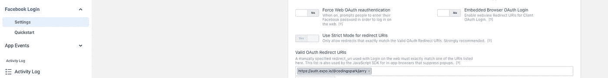

# 在 iOS/Android 上使用脸书的 expo-auth-session 是最简单的方法

> 原文：<https://javascript.plainenglish.io/use-expo-auth-session-with-facebook-the-most-easy-way-on-ios-android-1fd168deaf58?source=collection_archive---------2----------------------->

## Expo.io 提示

## 想要实现与脸书和 expo.io 的 OAuth2 连接吗？你来对地方了！


[**此贴有🇫🇷法文版**](https://www.codingspark.io/blog/utiliser-expo-auth-session-via-facebook-expo-managed-workflow-expo-gostandalone-appexpo-dev-client-eas-build)

# 为什么是这篇文章？

由于脸书和谷歌的 OAUth2 认证 API 现已过时，世博会邀请我们使用名为 **expo-auth-session** 的基于 Web 浏览器的新实现。

然而，我们不得不承认，它仍然不能在所有情况下都很好地工作。

事实上，当你使用 Expo GO(Expo 的预编译客户端)时，它工作得很好，但当你创建一个独立的应用程序时，它会很快变得复杂，特别是在 Android 上，你最终会抓狂。

在撰写本文时，有几个主题报告了与 expo-auth-session (SDK44 Expo)相关的各种问题

*   [https://github.com/expo/expo/issues/9917](https://github.com/expo/expo/issues/9917)
*   [https://github.com/expo/expo/issues/13714](https://github.com/expo/expo/issues/13714)
*   [https://github.com/expo/expo/issues/17011](https://github.com/expo/expo/issues/17011)
*   [https://github.com/expo/expo/issues/13513](https://github.com/expo/expo/issues/13513)

经过大量的研究和实验，我发现了一个很好的解决方案，它解决了两个问题，以便在 IOS 和 Android 上以托管工作流的方式为在独立或 expo-dev-client 中使用 eas-build 创建的应用程序提供功能性的脸书登录。

但是首先，让我们看看 expo-auth-session 是如何工作的。

# 世博会授权会议是如何工作的？

**expo-auth-session** 是一个旨在简化我们的 OAuth2 授权生活的库，支持各种提供商，其中包括谷歌和脸书。

它通过一个简单的 API 提供原语，该 API 允许在我们的应用程序中打开一个使用系统浏览器 cookies 的浏览器(以便利用我们可能已经连接到给定服务的事实)。

一旦用户验证了权限，库将管理第三方服务的重定向，并处理返回的数据，以便检索身份验证令牌、用户 ID 和 OAuth2 连接过程中可能使用的所有其他内容。有了这个身份验证令牌，我们就可以使用第三方 API 来检索客户端数据。

正如我们所见，它很实用，在 Expo GO 上运行良好，但在没有 Expo GO 中所有微调配置的独立应用程序上，它有时会更复杂，尤其是在 Android 上。

不要慌:下面是一个非常容易实现的功能性工作流程。

# 适用于 ExpoGO 和 Android/IOS 单机版(EAS 版本)的脸书的完整功能性 expo-auth-session 工作流

在 expo SDK 44 上使用给定的软件包版本进行了测试:

```
// Packages versions range
{
  "expo": "~44.0.0",
  "expo-app-loading": "~1.3.0",
  "expo-auth-session": "~3.5.0",
  "expo-constants": "~13.0.1",
  "expo-dev-client": "~0.8.4",
  "expo-random": "~12.1.1",
  "expo-status-bar": "~1.2.0",
  "expo-updates": "~0.11.6"
}
```

## 1-安装者展示-授权-会话和 deps

```
expo install expo-auth-session expo-random
```

([更多详情](https://docs.expo.dev/versions/v44.0.0/sdk/auth-session))

## 2-为我们的应用程序定义深度链接方案

```
// app.json or equivalent
{
  "expo": {
    "scheme": "codingspark" // Allows to deeplink to codingspark://
  }
}
```

## 3-配置脸书开发者应用程序

转到您的脸书应用程序的配置(如果您没有应用程序，请创建一个)并在**脸书登录**部分输入 expo auth 链接的 URL。

这个网址由两部分组成[https://auth.expo.io/](https://auth.expo.io/)和你的`originalFullName`，这是应用程序的`username`和`slug`的总和。

**举例:**

要获得您的`originalFullName`,您可以在项目的根文件夹中使用以下命令:

```
expo config --type public | grep "originalFullName"
```

然后，我们检查我们是否处于这种状态，并进行验证！



现在最精彩的部分…

## 4 —一点黑客代码！

首先要注意的是，我们目前在 EAS build 上有一个 bug，当你阅读这篇文章时，这个 bug 可能不再相关了(如果是这种情况，请不要犹豫地给我打电话)。

为此，你必须重载下面的`originalFullName`，在应用程序开始的某个地方，否则，你将在使用`useProxy: true`时得到一个错误。您可以查看本文开头的主题，了解这些 bug 的进展。

```
// Somewhere at application root like App.tsx
// [https://github.com/expo/expo/issues/13714](https://github.com/expo/expo/issues/13714) to counter this issue
import Constants from "expo-constants";
Constants.manifest!.originalFullName = "@<teamname/username>/<slug>";
```

第二个问题是重定向问题，它不起作用，要么使应用程序崩溃，要么做出其他奇怪的行为，就是不起作用。

**这里的解决方案是始终使用 auth.expo.io 链接，这有几个好处**

为此，您需要将`useProxy: true`和一个手动定义的`redirectURL`参数结合起来，该参数将始终在 auth.expo.io 中生成链接。

```
import Constants from "expo-constants";export const HomeScreen: React.FC = () => {
  const [, response, prompt] = Facebook.useAuthRequest(
    {
      clientId: "<facebook_app_id>", // Must be defined in JavaScript, won't use app.json values.
      redirectUri: AuthSession.makeRedirectUri({ useProxy: true }), // useProxy here…
    },
    { useProxy: true } // …and also here
  );return <AppButton onPress={() => prompt()} title="Login with FB" />
}
```

然后我们在`response`变量中获得认证令牌，这允许我们查询脸书 API，如下所示:

```
https://graph.facebook.com/me?fields=first_name,last_name,email,picture.type(large)&access_token=${response.authentication.accessToken}
```

瞧，在等待 Expo 对该模块的使用进行一点改进时，你应该会没事的。

*更多内容请看*[***plain English . io***](https://plainenglish.io/)*。报名参加我们的* [***免费周报***](http://newsletter.plainenglish.io/) *。关注我们关于*[***Twitter***](https://twitter.com/inPlainEngHQ)*和*[***LinkedIn***](https://www.linkedin.com/company/inplainenglish/)*。加入我们的* [***社区不和谐***](https://discord.gg/GtDtUAvyhW) *。*