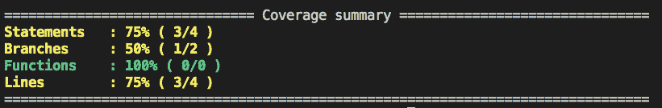
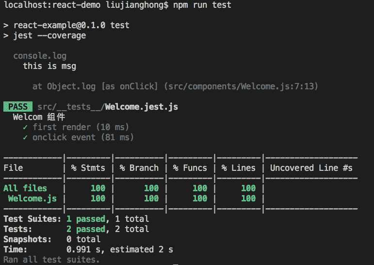

# 使用“伊斯坦布尔”让您的 JavaScript 代码覆盖率达到 99%

> 原文：<https://javascript.plainenglish.io/use-istanbul-to-get-your-javascript-code-coverage-to-99-bc03f083346d?source=collection_archive---------6----------------------->


Photo by [Hannah Troupe](https://unsplash.com/@htroupe?utm_source=medium&utm_medium=referral) on [Unsplash](https://unsplash.com?utm_source=medium&utm_medium=referral)

本人工作多年，经常发现一个边界案例没有测试，上线后用户操作刚好打中了漏例，导致上线意外。

# 情况分析

让我们用一个具体的场景来解释漏测的可能后果。

假设我在我的项目里开发了一个叫做`Welcome`的`React`组件，代码比较简单，你可以先看一下。

可以看到，Welcome 组件中只有一个 div 元素，内容显示为字符串“this welcome page”。当然，你也可以看到我绑定了一个`click`事件`showMessage`到 div 元素，但是当`showMessage` 事件被执行时，会抛出一个异常。假设这个`div`上的`click`事件是一个边界案例，在测试过程中没有被覆盖，那么我们的项目就存在隐患。页面上线后，只要用户点击`div`，就会报错，导致功能异常。那么如何才能避免漏检呢？

# 代码覆盖率的概念

在解释避免遗漏测试之前，让我向您介绍一下测试覆盖的概念。

简单来说，测试覆盖率是软件测试或软件工程中的一种软件度量，即`indicates the proportion of the software program that was tested`。覆盖率是判断测试严格性的一种方式，它可以被分解，例如:

*   **行覆盖**:每一行都执行了吗？
*   **函数覆盖**:每个函数都被调用了吗？
*   **分支覆盖**:每个块都执行了吗？
*   **语句覆盖**:每条语句都执行了吗？

那么在开源社区中，有一个工具可以帮助我们统计代码的覆盖率，它叫做`Istanbul`，如果你有兴趣可以查看源代码，[地址](https://github.com/gotwarlost/istanbul)。我们先简单学习一下如何使用。

首先，需要全局安装`Istanbul`依赖项，代码如下:

```
npm install -g istanbul
```

然后，我这里有一个测试文件，代码如下:

```
// test.js
var a = 1;
var b = 1;
if ((a + b) > 2) {
  console .log('more than two');
}
```

接下来，使用`Istanbul`工具统计代码覆盖率，并执行以下命令:

```
istanbul cover test.js
```

最后，代码覆盖的细节将在终端中输出:



这个测试有 75%的语句覆盖率、50%的分支覆盖率、100%的函数覆盖率和 75%的行覆盖率。

好吧，让我们来理解代码覆盖率的概念。接下来，我们来解释一下如何在实战中统计代码覆盖率。

# 单元测试统计代码覆盖率

一般在严格的开发过程中，我们的项目需要编写单元测试。好的单元测试可以帮助我们避免许多问题。例如，每次迭代需求时，您想要检查新的代码逻辑是否会影响之前的代码逻辑。函数，此时运行一个单元测试就可以知道了。如果所有的测试用例都通过了，您就可以对这个迭代放心了。

为了编写前端单元测试，我使用了`Jest + Chai`组合。因为 Jest 自带了代码覆盖率统计的功能，而 Chai 又是一个优秀的断言库，所以用这种组合我们很容易就能写出相关的测试用例。

对于前面场景分析中的`Welcome`组件，我们稍微修改了代码，如下所示:

我们注释掉了`showMessage`方法中的异常，并执行正常的逻辑。那么单元测试用例可以这样写:

我们再写两个测试用例，一个是第一次渲染，一个是`onclick`事件，涵盖了`Welcome`组件的所有功能。

接下来，我们需要向`package.json`文件的脚本中添加一个测试命令，如下所示:

```
"test": "jest --coverage"
```

然后通过执行`npm run test`命令，我们可以测试`Welcome`组件的功能并计算代码覆盖率。执行结果如下:



可以看出，两个测试用例都正常通过，代码覆盖率 100%，一定程度上避免了漏测。

Jest 统计代码覆盖率，底层也依赖于`Istanbul`。所以在一些工程建设中，工程师可以单独使用`Istanbul`进行代码覆盖统计，然后将相关数据交给 QA 或者项目负责人进行更完整的测试。

# 最后

**感谢阅读。**我期待着您的关注和阅读更多高质量的文章。


[omgzui](https://medium.com/@omgzui?source=post_page-----bc03f083346d--------------------------------)

## 更好的编程

[View list](https://medium.com/@omgzui/list/better-programing-9b4c9bb174aa?source=post_page-----bc03f083346d--------------------------------)109 stories

[omgzui](https://medium.com/@omgzui?source=post_page-----bc03f083346d--------------------------------)

## Java Script 语言

[View list](https://medium.com/@omgzui/list/javascript-48bfc7b5f93c?source=post_page-----bc03f083346d--------------------------------)57 stories

*更多内容请看*[***plain English . io***](https://plainenglish.io/)*。报名参加我们的* [***免费周报***](http://newsletter.plainenglish.io/) *。关注我们关于*[***Twitter***](https://twitter.com/inPlainEngHQ)[***LinkedIn***](https://www.linkedin.com/company/inplainenglish/)*[***YouTube***](https://www.youtube.com/channel/UCtipWUghju290NWcn8jhyAw)*[***不和***](https://discord.gg/GtDtUAvyhW) *。***