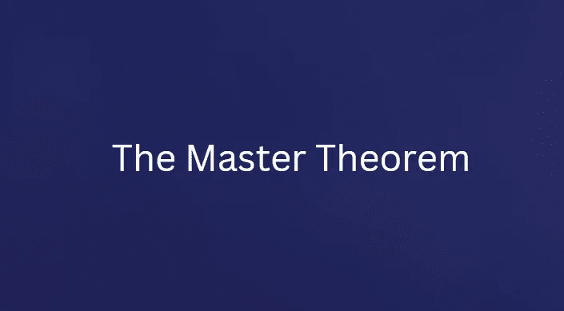
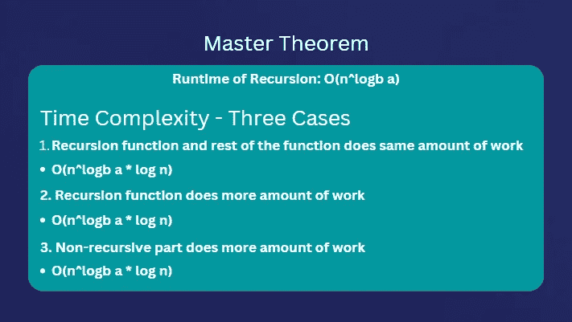

# 利用主定理导出递归二分搜索法算法的大 O

> 原文：<https://javascript.plainenglish.io/use-master-theorem-to-derive-big-o-of-a-recursive-binary-search-algorithm-7f32249f3f03?source=collection_archive---------6----------------------->

## JavaScript 算法基础第 7 部分:理解主定理推导递归算法的时间复杂度



我们使用**渐近分析**来确定算法的时间复杂度。然而，计算一些递归算法的时间复杂度有时是具有挑战性的。

大多数时候，这在具有**对数时间复杂度**的递归算法中可以观察到。有利的是，我们可以使用被称为“**主定理**”的数学定理来容易地确定这些算法的运行时间。

## 什么是主定理？

主定理是一个数学公式，可以很容易地推导出递归算法的时间复杂度。该定理只适用于那些递归算法，在这些算法中，我们将问题(n)分成更小的块。

这个公式不适用于其他递归方法，在这些方法中，我们只用(n-1)步调用递归函数，例如在阶乘的情况下。

但是如果我们正在处理一个算法，它把自己分成两半或者三分之一，或者类似的东西，那么这个公式仍然有效。

## **公式是什么？**

为了计算递归的运行时间，我们使用下面的主定理公式。

```
**O(n^logb a)**
```

在哪里，

**a** =子问题的数量(递归分裂的数量)。函数多久调用一次自己？

**b** =从属子问题大小(每次分割的输入减量)。我们如何分割数组？无论我们在每次递归调用时是将其减半还是除以 3。

**f(n)** =我们稍后也会看到这是递归之外的运行时(非递归部分)，尽管不是公式的一部分。但是我们需要它来导出函数的总运行时间。



Master Theorem

根据主理论，为了推导算法的总时间复杂度，我们必须区分三种情况。

## 第一个案例

第一种情况是**递归函数和非递归函数做同样多的工作**。如果是这种情况，那么我们使用下面的公式。

```
**O(n^logb a * log n)**
```

## **第二种情况**

第二种情况是当**递归步骤完成大部分工作**时，即它有最大的运行时间。在这种情况下，整体算法运行时间由以下公式得出。

```
**O(n^logb a)**
```

## **第三个案例**

而且，如果我们让**非递归部分做了最多的工作**，这种情况很少发生，那么我们使用下面的公式。

```
**O(fn(n))**
```

在第三种情况下，我们忽略递归的运行时，只关注外部运行时，因为递归步骤几乎不做任何工作。

让我们通过推导递归二分搜索法算法的运行时来理解这个例子。

## **导出递归二分搜索法的大 O**

下面的代码是二分搜索法算法的递归版本。

```
function searchElement(arr, searchElement, offset) {
 let startPosition = 0;
 let endPosition = arr.length - 1;

 let midPosition = Math.floor((endPosition - startPosition) / 2); if (searchElement === arr[midPosition]) {
   return midPosition + offset;
 }

 if (searchElement < arr[midPosition]) {
   endPosition = midPosition - 1;
 } else {
   startPosition = midPosition + 1;
   offset = offset + midPosition + 1
 }

 return searchElement(arr.slice(startPosition, endPosition + 1), element, offset);
}
```

**第一步**

我们将首先使用主定理公式开始递归步骤的计算，即 **O(n^logb a)** 。

下面递归步骤的大 O 是什么？

```
**return searchElement(arr.slice(startPosition, endPosition + 1), element, offset);**
```

为了找出“ **a** ”(子问题的数量)，我们看看函数调用自己的频率。在我们上面的例子中，只有一次。

因此， **a** 准 **1** 。因此，我们有，

```
**a = 1**
```

现在， **b** 是子问题的大小，也就是说，我们是分成一半还是三分之一？在我们的例子中，我们把它分成两半。因此， **b** 就是 **2** 。

```
**b = 2**
```

因此，替换公式中的上述值。

```
**O(n^logb a) = O(n^log2 1)
            = O(n^0)** // log2 (1) is 0 **= O(1)**
```

**所以我们单独为递归步骤得到一个常数运行时间 O(1)。**

但这不是整体算法运行时。**为了得出总的运行时间，我们需要使用三种情况中的一种公式**。

我们需要找出这个递归步骤比函数的其余部分做更多的工作，更少的工作，还是等量的工作。如果我们看看函数的其余部分，不包括递归步骤，那么我们可以很容易地说，它也有一个恒定的时间复杂度 O(1)，因为我们在函数中没有任何循环或任何嵌套调用。

因此，递归步骤的时间复杂度与递归步骤之外的工作相同。所以**我们可以用** **第一种情况公式推导出整体算法**的时间复杂度。

```
**O(n^logb a * log n) = O(1 * log n)
                    = O(log n)**
```

替换上述第一种情况公式中的**递归步长时间复杂度**即**O(1)****得到对数时间复杂度**。

*这就是我们如何使用* ***主定理*** *数学推导出递归算法的时间复杂度。但是，同样重要的是要记住，这个定理并不是在所有情况下都适用，比如阶乘递归函数。*

## 专业提示

如果您想避免使用上面的公式，而只是通过查看代码来获得运行时，那么这个技巧在大多数情况下都会对您有所帮助。

如果您看到子问题的大小，即**每次分割的输入减少一半、三分之一或四分之一，并且不是线性(n-1)步**，那么您可以得出结论，该函数将主要具有对数时间复杂度 **O(log n)** 。

感谢您的阅读。

*更多内容请看*[***plain English . io***](https://plainenglish.io/)*。报名参加我们的* [***免费周报***](http://newsletter.plainenglish.io/) *。关注我们关于*[***Twitter***](https://twitter.com/inPlainEngHQ)[***LinkedIn***](https://www.linkedin.com/company/inplainenglish/)*[***YouTube***](https://www.youtube.com/channel/UCtipWUghju290NWcn8jhyAw)*[***不和***](https://discord.gg/GtDtUAvyhW) *。对增长黑客感兴趣？检查* [***电路***](https://circuit.ooo/) *。***