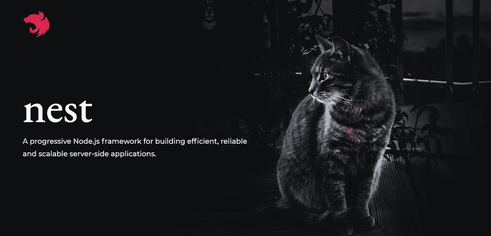

# 在 NestJS 应用程序中使用 DTO 进行验证

> 原文：<https://javascript.plainenglish.io/use-of-dto-for-validation-in-nestjs-application-d37ff55f0560?source=collection_archive---------1----------------------->

## 如何用 NestJS 框架处理和验证 REST 端点的数据。

本文的目的是展示如何用 [NestJS](https://nestjs.com/) 框架处理和验证 rest 端点的数据。

# **什么是 DTO？**

DTO 是数据传输对象的简称。使用 DTO 来验证传入的请求。

DTO 本身更多的是为开发者和那些使用 API 的人提供一个指南，让他们知道请求体期望是什么样的形状，它本身实际上并不运行任何验证**！！！**。

# 我们为什么要用 DTO？

在 **Nest** 中还有一些其他的重要概念。 **js** : **DTO** :数据传输对象是定义数据如何通过网络发送的对象。接口:类型脚本接口**用于**类型检查和定义可以传递给控制器或**嵌套**服务的数据类型。

# 我们如何使用它？

假设我们想要创建一个端点来添加一个产品，并且我们想要在进入服务之前验证这个产品。我们希望在控制器级别验证它。使用 NestJS 的方法是什么？

我们需要创建我们的 d to 类💁‍♀️，带有应该被验证的字段(我们应该安装库类验证器来验证数据)

现在我们想添加一个名为 product_type 的枚举字段，并想通过 DTO 进行验证。

我们不仅可以验证单个字段，还可以用 NestJS 中的 DTO 验证一组对象。为此，我们需要使用一个类转换器。例如，我们有一个产品数组，其中我们需要验证多个产品对象。我们将制作一个**类型**的数组，然后我们将验证它。

我们已经讨论了足够多的 DTO，但在此之前，我们只需要创建一个全局验证管道，下面是对其属性的解释:

*   **白名单**:删除不在 DTO 中的请求主体的所有属性
*   **转换**:这个属性允许我们转换属性，例如，将一个整数转换成一个字符串。我们今天不讨论这个。

# 一些要点:

*   **dto 用于减少代码重复**
*   **为了实现部分验证，可以使用** `**PartialType**` **效用函数。你可以在这里了解一下:**[**https://docs.nestjs.com/openapi/mapped-types#partial**](https://docs.nestjs.com/openapi/mapped-types#partial)

*更多内容请看*[***plain English . io***](https://plainenglish.io/)*。报名参加我们的**[***免费周报***](http://newsletter.plainenglish.io/) *。关注我们关于*[***Twitter***](https://twitter.com/inPlainEngHQ)*和*[***LinkedIn***](https://www.linkedin.com/company/inplainenglish/)*。加入我们的* [***社区***](https://discord.gg/GtDtUAvyhW) *。**