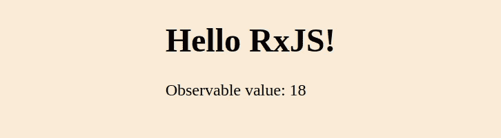

# 在用钩子反应中使用 RxJS

> 原文：<https://javascript.plainenglish.io/use-rxjs-in-react-with-hooks-da0226a00f1f?source=collection_archive---------0----------------------->

## [RxJS](https://medium.com/@lorenzozar/list/rxjs-39bc4f4110ec)

使用 JavaScript 的反应式扩展处理数据。


RxJS is suitable to work with React

RxJS 代表 JavaScript 的反应式扩展。

Reactive Extensions 库最初是由微软开发的，从那时起，它已经被用于其他几种语言，如 Java (RxJava)和 Python (RxPy)。

# RxJS 是什么？

根据[官方文档](https://rxjs.dev/guide/overview)“*RxJS 是一个利用可观察序列*来组成异步的、基于事件的程序的库”。

换句话说，RxJS 是一个帮助我们管理和操作数据的库。

用 RxJS 代替 promises 有几个[原因。然而，我们可以简单地说，与其他库不同，RxJS 可以随时间产生多个值，并且当特定事件发生时，它使用推送模型来通知应用程序。这是反应式编程的核心。](https://www.vitainbeta.org/2022/01/25/why-rxjs-rxjs-vs-promises/)

# 在 React 中使用 RxJS

在本帖中，我将展示 React 中 RxJS 的一个例子。

在前进之前，确保你已经很好地掌握了[可观察到的](https://www.vitainbeta.org/2022/02/01/what-are-observables/)。可观测量是 RxJS 的组成部分，因此理解它们非常重要。

在下面的例子中，我将使用内置的`interval`函数，因为它是现成的，易于使用。也有可能[从头开始创建一个 observable](https://www.vitainbeta.org/2022/02/15/hands-on-1-create-an-observable/)但是在这篇文章中，我想去掉一些复杂性来展示如何在 React 中使用 RxJS 和 observables。

让我们来看一种处理可观察对象的方法，以及 React 中的 *subscribe* 和 *unsubscribe* 方法。

## 内置的区间函数

如 [rxjs.dev](https://rxjs.dev/api/index/function/interval) 上所报告的那样，`interval`内置函数“*创建一个可观察对象，该可观察对象每隔指定的时间间隔*发出连续的数字。

换句话说，多亏了`interval`，我们将获得一系列(可观察到的)上升数字。

可观测的将发射整数，“在这些发射之间有一个你选择的恒定时间间隔”。

## 创建一个反应组件

为了在 React 中使用 RxJS interval，我们从一个非常通用的 React 组件开始。

我导入了 useState 和 useEffect。我假设你熟悉 React 钩子。然而，如果不是这样，我鼓励你复习一下[状态挂钩](https://www.vitainbeta.org/2021/05/03/learn-react-from-scratch-usestate-react-state-hook/)和[效果挂钩](https://reactjs.org/docs/hooks-effect.html)。

我还从 rxjs 库导入了`interval`。

[Initial React component](https://gist.github.com/lorenzojkrl/29715c917b925113bf5ee6b51833786f)

最终的应用程序将显示一个计数器，从零开始，每秒增加一个单位。

在这个函数组件中，我使用了 useState 钩子。state 将存储由 observable 发出的值，setState 将在必要时设置新值。

因此，通过在 HTML 代码中使用`{state}`，我们将始终显示每秒更新的`state`的当前值。

我们可以在组件中创建一个 rxjs 可观察对象，如下所示:

```
const observable$ = interval(1000);
```

美元符号是一种约定，表示变量 observable$确实是 rxjs 可观测的。它代表一段时间内的数据流。

我们把 1000 交给`interval()`。这是一次发射和下一次发射之间的指定时间量，以毫秒为单位。

## 连接 RxJS 并通过 useEffect 做出反应

我们可以说 RxJS 和 React 之间的链接就是效果钩子。

尽管我们在 React 中只看到了一个`interval`的例子，但这种模式对其他 RxJS 函数也很有用。

`useEffect()`接受一个函数，在这个函数中，我们可以有副作用。在我们的例子中，副作用是通过使用`subscribe()`方法订阅 observable$。

我们向 subscribe 方法传递一个观察器。[观察器可以是一个带有 next、error 和 complete](https://www.vitainbeta.org/2022/02/08/what-are-observers/#next-error-complete) 的对象，也可以是一个函数。

在这种情况下，我们将函数`(value) => setState(value)`传递给 setState，该函数将由 observable 发出的值传递给重新呈现组件的 setState。

每次效果挂钩重新渲染组件时，它都会取消订阅可观察对象，并订阅新的可观察对象。

注意，我们传递的是一个空的依赖数组，所以我们没有与任何状态同步。换句话说，我们是在说“继续重新渲染”。

```
useEffect(() => {
    observable$.subscribe((value) => setState(value));
  }, []);
```

此时，我们的代码如下所示:

而且 app 会有计数器！



React app using RxJS and the interval function

这个应用程序看起来运行良好，但是缺少了一些东西。

# 记得打扫卫生

为了避免内存泄漏，我们应该在结束时停止可观察到的内容。由于`interval`永远不会完成，我们需要手动取消订阅。

在 React effect hook 中，如果我们订阅了某个数据源，我们应该返回一个清理函数。

这并不总是必要的！你可以在 React 文档中阅读更多关于不清理的[效果。简而言之，“*网络请求、手动 DOM 突变和日志记录是不需要清理的常见影响示例。*”](https://reactjs.org/docs/hooks-effect.html#effects-without-cleanup)

订阅确实需要清理。

幸运的是，添加和删除订阅的"*代码是如此紧密地联系在一起，以至于 useEffect 被设计成将它们结合在一起。如果你的效果返回一个函数，React 会在清理*的时候运行它。

这对我们来说是个好消息，因为它简化了清理工作！

换句话说，使用效果

1.  运行效果
2.  当它完成效果时，它返回并运行我们提供的清理功能

让我们来看看这段新代码:

```
useEffect(() => {
    const subscription = observable$.subscribe(setState);
    return () => subscription.unsubscribe();
  }, []);
```

首先，我们订阅了`observable$`，这将返回一个订阅。

注意，将`setState`传递给`subscribe`方法类似于传递`(value) => setState(value)`。

我们保存对`subscription`变量的订阅。

effects 钩子通过使用`unsubscribe()`方法返回一个取消订阅的函数。

通过这样做，在必要的时候进行清理，我们不会引入内存泄漏。

在 GitHub 上找到完整的[代码，在 RxJS](https://github.com/lorenzojkrl/rxjs-primer/blob/main/hands-on/hands-on-2/App.js) 上找到其他[帖子。](https://www.vitainbeta.org/2022/03/06/rxjs-primer/)

# 结论

RxJS 不简单也不直白。

理解“可观察”的概念需要从承诺的传统观念中转移思维。

然而，随着时间的推移处理数据而不是在单一时刻获取数据的概念可能是一个强大的概念。有些框架，比如 Angular，广泛采用 RxJS。

RxJS 被定义为事件的 Lodash。与 Lodash 的情况一样，您并不一定需要使用它。然而，熟悉它的程序员可以获得一些主要的好处。

## 感谢你花时间在我的帖子上！

如果你对 RxJS 有一些经验，好的坏的，都留下评论吧！我个人主要是用 RxJS 搭配 Angular。

*更多内容请看*[***plain English . io***](https://plainenglish.io/)*。报名参加我们的* [***免费周报***](http://newsletter.plainenglish.io/) *。关注我们关于*[***Twitter***](https://twitter.com/inPlainEngHQ)*和*[***LinkedIn***](https://www.linkedin.com/company/inplainenglish/)*。加入我们的* [***社区不和谐***](https://discord.gg/GtDtUAvyhW) *。*