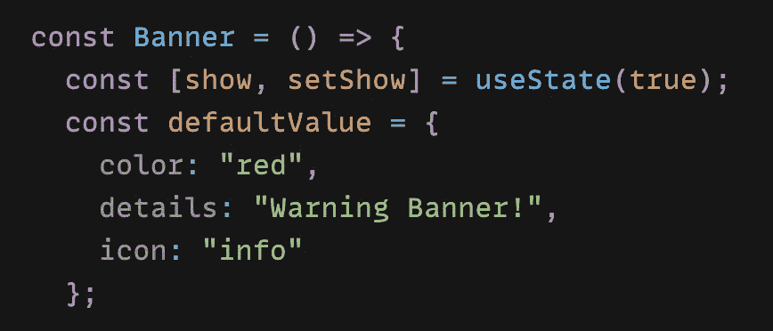
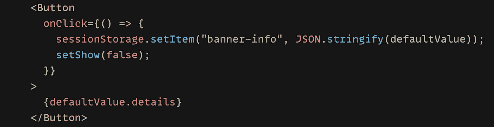
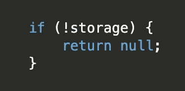

# 使用会话存储来保持 React 组件中的状态

> 原文：<https://javascript.plainenglish.io/use-session-storage-to-persist-state-within-a-react-component-206867ef2269?source=collection_archive---------0----------------------->

当页面会话结束时，sessionStorage 中的数据将被清除。


Photo by [Lautaro Andreani](https://unsplash.com/@lautaroandreani?utm_source=medium&utm_medium=referral) on [Unsplash](https://unsplash.com?utm_source=medium&utm_medium=referral)

在我正在做的项目中，我创建了一个小小的 React 组件横幅。它包含一个图标、一些文本、一些不同的背景颜色和一个关闭按钮(🌱下面我就简化一下例子)。


A simple Banner component with a close button

如上所述，这个横幅组件非常简单。但是，我发现在点击**关闭按钮**“x”并刷新页面后，虽然不应该，但是横幅又重新出现了！💥

好了，现在的重点是防止这种行为。我想到了用一个**简单流行的 React 解决方案**带原生**本地存储**或者**会话存储**来持久化这个外观状态。✂️

但是这种情况下哪个更好呢？研究了一些资料来源后，我得出了结论。👇

🌸 **sessionStorage** 访问当前原点的 session Storage **对象**，类似于 **localStorage，**不同的是 **localStorage** 中的数据不会过期，而 **sessionStorage** 中的数据会在页面会话结束时被清空。

在我的例子中，我实际需要的是 ***sessionStorage*** ，因为除了一些值之外，没有重要的数据需要存储和检索。所以我做了这个👇(下面是简化的例子)



Banner Component with “appearance” state and “defaultValue” for sessionStorage

当然，下面的关闭按钮是这样的👇



Close button which sets sessionStorage item object with key “banner-info”

是的，在点击关闭按钮并检查应用程序后👇


Session Storage Item object is created after button click

之后，我用 **useEffect** 检查是否有会话存储对象值，如果有，那么**不要显示**横幅，类似如下。👇

```
*Object.values(defaultValue).every((value) => value !== “ ” && setShow(false));*
```

并渲染横幅:`*{show && <Banner />}*`

🤔

有用吗？是的，但那是 d*，为什么？因为就像我说的，没有**重要的数据**需要存储和检索，我所需要的只是决定**是否显示**横幅 **🦜** ！**为什么要把那些没用的数据**(详情，图标… ) **保存到会话存储？感谢我的同事。:)**

我所需要的就是使用一个布尔状态，并像下面这样更新它

```
***sessionStorage.setItem(“banner-info”, true)***
```

并呈现如下👇



Render **nothing** if the session storage value exists!

就是这样！移除了 **defaultValue** 状态，移除了 **useEffect，**只需使用**真/假**到保持那个外观状态🍭，甜美简单。

以上是一个简单的 **sessionStorage** 用法示例，希望它有趣且有用，如果你对我的其他文章感兴趣，这里有一些链接:🧚‍♂️

[](https://xiaominzhu.medium.com/hide-and-replace-sticky-element-on-scrolling-in-a-react-way-8bc3f04e2a81) [## 以反应方式隐藏和替换滚动时的粘性元素

### —棘手但有趣🍡

xiaominzhu.medium.com](https://xiaominzhu.medium.com/hide-and-replace-sticky-element-on-scrolling-in-a-react-way-8bc3f04e2a81) [](https://xiaominzhu.medium.com/create-a-pagination-in-a-react-way-df5c6fe1e0c7) [## 以反应方式创建分页

### —一个漂亮的分页🧚‍♂️怎么样？

xiaominzhu.medium.com](https://xiaominzhu.medium.com/create-a-pagination-in-a-react-way-df5c6fe1e0c7) [](https://xiaominzhu.medium.com/lets-play-with-hyperlinks-338d1be1f6d7) [## 让我们玩超链接吧

### —创建指向页面部分的链接很简单，但是如果您有一个固定的页眉呢？

xiaominzhu.medium.com](https://xiaominzhu.medium.com/lets-play-with-hyperlinks-338d1be1f6d7) [](https://medium.com/geekculture/css-trick-add-colour-and-linear-gradient-to-a-background-image-2dd0fe6125a8) [## Css 技巧:给背景图片添加颜色和线性渐变

### —一个可以节省您时间的 css 技巧🦋

medium.com](https://medium.com/geekculture/css-trick-add-colour-and-linear-gradient-to-a-background-image-2dd0fe6125a8) [](/prevent-validatedomnesting-button-descendant-error-21d9a34e5984) [## 如何防止 React 中嵌套

### 你熟悉这个错误吗？💻

javascript.plainenglish.io](/prevent-validatedomnesting-button-descendant-error-21d9a34e5984) [](https://medium.com/geekculture/prevent-line-breaks-with-css-68a9f066db60) [## 用 CSS 防止换行

### —reactcomponent🧚中的 css 技巧

medium.com](https://medium.com/geekculture/prevent-line-breaks-with-css-68a9f066db60) [](https://medium.com/geekculture/react-email-validation-with-dialog-overlay-472ee564d585) [## 用对话框覆盖反应电子邮件验证

### —电子邮件验证有时令人头疼，🧊

medium.com](https://medium.com/geekculture/react-email-validation-with-dialog-overlay-472ee564d585) [](/find-the-nearest-location-in-a-react-way-9ed51a999807) [## 以反应的方式找到最近的位置

### —️地理定位 API

javascript.plainenglish.io](/find-the-nearest-location-in-a-react-way-9ed51a999807) [](/sourcing-json-data-with-gatsby-source-filesystem-and-graphql-6fc7cef2a49e) [## 用 gatsby-source-filesystem 和 GraphQL 获取 JSON 数据

### 学习盖茨比第二步

javascript.plainenglish.io](/sourcing-json-data-with-gatsby-source-filesystem-and-graphql-6fc7cef2a49e) [](/learn-by-doing-use-gatsby-to-create-your-first-site-af7bfb7a8a6f) [## 边做边学——使用 Gatsby 创建您的第一个网站

### 一步一步来，是的。

javascript.plainenglish.io](/learn-by-doing-use-gatsby-to-create-your-first-site-af7bfb7a8a6f) [](/5-react-hook-libraries-you-could-use-d7f13066ebba) [## 您可以使用的 5 个 React 钩子库

### 大三学生的建议——试一试。

javascript.plainenglish.io](/5-react-hook-libraries-you-could-use-d7f13066ebba) [](/from-music-to-web-development-my-junior-path-7421e0ddd65) [## 从音乐到网络开发-我的道路

### 从一个交响乐团的音乐家到一个网页开发者。

javascript.plainenglish.io](/from-music-to-web-development-my-junior-path-7421e0ddd65) 

*更多内容尽在* [***说白了. io***](http://plainenglish.io/) *。报名参加我们的* [***免费周报***](http://newsletter.plainenglish.io/) *。在我们的* [***社区获得独家访问写作机会和建议***](https://discord.gg/GtDtUAvyhW) *。*