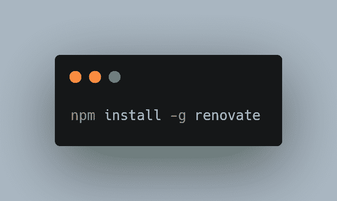
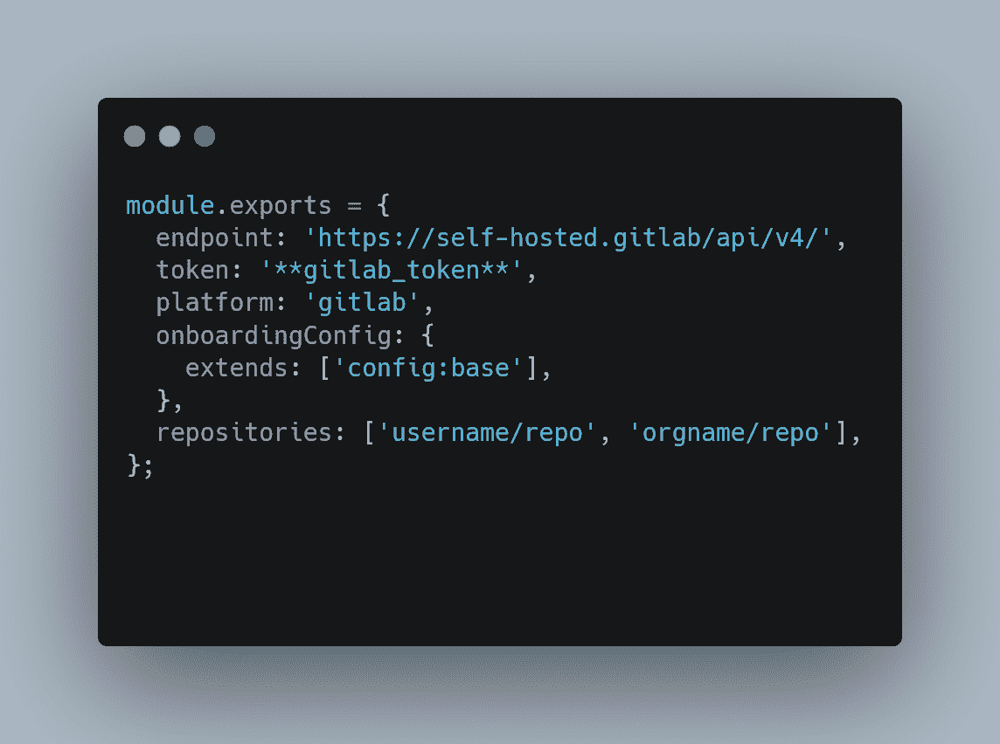
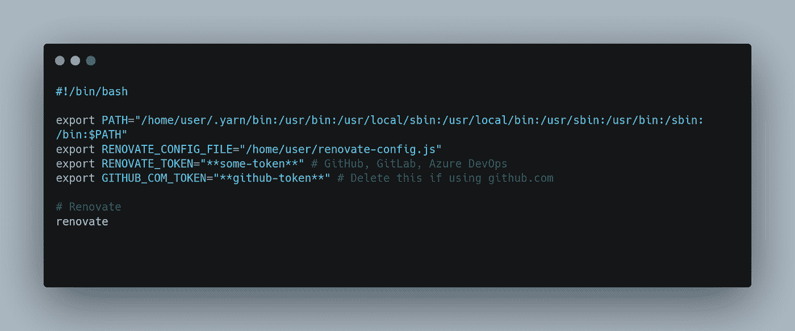
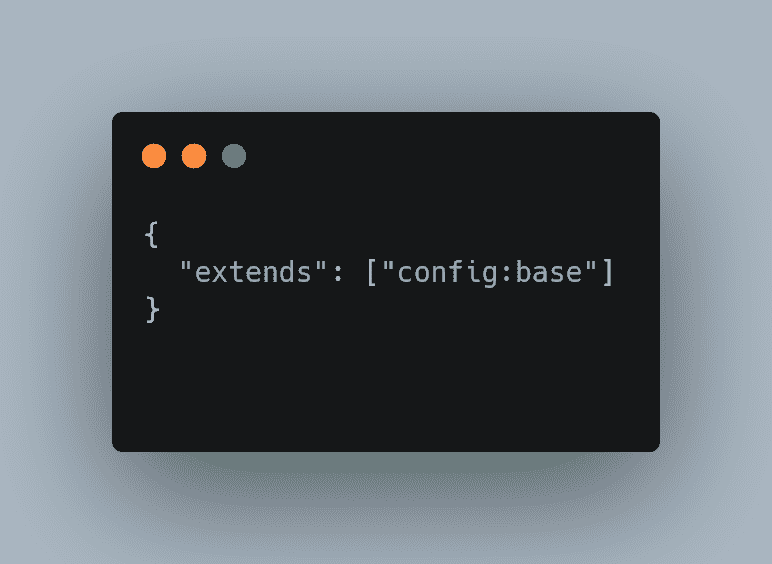
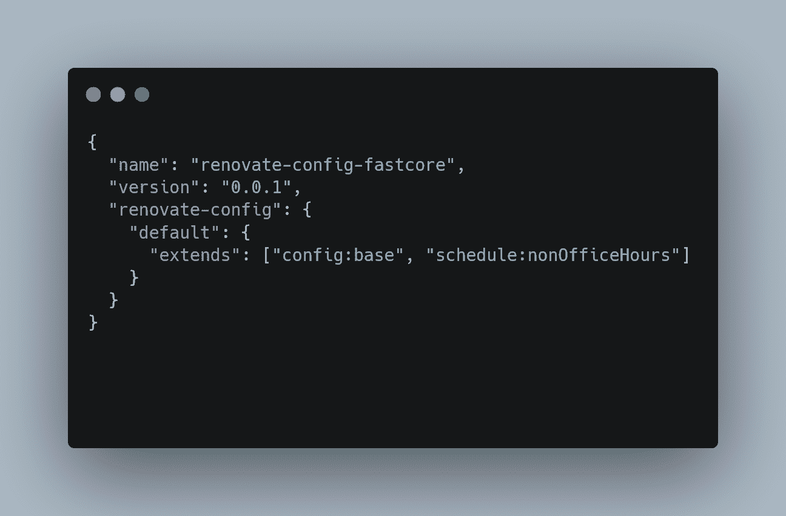
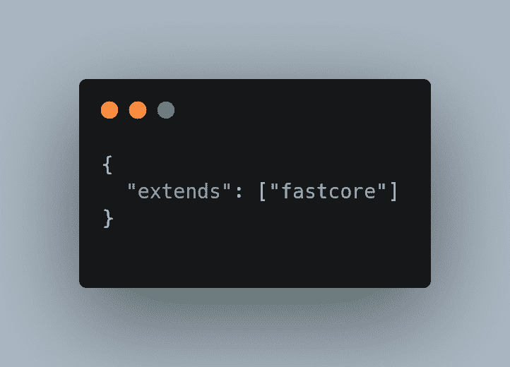

# 对 NPM 项目使用可共享的配置预设并进行更新

> 原文：<https://javascript.plainenglish.io/use-shareable-configuration-presets-for-npm-projects-with-renovate-6dff7f544a17?source=collection_archive---------11----------------------->

Photo by [Brina Blum](https://unsplash.com/@brina_blum?utm_source=medium&utm_medium=referral) on [Unsplash](https://unsplash.com?utm_source=medium&utm_medium=referral)

NPM，作为这个星球上最大的软件注册中心，非常受全世界开发者的欢迎。注册表包含超过 800，000 个包，用于共享和重用代码。由于 npm 包的可共享性，开发人员很难跟踪他们可能已经安装在项目中的许多包中存在的各种漏洞。

即使其中一个包中有一个漏洞，也会危及整个项目以及基础设施的安全。因此，所有的依赖项和包都应该被正确地更新。

管理依赖关系有很多方法，但我最喜欢的一种是翻新。[renewate](https://github.com/marketplace/renovate)是一款免费工具，由从事各种项目和平台的开发人员使用，用于自动更新依赖关系。

设置完成后，使用 renew，您可以获得更新依赖项和锁定文件的 pull 请求，通过使用 pull 请求调度更新来减少 GitHub 存储库中的噪音。由于该工具的开源性质，它使用最新的功能和安全补丁进行维护。

在这篇博客中，我们将讨论如何利用更新预置来管理 npm 项目。

# 运行更新

在典型的使用案例中，可以选择以下两种使用类别中的任何一种。开发者可以使用 [Docker images](https://docs.docker.com/engine/reference/commandline/images/) 从自托管环境中使用 renew，或者其他人可以为你托管它。要在自托管环境中运行 Renovate，最简单的方法是使用节点包管理器 NPM。

renew 命令行界面作为 npm 包“renew”分发。

要使用 npm 安装 renew，请运行以下命令:

[Source Code](https://carbon.now.sh/?bg=rgba%28171%2C+184%2C+195%2C+1%29&t=seti&wt=none&l=application%2Fx-sh&width=680&ds=true&dsyoff=20px&dsblur=68px&wc=true&wa=true&pv=56px&ph=56px&ln=false&fl=1&fm=Hack&fs=14px&lh=133%25&si=false&es=2x&wm=false&code=npm%2520install%2520-g%2520renovate)

现在，命令“翻新”可以执行翻新的命令行界面。

# 首次使用

在使用 need 之前，您需要在 need 上创建一个用户帐户，并生成一个个人访问令牌。一旦生成了访问令牌，您就可以使用您的帐户名和访问令牌来创建一个最小配置文件。这个配置文件指向 renew API URL、令牌和其他与配置相关的信息。

请参见下面的示例:

[Source Code](https://carbon.now.sh/?bg=rgba%28171%2C+184%2C+195%2C+1%29&t=seti&wt=none&l=application%2Fjson&width=680&ds=true&dsyoff=20px&dsblur=68px&wc=true&wa=true&pv=56px&ph=56px&ln=false&fl=1&fm=Hack&fs=14px&lh=133%25&si=false&es=2x&wm=false&code=module.exports%2520%253D%2520%257B%250A%2520%2520endpoint%253A%2520%27https%253A%252F%252Fself-hosted.gitlab%252Fapi%252Fv4%252F%27%252C%250A%2520%2520token%253A%2520%27**gitlab_token**%27%252C%250A%2520%2520platform%253A%2520%27gitlab%27%252C%250A%2520%2520onboardingConfig%253A%2520%257B%250A%2520%2520%2520%2520extends%253A%2520%255B%27config%253Abase%27%255D%252C%250A%2520%2520%257D%252C%250A%2520%2520repositories%253A%2520%255B%27username%252Frepo%27%252C%2520%27orgname%252Frepo%27%255D%252C%250A%257D%253B%250A)

除了使用秘密的配置文件，开发人员还可以使用 bash 脚本来更好地利用诸如 cron 之类的调度任务执行器进行更新。

因此，不用在 JSON 文件中指定 GitHub 和 Renovate 标记，而是在环境变量中声明它们，其余的配置在称为配置文件的文件中指定。

[Source Code](https://carbon.now.sh/?bg=rgba%28171%2C+184%2C+195%2C+1%29&t=seti&wt=none&l=application%2Fx-sh&width=680&ds=true&dsyoff=20px&dsblur=68px&wc=true&wa=true&pv=56px&ph=56px&ln=false&fl=1&fm=Hack&fs=14px&lh=133%25&si=false&es=2x&wm=false&code=%2523%21%252Fbin%252Fbash%250A%250Aexport%2520PATH%253D%2522%252Fhome%252Fuser%252F.yarn%252Fbin%253A%252Fusr%252Fbin%253A%252Fusr%252Flocal%252Fsbin%253A%252Fusr%252Flocal%252Fbin%253A%252Fusr%252Fsbin%253A%252Fusr%252Fbin%253A%252Fsbin%253A%252Fbin%253A%2524PATH%2522%250Aexport%2520RENOVATE_CONFIG_FILE%253D%2522%252Fhome%252Fuser%252Frenovate-config.js%2522%250Aexport%2520RENOVATE_TOKEN%253D%2522**some-token**%2522%2520%2523%2520GitHub%252C%2520GitLab%252C%2520Azure%2520DevOps%250Aexport%2520GITHUB_COM_TOKEN%253D%2522**github-token**%2522%2520%2523%2520Delete%2520this%2520if%2520using%2520github.com%250A%250A%2523%2520Renovate%250Arenovate%250A)

# 更新包文件

不同的语言有不同的包文件来处理对依赖项的引用。

包文件通常由包管理器管理。比如“package.json”文件由 npm 管理，“Gemfile”由 [Bundler](https://bundler.io/) 管理，“go.mod”由 go 模块管理。

翻新自动扫描您的项目目录和仓库，以检测软件包文件及其依赖关系，寻找互联网上的相关版本。如果它找到任何依赖项的较新版本，它会发出对新版本的拉请求。

配置文件是可以用来简化部署的 JSON 配置文件。

翻新有许多预置配置，如“配置:基础”预置。

在深入讨论可共享配置预设的细节之前，我们需要理解 need 上下文中预设的概念。使用翻新预设，您可以使用良好的默认设置来设置翻新机器人。您还可以与其他开发人员共享您的配置，或者通过更改重用您以前的配置。由于预置的模块化性质，它们可以非常小，即几行或一个完整的配置文件。为了简化设置，renewal 附带了大量内置预设，只需很少的工作就可以使用。

# 如何使用预设

如果您正在使用任何预设配置，应该在 renovate.json 文件中声明如下:

[Source Code](https://carbon.now.sh/?bg=rgba%28171%2C+184%2C+195%2C+1%29&t=seti&wt=none&l=python&width=680&ds=true&dsyoff=20px&dsblur=68px&wc=true&wa=true&pv=56px&ph=56px&ln=false&fl=1&fm=Hack&fs=14px&lh=133%25&si=false&es=2x&wm=false&code=%257B%250A%2520%2520%2522extends%2522%253A%2520%255B%2522config%253Abase%2522%255D%250A%257D%250A)

将默认预设添加到项目中就像添加一行 json 一样简单:根据需要用预设配置“扩展”。正如我们在图像中看到的，预置“配置:基础”可以替换为 100 个预置中的任何一个。

# 正在 npm 上发布配置

在花了一些时间修改具有许多计划和预设的配置文件之后，如果您想要在其他项目和存储库中复制相同的配置文件，您可以在 npm 存储库上发布您的配置文件，这可以很容易地扩展到其他项目。

[Source Code](https://carbon.now.sh/?bg=rgba%28171%2C+184%2C+195%2C+1%29&t=seti&wt=none&l=application%2Fjson&width=680&ds=true&dsyoff=20px&dsblur=68px&wc=true&wa=true&pv=56px&ph=56px&ln=false&fl=1&fm=Hack&fs=14px&lh=133%25&si=false&es=2x&wm=false&code=%257B%250A%2520%2520%2522name%2522%253A%2520%2522renovate-config-fastcore%2522%252C%250A%2520%2520%2522version%2522%253A%2520%25220.0.1%2522%252C%250A%2520%2520%2522renovate-config%2522%253A%2520%257B%250A%2520%2520%2520%2520%2522default%2522%253A%2520%257B%250A%2520%2520%2520%2520%2520%2520%2522extends%2522%253A%2520%255B%2522config%253Abase%2522%252C%2520%2522schedule%253AnonOfficeHours%2522%255D%250A%2520%2520%2520%2520%257D%250A%2520%2520%257D%250A%257D%250A)

例如，在下图中，我们创建了一个名为“renew-config-fast core”的新配置文件，版本为“0.0.1”。此配置文件扩展了“config:base”的默认预设，并计划仅在非办公时间运行，以避免工作中断。

现在，这个包可以很容易地集成到其他存储库中，就像添加现有的预定义配置文件一样。

[Source Code](https://carbon.now.sh/?bg=rgba%28171%2C+184%2C+195%2C+1%29&t=seti&wt=none&l=application%2Fjson&width=680&ds=true&dsyoff=20px&dsblur=68px&wc=true&wa=true&pv=56px&ph=56px&ln=false&fl=1&fm=Hack&fs=14px&lh=133%25&si=false&es=2x&wm=false&code=%257B%250A%2520%2520%2522extends%2522%253A%2520%255B%2522fastcore%2522%255D%250A%257D%250A)

# 结论

开发人员现在可以节省时间，并在 Renovate 的帮助下确保他们的应用程序是安全的，而不是逐一检查所有的依赖项以确保它们是最新的。在员工和 600 名贡献者的帮助下，Renovate now 提供了许多尖端功能来提供安全性和可扩展性。

*更多内容请看*[***plain English . io***](https://plainenglish.io/)*。报名参加我们的* [***免费周报***](http://newsletter.plainenglish.io/) *。关注我们关于*[***Twitter***](https://twitter.com/inPlainEngHQ)*和*[***LinkedIn***](https://www.linkedin.com/company/inplainenglish/)*。查看我们的* [***社区不和谐***](https://discord.gg/GtDtUAvyhW) *加入我们的* [***人才集体***](https://inplainenglish.pallet.com/talent/welcome) *。*