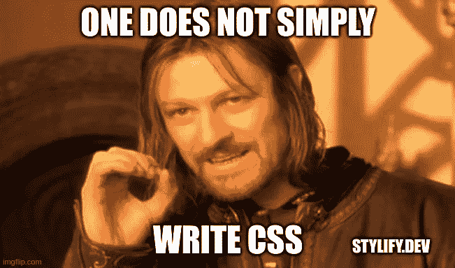

# 使用 Stylify 根据您编写的内容动态生成 CSS

> 原文：<https://javascript.plainenglish.io/use-stylify-to-dynamically-generate-css-based-on-what-you-write-b808594cd0f?source=collection_archive---------14----------------------->

## 了解如何以优化的方式编写 CSS，远离昂贵的重构。



“这只是 CSS。最糟糕的情况会是什么？”重构前几个月一个 web 开发人员说。

先说个例子。创建一个简单的蓝色按钮有多难？它就像一个选择器，可能是一个悬停状态和一些属性。大概是这样的:

```
.button {
  font-size:18px;
  padding:8px 24px;
  background:#2196f3;
  color:#fff;
  border-radius:2px;
  border:0;
  display:inline-block;
  cursor:pointer;
}.button:hover {
  background:#1e87db
}
```

用同样的方法，我们可以创建各种下拉菜单，侧栏，标题，部分等。

但是上面的代码和方法是正确的方法吗？

让我们找出答案。

# 问题是

每次创建一个新的组件或样式时，都会增加 CSS 的大小。如果我们给图像添加边框半径，给一些文本添加字体大小，会发生什么？

```
.button { /* ... */ border-radius:2px; /* ... */ }
img { border-radius:2px; /* Duplicated */ }
.subtitle { font-size:18px /* Duplicated */ }
```

# 解决方案

我认为为我们的按钮编写 CSS 的一个更好的方法是**混合组件和实用选择器**:

```
.hover\:background\:\#1e87db:hover,
.button:hover { background: #1e87db }.font-size\:16px, .button { font-size: 16px }.padding\:8px__24px, .button { padding: 8px 24px }.background\:\#2196f3, .button { background: #2196f3 }.color\:\#fff, .button { color: #fff }.border-radius\:2px, .button { border-radius: 2px }.border\:0, .button { border: 0 }.display\:inline-block, .button { display: inline-block }.cursor\:pointer, .button { cursor: pointer }
```

当你看代码的时候，你可能会想“这到底是什么？”

让我解释一下:你添加到 CSS 中的每一个`property:value`也应该是一个实用程序:

*   您可以在任何地方轻松重用它们
*   重复的属性更少
*   项目越大，重用的类就越多，这意味着 CSS 的大小会慢慢增长

好吧，但是谁会想要手动编写这样的东西呢？好消息是，你不必这么做。

# 风格化拯救

正是因为以上原因，我一直在开发[Stylifycss.com](https://stylifycss.com/)。

下面是一个如何用 Stylify 创建相同按钮的例子(检查 HTML 标签):

CSS 选择器在 Node.js 中使用时也可以缩小[:](https://stylifycss.com/docs/stylify/compiler#usage)

```
<button class="_91rm6e"></button>
<style>
._79qtu:hover, ._91rm6e:hover { background: #1e87db }._h0jma, ._91rm6e { font-size: 16px }._gtcr, ._91rm6e { padding: 8px 24px }._8kde4, ._91rm6e { background: #2196f3 }._olqrj2, ._91rm6e { color: #fff }._5s8un, ._91rm6e { border-radius: 2px }._8r76, ._91rm6e { border: 0 }._qprvp, ._91rm6e { display: inline-block }._4gipbn, ._91rm6e { cursor: pointer }
</style>
```

如果你也花时间将你的 CSS 布局和每一页分开([这很容易用 Stylify](https://stylifycss.com/docs/bundler/installation-and-usage#installation) 来实现)，你可以为你的每一页准备很小的 CSS 块。你也不必担心重复，选择器会自动缩小。

# 让我知道你的想法！

我会很高兴得到任何反馈！ [Stylify](https://stylifycss.com/) 仍然是一个新的库，有很大的改进空间🙂。

保持联系:
👉[@ 8 machy](https://twitter.com/8machy)👉 [@stylifycss](https://twitter.com/stylifycss)
👉[Stylifycss.com](https://stylifycss.com)👉[dev.to/machy8](https://dev.to/machy8)👉[medium.com/@8machy](https://medium.com/@8machy)

*更多内容看* [***说白了就是***](https://plainenglish.io/) *。报名参加我们的* [***免费每周简讯***](http://newsletter.plainenglish.io/) *。关注我们*[***Twitter***](https://twitter.com/inPlainEngHQ)*和*[***LinkedIn***](https://www.linkedin.com/company/inplainenglish/)*。加入我们的* [***社区不和谐***](https://discord.gg/GtDtUAvyhW) *。*