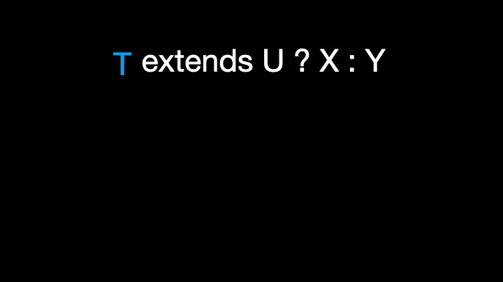

# 像专业人员一样使用 TypeScript 条件类型

> 原文：<https://javascript.plainenglish.io/use-typescript-conditional-types-like-a-pro-7baea0ad05c5?source=collection_archive---------0----------------------->

## 用动画解释。掌握 TypeScript 条件类型，了解 TypeScript 的内置实用工具类型是如何工作的。


欢迎来到**掌握打字稿**系列。本系列将以动画的形式介绍 TypeScript 的核心知识和技术。让我们一起学习吧！以前的文章如下:

*   [**TypeScript 泛型中的 K、T、V 是什么？**](https://medium.com/frontend-canteen/what-are-k-t-and-v-in-typescript-generics-9fabe1d0f0f3)
*   [**使用 TypeScript 像 Pro 一样映射类型**](/using-typescript-mapped-types-like-a-pro-be10aef5511a)
*   [**使用 TypeScript 条件类型像亲**](/use-typescript-conditional-types-like-a-pro-7baea0ad05c5)
*   [**使用 TypeScript 交集类型像亲**](/using-typescript-intersection-types-like-a-pro-a55da6a6a5f7)
*   [**利用打字稿像专家一样推断**](https://levelup.gitconnected.com/using-typescript-infer-like-a-pro-f30ab8ab41c7)
*   [**使用 TypeScript 模板字面类型像亲**](https://medium.com/javascript-in-plain-english/how-to-use-typescript-template-literal-types-like-a-pro-2e02a7db0bac)
*   [**可视化打字稿:15 种最常用的实用类型**](/15-utility-types-that-every-typescript-developer-should-know-6cf121d4047c)
*   [**关于类型脚本类你需要知道的 10 件事**](https://levelup.gitconnected.com/10-things-you-need-to-know-about-typescript-classes-f58c57869266)
*   [**TypeScript 中‘declare’关键字的用途**](/purpose-of-declare-keyword-in-typescript-8431d9db2b10)

您使用过 **Exclude、Extract、NonNullable、Parameters 和 ReturnType** 实用程序类型吗？你知道他们内部是怎么运作的吗？实际上，以上的 TypeScript 内置实用工具类型都是基于**条件类型**开发的。


*注:仅演示部分流程*

这里我们首先简单了解一下这些 TypeScript 内置实用工具类型的具体实现。


这些实用程序类型用于以下目的:

*   Exclude:通过从`UnionType`中排除所有可分配给`ExcludedMembers`的联合成员来构造类型。
*   提取:通过从`Type`中提取所有可分配给`Union`的联合成员来构造类型。
*   不可空:通过从`Type`中排除`null`和`undefined`来构造类型。
*   Parameters:从函数类型`Type`的参数中使用的类型构造一个元组类型。
*   ReturnType:构造一个由函数`Type`的返回类型组成的类型。

这里我们来看几个用法示例:


如果您想彻底掌握它们并创建自己的实用程序类型，请不要错过本文中的内容。

前面描述的内置实用工具类型在内部使用 TypeScript 2.8 中引入的条件类型。这种类型的语法如下:

```
T extends U ? X : Y
```

t、U、X 和 Y 都是类型占位符。可以这样理解语法:当 T 型可以赋给 U 型时，则返回 X 型，否则返回 y 型，看到这里让你想起了 JavaScript 中的三元表达式。


如果您不熟悉类型占位符，可以阅读下面的文章。

[](https://medium.com/frontend-canteen/what-are-k-t-and-v-in-typescript-generics-9fabe1d0f0f3) [## TypeScript 泛型中的 K，T，V 是什么？

### 用动画讲解，让你轻松掌握 TypeScript 泛型类型参数。

medium.com](https://medium.com/frontend-canteen/what-are-k-t-and-v-in-typescript-generics-9fabe1d0f0f3) 

那么条件类型有什么用呢？这里举个例子。

```
type IsString<T> = T extends string ? true : false;
​
type I0 = IsString<number>;  // false
type I1 = IsString<"abc">;  // true
type I2 = IsString<any>;  // boolean
type I3 = IsString<never>;  // never
```


在上面的代码中，我们定义了 IsString 实用程序类型。使用这个实用程序类型，我们可以确定传递给类型参数 T 的实际类型是否是字符串类型。除了确定单个类型，使用条件类型和条件链，我们还可以同时确定多个类型。

接下来，让我们看看如何实现这个实用程序类型:


在上面的代码中，我们定义了一个新的 TypeName 实用程序类型，其中使用了条件链接。为了让你更容易理解条件链，我们以 JavaScript 三元表达式为例来演示一下它的作用。


现在问题来了，对于前面定义的 TypeName 实用工具类型，如果传入的类型是 union 类型，将返回什么结果？下面我们来验证一下。

```
// "string" | "function"
type T10 = TypeName<string | (() => void)>; // "string" | "object" | "undefined"
type T11 = TypeName<string | string[] | undefined>;
```


为什么 T10 和 T11 类型返回联合类型？这是因为 TypeName 是分布式条件类型。**在条件类型中，如果被检查的类型是“裸”类型参数，即没有被数组、元组、承诺等包装。**，条件类型称为分布式条件类型。


对于分布式条件类型，当传入的检查类型是联合类型时，它将在操作过程中被分成多个分支。

```
T extends U ? X : Y T => A | B | C A | B | C extends U ? X : Y  => (A extends U ? X : Y) | (B extends U ? X : Y) | (C extends U ? X : Y)
```



为了让你更容易理解，我们来举个例子。


从上面的结果可以看出，如果类型参数 T 被包装在一个条件类型中，那么这个条件类型就不是分布式条件类型，所以在运算过程中不会被分解成分支。

在了解了条件类型和分布式条件类型之后，我们举一个例子来演示 TypeScript 内置的实用工具类型 Exclude 的执行流程。

```
type Exclude<T, U> = T extends U ? never : T;type T4 = Exclude<"a" | "b" | "c", "a" | "b">
​
("a" extends "a" | "b" ? never : "a") // => never
| ("b" extends "a" | "b" ? never : "b") // => never
| ("c" extends "a" | "b" ? never : "c") // => "c"
​
never | never | "c" // => "c"
```


一旦我们掌握了条件类型，我们就可以通过将它们与前几篇文章中介绍的映射类型相结合来实现一些有用的实用程序类型。

[](/using-typescript-mapped-types-like-a-pro-be10aef5511a) [## 像专业人员一样使用 TypeScript 映射类型

### 映射类型—用动画解释。掌握 TypeScript 映射类型并理解 TypeScript 的内置…

javascript.plainenglish.io](/using-typescript-mapped-types-like-a-pro-be10aef5511a) 

比如实现`FunctionProperties`和`NonFunctionProperties`这样的实用程序类型。


在上面的代码中，使用上面的实用程序类型，我们可以很容易地提取用户对象类型中的函数类型和非函数类型属性以及相关的对象类型。

看完这篇文章，相信你已经了解了条件类型和分布式条件类型的作用，也知道了一些实用工具类型是如何在 TypeScript 中实现的。关于如何使用 infer 实现条件类型中的类型推断，我们会在后续文章中介绍。

如果你喜欢学习动画形式的打字稿，可以在[中](https://medium.com/@bytefer)或者[推特](https://twitter.com/Tbytefer)关注我，了解更多关于 TS 和 JS 的内容！

# 资源

[](https://www.typescriptlang.org/docs/handbook/2/conditional-types.html) [## 文档-条件类型

### 在大多数有用程序的核心，我们必须根据输入做出决定。JavaScript 程序也不例外…

www.typescriptlang.org](https://www.typescriptlang.org/docs/handbook/2/conditional-types.html) [](https://medium.com/frontend-canteen/what-are-k-t-and-v-in-typescript-generics-9fabe1d0f0f3) [## TypeScript 泛型中的 K，T，V 是什么？

### 用动画讲解，让你轻松掌握 TypeScript 泛型类型参数。

medium.com](https://medium.com/frontend-canteen/what-are-k-t-and-v-in-typescript-generics-9fabe1d0f0f3) [](/using-typescript-mapped-types-like-a-pro-be10aef5511a) [## 像专业人员一样使用 TypeScript 映射类型

### 映射类型—用动画解释。掌握 TypeScript 映射类型并理解 TypeScript 的内置…

javascript.plainenglish.io](/using-typescript-mapped-types-like-a-pro-be10aef5511a) 

*更多内容请看*[***plain English . io***](https://plainenglish.io/)*。报名参加我们的* [***免费周报***](http://newsletter.plainenglish.io/) *。关注我们关于*[***Twitter***](https://twitter.com/inPlainEngHQ)[***LinkedIn***](https://www.linkedin.com/company/inplainenglish/)*，以及* [***不和***](https://discord.gg/GtDtUAvyhW) *。*