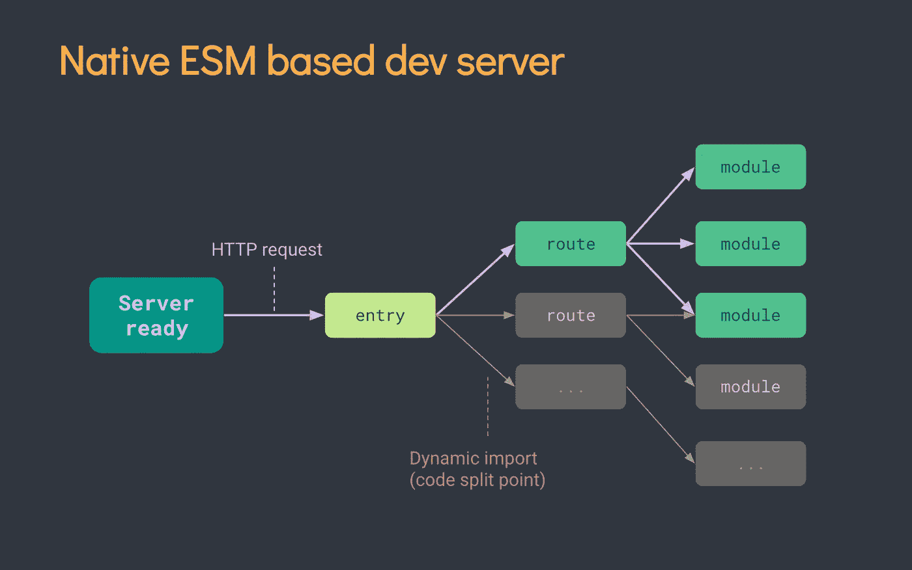
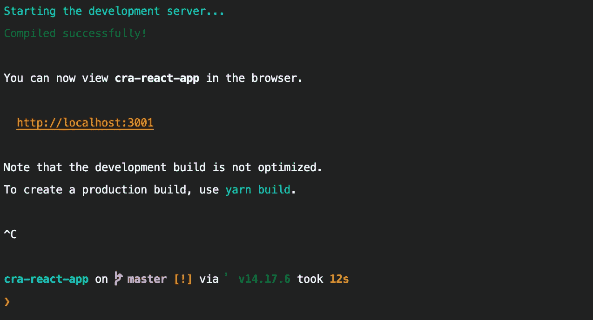
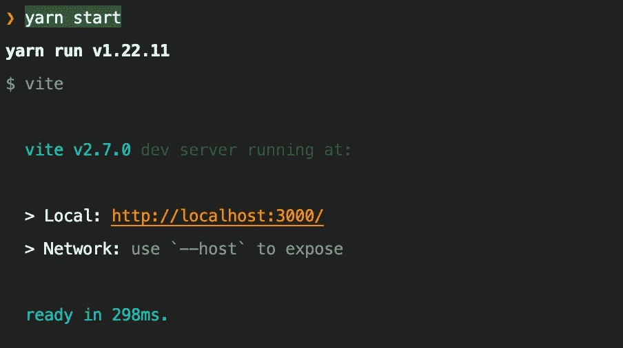
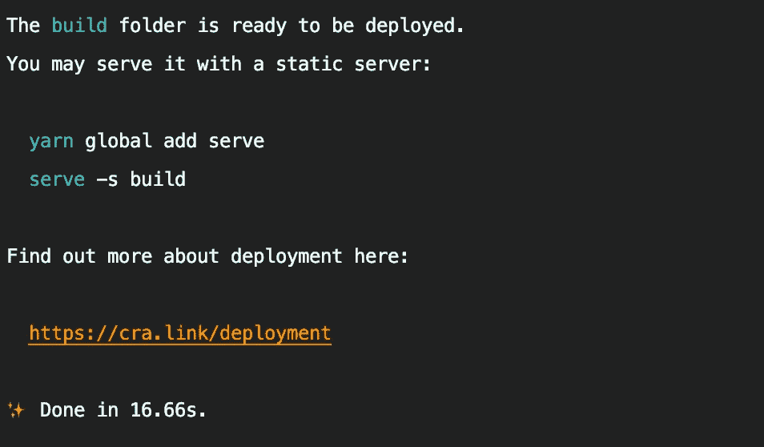
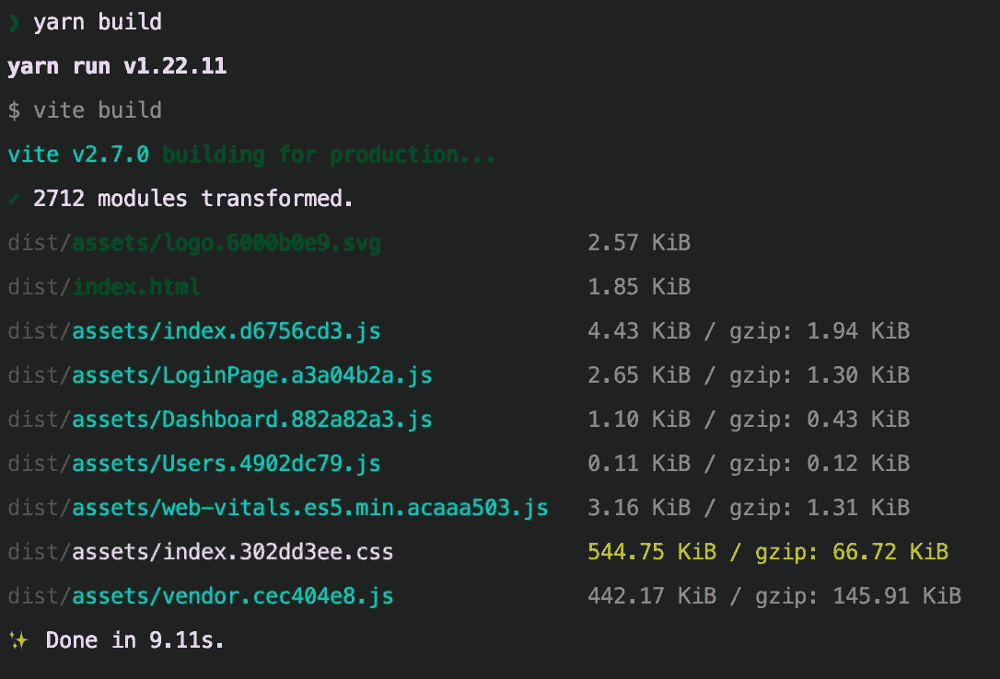

# 对 React 应用程序使用 Vite，而不是 CRA

> 原文：<https://javascript.plainenglish.io/use-vite-for-react-apps-instead-of-cra-7ad4885e0c73?source=collection_archive---------3----------------------->

## 将您的 CRA 应用程序迁移到 Vite，以加快开发和生产构建。


Photo by [Chris Liverani](https://unsplash.com/@chrisliverani?utm_source=unsplash&utm_medium=referral&utm_content=creditCopyText) on [Unsplash](https://unsplash.com/s/photos/speed?utm_source=unsplash&utm_medium=referral&utm_content=creditCopyText)

我们大多数人会使用 [Create React App](https://create-react-app.dev/) 来创建 [React](https://reactjs.org/) App。它支持开箱即用的所有配置。但是，当您的项目代码增长时，您可能会面临更长的构建时间、开发服务器中更慢的启动，以及等待 2 到 5 秒来反映您在代码中所做的更改，当应用程序规模更大时，这可能会迅速增加。

这增加了:

1.  开发时间，因为我们需要为每个变化等待 2 到 6 秒。
2.  生产构建时间，部署快速修复可能需要 10 到 20 分钟。
3.  时间，时间就是金钱🙂。

# 为什么 CRA 开发服务器很慢？

CRA 使用 [Webpack](https://webpack.js.org/) 来捆绑代码。Webpack 捆绑了整个代码，所以如果您的代码库非常大(超过 10k 行),您可能会看到开发服务器启动较慢，并且需要很长时间才能看到所做的更改。


正如您在上面的图像中所看到的，整个代码被捆绑在一起，以使服务器为开发做好准备。

# 怎么让它更快？

我们可以迁移到 [Vite](https://vitejs.dev/) ，而不是使用 CRA 来创建一个 React 应用。Vite 是下一代前端工具，可以更快地构建应用程序。

## Vite 的亮点

1.  通过本机 ESM 按需提供文件服务，无需捆绑！
2.  热模块更换(HMR ),无论应用程序大小如何都保持快速。
3.  对 TypeScript、JSX、CSS 等的现成支持。
4.  支持多页和库模式的预配置汇总构件。
5.  开发人员和构建人员共享的 roll up-超集插件接口。
6.  具有完整类型脚本类型的灵活编程 API。
7.  支架反作用， [Vue.js](https://vite.new/vue) ，[预作用](https://vite.new/preact)，和[细长](https://vite.new/svelte)。

# 维特比 CRA 快多少？

**Vite** 使用的 [esbuild](https://esbuild.github.io/) 是用 Go 编写的，预捆绑依赖**比基于 JavaScript 的捆绑器快 10-100 倍**。

Vite 通过将应用程序的模块分成两类来改进开发服务器的启动时间:**依赖项**和**源代码**。

*   **依赖关系**大多是普通的 JavaScript，在开发过程中不会经常改变。一些大型依赖项(例如[和](https://ant.design/))的处理成本也很高。
*   **源代码**经常包含需要转换的非普通 JavaScript(如 JSX、CSS 或 etc 组件)，并且会被频繁编辑。此外，并非所有源代码都需要同时加载(例如，基于路由的代码分割)。



Vite Approach

如上图所示，当浏览器请求时，Vite 只需要按需转换和提供源代码。代码隐藏条件动态导入只有在当前屏幕上实际使用时才会被处理。

我已经将现有的 react 应用程序迁移到了 Vite。我们来比较一下区别。

# CRA 开发服务器启动持续时间



**CRA** 带着 **12s** 启动开发服务器。示例应用程序只包含 2 条路线和 6 个组件。让我们用 Vite 看看同样的情况。

# Vite 开发服务器启动持续时间



**Vite** 只用了**298 毫秒**就启动了开发服务器，与 CRA 相比，这已经是非常快的速度了。您可以看到这两种工具之间的巨大差异。让我们也比较一下两者的生产构建时间。

# CRA 构建持续时间



CRA 花了**16.66 秒**来制作这个应用程序。来看看 Vite 的表现吧。

# Vite 构建持续时间

Vite 使用与 [**Rollup**](https://rollupjs.org/guide/en/) 相同的**捆绑包方法**进行生产构建，因为在生产中使用未捆绑的本机 ESM 会导致额外的 HTTP 请求。



Vite with rollup 只用了**9.11 秒**就完成了整个应用，似乎比 CRA 更好。因为它减少了使用 Vite 时 40%到 50%的构建时间。这样更有效。例如，如果您当前的构建时间是 20 分钟，那么当使用 Vite 时，它将减少到 10 到 12 分钟🚀。

> *不满意对比检查本* [*推文*](https://twitter.com/amasad/status/1355379680275128321) *。*

希望您正在考虑如何**将您当前的 React CRA 应用程序迁移到 Vite** ？

没什么大不了的！让我们重新开始。

# 从 CRA 到维特的迁移

1.  从 **package.json** 依赖关系中移除 **react-scripts** 。
2.  如果你使用 CSS 或 SCSS，在 **package.json** 中添加 **sass** 。
3.  将以下依赖项添加为开发依赖项:

```
"devDependencies": {
  "@vitejs/plugin-react": "1.1.1",
  "vite": "2.7.0"
},
```

4.将以下命令添加到脚本中:

```
"scripts": {
  "start": "vite",
  "build": "vite build"
},
```

5.在根文件夹中创建一个文件 **vite.config.js** ，添加下面的代码:

**react()** 用于避免在`.jsx`和`.tsx`模块中手工导入`React`。

6.将`index.html`文件移到`public`文件夹外。

7.从`index.html`上拆下所有的`%PUBLIC_URL%`:

```
//From
<link *rel*="icon" *href*="%PUBLIC_URL%/favicon.ico" />//To
<link *rel*="icon" *href*="/favicon.ico" />
```

8.在**index.html**的主体中添加以下脚本标签:

```
<div *id*="root"></div>
<script *type*="module" *src*="/src/index.jsx"></script> // Need to add
```

9.将您的 env 从 **REACT_APP** 更新为 **VITE** ，如下所示:

```
// From
REACT_APP_ENV = local
REACT_APP_HOST_UR = [https://reqres.in/api/](https://reqres.in/api/)// To
*VITE_ENV* = local
*VITE_HOST_URL* = [https://reqres.in/api/](https://reqres.in/api/)
```

10.现在只需运行`**npm install**`或`**yarn**`或**。**

11.现在运行`yarn start`或`npm start`。搞定了。现在，我们的 CRA 应用程序迁移到了 Vite。

## 注意事项:

如果您在导入组件时遇到任何问题，请使用[解决别名](https://vitejs.dev/config/#resolve-alias)。

# 使用 Vite 的新 React 应用程序

使用下面的命令创建一个新的 React 应用程序:

```
**yarn create vite my-react-app --template react**
```

# 参考

1.  [维特](https://vitejs.dev/)
2.  [esbuild](https://esbuild.github.io/)
3.  [汇总](https://rollupjs.org/guide/en/)
4.  [Vite 预置模板](https://github.com/vitejs/vite/tree/main/packages/create-vite)

# 结论

与 CRA 相比，Vite 似乎很有效率，速度更快，节省更多的时间。试试 **Vite** ，就能看出区别。

感谢您的阅读。

*更多内容请看*[***plain English . io***](https://plainenglish.io/)*。报名参加我们的* [***免费周报***](http://newsletter.plainenglish.io/) *。关注我们关于*[***Twitter***](https://twitter.com/inPlainEngHQ)*和*[***LinkedIn***](https://www.linkedin.com/company/inplainenglish/)*。查看我们的* [***社区不和谐***](https://discord.gg/GtDtUAvyhW) *加入我们的* [***人才集体***](https://inplainenglish.pallet.com/talent/welcome) *。*